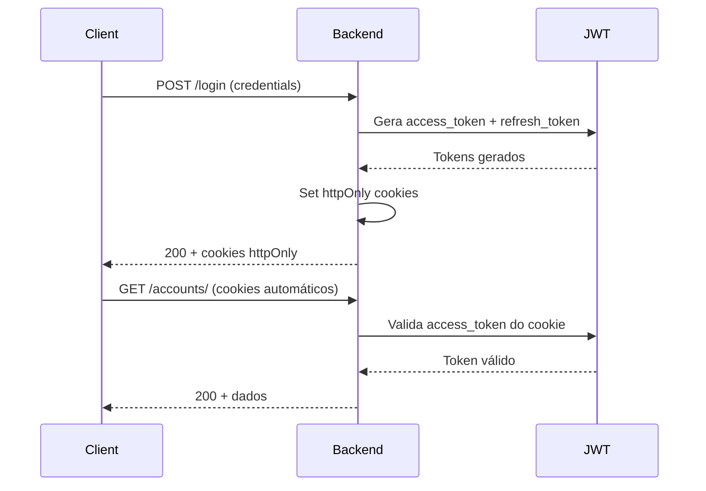

# Autenticação e Tokens JWT

## Visão Geral

O MindLedger utiliza **JWT (JSON Web Tokens)** armazenados em **cookies httpOnly** para autenticação segura, protegendo contra ataques XSS.

## Arquitetura de Autenticação



## Tipos de Tokens

### 1. Access Token

**Propósito:** Autorizar requisições à API

**Características:**
- **Duração:** 60 minutos
- **Armazenamento:** Cookie httpOnly `access_token`
- **Renovação:** Automática via refresh token

**Payload:**
```json
{
  "user_id": 1,
  "username": "usuario",
  "exp": 1704067200,
  "iat": 1704063600,
  "jti": "abc123..."
}
```

### 2. Refresh Token

**Propósito:** Renovar access token expirado

**Características:**
- **Duração:** 7 dias
- **Armazenamento:** Cookie httpOnly `refresh_token`
- **Uso único:** Cada refresh gera novos tokens

## Cookies Definidos

| Cookie | httpOnly | Secure | Purpose |
|--------|----------|--------|---------|
| `access_token` | ✅ Yes | ✅ Yes | JWT access token |
| `refresh_token` | ✅ Yes | ✅ Yes | JWT refresh token |
| `user_data` | ❌ No | ✅ Yes | Dados do usuário (JSON) |
| `user_permissions` | ❌ No | ✅ Yes | Permissões (JSON) |

**Por que alguns não são httpOnly?**
- `user_data` e `user_permissions` precisam ser lidos pelo JavaScript do frontend
- Não contêm informações sensíveis (apenas dados básicos)
- Tokens reais ficam protegidos em cookies httpOnly

## Fluxo de Login

### 1. Requisição de Login

```http
POST /api/v1/authentication/login/
Content-Type: application/json

{
  "username": "usuario",
  "password": "senha123"
}
```

### 2. Resposta do Backend

```http
HTTP/1.1 200 OK
Set-Cookie: access_token=eyJ0eXAiOiJKV1QiLCJhbGc...; HttpOnly; Secure; SameSite=Lax; Path=/
Set-Cookie: refresh_token=eyJ0eXAiOiJKV1QiLCJhbGc...; HttpOnly; Secure; SameSite=Lax; Path=/
Set-Cookie: user_data={"id":1,"username":"usuario"}; Secure; SameSite=Lax; Path=/
Set-Cookie: user_permissions=[...]; Secure; SameSite=Lax; Path=/

{
  "message": "Login realizado com sucesso",
  "user": {
    "id": 1,
    "username": "usuario"
  }
}
```

### 3. Requisições Subsequentes

```http
GET /api/v1/accounts/
Cookie: access_token=eyJ0eXAiOiJKV1QiLCJhbGc...
```

O navegador envia cookies automaticamente. O middleware `JWTCookieMiddleware` extrai o token e adiciona ao header `Authorization`.

## Middleware de Autenticação

### JWTCookieMiddleware

```python
# authentication/middleware.py
class JWTCookieMiddleware:
    def __call__(self, request):
        # Ler access token do cookie
        access_token = request.COOKIES.get('access_token')

        # Adicionar ao header Authorization
        if access_token and not request.META.get('HTTP_AUTHORIZATION'):
            request.META['HTTP_AUTHORIZATION'] = f'Bearer {access_token}'

        response = self.get_response(request)
        return response
```

**Fluxo:**
1. Middleware lê `access_token` do cookie
2. Adiciona ao header `Authorization: Bearer <token>`
3. DRF JWTAuthentication valida o token normalmente

## Token Refresh (Renovação)

### Detecção de Token Expirado

Quando access token expira, o backend retorna `401 Unauthorized`.

### Renovação Automática (Frontend)

O `api-client.ts` detecta 401 e tenta renovar:

```typescript
// Frontend interceptor
this.client.interceptors.response.use(
  (response) => response,
  async (error) => {
    if (error.response?.status === 401 && !originalRequest._retry) {
      // Tenta refresh
      await axios.post('/api/v1/authentication/token/refresh/', {}, {
        withCredentials: true // Envia refresh_token cookie
      });

      // Retry requisição original
      return this.client(originalRequest);
    }
    return Promise.reject(error);
  }
);
```

### Endpoint de Refresh

```http
POST /api/v1/authentication/token/refresh/
Cookie: refresh_token=eyJ0eXAiOiJKV1QiLCJhbGc...

Response:
Set-Cookie: access_token=<novo_token>; HttpOnly; Secure
Set-Cookie: refresh_token=<novo_refresh>; HttpOnly; Secure

{
  "message": "Token renovado com sucesso"
}
```

## Verificação de Token

### Endpoint de Verificação

```http
POST /api/v1/authentication/token/verify/
Cookie: access_token=eyJ0eXAiOiJKV1QiLCJhbGc...

Response 200:
{
  "message": "Token válido"
}

Response 401:
{
  "detail": "Token inválido ou expirado"
}
```

## Logout

### Requisição

```http
POST /api/v1/authentication/logout/
Cookie: access_token=...
```

### Resposta

```http
HTTP/1.1 200 OK
Set-Cookie: access_token=; Max-Age=0; Path=/
Set-Cookie: refresh_token=; Max-Age=0; Path=/

{
  "message": "Logout realizado com sucesso"
}
```

Os cookies são removidos (Max-Age=0).

## Configuração JWT

### settings.py

```python
from datetime import timedelta

SIMPLE_JWT = {
    'ACCESS_TOKEN_LIFETIME': timedelta(minutes=60),
    'REFRESH_TOKEN_LIFETIME': timedelta(days=7),
    'ROTATE_REFRESH_TOKENS': True,
    'BLACKLIST_AFTER_ROTATION': True,
    'ALGORITHM': 'HS256',
    'SIGNING_KEY': SECRET_KEY,
    'AUTH_HEADER_TYPES': ('Bearer',),
    'USER_ID_FIELD': 'id',
    'USER_ID_CLAIM': 'user_id',
}
```

## Segurança

### Proteções Implementadas

✅ **XSS Protection:** Tokens em cookies httpOnly não são acessíveis via JavaScript

✅ **CSRF Protection:** Cookies com `SameSite=Lax` impedem CSRF

✅ **Secure Flag:** Cookies só enviados via HTTPS em produção

✅ **Token Rotation:** Refresh tokens são rotacionados a cada uso

✅ **Expiration:** Tokens têm tempo de vida limitado

### Configuração de Cookies

```python
# cookie_auth.py
response.set_cookie(
    'access_token',
    access_token,
    httponly=True,          # Não acessível via JS
    secure=True,            # Apenas HTTPS (produção)
    samesite='Lax',         # Proteção CSRF
    max_age=3600,           # 1 hora
    path='/'
)
```

## Tratamento de Erros

### 401 Unauthorized

**Causa:** Token ausente, inválido ou expirado

**Ação do Frontend:**
1. Tenta refresh automático
2. Se refresh falha, redireciona para login

### 403 Forbidden

**Causa:** Token válido mas sem permissão

**Ação:** Mostra mensagem de erro ao usuário

## Permissões

### Verificação no Backend

```python
from rest_framework.permissions import IsAuthenticated

class AccountViewSet(viewsets.ModelViewSet):
    permission_classes = [IsAuthenticated]

    def get_queryset(self):
        # Retorna apenas dados do usuário autenticado
        return Account.objects.filter(owner=self.request.user.member)
```

### Permissões Customizadas

```python
from rest_framework import permissions

class IsOwnerOrReadOnly(permissions.BasePermission):
    def has_object_permission(self, request, view, obj):
        # Leitura permitida para todos
        if request.method in permissions.SAFE_METHODS:
            return True

        # Escrita apenas para o proprietário
        return obj.owner == request.user.member
```

## Cache de Validação (Frontend)

O frontend cacheia a validação de token por 5 segundos para evitar chamadas excessivas:

```typescript
// api-client.ts
private tokenValidationCache: { isValid: boolean; timestamp: number } | null = null;
private readonly CACHE_DURATION = 5000; // 5 segundos

public async hasValidToken(): Promise<boolean> {
  if (this.tokenValidationCache) {
    const age = Date.now() - this.tokenValidationCache.timestamp;
    if (age < this.CACHE_DURATION) {
      return this.tokenValidationCache.isValid;
    }
  }

  // Valida com backend
  try {
    await this.client.post('/api/v1/authentication/token/verify/');
    this.tokenValidationCache = { isValid: true, timestamp: Date.now() };
    return true;
  } catch {
    this.tokenValidationCache = { isValid: false, timestamp: Date.now() };
    return false;
  }
}
```

## Debugging

### Ver Tokens (DevTools)

1. Abra DevTools (F12)
2. Vá para Application > Cookies
3. Veja cookies `access_token` e `refresh_token`
4. Copie e cole em https://jwt.io/ para decodificar

### Logs no Console

```javascript
// Ver se token está sendo enviado
console.log('[ApiClient] Request to', url);

// Ver tentativa de refresh
console.log('[ApiClient] Attempting token refresh');

// Ver sucesso/falha do refresh
console.log('[ApiClient] Token refreshed successfully');
console.error('[ApiClient] Token refresh failed');
```

## Boas Práticas

### 1. Nunca expor tokens no código

```typescript
// ❌ Ruim
localStorage.setItem('token', 'eyJ0eXAiOiJKV1QiLCJhbGc...');

// ✅ Bom - deixa o navegador gerenciar cookies
// Tokens ficam em cookies httpOnly
```

### 2. Sempre use withCredentials

```typescript
// ✅ Bom
axios.create({
  withCredentials: true, // Envia cookies automaticamente
});
```

### 3. Trate 401 corretamente

```typescript
// ✅ Bom - tenta refresh, depois redireciona
if (error.response?.status === 401) {
  await refreshToken();
  return retry(originalRequest);
}
```

### 4. Limpe tokens no logout

```typescript
// ✅ Bom
await authService.logout(); // Remove cookies no backend
authStore.clearTokens();    // Limpa cache local
navigate('/login');
```

## Troubleshooting

### Token não sendo enviado

**Causa:** `withCredentials: false` ou domínio diferente

**Solução:** Verifique `withCredentials: true` em todas as requisições

### CORS error

**Causa:** Backend não configurado para aceitar cookies

**Solução:**
```python
# settings.py
CORS_ALLOW_CREDENTIALS = True
CORS_ALLOWED_ORIGINS = ['http://localhost:3000']
```

### Token expira muito rápido

**Causa:** `ACCESS_TOKEN_LIFETIME` muito curto

**Solução:** Ajuste em `settings.py`:
```python
SIMPLE_JWT = {
    'ACCESS_TOKEN_LIFETIME': timedelta(hours=1),
}
```

## Próximos Passos

- **Endpoints:** Veja [endpoints.md](./endpoints.md)
- **Tratamento de Erros:** Veja [tratamento-erros.md](./tratamento-erros.md)
