# Fluxo de Dados

## Introdução

Este documento detalha como os dados fluem através do PersonalHub, desde a interação do usuário na interface até a persistência no banco de dados e vice-versa. Compreender esses fluxos é essencial para entender o comportamento do sistema, fazer debugging e implementar novas funcionalidades.

## Visão Geral dos Fluxos

O PersonalHub possui cinco fluxos principais de dados:

1. **Fluxo de Autenticação**: Login, refresh de tokens, logout
2. **Fluxo CRUD Padrão**: Operações de criação, leitura, atualização e exclusão
3. **Fluxo de Dados Sensíveis**: Leitura e gravação de dados criptografados
4. **Fluxo de Busca Semântica**: Consultas ao AI Assistant
5. **Fluxo de Dashboard**: Agregação e visualização de métricas

## 1. Fluxo de Autenticação

### Login (Fluxo Completo)

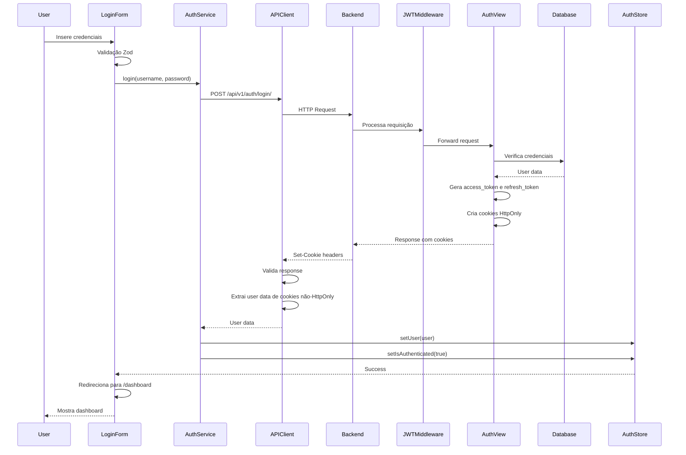

**Detalhamento**:

1. **Frontend - Validação**:
   - React Hook Form valida campos do formulário
   - Zod schema valida tipos e requisitos
   - Feedback visual de erros ao usuário

2. **Frontend - Service**:
   - `authService.login()` é chamado
   - Dados são enviados via `apiClient.post()`

3. **Backend - Middleware**:
   - `JWTCookieMiddleware` processa requisição
   - CORS middleware valida origem

4. **Backend - Autenticação**:
   - `AuthView` recebe credenciais
   - Django autentica com `authenticate()`
   - Gera tokens JWT (access e refresh)
   - Cria cookies HttpOnly para tokens
   - Cria cookies não-HttpOnly para dados de usuário

5. **Frontend - Resposta**:
   - Navegador armazena cookies automaticamente
   - `apiClient` extrai dados de usuário
   - `authStore` é atualizado
   - UI reage ao estado de autenticação

### Refresh de Token (Automático)

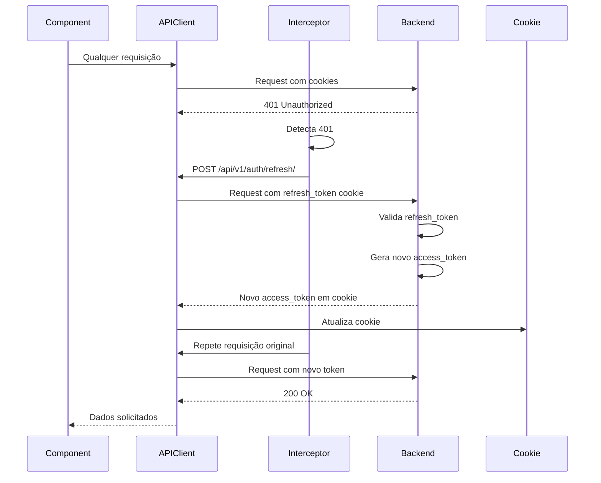

**Detalhamento**:

1. **Detecção de Token Expirado**:
   - Qualquer requisição pode retornar 401
   - Interceptor de resposta detecta automaticamente

2. **Refresh Automático**:
   - Interceptor chama `/auth/refresh/`
   - Backend valida `refresh_token` do cookie
   - Novo `access_token` é gerado e retornado

3. **Retry da Requisição**:
   - Interceptor automaticamente repete requisição original
   - Nova requisição usa token atualizado
   - Usuário não percebe o refresh

**Exceções**:
- Refresh só ocorre se não for endpoint de autenticação
- Se refresh falhar, usuário é deslogado
- Múltiplas requisições simultâneas usam mesma promise de refresh

### Logout

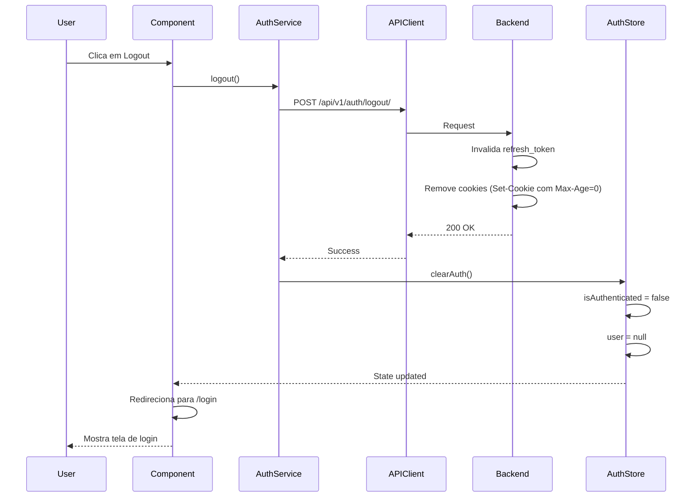

## 2. Fluxo CRUD Padrão

### Leitura (GET List)

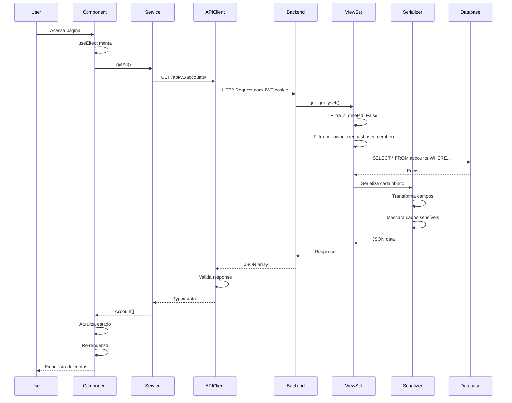

**Detalhamento**:

1. **Frontend - Montagem**:
   - Componente monta e dispara `useEffect`
   - Service layer é chamado
   - Loading state ativado

2. **Backend - Filtragem**:
   - ViewSet aplica filtros automáticos
   - `is_deleted=False` (soft delete)
   - Filtro de ownership (usuário só vê seus dados)
   - Filtros adicionais via query params

3. **Backend - Serialização**:
   - `Serializer` transforma objetos Python em JSON
   - Campos sensíveis são mascarados ou omitidos
   - Campos calculados são adicionados
   - Relacionamentos são serializados

4. **Frontend - Atualização**:
   - Estado do componente é atualizado
   - Loading desativado
   - UI re-renderiza com dados

### Criação (POST)

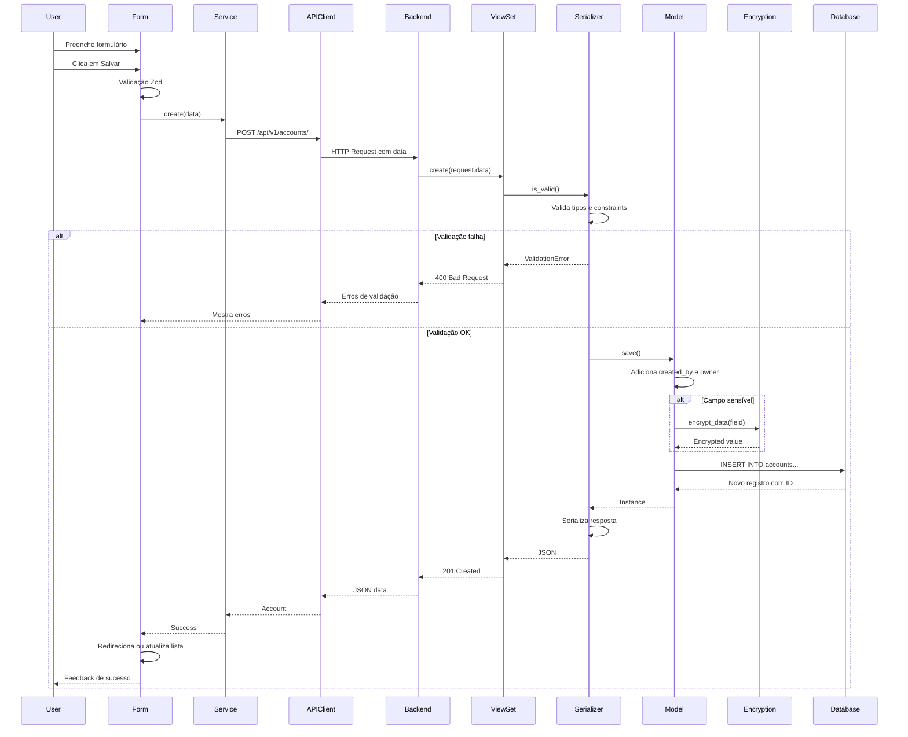

**Detalhamento**:

1. **Frontend - Validação**:
   - React Hook Form valida em tempo real
   - Zod schema valida ao submeter
   - Erros mostrados inline nos campos

2. **Backend - Validação Serializer**:
   - Tipos de dados validados
   - Constraints (required, max_length, etc.)
   - Validações customizadas
   - Validação de relacionamentos

3. **Backend - Criptografia**:
   - Se campo é sensível (ex: account_number)
   - `Model.save()` chama `FieldEncryption.encrypt_data()`
   - Valor criptografado antes de INSERT

4. **Backend - Auditoria**:
   - `created_by` = `request.user`
   - `created_at` = timestamp atual
   - `owner` = `request.user.member`
   - UUID gerado automaticamente

5. **Frontend - Feedback**:
   - Toast de sucesso
   - Redirecionamento ou atualização de lista
   - Form é resetado

### Atualização (PUT/PATCH)

Similar ao POST, mas:
- Usa `PATCH` para atualização parcial ou `PUT` para completa
- Backend chama `update()` em vez de `create()`
- `updated_by` e `updated_at` são atualizados
- Campos não enviados mantêm valores anteriores (PATCH)

### Exclusão (DELETE - Soft Delete)

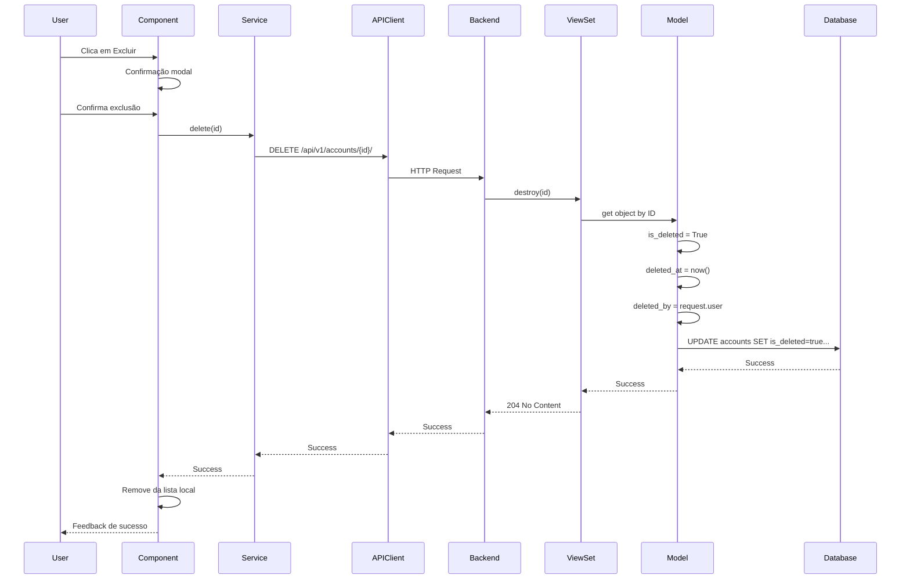

**Soft Delete**:
- Registro não é removido do banco
- Flag `is_deleted=True` marca como excluído
- Timestamp `deleted_at` registra quando
- `deleted_by` registra quem excluiu
- Queries padrão filtram automaticamente deletados
- Permite auditoria e recuperação futura

## 3. Fluxo de Dados Sensíveis

### Escrita de Dados Criptografados

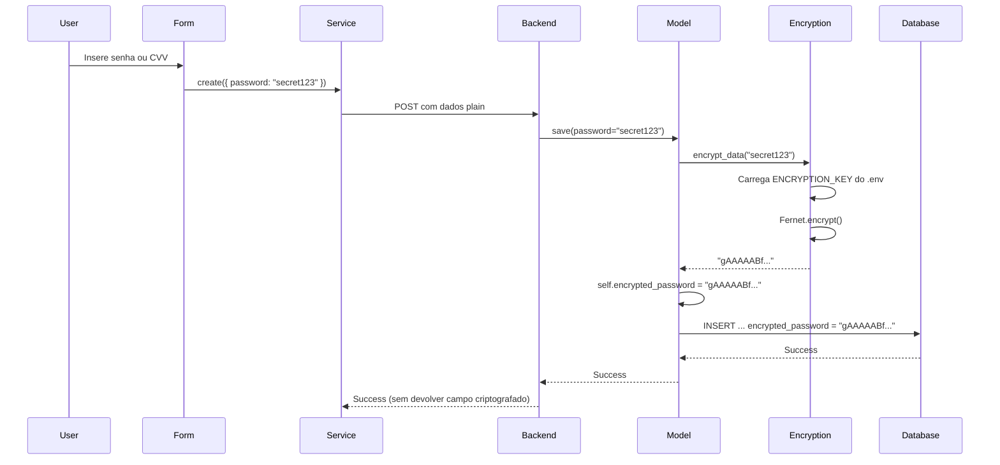

**Criptografia Fernet**:

- Algoritmo: AES-128 em modo CBC
- HMAC com SHA256 para integridade
- Timestamp incluso (detecta adulteração)
- Chave: 44 caracteres base64 (`ENCRYPTION_KEY` no .env)

**Campos criptografados**:
- `CreditCard.cvv`
- `CreditCard.card_number`
- `Account.account_number`
- `Password.encrypted_password`
- `BankAccountSecure.account_number`
- `BankAccountSecure.bank_password`
- `BankAccountSecure.digital_password`
- `CardSecure.card_number`
- `CardSecure.cvv`
- `ConfidentialFile.encrypted_content`

### Leitura de Dados Criptografados

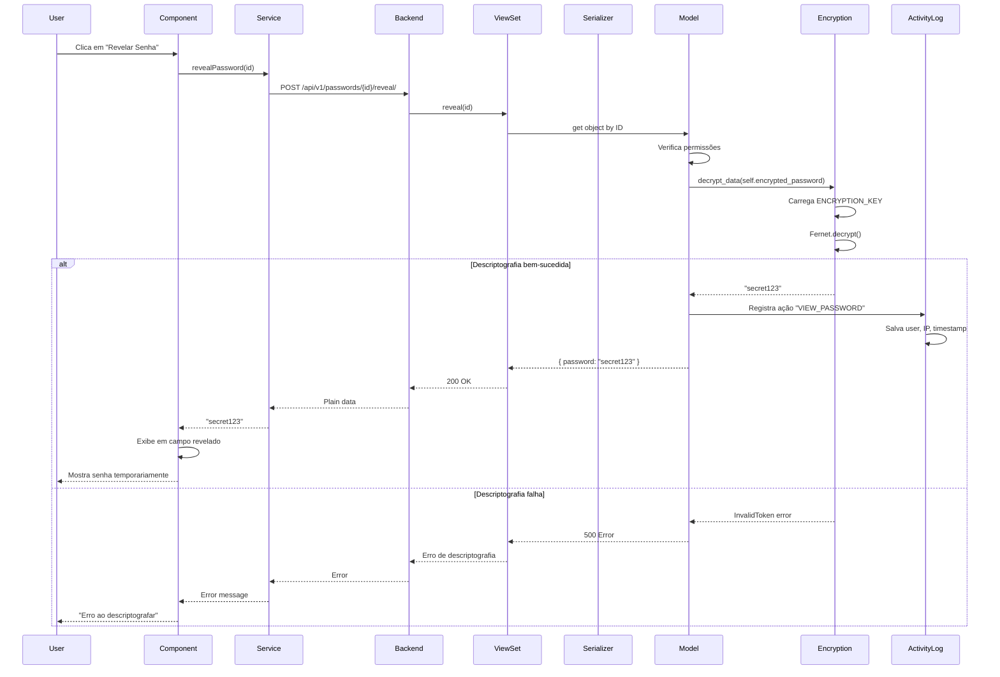

**Segurança**:

1. **Endpoints dedicados**: Dados sensíveis só são descriptografados em endpoints específicos (`/reveal/`)
2. **Auditoria**: Toda visualização é registrada em `ActivityLog`
3. **Permissões**: Verificação de ownership antes de descriptografar
4. **Nunca em listagens**: Campos criptografados nunca aparecem em GET lists
5. **Mascaramento**: Números de cartão são mascarados (ex: `****1234`)

## 4. Fluxo de Busca Semântica (AI Assistant)

### Geração de Embeddings

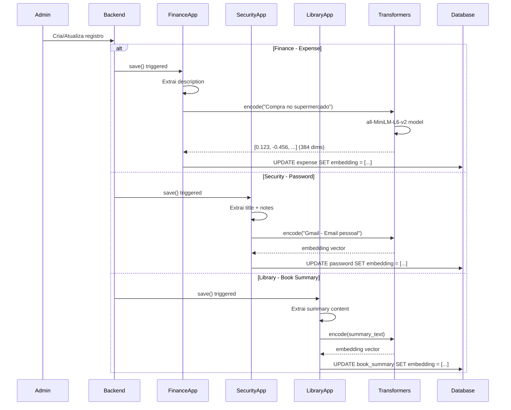

**Modelo de Embedding**:

- **Nome**: all-MiniLM-L6-v2
- **Dimensões**: 384
- **Tamanho**: ~80MB
- **Latência**: ~50ms por texto
- **Multilingual**: Sim (inclui português)
- **Custo**: Grátis (local)

**Quando embeddings são gerados**:

- Na criação de novo registro
- Na atualização de campos de texto
- Via signal `post_save` no Django
- Automático e transparente

### Busca Semântica

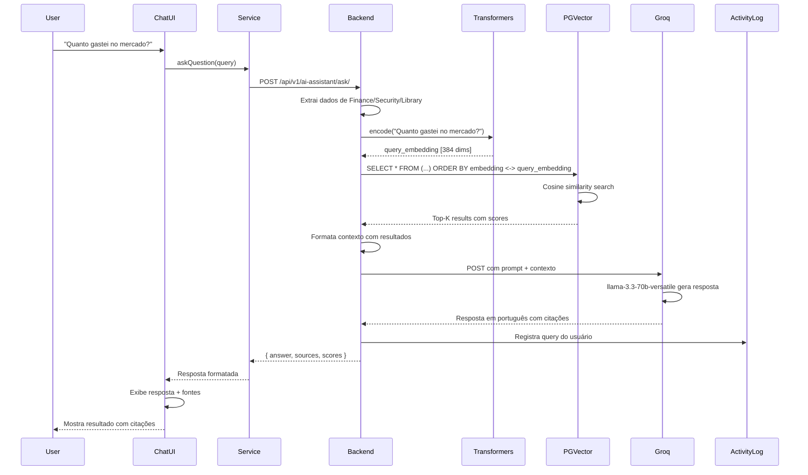

**Busca Vetorial com pgvector**:

```sql
SELECT
    id,
    content,
    source_type,
    1 - (embedding <=> query_embedding) as similarity_score
FROM ai_content
WHERE 1 - (embedding <=> query_embedding) > 0.7
ORDER BY embedding <=> query_embedding
LIMIT 10;
```

**Operadores pgvector**:
- `<->`: Distância L2 (Euclidiana)
- `<=>`: Distância de cosseno (usado no PersonalHub)
- `<#>`: Produto interno negativo

**Estrutura da Resposta**:

```json
{
  "answer": "Você gastou R$ 450,00 no mercado em janeiro...",
  "sources": [
    {
      "id": "uuid-123",
      "type": "expense",
      "content": "Compra no Supermercado Extra",
      "score": 0.89,
      "metadata": {
        "amount": 450.0,
        "date": "2026-01-10"
      }
    }
  ],
  "query": "Quanto gastei no mercado?",
  "timestamp": "2026-01-12T10:30:00Z"
}
```

## 5. Fluxo de Dashboard (Agregações)

### Carregamento de Dashboard

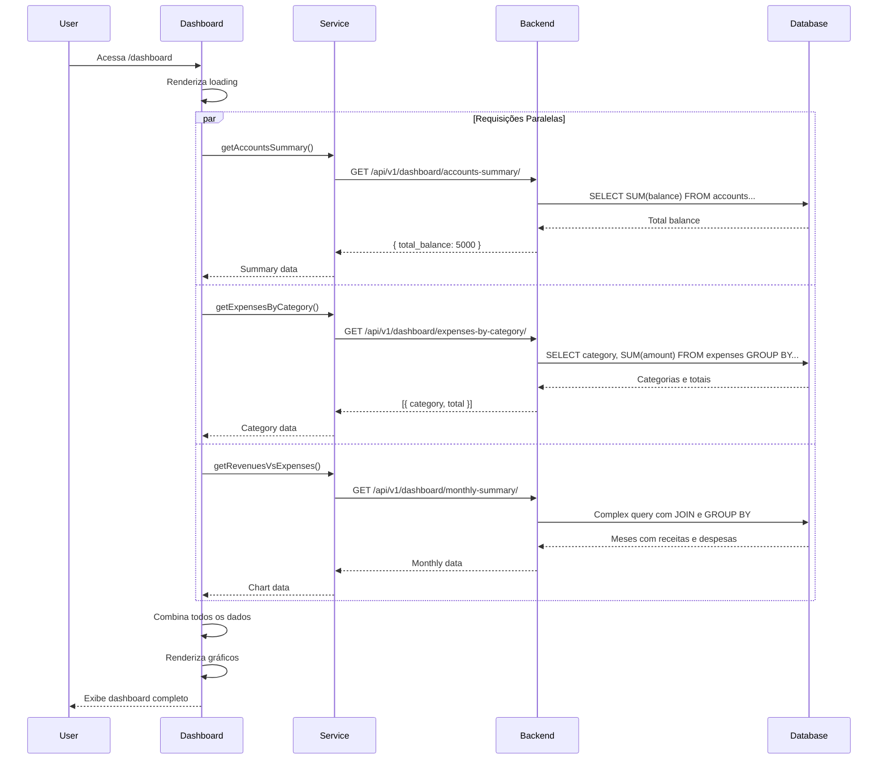

**Otimizações de Dashboard**:

1. **Requisições paralelas**: Múltiplas chamadas simultâneas
2. **Agregações no banco**: Cálculos feitos via SQL
3. **Índices**: Em campos usados em GROUP BY e WHERE
4. **Annotations**: Django ORM usa `annotate()` e `aggregate()`
5. **Caching (futuro)**: Resultados armazenados por 5 minutos

**Exemplo de Query Otimizada**:

```python
# Backend - Dashboard ViewSet
def expenses_by_category(self, request):
    queryset = Expense.objects.filter(
        owner=request.user.member,
        is_deleted=False,
        date__gte=start_of_month,
        date__lte=end_of_month
    ).values('category__name').annotate(
        total=Sum('amount'),
        count=Count('id')
    ).order_by('-total')

    return Response(queryset)
```

Gera SQL:

```sql
SELECT
    category.name,
    SUM(expense.amount) as total,
    COUNT(expense.id) as count
FROM expenses expense
INNER JOIN categories category ON expense.category_id = category.id
WHERE
    expense.owner_id = %s
    AND expense.is_deleted = false
    AND expense.date >= %s
    AND expense.date <= %s
GROUP BY category.name
ORDER BY total DESC;
```

## Fluxos de Erro e Recuperação

### Tratamento de Erros HTTP

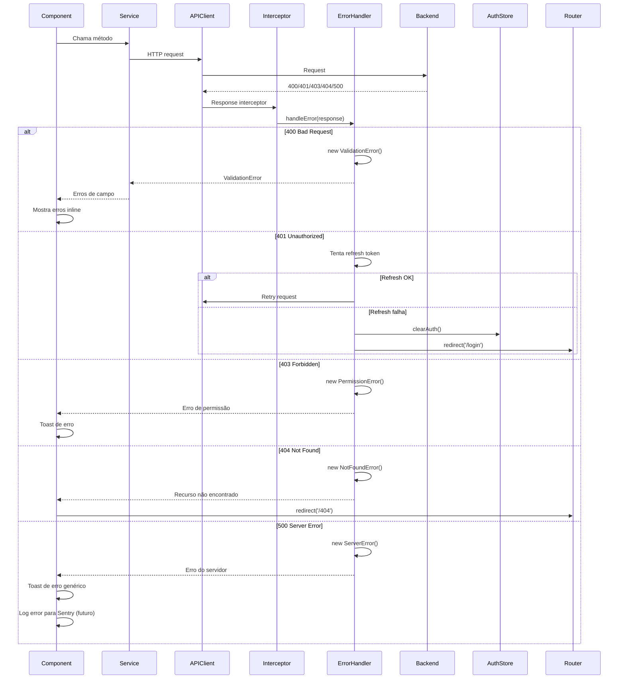

### Validação em Múltiplas Camadas

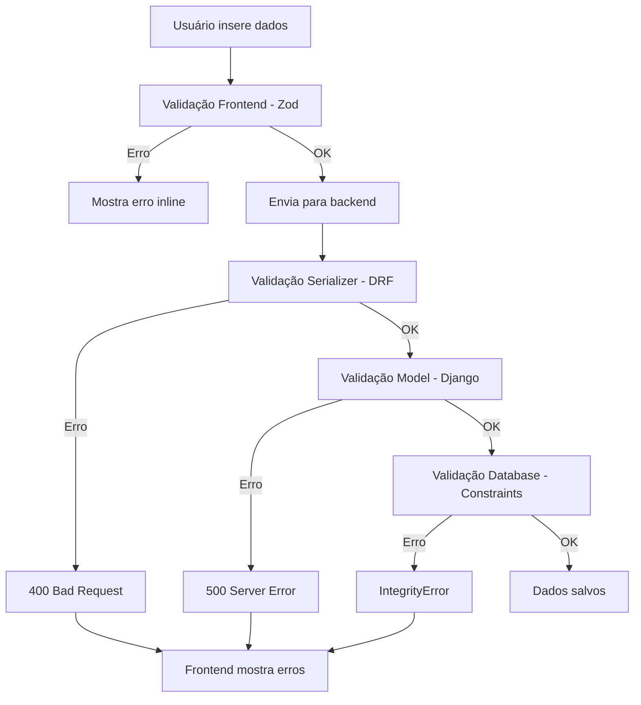

**Camadas de Validação**:

1. **Frontend (Zod)**:
   - Tipos corretos
   - Campos obrigatórios
   - Formatos (email, URL, etc.)
   - Limites de tamanho

2. **Serializer (DRF)**:
   - Validações de negócio
   - Relacionamentos válidos
   - Valores permitidos
   - Validações customizadas

3. **Model (Django)**:
   - Constraints de banco
   - Validações de integridade
   - Valores default

4. **Database (PostgreSQL)**:
   - NOT NULL
   - UNIQUE
   - FOREIGN KEY
   - CHECK constraints

## Performance e Otimizações

### N+1 Queries Problem - Solução

**Problema**:

```python
# Gera N+1 queries (ruim)
accounts = Account.objects.all()
for account in accounts:
    print(account.owner.name)  # Query adicional por account!
```

**Solução**:

```python
# Gera apenas 2 queries (bom)
accounts = Account.objects.select_related('owner').all()
for account in accounts:
    print(account.owner.name)  # Já carregado, sem query extra
```

**Estratégias**:

- `select_related()`: Para ForeignKey e OneToOne (JOIN)
- `prefetch_related()`: Para ManyToMany e reverse ForeignKey (IN query)
- `only()`: Carrega apenas campos específicos
- `defer()`: Adia carregamento de campos pesados

### Caching (Futuro)

**Estratégia de cache planejada**:

```python
# Backend - com decorador
@cache_page(60 * 5)  # Cache por 5 minutos
def dashboard_summary(request):
    # Query pesada
    return Response(data)

# Com Redis
cache.set(f'dashboard:{user_id}', data, timeout=300)
cached = cache.get(f'dashboard:{user_id}')
```

**Dados a cachear**:
- Dashboard summaries
- Listas frequentemente acessadas
- Configurações de usuário
- Dados de referência (categorias, tipos)

### Lazy Loading (Frontend)

```typescript
// Componentes carregados sob demanda
const Dashboard = lazy(() => import('./pages/Dashboard'));
const Accounts = lazy(() => import('./pages/Accounts'));

// Na rota
<Suspense fallback={<Loading />}>
  <Dashboard />
</Suspense>
```

**Benefícios**:
- Bundle inicial menor
- Carregamento mais rápido
- Recursos carregados apenas quando necessários

## Links Relacionados

- [Visão Geral da Arquitetura](./visao-geral.md)
- [Decisões Arquiteturais](./decisoes-arquiteturais.md)
- [Documentação da API](../05-api/endpoints.md)
- [Autenticação](../07-authentication-security/autenticacao.md)
- [Segurança](../07-authentication-security/seguranca.md)
