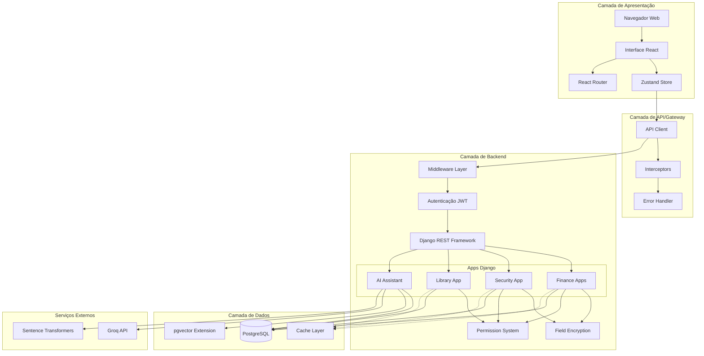
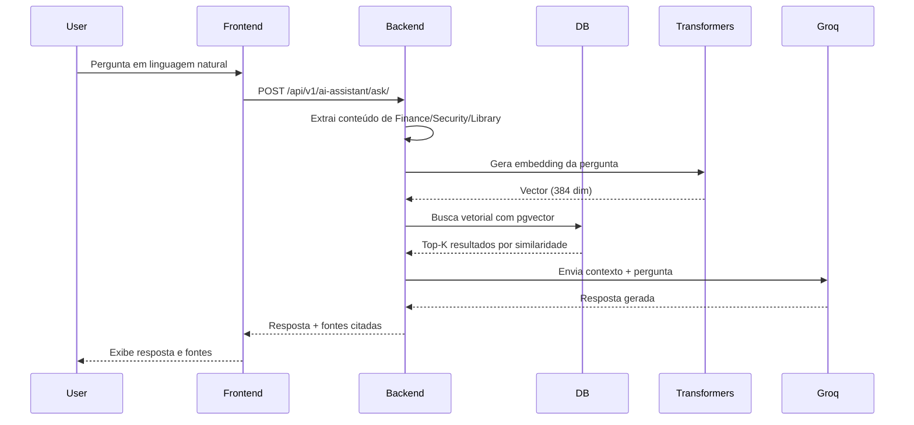

# Visão Geral da Arquitetura

## Introdução

O PersonalHub é construído sobre uma arquitetura full-stack moderna, utilizando um monorepo que combina backend Django REST Framework e frontend React com TypeScript. A arquitetura foi projetada para ser modular, escalável e segura, com separação clara de responsabilidades entre as camadas.

Este documento apresenta a visão geral da arquitetura do sistema, suas camadas principais, padrões arquiteturais adotados e como os componentes se comunicam entre si.

## Arquitetura de Alto Nível



## Estrutura do Monorepo

O projeto utiliza uma estrutura de monorepo que organiza o código em dois diretórios principais:

```
PersonalHub/
├── api/                    # Backend Django
│   ├── accounts/          # Gestão de contas bancárias
│   ├── credit_cards/      # Gestão de cartões de crédito
│   ├── expenses/          # Controle de despesas
│   ├── revenues/          # Controle de receitas
│   ├── loans/             # Gestão de empréstimos
│   ├── transfers/         # Transferências bancárias
│   ├── dashboard/         # Dashboard financeiro
│   ├── security/          # Módulo de segurança (senhas)
│   ├── library/           # Biblioteca de livros
│   ├── ai_assistant/      # Assistente de IA (RAG)
│   ├── authentication/    # Sistema de autenticação
│   ├── members/           # Sistema de membros
│   └── app/               # Configuração central
├── frontend/              # Frontend React
│   ├── src/
│   │   ├── components/   # Componentes React
│   │   ├── pages/        # Páginas/rotas
│   │   ├── services/     # Camada de serviços
│   │   ├── stores/       # Estado global (Zustand)
│   │   ├── types/        # Definições TypeScript
│   │   └── utils/        # Utilitários
│   └── public/           # Arquivos estáticos
├── docker-compose.yml     # Orquestração de containers
├── .env                   # Variáveis de ambiente
└── documentation/         # Documentação do projeto
```

### Vantagens do Monorepo

1. **Versionamento unificado**: Frontend e backend evoluem juntos
2. **Compartilhamento de código**: Tipos e interfaces podem ser compartilhados
3. **Desenvolvimento simplificado**: Um único repositório para clonar e configurar
4. **Refatorações mais seguras**: Mudanças na API podem ser feitas atomicamente
5. **Documentação centralizada**: Toda a documentação em um único lugar

## Camadas da Arquitetura

### 1. Camada de Apresentação (Frontend)

**Tecnologias**: React 18, TypeScript, TailwindCSS, Zustand

A camada de apresentação é responsável pela interface do usuário e interações. Utiliza componentes React funcionais com hooks e TypeScript para tipagem forte.

**Componentes principais**:

- **UI Components**: Componentes reutilizáveis baseados em shadcn/ui (Radix)
- **Pages**: Componentes de página que representam rotas
- **Layout Components**: Estrutura de layout (Sidebar, Header, etc.)
- **Feature Components**: Componentes específicos de funcionalidades

**Estado**:

- **Global**: Zustand para autenticação e dados compartilhados
- **Local**: React hooks (useState, useReducer) para estado de componente
- **Formulários**: React Hook Form + Zod para validação

### 2. Camada de API/Gateway (Frontend)

**Tecnologia**: Axios com interceptors customizados

Esta camada abstrai toda a comunicação HTTP entre frontend e backend, fornecendo uma interface consistente para todas as requisições.

**Responsabilidades**:

- Gerenciamento de requisições HTTP
- Refresh automático de tokens JWT
- Tratamento padronizado de erros
- Transformação de dados de/para API
- Headers e configurações centralizadas

**Padrão Service Layer**: Cada módulo possui um service dedicado que encapsula todas as chamadas de API relacionadas.

```typescript
// Exemplo de service
export const accountsService = {
  getAll: () => apiClient.get<Account[]>('/api/v1/accounts/'),
  getById: (id: string) => apiClient.get<Account>(`/api/v1/accounts/${id}/`),
  create: (data: CreateAccount) => apiClient.post('/api/v1/accounts/', data),
  update: (id: string, data: UpdateAccount) =>
    apiClient.put(`/api/v1/accounts/${id}/`, data),
  delete: (id: string) => apiClient.delete(`/api/v1/accounts/${id}/`),
};
```

### 3. Camada de Backend (Django)

**Tecnologias**: Django 5.2.5, Django REST Framework 3.16.1

O backend é organizado em apps Django independentes, cada um com responsabilidade específica. Segue o padrão MVT (Model-View-Template) do Django, adaptado para API REST.

**Estrutura de cada app**:

```
app_name/
├── models.py          # Modelos de dados (ORM)
├── serializers.py     # Serialização DRF
├── views.py           # ViewSets (lógica de endpoints)
├── urls.py            # Roteamento de URLs
├── permissions.py     # Permissões customizadas
├── admin.py           # Interface administrativa
└── tests.py           # Testes unitários
```

**Apps principais**:

**Core Financial**:
- `accounts`: Contas bancárias
- `credit_cards`: Cartões e faturas
- `expenses`: Despesas
- `revenues`: Receitas
- `loans`: Empréstimos
- `transfers`: Transferências
- `dashboard`: Métricas e visualizações

**System**:
- `authentication`: JWT, login, logout
- `members`: Sistema unificado de pessoas
- `app`: Configuração central, criptografia

**Extended**:
- `security`: Senhas, arquivos confidenciais, logs
- `library`: Livros, autores, editoras, resumos
- `ai_assistant`: RAG, busca semântica, chat

### 4. Camada de Middleware

O Django utiliza middlewares para processar requisições e respostas globalmente.

**Middleware customizado**:

- **JWTCookieMiddleware**: Extrai JWT de cookies HttpOnly e adiciona ao header Authorization
- **CORS Middleware**: Gerencia políticas de CORS
- **Security Middleware**: Headers de segurança (CSP, HSTS, etc.)
- **Logging Middleware**: Log estruturado de requisições

### 5. Camada de Dados

**Tecnologia**: PostgreSQL 16 com extensão pgvector

**Características**:

- **Banco relacional**: PostgreSQL para dados estruturados
- **Busca vetorial**: pgvector para embeddings e busca semântica
- **Migrations**: Sistema de migrações Django para versionamento de schema
- **ORM Django**: Abstração de banco de dados com consultas Python

**Estratégias de otimização**:

- Índices em campos de busca e foreign keys
- `select_related` e `prefetch_related` para evitar N+1 queries
- Queries otimizadas com annotations e aggregations
- Cache de queries frequentes (futuro)

### 6. Camada de Serviços Externos

**Groq API**:
- Geração de respostas via LLM (llama-3.3-70b-versatile)
- Tier gratuito com 6.000 requisições/minuto
- Usado pelo AI Assistant para responder perguntas

**Sentence Transformers**:
- Geração de embeddings localmente
- Modelo: all-MiniLM-L6-v2 (384 dimensões)
- Completamente gratuito e offline
- ~80MB RAM, 5x mais rápido que modelos maiores

## Padrões Arquiteturais

### 1. Arquitetura em Camadas (Layered Architecture)

A separação em camadas garante baixo acoplamento e alta coesão. Cada camada tem responsabilidades bem definidas e se comunica apenas com a camada adjacente.

### 2. Service Layer Pattern

O frontend utiliza uma camada de serviços que abstrai toda a lógica de comunicação com a API. Isso permite:

- Reutilização de lógica de API
- Testes isolados
- Mudanças na API sem impactar componentes
- Tipagem forte com TypeScript

### 3. Repository Pattern (Django ORM)

O ORM do Django funciona como um Repository Pattern, abstraindo o acesso ao banco de dados e permitindo queries Python em vez de SQL direto.

### 4. ViewSet Pattern (DRF)

Django REST Framework utiliza ViewSets que agrupam operações CRUD em uma única classe, seguindo convenções REST.

```python
class AccountViewSet(viewsets.ModelViewSet):
    queryset = Account.objects.filter(is_deleted=False)
    serializer_class = AccountSerializer
    permission_classes = [IsAuthenticated]

    def get_queryset(self):
        return self.queryset.filter(owner=self.request.user.member)
```

### 5. Middleware Pattern

O Django utiliza middlewares para cross-cutting concerns como autenticação, logging, CORS, etc.

### 6. Strategy Pattern (Criptografia)

O módulo de criptografia (`app/encryption.py`) implementa uma estratégia única (Fernet) mas pode ser facilmente substituído por outras estratégias.

### 7. Singleton Pattern (API Client)

O API Client do frontend é um singleton que garante configuração única de interceptors e headers.

## Módulos do Sistema

### Módulo Finance

**Responsabilidade**: Gestão financeira completa

**Apps**: accounts, credit_cards, expenses, revenues, loans, transfers, dashboard

**Funcionalidades principais**:
- CRUD de contas bancárias e cartões
- Registro e categorização de despesas/receitas
- Sistema de empréstimos com amortização
- Transferências entre contas
- Dashboard com métricas e gráficos

### Módulo Security

**Responsabilidade**: Armazenamento seguro de credenciais

**App**: security

**Funcionalidades principais**:
- Gerenciamento de senhas criptografadas
- Armazenamento de cartões e contas bancárias
- Arquivos confidenciais criptografados
- Logs de auditoria de acesso
- Sistema de categorias e tags

### Módulo Library

**Responsabilidade**: Biblioteca pessoal digital

**App**: library

**Funcionalidades principais**:
- Catálogo de livros com metadados completos
- Gestão de autores e editoras
- Resumos de leitura com busca semântica
- Status e progresso de leitura
- Dashboard com estatísticas

### Módulo AI Assistant

**Responsabilidade**: Busca semântica e assistente inteligente

**App**: ai_assistant

**Funcionalidades principais**:
- Busca unificada em todos os módulos
- Geração de embeddings com sentence-transformers
- Busca vetorial com pgvector
- Geração de respostas com Groq LLM
- Interface de chat

**Arquitetura RAG (Retrieval Augmented Generation)**:



## Comunicação Entre Camadas

### Frontend → Backend

**Protocolo**: HTTP/HTTPS (REST API)

**Formato**: JSON

**Autenticação**: JWT em cookies HttpOnly

**Fluxo típico**:

1. Usuário interage com UI
2. Componente chama função do service
3. Service usa apiClient para fazer requisição
4. Interceptor adiciona headers necessários
5. Backend processa requisição
6. Resposta é transformada pelo interceptor
7. Service retorna dados tipados
8. Componente atualiza UI

### Backend → Banco de Dados

**Protocolo**: PostgreSQL wire protocol

**ORM**: Django ORM

**Fluxo típico**:

1. View/ViewSet recebe requisição
2. Serializer valida dados de entrada
3. View executa query via ORM
4. ORM traduz para SQL
5. PostgreSQL executa query
6. Resultados são mapeados para objetos Python
7. Serializer transforma em JSON
8. Response é enviada ao frontend

### Backend → Serviços Externos

**Groq API**:
- Protocolo: HTTPS
- Autenticação: API Key
- Rate limit: 6.000 req/min (tier gratuito)

**Sentence Transformers**:
- Local, sem comunicação externa
- Modelo carregado em memória
- Inferência rápida (~50ms por embedding)

## Escalabilidade e Performance

### Estratégias Implementadas

1. **Índices de banco de dados**: Em campos de busca, foreign keys e campos de filtro
2. **Lazy loading**: Componentes React carregados sob demanda
3. **Queries otimizadas**: select_related, prefetch_related, annotations
4. **Embeddings locais**: Sem latência de API externa
5. **Soft delete**: Preserva histórico sem impactar queries principais

### Estratégias Futuras

1. **Cache Redis**: Para dados frequentemente acessados
2. **Paginação**: Limitação de resultados em listas grandes
3. **CDN**: Para assets estáticos
4. **Database read replicas**: Para separar leitura/escrita
5. **Background jobs**: Celery para tarefas assíncronas

## Segurança na Arquitetura

### Camada de Transporte

- **HTTPS obrigatório em produção**
- **CORS configurado para origens específicas**
- **HttpOnly cookies para JWT** (proteção XSS)
- **SameSite=Lax para cookies** (proteção CSRF)

### Camada de Aplicação

- **JWT com refresh tokens**
- **Sistema de permissões granular**
- **Validações em múltiplas camadas** (frontend, serializer, model)
- **Rate limiting** (futuro)

### Camada de Dados

- **Criptografia Fernet para campos sensíveis**
- **Hashing de senhas com bcrypt**
- **Soft delete preservando auditoria**
- **Logs de atividade para ações críticas**

## Padrões de Nomenclatura

### Backend (Python/Django)

- **Models**: PascalCase (ex: `BankAccount`)
- **Variáveis/funções**: snake_case (ex: `get_balance`)
- **Constantes**: UPPER_SNAKE_CASE (ex: `DEFAULT_CURRENCY`)
- **URLs**: kebab-case (ex: `/api/v1/bank-accounts/`)

### Frontend (TypeScript/React)

- **Componentes**: PascalCase (ex: `AccountCard`)
- **Variáveis/funções**: camelCase (ex: `fetchAccounts`)
- **Tipos/Interfaces**: PascalCase (ex: `Account`, `CreateAccountData`)
- **Constantes**: UPPER_SNAKE_CASE (ex: `API_BASE_URL`)
- **Arquivos**: kebab-case (ex: `account-card.tsx`)

### Banco de Dados

- **Tabelas**: snake_case (ex: `bank_accounts`)
- **Colunas**: snake_case (ex: `account_number`)
- **Índices**: snake_case com prefixo (ex: `idx_accounts_owner`)

## Versionamento de API

Todas as APIs seguem o padrão de versionamento por URL:

```
/api/v1/<resource>/
```

**Benefícios**:
- Clareza sobre qual versão está sendo usada
- Suporte a múltiplas versões simultaneamente
- Migração gradual entre versões

**Convenções**:
- Versão atual: v1
- Retrocompatibilidade mantida dentro da mesma major version
- Breaking changes requerem nova major version

## Logs e Observabilidade

### Logs Estruturados

O sistema utiliza logs estruturados em formato JSON para facilitar parsing e análise.

**Níveis de log**:
- **DEBUG**: Informações detalhadas para debugging
- **INFO**: Eventos normais do sistema
- **WARNING**: Situações incomuns que não são erros
- **ERROR**: Erros que não impedem funcionamento
- **CRITICAL**: Erros graves que impedem funcionamento

**Logs registrados**:
- Requisições HTTP (entrada/saída)
- Erros e exceções
- Acessos a dados sensíveis
- Operações de criptografia
- Queries lentas (futuro)

### Health Checks

Três endpoints de saúde:

- **/health/**: Verifica conectividade com banco de dados
- **/ready/**: Indica se a aplicação está pronta para receber tráfego
- **/live/**: Indica se a aplicação está viva (liveness probe)

## Links Relacionados

- [Fluxo de Dados](./fluxo-dados.md)
- [Decisões Arquiteturais](./decisoes-arquiteturais.md)
- [Documentação Backend](../03-backend/overview.md)
- [Documentação Frontend](../04-frontend/overview.md)
- [Documentação API](../05-api/endpoints.md)
- [Banco de Dados](../06-database/modelo-dados.md)
- [Autenticação e Segurança](../07-authentication-security/autenticacao.md)
