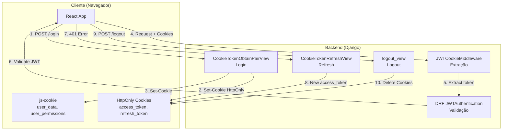
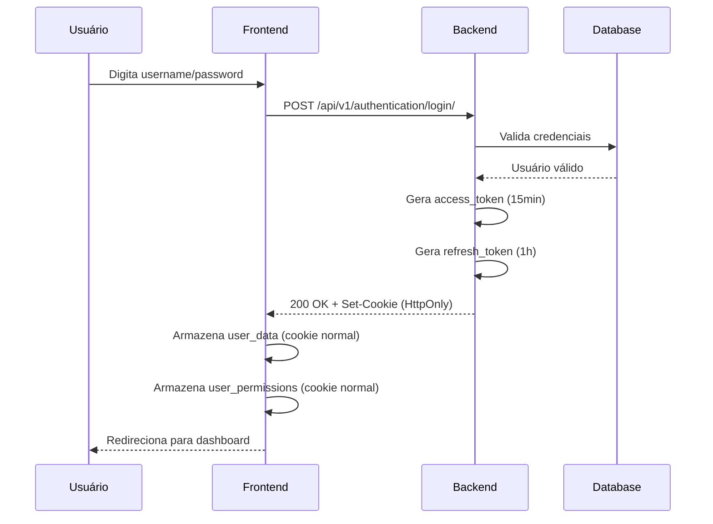
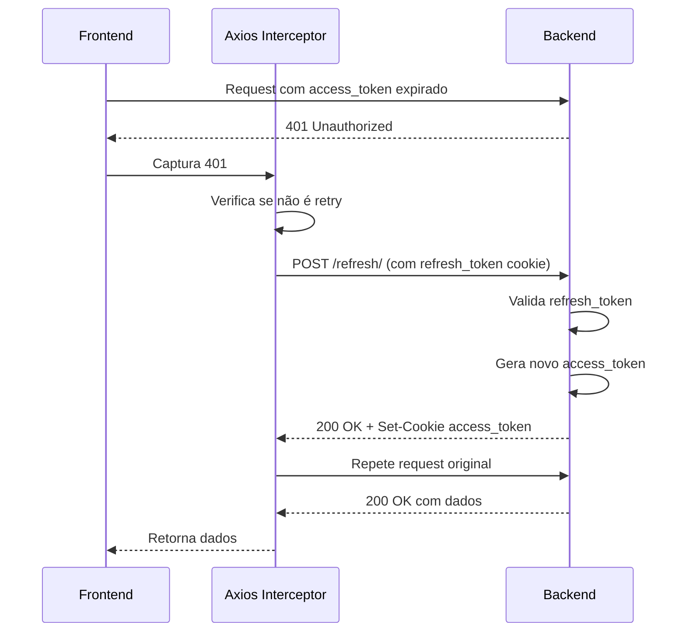
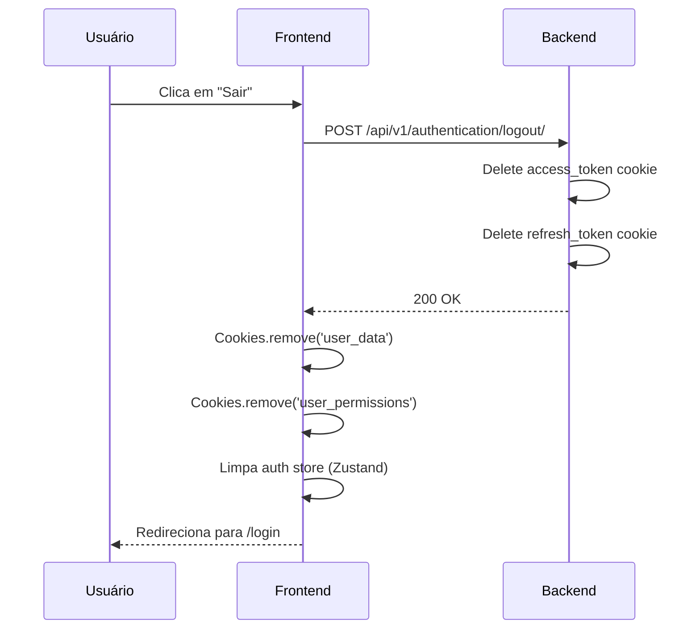
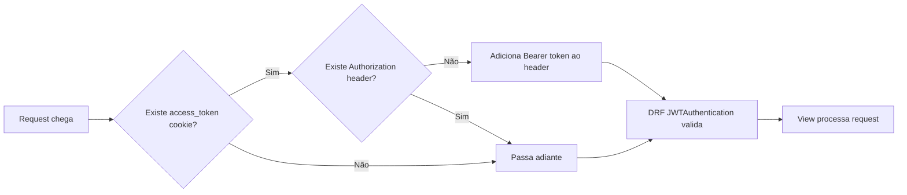

# Fluxo de Autenticação JWT

Este documento descreve o sistema completo de autenticação JWT baseado em cookies HttpOnly do MindLedger.

## Sumário

- [Visão Geral](#visão-geral)
- [Arquitetura](#arquitetura)
- [Componentes](#componentes)
- [Fluxo de Login](#fluxo-de-login)
- [Fluxo de Refresh](#fluxo-de-refresh)
- [Fluxo de Logout](#fluxo-de-logout)
- [JWTCookieMiddleware](#jwtcookiemiddleware)
- [Integração Frontend](#integração-frontend)
- [Configurações](#configurações)
- [Tratamento de Erros](#tratamento-de-erros)
- [Boas Práticas](#boas-práticas)

## Visão Geral

O MindLedger utiliza autenticação JWT (JSON Web Tokens) armazenados em **cookies HttpOnly** para máxima segurança contra ataques XSS. Esta abordagem oferece:

- **Segurança contra XSS**: Tokens inacessíveis via JavaScript
- **Transparência**: Navegador gerencia cookies automaticamente
- **Refresh automático**: Renovação de sessão sem interação do usuário
- **Expiração controlada**: Access token 15min, Refresh token 1h
- **CSRF protection**: SameSite=Lax por padrão

### Arquitetura JWT + HttpOnly Cookies



## Arquitetura

### Por que HttpOnly Cookies?

| Método | Segurança XSS | Auto-enviado | CSRF | Refresh Auto |
|--------|---------------|--------------|------|--------------|
| **localStorage** | ❌ Vulnerável | ❌ Manual | ✅ Seguro | ❌ Manual |
| **HttpOnly Cookie** | ✅ Protegido | ✅ Automático | ⚠️ Requer proteção | ✅ Transparente |

O MindLedger protege contra CSRF usando:
- `SameSite=Lax` nos cookies
- CORS restritivo
- CSRF tokens do Django (para formulários)

### Tipos de Cookies

#### 1. Cookies HttpOnly (Gerenciados pelo Backend)
Estes cookies são **inacessíveis** ao JavaScript do frontend:

- **`access_token`**
  - Contém: JWT de acesso
  - Validade: 15 minutos
  - Path: `/` (toda a aplicação)
  - HttpOnly: `True`
  - Secure: `True` (apenas produção HTTPS)
  - SameSite: `Lax`

- **`refresh_token`**
  - Contém: JWT de renovação
  - Validade: 1 hora
  - Path: `/api/v1/authentication/` (apenas refresh endpoint)
  - HttpOnly: `True`
  - Secure: `True` (apenas produção)
  - SameSite: `Lax`

#### 2. Cookies Normais (Gerenciados pelo Frontend)
Estes cookies são **acessíveis** ao JavaScript:

- **`user_data`**
  - Contém: `{ username, email, is_staff, is_superuser }`
  - Usado para exibir informações do usuário na UI
  - Não contém dados sensíveis

- **`user_permissions`**
  - Contém: Lista de permissões do usuário
  - Usado para controle de acesso na UI
  - Exemplo: `["accounts.view_account", "expenses.add_expense"]`

## Componentes

### Backend

#### 1. CookieTokenObtainPairView (Login)
**Arquivo**: `api/authentication/cookie_auth.py`

```python
class CookieTokenObtainPairView(TokenObtainPairView):
    """
    View customizada para login que armazena tokens em httpOnly cookies.
    """

    def post(self, request, *args, **kwargs):
        serializer = self.get_serializer(data=request.data)

        try:
            serializer.is_valid(raise_exception=True)
        except TokenError as e:
            raise InvalidToken(e.args[0])

        # Response SEM tokens no body (segurança)
        response = Response({
            'message': 'Login realizado com sucesso',
            'user': {
                'username': request.data.get('username'),
            }
        }, status=status.HTTP_200_OK)

        # Tokens nos cookies HttpOnly
        access_token = serializer.validated_data.get('access')
        refresh_token = serializer.validated_data.get('refresh')

        # Cookie de access token (15 minutos)
        response.set_cookie(
            key='access_token',
            value=access_token,
            max_age=60 * 15,  # 15 minutos
            httponly=True,
            secure=settings.DEBUG is False,  # True em produção
            samesite='Lax',
            path='/',
        )

        # Cookie de refresh token (1 hora)
        response.set_cookie(
            key='refresh_token',
            value=refresh_token,
            max_age=60 * 60,  # 1 hora
            httponly=True,
            secure=settings.DEBUG is False,
            samesite='Lax',
            path='/api/v1/authentication/',
        )

        return response
```

**Endpoint**: `POST /api/v1/authentication/login/`

**Request**:
```json
{
  "username": "user@example.com",
  "password": "senha123"
}
```

**Response**:
```json
{
  "message": "Login realizado com sucesso",
  "user": {
    "username": "user@example.com"
  }
}
```

**Headers de Response**:
```
Set-Cookie: access_token=eyJ0eXAiOiJKV1QiLCJhbGc...; Max-Age=900; Path=/; HttpOnly; SameSite=Lax
Set-Cookie: refresh_token=eyJ0eXAiOiJKV1QiLCJhbGc...; Max-Age=3600; Path=/api/v1/authentication/; HttpOnly; SameSite=Lax
```

#### 2. CookieTokenRefreshView (Refresh)
**Arquivo**: `api/authentication/cookie_auth.py`

```python
class CookieTokenRefreshView(TokenRefreshView):
    """
    View customizada para refresh que lê/escreve tokens de/para cookies.
    """

    def post(self, request, *args, **kwargs):
        # Lê refresh token do cookie
        refresh_token = request.COOKIES.get('refresh_token')

        if not refresh_token:
            return Response(
                {'detail': 'Refresh token não encontrado'},
                status=status.HTTP_401_UNAUTHORIZED
            )

        # Valida refresh token
        data = {'refresh': refresh_token}
        serializer = self.get_serializer(data=data)

        try:
            serializer.is_valid(raise_exception=True)
        except TokenError as e:
            return Response(
                {'detail': 'Token inválido ou expirado'},
                status=status.HTTP_401_UNAUTHORIZED
            )

        # Novo access token no cookie
        response = Response({
            'message': 'Token renovado com sucesso'
        }, status=status.HTTP_200_OK)

        access_token = serializer.validated_data.get('access')
        response.set_cookie(
            key='access_token',
            value=access_token,
            max_age=60 * 15,
            httponly=True,
            secure=settings.DEBUG is False,
            samesite='Lax',
            path='/',
        )

        return response
```

**Endpoint**: `POST /api/v1/authentication/refresh/`

**Request**: Não requer body (lê do cookie)

**Response**:
```json
{
  "message": "Token renovado com sucesso"
}
```

#### 3. logout_view (Logout)
**Arquivo**: `api/authentication/cookie_auth.py`

```python
def logout_view(request):
    """
    View de logout que remove os cookies de autenticação.
    """
    response = Response({
        'message': 'Logout realizado com sucesso'
    }, status=status.HTTP_200_OK)

    # Remove cookies HttpOnly
    response.delete_cookie('access_token', path='/')
    response.delete_cookie('refresh_token', path='/api/v1/authentication/')

    return response
```

**Endpoint**: `POST /api/v1/authentication/logout/`

**Response**:
```json
{
  "message": "Logout realizado com sucesso"
}
```

### Frontend

#### ApiClient (api-client.ts)
**Arquivo**: `frontend/src/services/api-client.ts`

```typescript
class ApiClient {
  private client: AxiosInstance;
  private isRefreshing = false;
  private refreshSubscribers: Array<() => void> = [];

  constructor() {
    this.client = axios.create({
      baseURL: API_CONFIG.BASE_URL,
      headers: {
        'Content-Type': 'application/json',
      },
      withCredentials: true, // CRÍTICO: envia cookies HttpOnly
    });

    this.setupInterceptors();
  }

  private setupInterceptors() {
    // Request interceptor
    this.client.interceptors.request.use(
      (config: InternalAxiosRequestConfig) => {
        // Cookies enviados automaticamente pelo navegador
        console.log('[ApiClient] Request to', config.url, '(tokens via HttpOnly cookies)');
        return config;
      },
      (error) => Promise.reject(error)
    );

    // Response interceptor - Auto refresh em 401
    this.client.interceptors.response.use(
      (response) => response,
      async (error: AxiosError) => {
        const originalRequest = error.config as InternalAxiosRequestConfig & {
          _retry?: boolean;
        };

        // NÃO tenta refresh para endpoints de autenticação
        const authEndpoints = [
          API_CONFIG.ENDPOINTS.LOGIN,
          API_CONFIG.ENDPOINTS.REFRESH_TOKEN,
          API_CONFIG.ENDPOINTS.VERIFY_TOKEN,
          API_CONFIG.ENDPOINTS.REGISTER,
        ];

        const isAuthEndpoint = authEndpoints.some(endpoint =>
          originalRequest.url?.includes(endpoint)
        );

        // 401 + não é endpoint de auth + não foi retry ainda
        if (error.response?.status === 401 && !originalRequest._retry && !isAuthEndpoint) {
          if (this.isRefreshing) {
            // Aguarda refresh em progresso
            return new Promise((resolve) => {
              this.refreshSubscribers.push(() => {
                resolve(this.client(originalRequest));
              });
            });
          }

          originalRequest._retry = true;
          this.isRefreshing = true;

          try {
            console.log('[ApiClient] Token expired, refreshing...');

            // Backend lê refresh_token do cookie HttpOnly
            await axios.post(
              `${API_CONFIG.BASE_URL}${API_CONFIG.ENDPOINTS.REFRESH_TOKEN}`,
              {}, // Body vazio
              { withCredentials: true } // Envia cookies
            );

            console.log('[ApiClient] Token refreshed successfully');

            // Notifica requests aguardando
            this.refreshSubscribers.forEach((callback) => callback());
            this.refreshSubscribers = [];

            return this.client(originalRequest);
          } catch (refreshError) {
            console.error('[ApiClient] Token refresh failed:', refreshError);
            this.clearTokens();
            return Promise.reject(new AuthenticationError('Session expired'));
          } finally {
            this.isRefreshing = false;
          }
        }

        return Promise.reject(this.handleError(error));
      }
    );
  }

  public clearTokens() {
    // Limpa apenas cookies não-httpOnly
    Cookies.remove('user_data');
    Cookies.remove('user_permissions');
    // HttpOnly cookies removidos pelo backend no logout
  }

  public async hasValidToken(): Promise<boolean> {
    try {
      await this.client.post(API_CONFIG.ENDPOINTS.VERIFY_TOKEN);
      return true;
    } catch {
      return false;
    }
  }
}

export const apiClient = new ApiClient();
```

## Fluxo de Login

### Diagrama Detalhado



### Código Exemplo (Frontend)

```typescript
// services/auth-service.ts
import { apiClient } from './api-client';
import Cookies from 'js-cookie';

interface LoginRequest {
  username: string;
  password: string;
}

interface LoginResponse {
  message: string;
  user: {
    username: string;
  };
}

export const authService = {
  login: async (data: LoginRequest): Promise<LoginResponse> => {
    // Backend define cookies HttpOnly automaticamente
    const response = await apiClient.post<LoginResponse>(
      '/api/v1/authentication/login/',
      data
    );

    // Busca dados completos do usuário
    const userData = await apiClient.get('/api/v1/me/');

    // Armazena em cookies não-httpOnly (para UI)
    Cookies.set('user_data', JSON.stringify({
      id: userData.id,
      username: userData.username,
      email: userData.email,
      is_staff: userData.is_staff,
      is_superuser: userData.is_superuser,
    }), { expires: 1 }); // 1 dia

    Cookies.set('user_permissions', JSON.stringify(userData.permissions), {
      expires: 1
    });

    return response;
  },
};
```

## Fluxo de Refresh

### Diagrama Detalhado



### Código Exemplo

O refresh é **totalmente automático** graças ao interceptor do Axios. O desenvolvedor não precisa se preocupar:

```typescript
// Exemplo de uso - refresh é transparente
const fetchAccounts = async () => {
  try {
    // Se o token expirar durante esta chamada,
    // o interceptor faz refresh automaticamente
    const accounts = await apiClient.get('/api/v1/accounts/');
    return accounts;
  } catch (error) {
    // Só cai aqui se refresh também falhar
    console.error('Failed to fetch accounts:', error);
  }
};
```

### Renovação Preventiva (Múltiplos Requests Simultâneos)

O interceptor implementa um sistema de fila para evitar múltiplas tentativas de refresh:

```typescript
private isRefreshing = false;
private refreshSubscribers: Array<() => void> = [];

// Quando detecta 401
if (this.isRefreshing) {
  // Aguarda refresh em progresso
  return new Promise((resolve) => {
    this.refreshSubscribers.push(() => {
      resolve(this.client(originalRequest));
    });
  });
}

// Inicia refresh
this.isRefreshing = true;

try {
  await axios.post('/refresh/');

  // Notifica todos os requests aguardando
  this.refreshSubscribers.forEach((callback) => callback());
  this.refreshSubscribers = [];

  return this.client(originalRequest);
} finally {
  this.isRefreshing = false;
}
```

## Fluxo de Logout

### Diagrama Detalhado



### Código Exemplo

```typescript
// services/auth-service.ts
export const authService = {
  logout: async (): Promise<void> => {
    try {
      // Backend remove cookies HttpOnly
      await apiClient.post('/api/v1/authentication/logout/');
    } catch (error) {
      console.error('Logout error:', error);
    } finally {
      // Sempre limpa dados locais (mesmo se request falhar)
      apiClient.clearTokens(); // Remove user_data, user_permissions

      // Limpa Zustand store
      useAuthStore.getState().clearAuth();

      // Redireciona
      window.location.href = '/login';
    }
  },
};
```

## JWTCookieMiddleware

### Propósito

O Django REST Framework espera tokens JWT no header `Authorization: Bearer <token>`. No entanto, nossos tokens estão em cookies HttpOnly. O middleware faz a ponte entre estes dois sistemas.

### Arquivo
`api/authentication/middleware.py`

### Código

```python
class JWTCookieMiddleware:
    """
    Middleware que extrai JWT token de cookies httpOnly.

    Se o cookie 'access_token' existe e não há header Authorization,
    adiciona o token ao header no formato 'Bearer <token>'.
    """

    def __init__(self, get_response):
        self.get_response = get_response

    def __call__(self, request):
        # Lê access token do cookie
        access_token = request.COOKIES.get('access_token')

        # Se existe token no cookie e não há Authorization header
        if access_token and not request.META.get('HTTP_AUTHORIZATION'):
            # Adiciona token ao header Authorization
            request.META['HTTP_AUTHORIZATION'] = f'Bearer {access_token}'

        response = self.get_response(request)
        return response
```

### Configuração (settings.py)

```python
MIDDLEWARE = [
    # ...
    'django.middleware.security.SecurityMiddleware',
    'django.contrib.sessions.middleware.SessionMiddleware',
    'corsheaders.middleware.CorsMiddleware',
    'django.middleware.common.CommonMiddleware',
    'django.middleware.csrf.CsrfViewMiddleware',
    'django.contrib.auth.middleware.AuthenticationMiddleware',

    # IMPORTANTE: Após AuthenticationMiddleware
    'authentication.middleware.JWTCookieMiddleware',

    # ...
]
```

### Fluxo de Execução



## Integração Frontend

### Configuração de CORS

Para que cookies HttpOnly funcionem em requisições cross-origin, é necessário:

#### Backend (settings.py)
```python
CORS_ALLOWED_ORIGINS = [
    "http://localhost:3000",
    "https://seu-dominio.com",
]

CORS_ALLOW_CREDENTIALS = True  # CRÍTICO para cookies
```

#### Frontend (axios)
```typescript
const client = axios.create({
  baseURL: 'http://localhost:8002',
  withCredentials: true,  // CRÍTICO para enviar cookies
});
```

### Protected Routes (React)

```typescript
// components/ProtectedRoute.tsx
import { Navigate } from 'react-router-dom';
import { useAuthStore } from '@/stores/auth-store';

interface ProtectedRouteProps {
  children: React.ReactNode;
}

export const ProtectedRoute: React.FC<ProtectedRouteProps> = ({ children }) => {
  const { isAuthenticated, isLoading } = useAuthStore();

  if (isLoading) {
    return <div>Loading...</div>;
  }

  if (!isAuthenticated) {
    return <Navigate to="/login" replace />;
  }

  return <>{children}</>;
};
```

### Auth Store (Zustand)

```typescript
// stores/auth-store.ts
import { create } from 'zustand';
import Cookies from 'js-cookie';
import { apiClient } from '@/services/api-client';

interface User {
  id: number;
  username: string;
  email: string;
  is_staff: boolean;
  is_superuser: boolean;
  permissions: string[];
}

interface AuthState {
  user: User | null;
  isAuthenticated: boolean;
  isLoading: boolean;

  setUser: (user: User) => void;
  clearAuth: () => void;
  checkAuth: () => Promise<void>;
}

export const useAuthStore = create<AuthState>((set) => ({
  user: null,
  isAuthenticated: false,
  isLoading: true,

  setUser: (user) => set({ user, isAuthenticated: true }),

  clearAuth: () => {
    Cookies.remove('user_data');
    Cookies.remove('user_permissions');
    set({ user: null, isAuthenticated: false });
  },

  checkAuth: async () => {
    try {
      // Verifica se existe token válido (via cookie HttpOnly)
      const hasToken = await apiClient.hasValidToken();

      if (hasToken) {
        // Busca dados do usuário
        const userData = await apiClient.get('/api/v1/me/');
        set({
          user: userData,
          isAuthenticated: true,
          isLoading: false
        });
      } else {
        set({
          user: null,
          isAuthenticated: false,
          isLoading: false
        });
      }
    } catch (error) {
      console.error('Auth check failed:', error);
      set({
        user: null,
        isAuthenticated: false,
        isLoading: false
      });
    }
  },
}));
```

## Configurações

### settings.py (Django)

```python
from datetime import timedelta

# JWT Settings
SIMPLE_JWT = {
    "ACCESS_TOKEN_LIFETIME": timedelta(minutes=15),
    "REFRESH_TOKEN_LIFETIME": timedelta(hours=1),
    "ROTATE_REFRESH_TOKENS": False,
    "BLACKLIST_AFTER_ROTATION": False,
    "UPDATE_LAST_LOGIN": True,

    "ALGORITHM": "HS256",
    "SIGNING_KEY": SECRET_KEY,
    "VERIFYING_KEY": None,
    "AUDIENCE": None,
    "ISSUER": None,

    "AUTH_HEADER_TYPES": ("Bearer",),
    "AUTH_HEADER_NAME": "HTTP_AUTHORIZATION",
    "USER_ID_FIELD": "id",
    "USER_ID_CLAIM": "user_id",

    "AUTH_TOKEN_CLASSES": ("rest_framework_simplejwt.tokens.AccessToken",),
    "TOKEN_TYPE_CLAIM": "token_type",

    "JTI_CLAIM": "jti",
}

# CORS Settings
CORS_ALLOWED_ORIGINS = [
    "http://localhost:3000",
]

CORS_ALLOW_CREDENTIALS = True  # CRÍTICO

# Security
SECURE_SSL_REDIRECT = not DEBUG  # Redireciona HTTP->HTTPS em produção
SESSION_COOKIE_SECURE = not DEBUG  # Apenas HTTPS
CSRF_COOKIE_SECURE = not DEBUG
SECURE_BROWSER_XSS_FILTER = True
SECURE_CONTENT_TYPE_NOSNIFF = True
X_FRAME_OPTIONS = 'DENY'
```

### constants.ts (Frontend)

```typescript
export const API_CONFIG = {
  BASE_URL: import.meta.env.VITE_API_BASE_URL || 'http://localhost:8002',
  ENDPOINTS: {
    LOGIN: '/api/v1/authentication/login/',
    LOGOUT: '/api/v1/authentication/logout/',
    REFRESH_TOKEN: '/api/v1/authentication/refresh/',
    VERIFY_TOKEN: '/api/v1/authentication/verify/',
    ME: '/api/v1/me/',
    REGISTER: '/api/v1/authentication/register/',
  },
};
```

## Tratamento de Erros

### Erros Comuns

#### 1. 401 Unauthorized (Token Expirado)
**Causa**: Access token expirou
**Solução**: Interceptor tenta refresh automaticamente
**Ação usuário**: Nenhuma (transparente)

```typescript
// Tratado automaticamente pelo interceptor
```

#### 2. 401 Unauthorized (Refresh Falhou)
**Causa**: Refresh token também expirou
**Solução**: Logout e redireciona para login
**Ação usuário**: Fazer login novamente

```typescript
catch (refreshError) {
  apiClient.clearTokens();
  window.location.href = '/login';
  return Promise.reject(new AuthenticationError('Session expired'));
}
```

#### 3. CORS Error
**Causa**: `withCredentials` não configurado ou CORS backend incorreto
**Solução**: Verificar configurações CORS

```
Access to XMLHttpRequest at 'http://localhost:8002/api/v1/accounts/'
from origin 'http://localhost:3000' has been blocked by CORS policy:
The value of the 'Access-Control-Allow-Credentials' header in the response
is '' which must be 'true' when the request's credentials mode is 'include'.
```

**Checklist**:
- [ ] Backend: `CORS_ALLOW_CREDENTIALS = True`
- [ ] Backend: `CORS_ALLOWED_ORIGINS` inclui frontend
- [ ] Frontend: `withCredentials: true` no axios

#### 4. Cookie Not Sent
**Causa**: Path incorreto ou cookie expirado
**Solução**: Verificar configurações de path e max_age

```python
# Refresh token deve ter path específico
response.set_cookie(
    key='refresh_token',
    path='/api/v1/authentication/',  # Apenas endpoints de auth
    # ...
)
```

### Error Handling (Frontend)

```typescript
// Custom error classes
export class AuthenticationError extends Error {
  constructor(message: string) {
    super(message);
    this.name = 'AuthenticationError';
  }
}

// Uso
try {
  await apiClient.post('/api/v1/accounts/', data);
} catch (error) {
  if (error instanceof AuthenticationError) {
    // Sessão expirada
    toast.error('Sua sessão expirou. Faça login novamente.');
    window.location.href = '/login';
  } else {
    // Outro erro
    toast.error('Erro ao criar conta');
  }
}
```

## Boas Práticas

### Segurança

1. **Nunca exponha tokens no body da resposta**
   ```python
   # ❌ ERRADO
   return Response({'access_token': token, 'refresh_token': refresh})

   # ✅ CORRETO
   response.set_cookie('access_token', token, httponly=True)
   ```

2. **Sempre use HttpOnly para tokens sensíveis**
   ```python
   response.set_cookie(
       key='access_token',
       httponly=True,  # Impede acesso via JavaScript
       secure=True,    # Apenas HTTPS em produção
       samesite='Lax'  # Proteção CSRF
   )
   ```

3. **Defina tempos de expiração apropriados**
   - Access token: 5-15 minutos (balanço segurança/UX)
   - Refresh token: 1-7 dias (quanto maior, maior risco)

4. **Implemente refresh automático**
   - Usa interceptor para renovar antes da expiração
   - Evita interrupções na experiência do usuário

5. **Proteja refresh endpoint**
   ```python
   # Refresh token tem path específico
   path='/api/v1/authentication/'  # Apenas refresh endpoint
   ```

### Performance

1. **Cache de validação de token**
   ```typescript
   private tokenValidationCache: { isValid: boolean; timestamp: number } | null = null;
   private readonly CACHE_DURATION = 5000; // 5 segundos

   public async hasValidToken(): Promise<boolean> {
     if (this.tokenValidationCache) {
       const age = Date.now() - this.tokenValidationCache.timestamp;
       if (age < this.CACHE_DURATION) {
         return this.tokenValidationCache.isValid;
       }
     }
     // Valida com backend...
   }
   ```

2. **Fila de refresh requests**
   - Evita múltiplos refreshes simultâneos
   - Implementado no interceptor

### UX

1. **Feedback visual durante refresh**
   ```typescript
   // Mostrar loading durante refresh
   if (isRefreshing) {
     toast.info('Renovando sessão...');
   }
   ```

2. **Mensagens claras de erro**
   ```typescript
   if (error instanceof AuthenticationError) {
     toast.error('Sua sessão expirou. Faça login novamente.');
   }
   ```

3. **Logout suave**
   ```typescript
   // Sempre limpa dados locais mesmo se request falhar
   try {
     await apiClient.post('/logout/');
   } finally {
     apiClient.clearTokens();
     window.location.href = '/login';
   }
   ```

### Testes

1. **Testes de expiração de token**
   ```python
   def test_expired_access_token():
       # Login
       response = client.post('/login/', credentials)

       # Espera token expirar (em dev, usar tempo reduzido)
       time.sleep(16 * 60)  # 16 minutos

       # Request deve retornar 401
       response = client.get('/accounts/')
       assert response.status_code == 401
   ```

2. **Testes de refresh**
   ```python
   def test_token_refresh():
       # Login
       login_response = client.post('/login/', credentials)

       # Refresh
       refresh_response = client.post('/refresh/')
       assert refresh_response.status_code == 200

       # Novo access_token deve funcionar
       response = client.get('/accounts/')
       assert response.status_code == 200
   ```

## Troubleshooting

### Problema: Cookies não enviados
**Sintoma**: Requests retornam 401 mesmo após login
**Causa**: `withCredentials` não configurado
**Solução**:
```typescript
axios.create({
  withCredentials: true,  // Adicione esta linha
});
```

### Problema: Refresh loop infinito
**Sintoma**: Frontend fica fazendo refresh constantemente
**Causa**: Endpoint de refresh retornando 401
**Solução**: Verificar que endpoints de auth não tentam refresh
```typescript
const authEndpoints = ['/login/', '/refresh/', '/verify/'];
const isAuthEndpoint = authEndpoints.some(endpoint =>
  originalRequest.url?.includes(endpoint)
);

if (!isAuthEndpoint) {
  // Tenta refresh
}
```

### Problema: CORS error em produção
**Sintoma**: Requests funcionam em dev mas falham em produção
**Causa**: Configuração de CORS incorreta
**Solução**:
```python
# settings.py
CORS_ALLOWED_ORIGINS = [
    "https://seu-dominio.com",  # Sem trailing slash
]
CORS_ALLOW_CREDENTIALS = True
```

### Problema: Token válido mas 401
**Sintoma**: Token existe mas backend retorna 401
**Causa**: Middleware não está extraindo token do cookie
**Solução**: Verificar ordem de middlewares
```python
MIDDLEWARE = [
    # ...
    'django.contrib.auth.middleware.AuthenticationMiddleware',
    'authentication.middleware.JWTCookieMiddleware',  # APÓS AuthenticationMiddleware
    # ...
]
```

---

**Última atualização**: 2026-01-12
**Versão**: 1.0
