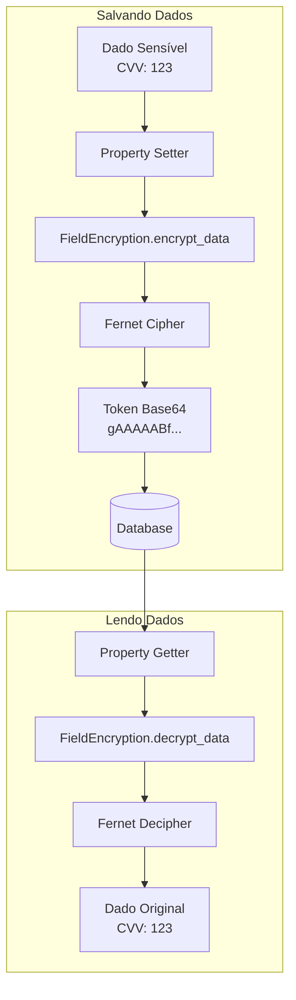

# Criptografia de Dados Sensíveis

Documentação completa do sistema de criptografia de campos sensíveis usando Fernet (symmetric encryption) no MindLedger.

## Sumário

- [Visão Geral](#visão-geral)
- [FieldEncryption Class](#fieldencryption-class)
- [Campos Criptografados](#campos-criptografados)
- [ENCRYPTION_KEY](#encryption_key)
- [Implementação em Modelos](#implementação-em-modelos)
- [Rotação de Chaves](#rotação-de-chaves)
- [Backup e Recuperação](#backup-e-recuperação)
- [Boas Práticas](#boas-práticas)
- [Troubleshooting](#troubleshooting)

## Visão Geral

O MindLedger implementa criptografia de dados sensíveis em repouso usando **Fernet** (symmetric encryption) da biblioteca `cryptography`. Dados como CVVs de cartões, números de cartões e senhas armazenadas são criptografados antes de serem salvos no banco de dados.

### Por que Fernet?

- **Segurança**: Implementa AES-128 em modo CBC com HMAC SHA-256
- **Simplicidade**: API simples e direta
- **Auditável**: Padrão bem documentado e amplamente usado
- **Symmetric**: Mesma chave para encriptar e decriptar (mais rápido que assimétrico)
- **Timestamp**: Incluído automaticamente no token criptografado

### Fluxo de Criptografia



### Características Principais

- **Transparente**: Criptografia/descriptografia automática via properties Python
- **Segura**: Dados nunca armazenados em plain text
- **Centralizada**: Classe única `FieldEncryption` para todo o sistema
- **ENCRYPTION_KEY única**: Uma chave para todo o sistema
- **Imutável**: NUNCA alterar ENCRYPTION_KEY após criptografar dados

## FieldEncryption Class

### Arquivo
`/home/tarcisio/Development/MindLedger/api/app/encryption.py`

### Código Completo

```python
import os
from cryptography.fernet import Fernet
from django.core.exceptions import ValidationError


class FieldEncryption:
    """
    Classe para criptografar/descriptografar campos sensíveis do banco.

    Utiliza Fernet (symmetric encryption) da biblioteca cryptography.
    Requer ENCRYPTION_KEY no arquivo .env (44 caracteres base64).
    """

    @staticmethod
    def get_encryption_key():
        """
        Obtém a chave de criptografia das variáveis de ambiente.

        Returns:
            bytes: Chave de criptografia em formato bytes

        Raises:
            ValidationError: Se ENCRYPTION_KEY não estiver definida
        """
        encryption_key = os.getenv('ENCRYPTION_KEY')
        if not encryption_key:
            raise ValidationError(
                "ENCRYPTION_KEY não encontrada nas variáveis de ambiente"
            )
        return encryption_key.encode()

    @staticmethod
    def encrypt_data(data):
        """
        Criptografa dados sensíveis.

        Args:
            data (str): Dados a serem criptografados

        Returns:
            str: Dados criptografados em string base64

        Raises:
            ValidationError: Se houver erro na criptografia
        """
        if not data:
            return data

        try:
            key = FieldEncryption.get_encryption_key()
            fernet = Fernet(key)
            encrypted_data = fernet.encrypt(str(data).encode())
            return encrypted_data.decode()
        except Exception as e:
            raise ValidationError(f"Erro ao criptografar dados: {str(e)}")

    @staticmethod
    def decrypt_data(encrypted_data):
        """
        Descriptografa dados sensíveis.

        Args:
            encrypted_data (str): Dados criptografados em string base64

        Returns:
            str: Dados descriptografados

        Raises:
            ValidationError: Se houver erro na descriptografia
        """
        if not encrypted_data:
            return encrypted_data

        try:
            key = FieldEncryption.get_encryption_key()
            fernet = Fernet(key)
            decrypted_data = fernet.decrypt(encrypted_data.encode())
            return decrypted_data.decode()
        except Exception as e:
            raise ValidationError(f"Erro ao descriptografar dados: {str(e)}")

    @staticmethod
    def generate_key():
        """
        Gera uma nova chave de criptografia.
        Use esta função apenas para gerar a chave inicial.

        ATENÇÃO: NUNCA mude a chave após criptografar dados!
        Dados criptografados com uma chave não podem ser
        descriptografados com outra chave.

        Returns:
            str: Chave de criptografia em base64

        Usage:
            >>> from app.encryption import FieldEncryption
            >>> key = FieldEncryption.generate_key()
            >>> print(key)  # Copie para o .env como ENCRYPTION_KEY
        """
        return Fernet.generate_key().decode()
```

### Funcionamento Técnico

#### Criptografia (encrypt_data)

```python
# Input
data = "123"  # CVV do cartão

# Processo
1. Converte para string: str(data) -> "123"
2. Converte para bytes: "123".encode() -> b'123'
3. Criptografa com Fernet: fernet.encrypt(b'123')
4. Retorna token base64: "gAAAAABf3cZ7..."

# Output
encrypted = "gAAAAABf3cZ7vQx..."  # Armazenado no DB
```

#### Descriptografia (decrypt_data)

```python
# Input
encrypted_data = "gAAAAABf3cZ7vQx..."  # Do DB

# Processo
1. Converte para bytes: encrypted_data.encode() -> b'gAAAAABf3cZ7...'
2. Descriptografa com Fernet: fernet.decrypt(b'gAAAAABf3cZ7...')
3. Converte de bytes para string: decrypted.decode() -> "123"

# Output
data = "123"  # CVV original
```

## Campos Criptografados

### 1. Cartões de Crédito (CreditCard)

**Arquivo**: `/home/tarcisio/Development/MindLedger/api/credit_cards/models.py`

```python
class CreditCard(BaseModel):
    name = models.CharField(max_length=200)
    on_card_name = models.CharField(max_length=200)
    flag = models.CharField(max_length=200, choices=FLAGS)

    # Campo criptografado: CVV
    _security_code = models.TextField(
        verbose_name="Código de Segurança (Criptografado)",
        blank=False,
        null=False,
        help_text="Campo criptografado para armazenar o CVV"
    )

    # Property para acesso transparente
    @property
    def security_code(self):
        """Retorna CVV descriptografado"""
        if self._security_code:
            try:
                return FieldEncryption.decrypt_data(self._security_code)
            except Exception:
                return None
        return None

    @security_code.setter
    def security_code(self, value):
        """Criptografa CVV antes de salvar"""
        if value:
            self._security_code = FieldEncryption.encrypt_data(str(value))
        else:
            self._security_code = None

    def save(self, *args, **kwargs):
        # CVV já criptografado via property setter
        super().save(*args, **kwargs)
```

**Uso**:
```python
# Criar cartão (CVV criptografado automaticamente)
card = CreditCard.objects.create(
    name="Cartão Nubank",
    on_card_name="JOAO SILVA",
    flag="MSC",
    security_code="123",  # Setter criptografa antes de salvar
)

# Acessar CVV (descriptografado automaticamente)
print(card.security_code)  # "123" (descriptografado)
print(card._security_code)  # "gAAAAABf..." (criptografado no DB)
```

### 2. Cartões Armazenados (StoredCreditCard - módulo Security)

**Arquivo**: `/home/tarcisio/Development/MindLedger/api/security/models.py`

```python
class StoredCreditCard(BaseModel):
    """Armazenamento seguro de credenciais de cartões de crédito."""

    title = models.CharField(max_length=200)
    flag = models.CharField(max_length=50, choices=FLAGS)

    # Campos criptografados
    _card_number = models.TextField(verbose_name="Número do Cartão (Criptografado)")
    _cvv = models.TextField(verbose_name="CVV (Criptografado)")

    holder_name = models.CharField(max_length=200)
    expiration_date = models.DateField()
    notes = models.TextField(blank=True, null=True)
    owner = models.ForeignKey('members.Member', on_delete=models.PROTECT)

    # Properties para número do cartão
    @property
    def card_number(self):
        if self._card_number:
            try:
                return FieldEncryption.decrypt_data(self._card_number)
            except Exception:
                return None
        return None

    @card_number.setter
    def card_number(self, value):
        if value:
            self._card_number = FieldEncryption.encrypt_data(str(value))
        else:
            self._card_number = None

    # Properties para CVV
    @property
    def cvv(self):
        if self._cvv:
            try:
                return FieldEncryption.decrypt_data(self._cvv)
            except Exception:
                return None
        return None

    @cvv.setter
    def cvv(self, value):
        if value:
            self._cvv = FieldEncryption.encrypt_data(str(value))
        else:
            self._cvv = None

    # Property para exibir número parcial (segurança na UI)
    @property
    def card_number_masked(self):
        """Retorna apenas últimos 4 dígitos: **** **** **** 1234"""
        full_number = self.card_number
        if full_number and len(full_number) >= 4:
            return f"**** **** **** {full_number[-4:]}"
        return "****"
```

**Uso**:
```python
# Criar cartão armazenado
card = StoredCreditCard.objects.create(
    title="Cartão Principal",
    flag="VSA",
    card_number="1234567812345678",  # Criptografado automaticamente
    cvv="456",  # Criptografado automaticamente
    holder_name="MARIA SILVA",
    expiration_date="2028-12-31",
    owner=member,
)

# Acessar dados (descriptografados)
print(card.card_number)  # "1234567812345678"
print(card.cvv)  # "456"
print(card.card_number_masked)  # "**** **** **** 5678"

# No banco de dados
print(card._card_number)  # "gAAAAABf..." (criptografado)
print(card._cvv)  # "gAAAAABg..." (criptografado)
```

### 3. Senhas (Password - módulo Security)

**Arquivo**: `/home/tarcisio/Development/MindLedger/api/security/models.py`

```python
class Password(BaseModel):
    """
    Modelo para armazenamento seguro de senhas.
    Todas as senhas são criptografadas usando Fernet.
    """

    title = models.CharField(max_length=200, verbose_name="Título")
    site = models.URLField(max_length=500, blank=True, null=True)
    username = models.CharField(max_length=200, verbose_name="Usuário/Email")

    # Campo criptografado
    _password = models.TextField(verbose_name="Senha (Criptografada)")

    category = models.CharField(max_length=100, choices=PASSWORD_CATEGORIES, default='other')
    notes = models.TextField(blank=True, null=True)
    last_password_change = models.DateTimeField(auto_now_add=True)
    owner = models.ForeignKey('members.Member', on_delete=models.PROTECT)

    # Property para senha
    @property
    def password(self):
        if self._password:
            try:
                return FieldEncryption.decrypt_data(self._password)
            except Exception:
                return None
        return None

    @password.setter
    def password(self, value):
        if value:
            self._password = FieldEncryption.encrypt_data(str(value))
        else:
            self._password = None

    def __str__(self):
        return f"{self.title} - {self.username}"
```

**Uso**:
```python
# Criar senha armazenada
pwd = Password.objects.create(
    title="Gmail",
    site="https://gmail.com",
    username="joao@gmail.com",
    password="minhaSenhaSegura123!",  # Criptografada automaticamente
    category="email",
    owner=member,
)

# Acessar senha (descriptografada)
print(pwd.password)  # "minhaSenhaSegura123!"

# No banco de dados
print(pwd._password)  # "gAAAAABf..." (criptografada)
```

## ENCRYPTION_KEY

### O que é?

A `ENCRYPTION_KEY` é uma chave de 44 caracteres em formato base64 usada pelo Fernet para criptografar e descriptografar dados. É a chave **mais crítica** de todo o sistema.

### Formato

```
ENCRYPTION_KEY=xQtSv8N3K7ZwY9RmPqL5GhJkFdWbVcXz4A2SdFgHj6M=
                ^^^^^^^^^^^^^^^^^^^^^^^^^^^^^^^^^^^^^^^^^
                44 caracteres em base64
```

### Características

- **Tamanho**: Exatamente 44 caracteres
- **Formato**: Base64
- **Encoding**: URL-safe base64
- **Algoritmo**: Gera chave de 256 bits (32 bytes)
- **Imutável**: NUNCA mude após criar dados criptografados

### Geração

#### Método 1: Python Shell

```bash
python -c "from cryptography.fernet import Fernet; print(Fernet.generate_key().decode())"
```

**Output**:
```
xQtSv8N3K7ZwY9RmPqL5GhJkFdWbVcXz4A2SdFgHj6M=
```

#### Método 2: Django Shell

```bash
python manage.py shell
```

```python
from app.encryption import FieldEncryption

key = FieldEncryption.generate_key()
print(key)
# xQtSv8N3K7ZwY9RmPqL5GhJkFdWbVcXz4A2SdFgHj6M=
```

#### Método 3: Python Script

```python
# generate_key.py
from cryptography.fernet import Fernet

key = Fernet.generate_key()
print(f"ENCRYPTION_KEY={key.decode()}")
```

```bash
python generate_key.py
# ENCRYPTION_KEY=xQtSv8N3K7ZwY9RmPqL5GhJkFdWbVcXz4A2SdFgHj6M=
```

### Configuração no .env

```bash
# .env
ENCRYPTION_KEY=xQtSv8N3K7ZwY9RmPqL5GhJkFdWbVcXz4A2SdFgHj6M=
```

### Validação

```python
# Validar se chave é válida
from cryptography.fernet import Fernet

try:
    key = b'xQtSv8N3K7ZwY9RmPqL5GhJkFdWbVcXz4A2SdFgHj6M='
    fernet = Fernet(key)
    print("Chave válida!")
except Exception as e:
    print(f"Chave inválida: {e}")
```

### CRÍTICO: Nunca Altere a Chave

```
⚠️  ATENÇÃO EXTREMA  ⚠️

Se você alterar ENCRYPTION_KEY após criptografar dados:
- Todos os dados criptografados se tornam IRRECUPERÁVEIS
- CVVs de cartões: PERDIDOS
- Números de cartões: PERDIDOS
- Senhas armazenadas: PERDIDAS
- Não há como reverter

SOLUÇÃO: Rotação de chaves (ver seção abaixo)
```

## Implementação em Modelos

### Pattern de Implementação

Todos os campos criptografados seguem o mesmo pattern:

```python
from django.db import models
from app.encryption import FieldEncryption


class MyModel(models.Model):
    # 1. Campo privado com prefixo _ (armazena dados criptografados)
    _sensitive_field = models.TextField(
        verbose_name="Campo Sensível (Criptografado)",
        help_text="Campo criptografado usando Fernet"
    )

    # 2. Property getter (descriptografa ao ler)
    @property
    def sensitive_field(self):
        """Retorna dados descriptografados"""
        if self._sensitive_field:
            try:
                return FieldEncryption.decrypt_data(self._sensitive_field)
            except Exception as e:
                # Log erro e retorna None
                logger.error(f"Erro ao descriptografar: {e}")
                return None
        return None

    # 3. Property setter (criptografa ao escrever)
    @sensitive_field.setter
    def sensitive_field(self, value):
        """Criptografa dados antes de salvar"""
        if value:
            self._sensitive_field = FieldEncryption.encrypt_data(str(value))
        else:
            self._sensitive_field = None
```

### Serializer (DRF)

```python
from rest_framework import serializers
from .models import CreditCard


class CreditCardSerializer(serializers.ModelSerializer):
    # Campo público (descriptografado)
    security_code = serializers.CharField(
        write_only=True,  # Nunca retorna no GET
        required=False
    )

    class Meta:
        model = CreditCard
        fields = [
            'id', 'name', 'on_card_name', 'flag',
            'security_code',  # Campo público
            'created_at', 'updated_at'
        ]
        # _security_code NÃO é exposto na API

    def create(self, validated_data):
        # security_code setter cuida da criptografia
        return CreditCard.objects.create(**validated_data)

    def update(self, instance, validated_data):
        # security_code setter cuida da criptografia
        for attr, value in validated_data.items():
            setattr(instance, attr, value)
        instance.save()
        return instance
```

### Exemplo Completo: Novo Modelo

```python
# myapp/models.py
from django.db import models
from app.models import BaseModel
from app.encryption import FieldEncryption


class BankAccount(BaseModel):
    """Conta bancária com dados sensíveis criptografados"""

    bank_name = models.CharField(max_length=200)
    account_type = models.CharField(max_length=50)

    # Número da conta (criptografado)
    _account_number = models.TextField(verbose_name="Número da Conta (Criptografado)")

    # Agência (criptografado)
    _branch_number = models.TextField(verbose_name="Agência (Criptografada)")

    owner = models.ForeignKey('members.Member', on_delete=models.PROTECT)

    @property
    def account_number(self):
        if self._account_number:
            try:
                return FieldEncryption.decrypt_data(self._account_number)
            except Exception:
                return None
        return None

    @account_number.setter
    def account_number(self, value):
        if value:
            self._account_number = FieldEncryption.encrypt_data(str(value))
        else:
            self._account_number = None

    @property
    def branch_number(self):
        if self._branch_number:
            try:
                return FieldEncryption.decrypt_data(self._branch_number)
            except Exception:
                return None
        return None

    @branch_number.setter
    def branch_number(self, value):
        if value:
            self._branch_number = FieldEncryption.encrypt_data(str(value))
        else:
            self._branch_number = None

    @property
    def account_number_masked(self):
        """Exibe apenas últimos 4 dígitos"""
        full_number = self.account_number
        if full_number and len(full_number) >= 4:
            return f"****{full_number[-4:]}"
        return "****"
```

## Rotação de Chaves

### Quando Fazer Rotação?

- **Comprometimento da chave**: Chave vazou ou foi exposta
- **Saída de funcionário**: Admin que tinha acesso à chave saiu
- **Política de segurança**: Rotação periódica (ex: anualmente)
- **Upgrade de algoritmo**: Migração para algoritmo mais forte

### Processo de Rotação

```python
# scripts/rotate_encryption_key.py
from django.core.management.base import BaseCommand
from cryptography.fernet import Fernet
from myapp.models import CreditCard, StoredCreditCard, Password
import os


class Command(BaseCommand):
    help = 'Rotaciona ENCRYPTION_KEY (re-criptografa todos os dados)'

    def add_arguments(self, parser):
        parser.add_argument(
            '--new-key',
            type=str,
            help='Nova chave de criptografia (44 chars base64)'
        )

    def handle(self, *args, **options):
        # 1. Obter chaves
        old_key = os.getenv('ENCRYPTION_KEY').encode()
        new_key_str = options['new_key']

        if not new_key_str:
            new_key_str = Fernet.generate_key().decode()
            self.stdout.write(f'Nova chave gerada: {new_key_str}')

        new_key = new_key_str.encode()

        # Validar chaves
        old_fernet = Fernet(old_key)
        new_fernet = Fernet(new_key)

        # 2. Re-criptografar CreditCard._security_code
        self.stdout.write('Re-criptografando cartões de crédito...')
        for card in CreditCard.objects.all():
            try:
                # Descriptografar com chave antiga
                decrypted = old_fernet.decrypt(card._security_code.encode()).decode()
                # Re-criptografar com chave nova
                encrypted = new_fernet.encrypt(decrypted.encode()).decode()
                card._security_code = encrypted
                card.save()
            except Exception as e:
                self.stdout.write(self.style.ERROR(
                    f'Erro ao processar cartão {card.id}: {e}'
                ))

        # 3. Re-criptografar StoredCreditCard
        self.stdout.write('Re-criptografando cartões armazenados...')
        for card in StoredCreditCard.objects.all():
            try:
                # card_number
                decrypted_num = old_fernet.decrypt(card._card_number.encode()).decode()
                encrypted_num = new_fernet.encrypt(decrypted_num.encode()).decode()
                card._card_number = encrypted_num

                # cvv
                decrypted_cvv = old_fernet.decrypt(card._cvv.encode()).decode()
                encrypted_cvv = new_fernet.encrypt(decrypted_cvv.encode()).decode()
                card._cvv = encrypted_cvv

                card.save()
            except Exception as e:
                self.stdout.write(self.style.ERROR(
                    f'Erro ao processar cartão armazenado {card.id}: {e}'
                ))

        # 4. Re-criptografar Password
        self.stdout.write('Re-criptografando senhas armazenadas...')
        for pwd in Password.objects.all():
            try:
                decrypted = old_fernet.decrypt(pwd._password.encode()).decode()
                encrypted = new_fernet.encrypt(decrypted.encode()).decode()
                pwd._password = encrypted
                pwd.save()
            except Exception as e:
                self.stdout.write(self.style.ERROR(
                    f'Erro ao processar senha {pwd.id}: {e}'
                ))

        self.stdout.write(self.style.SUCCESS('Rotação concluída com sucesso!'))
        self.stdout.write(f'\nAtualize o .env com: ENCRYPTION_KEY={new_key_str}')
```

### Uso do Script

```bash
# 1. Gerar nova chave
python -c "from cryptography.fernet import Fernet; print(Fernet.generate_key().decode())"
# Output: NEW_KEY_HERE

# 2. Executar rotação (BACKUP ANTES!)
python manage.py rotate_encryption_key --new-key="NEW_KEY_HERE"

# 3. Atualizar .env
# ENCRYPTION_KEY=NEW_KEY_HERE

# 4. Reiniciar aplicação
docker-compose restart api
```

## Backup e Recuperação

### Backup da ENCRYPTION_KEY

```bash
# 1. Armazenar em vault seguro (recomendado)
# - AWS Secrets Manager
# - HashiCorp Vault
# - Azure Key Vault
# - 1Password / LastPass (para projetos pequenos)

# 2. Backup físico (emergência)
# Escreva a chave em papel e guarde em cofre
echo "$ENCRYPTION_KEY" > encryption_key_backup.txt
# Imprima e guarde em local seguro
# DELETE o arquivo digital após imprimir
rm encryption_key_backup.txt
```

### Backup do Banco de Dados

```bash
# SEMPRE faça backup antes de qualquer operação com criptografia

# Backup PostgreSQL
docker-compose exec db pg_dump -U $DB_USER mindledger_db > backup_$(date +%Y%m%d_%H%M%S).sql

# Backup com criptografia (gpg)
docker-compose exec db pg_dump -U $DB_USER mindledger_db | \
  gpg --encrypt --recipient your-email@example.com > backup_$(date +%Y%m%d_%H%M%S).sql.gpg
```

### Recuperação de Desastre

#### Cenário 1: ENCRYPTION_KEY Perdida (COM backup)

```bash
# 1. Restaurar chave do backup
# (do vault seguro ou papel guardado)

# 2. Atualizar .env
ENCRYPTION_KEY=xQtSv8N3K7ZwY9RmPqL5GhJkFdWbVcXz4A2SdFgHj6M=

# 3. Reiniciar aplicação
docker-compose restart api

# 4. Validar descriptografia
python manage.py shell
from credit_cards.models import CreditCard
card = CreditCard.objects.first()
print(card.security_code)  # Deve funcionar
```

#### Cenário 2: ENCRYPTION_KEY Perdida (SEM backup)

```
❌ DADOS IRRECUPERÁVEIS ❌

Não há como recuperar dados criptografados sem a chave.

Opções:
1. Restaurar backup do banco de dados (com chave antiga)
2. Recriar todos os dados manualmente
3. Aceitar perda de dados
```

#### Cenário 3: Banco Corrompido (COM backup)

```bash
# 1. Restaurar banco
docker-compose exec -T db psql -U $DB_USER mindledger_db < backup_20260112_143000.sql

# 2. Verificar ENCRYPTION_KEY no .env (deve ser a mesma de quando fez backup)

# 3. Validar
python manage.py shell
from security.models import Password
pwd = Password.objects.first()
print(pwd.password)  # Deve funcionar
```

## Boas Práticas

### Segurança

1. **Nunca commite ENCRYPTION_KEY no Git**
   ```bash
   # .gitignore
   .env
   .env.local
   .env.production
   ```

2. **Use vault seguro em produção**
   ```python
   # settings.py
   import boto3

   # AWS Secrets Manager
   secrets_client = boto3.client('secretsmanager')
   response = secrets_client.get_secret_value(SecretId='prod/encryption_key')
   ENCRYPTION_KEY = response['SecretString']
   ```

3. **Rotação periódica**
   - Rotacione ENCRYPTION_KEY anualmente
   - Documente processo de rotação
   - Teste rotação em staging antes de produção

4. **Backup redundante**
   ```
   ENCRYPTION_KEY armazenada em:
   - Vault primário (AWS Secrets Manager)
   - Vault secundário (1Password)
   - Backup físico (papel em cofre)
   ```

5. **Acesso limitado**
   - Apenas admins seniores têm acesso à chave
   - Log de todos os acessos à chave
   - Rotacione chave quando admin sair

### Performance

1. **Cache de descriptografia (se aplicável)**
   ```python
   # CUIDADO: Apenas para dados que mudam raramente
   from django.core.cache import cache

   def get_decrypted_field(self):
       cache_key = f'decrypted_{self.id}'
       cached = cache.get(cache_key)
       if cached:
           return cached

       decrypted = FieldEncryption.decrypt_data(self._field)
       cache.set(cache_key, decrypted, 60)  # 1 minuto
       return decrypted
   ```

2. **Bulk operations**
   ```python
   # ❌ Lento (N queries)
   for card in CreditCard.objects.all():
       print(card.security_code)  # Descriptografa uma vez por card

   # ✅ Melhor (mas ainda N descriptografias)
   cards = CreditCard.objects.all()
   for card in cards:
       print(card.security_code)
   ```

### Desenvolvimento

1. **ENCRYPTION_KEY diferente em dev/prod**
   ```bash
   # .env.development
   ENCRYPTION_KEY=dev_key_here

   # .env.production
   ENCRYPTION_KEY=prod_key_here_NEVER_IN_GIT
   ```

2. **Testes com chave de teste**
   ```python
   # tests.py
   from django.test import TestCase, override_settings

   @override_settings(ENCRYPTION_KEY='test_key_32_chars_base64_here')
   class EncryptionTests(TestCase):
       def test_encrypt_decrypt(self):
           # ...
   ```

## Troubleshooting

### Erro: "ENCRYPTION_KEY não encontrada"

**Causa**: Variável de ambiente não definida

**Solução**:
```bash
# Verificar se existe no .env
cat .env | grep ENCRYPTION_KEY

# Se não existir, gerar e adicionar
python -c "from cryptography.fernet import Fernet; print(Fernet.generate_key().decode())"
# Copiar output para .env

# Reiniciar
docker-compose restart api
```

### Erro: "Erro ao descriptografar dados"

**Causa 1**: ENCRYPTION_KEY mudou

**Solução**: Restaurar chave anterior ou fazer rotação

**Causa 2**: Dados corrompidos no banco

**Solução**: Restaurar backup

**Causa 3**: Formato inválido no banco

```python
# Debug
from security.models import Password
pwd = Password.objects.get(id=1)
print(pwd._password)  # Ver conteúdo criptografado
print(len(pwd._password))  # Verificar tamanho

# Tentar descriptografar manualmente
from app.encryption import FieldEncryption
try:
    decrypted = FieldEncryption.decrypt_data(pwd._password)
    print(decrypted)
except Exception as e:
    print(f"Erro: {e}")
```

### Erro: "Invalid token"

**Causa**: Chave Fernet inválida

**Solução**:
```python
# Validar chave
from cryptography.fernet import Fernet

try:
    key = b'sua_chave_aqui'
    fernet = Fernet(key)
    print("Chave válida!")
except Exception as e:
    print(f"Chave inválida: {e}")

# Gerar nova chave válida
new_key = Fernet.generate_key().decode()
print(f"Nova chave: {new_key}")
```

### Migration com Campo Criptografado

```python
# myapp/migrations/0002_add_encrypted_field.py
from django.db import migrations, models


class Migration(migrations.Migration):

    dependencies = [
        ('myapp', '0001_initial'),
    ]

    operations = [
        # Adicionar campo criptografado
        migrations.AddField(
            model_name='mymodel',
            name='_sensitive_field',
            field=models.TextField(
                verbose_name="Campo Sensível (Criptografado)",
                default=''  # Temporário para permitir criação
            ),
            preserve_default=False,
        ),
    ]
```

---

**Última atualização**: 2026-01-12
**Versão**: 1.0
