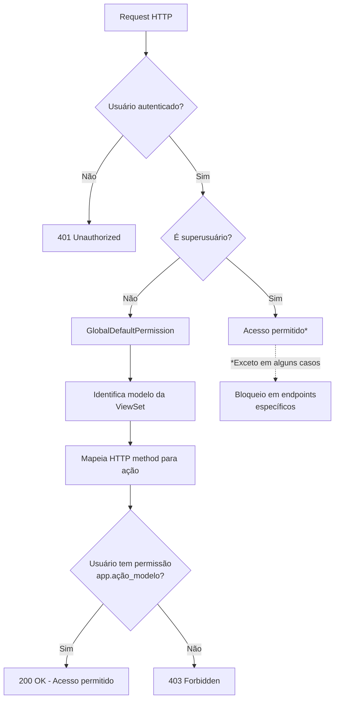

# Sistema de Permissões do MindLedger

Documentação completa do sistema de permissões baseado em grupos Django e controle de acesso granular por modelo e ação.

## Sumário

- [Visão Geral](#visão-geral)
- [Arquitetura de Permissões](#arquitetura-de-permissões)
- [GlobalDefaultPermission](#globaldefaultpermission)
- [Grupos e Permissões](#grupos-e-permissões)
- [Setup de Permissões](#setup-de-permissões)
- [Permissões Customizadas](#permissões-customizadas)
- [Integração com Frontend](#integração-com-frontend)
- [Casos de Uso](#casos-de-uso)
- [Troubleshooting](#troubleshooting)

## Visão Geral

O MindLedger implementa um sistema de permissões robusto baseado no sistema nativo de permissões do Django, estendido para trabalhar perfeitamente com Django REST Framework (DRF).

### Características Principais

- **Permissões por modelo**: Cada modelo tem permissões CRUD (view, add, change, delete)
- **Baseado em grupos**: Usuários herdam permissões dos grupos
- **GlobalDefaultPermission**: Mapeamento automático de HTTP methods para permissões Django
- **Verificação automática**: Todas as ViewSets DRF verificam permissões automaticamente
- **Granularidade**: Controle fino por módulo e ação
- **Superusuários bloqueados**: Superusuários não podem acessar interface de membros

### Fluxo de Verificação de Permissões



## Arquitetura de Permissões

### Modelo de Permissões Django

Cada modelo Django automaticamente gera 4 permissões:

| Permissão | Codename | Descrição |
|-----------|----------|-----------|
| **view** | `app.view_modelname` | Visualizar registros (GET, HEAD, OPTIONS) |
| **add** | `app.add_modelname` | Criar registros (POST) |
| **change** | `app.change_modelname` | Modificar registros (PUT, PATCH) |
| **delete** | `app.delete_modelname` | Deletar registros (DELETE) |

**Exemplo**: Para o modelo `Account` no app `accounts`:
- `accounts.view_account`
- `accounts.add_account`
- `accounts.change_account`
- `accounts.delete_account`

### Estrutura de Permissões

```
┌─────────────────────────────────────────────────────┐
│                    USUÁRIO                          │
│  - username, email, is_staff, is_superuser         │
└──────────────────┬──────────────────────────────────┘
                   │
                   │ pertence a
                   ▼
┌─────────────────────────────────────────────────────┐
│                    GRUPOS                           │
│  - admins (todas as permissões)                    │
│  - members (permissões limitadas)                  │
└──────────────────┬──────────────────────────────────┘
                   │
                   │ possui
                   ▼
┌─────────────────────────────────────────────────────┐
│                 PERMISSÕES                          │
│  - accounts.view_account                           │
│  - expenses.add_expense                            │
│  - revenues.change_revenue                         │
│  - ...                                             │
└─────────────────────────────────────────────────────┘
```

## GlobalDefaultPermission

### Arquivo
`/home/tarcisio/Development/MindLedger/api/app/permissions.py`

### Código Completo

```python
from rest_framework import permissions


class GlobalDefaultPermission(permissions.BasePermission):
    """
    Permissão global que verifica permissões Django baseadas no modelo
    e método HTTP da request.

    Mapeia automaticamente:
    - GET/HEAD/OPTIONS -> view
    - POST -> add
    - PUT/PATCH -> change
    - DELETE -> delete
    """

    def has_permission(self, request, view):
        """
        Verifica se o usuário tem permissão para acessar a view.

        Args:
            request: Request HTTP
            view: ViewSet sendo acessada

        Returns:
            bool: True se tem permissão, False caso contrário
        """
        model_permission_codename = self._get_model_permission_codename(
            method=request.method,
            view=view,
        )

        if not model_permission_codename:
            return False

        return request.user.has_perm(model_permission_codename)

    def _get_model_permission_codename(self, method, view):
        """
        Constrói o codename da permissão baseado no modelo e método HTTP.

        Args:
            method: Método HTTP (GET, POST, PUT, PATCH, DELETE)
            view: ViewSet sendo acessada

        Returns:
            str: Codename da permissão (ex: 'accounts.view_account')
            None: Se não conseguir identificar o modelo
        """
        try:
            model_name = view.queryset.model._meta.model_name
            app_label = view.queryset.model._meta.app_label
            action = self._get_action_sufix(method)
            return f'{app_label}.{action}_{model_name}'
        except AttributeError:
            return None

    def _get_action_sufix(self, method):
        """
        Mapeia método HTTP para sufixo de permissão Django.

        Args:
            method: Método HTTP

        Returns:
            str: Sufixo da permissão ('view', 'add', 'change', 'delete')
        """
        method_actions = {
            'GET': 'view',
            'POST': 'add',
            'PUT': 'change',
            'PATCH': 'change',
            'DELETE': 'delete',
            'OPTIONS': 'view',
            'HEAD': 'view',
        }
        return method_actions.get(method, '')
```

### Como Funciona

#### Exemplo 1: GET /api/v1/accounts/

```python
# Request
GET /api/v1/accounts/

# GlobalDefaultPermission
1. Identifica: view = AccountViewSet
2. Extrai: model = Account, app_label = 'accounts'
3. Mapeia: method 'GET' -> action 'view'
4. Constrói: 'accounts.view_account'
5. Verifica: request.user.has_perm('accounts.view_account')

# Resultado
✅ Se usuário tem permissão -> 200 OK
❌ Se não tem permissão -> 403 Forbidden
```

#### Exemplo 2: POST /api/v1/expenses/

```python
# Request
POST /api/v1/expenses/
Body: { "description": "Almoço", "amount": 25.00 }

# GlobalDefaultPermission
1. Identifica: view = ExpenseViewSet
2. Extrai: model = Expense, app_label = 'expenses'
3. Mapeia: method 'POST' -> action 'add'
4. Constrói: 'expenses.add_expense'
5. Verifica: request.user.has_perm('expenses.add_expense')

# Resultado
✅ Se tem permissão -> Cria despesa -> 201 Created
❌ Se não tem permissão -> 403 Forbidden
```

### Configuração em ViewSets

```python
# accounts/views.py
from rest_framework import viewsets
from app.permissions import GlobalDefaultPermission
from .models import Account
from .serializers import AccountSerializer


class AccountViewSet(viewsets.ModelViewSet):
    """
    ViewSet para gerenciar contas bancárias.
    Permissões verificadas automaticamente por GlobalDefaultPermission.
    """
    queryset = Account.objects.all()
    serializer_class = AccountSerializer
    permission_classes = [GlobalDefaultPermission]  # Aplica verificação

    # Métodos disponíveis:
    # - list() -> GET /accounts/ -> requer accounts.view_account
    # - retrieve() -> GET /accounts/{id}/ -> requer accounts.view_account
    # - create() -> POST /accounts/ -> requer accounts.add_account
    # - update() -> PUT /accounts/{id}/ -> requer accounts.change_account
    # - partial_update() -> PATCH /accounts/{id}/ -> requer accounts.change_account
    # - destroy() -> DELETE /accounts/{id}/ -> requer accounts.delete_account
```

### Configuração Global (settings.py)

```python
REST_FRAMEWORK = {
    'DEFAULT_AUTHENTICATION_CLASSES': (
        'rest_framework_simplejwt.authentication.JWTAuthentication',
    ),
    'DEFAULT_PERMISSION_CLASSES': (
        'rest_framework.permissions.IsAuthenticated',  # Requer autenticação
        # GlobalDefaultPermission aplicada por ViewSet
    ),
}
```

## Grupos e Permissões

### Grupo: admins

**Descrição**: Administradores com acesso total ao sistema

**Permissões**: Todas as permissões de todos os módulos

**Módulos**:
- `accounts` (Contas bancárias)
- `credit_cards` (Cartões de crédito)
- `expenses` (Despesas)
- `revenues` (Receitas)
- `loans` (Empréstimos)
- `transfers` (Transferências)
- `members` (Membros)
- `security` (Senhas armazenadas)
- `library` (Biblioteca de livros)
- `ai_assistant` (Assistente AI)
- `personal_planning` (Planejamento pessoal)

**Criação de Usuário Admin**:
```python
from django.contrib.auth.models import User, Group

# Criar usuário
user = User.objects.create_user(
    username='admin',
    email='admin@example.com',
    password='senha_segura',
    is_staff=True  # Acesso ao Django Admin
)

# Adicionar ao grupo admins
admins_group = Group.objects.get(name='admins')
user.groups.add(admins_group)
```

### Grupo: members

**Descrição**: Membros regulares com permissões limitadas

**Permissões**:
- **accounts**: view, add, change (sem delete)
- **credit_cards**: view, add, change (sem delete)
- **expenses**: view, add, change, delete
- **revenues**: view, add, change, delete
- **loans**: view apenas (sem modificação)
- **transfers**: view apenas
- **security**: view, add, change, delete (suas próprias senhas)
- **library**: view, add, change, delete (seus próprios livros)
- **personal_planning**: view, add, change, delete

**Criação de Usuário Member**:
```python
from django.contrib.auth.models import User, Group

# Criar usuário
user = User.objects.create_user(
    username='member',
    email='member@example.com',
    password='senha_segura',
    is_staff=False  # SEM acesso ao Django Admin
)

# Adicionar ao grupo members
members_group = Group.objects.get(name='members')
user.groups.add(members_group)
```

### Superusuários

**Descrição**: Usuários com `is_superuser=True` têm TODAS as permissões por padrão

**Bloqueios Especiais**:
```python
# authentication/views.py
@api_view(['GET'])
@permission_classes([IsAuthenticated])
def get_user_permissions(request):
    user = request.user

    # Bloqueia superusuários de usar interface Streamlit
    if user.is_superuser:
        return Response(
            {'error': 'Administradores não podem acessar esta interface'},
            status=status.HTTP_403_FORBIDDEN
        )

    perms = user.get_all_permissions()
    return Response({
        "username": user.username,
        "permissions": list(perms),
    })
```

## Setup de Permissões

### Management Command (Futura Implementação)

O comando `setup_permissions` ainda não foi implementado, mas a estrutura recomendada seria:

```python
# app/management/commands/setup_permissions.py
from django.core.management.base import BaseCommand
from django.contrib.auth.models import Group, Permission
from django.contrib.contenttypes.models import ContentType


class Command(BaseCommand):
    help = 'Configura grupos e permissões do sistema'

    def handle(self, *args, **options):
        self.stdout.write('Configurando grupos e permissões...')

        # Criar grupos
        admins_group, _ = Group.objects.get_or_create(name='admins')
        members_group, _ = Group.objects.get_or_create(name='members')

        # Permissões para admins (todas)
        all_permissions = Permission.objects.all()
        admins_group.permissions.set(all_permissions)

        # Permissões para members (seletivas)
        members_permissions = self.get_members_permissions()
        members_group.permissions.set(members_permissions)

        self.stdout.write(self.style.SUCCESS('Grupos configurados com sucesso!'))

    def get_members_permissions(self):
        """Retorna permissões para o grupo members"""
        permissions = []

        # Accounts (view, add, change)
        permissions += self.get_permissions_for_model('accounts', 'account',
                                                      ['view', 'add', 'change'])

        # Credit Cards (view, add, change)
        permissions += self.get_permissions_for_model('credit_cards', 'creditcard',
                                                      ['view', 'add', 'change'])

        # Expenses (todas)
        permissions += self.get_permissions_for_model('expenses', 'expense',
                                                      ['view', 'add', 'change', 'delete'])

        # Revenues (todas)
        permissions += self.get_permissions_for_model('revenues', 'revenue',
                                                      ['view', 'add', 'change', 'delete'])

        # Loans (view apenas)
        permissions += self.get_permissions_for_model('loans', 'loan', ['view'])

        # Transfers (view apenas)
        permissions += self.get_permissions_for_model('transfers', 'transfer', ['view'])

        # Security (todas)
        permissions += self.get_permissions_for_model('security', 'password',
                                                      ['view', 'add', 'change', 'delete'])
        permissions += self.get_permissions_for_model('security', 'storedcreditcard',
                                                      ['view', 'add', 'change', 'delete'])

        # Library (todas)
        permissions += self.get_permissions_for_model('library', 'book',
                                                      ['view', 'add', 'change', 'delete'])

        # Personal Planning (todas)
        permissions += self.get_permissions_for_model('personal_planning', 'goal',
                                                      ['view', 'add', 'change', 'delete'])

        return permissions

    def get_permissions_for_model(self, app_label, model_name, actions):
        """
        Obtém permissões específicas para um modelo

        Args:
            app_label: Nome do app Django (ex: 'accounts')
            model_name: Nome do modelo (ex: 'account')
            actions: Lista de ações (ex: ['view', 'add'])
        """
        permissions = []
        try:
            content_type = ContentType.objects.get(
                app_label=app_label,
                model=model_name
            )
            for action in actions:
                codename = f'{action}_{model_name}'
                perm = Permission.objects.get(
                    content_type=content_type,
                    codename=codename
                )
                permissions.append(perm)
        except (ContentType.DoesNotExist, Permission.DoesNotExist) as e:
            self.stdout.write(self.style.WARNING(
                f'Permissão não encontrada: {app_label}.{action}_{model_name}'
            ))

        return permissions
```

### Uso do Comando

```bash
# Executar setup de permissões
python manage.py setup_permissions

# Saída esperada:
# Configurando grupos e permissões...
# Grupos configurados com sucesso!
```

### Verificação de Permissões

```bash
# Shell Django
python manage.py shell

# Verificar grupos
from django.contrib.auth.models import Group
Group.objects.all()  # <QuerySet [<Group: admins>, <Group: members>]>

# Verificar permissões de um grupo
admins = Group.objects.get(name='admins')
admins.permissions.count()  # Número de permissões

members = Group.objects.get(name='members')
list(members.permissions.values_list('codename', flat=True))
# ['view_account', 'add_account', 'change_account', ...]

# Verificar permissões de um usuário
from django.contrib.auth.models import User
user = User.objects.get(username='member')
user.get_all_permissions()
# {'accounts.view_account', 'accounts.add_account', ...}

user.has_perm('accounts.view_account')  # True
user.has_perm('accounts.delete_account')  # False (members não podem deletar)
```

## Permissões Customizadas

### Permissões por Objeto

Para permissões mais granulares (ex: usuário só pode editar seus próprios registros):

```python
# accounts/permissions.py
from rest_framework import permissions


class IsOwnerOrAdmin(permissions.BasePermission):
    """
    Permissão customizada: apenas o dono do objeto ou admins podem acessar
    """

    def has_object_permission(self, request, view, obj):
        # Admins têm acesso total
        if request.user.is_staff or request.user.groups.filter(name='admins').exists():
            return True

        # Apenas GET/HEAD/OPTIONS permitido para todos autenticados
        if request.method in permissions.SAFE_METHODS:
            return True

        # Write permissions apenas para o dono
        return obj.owner == request.user


# Uso em ViewSet
class PasswordViewSet(viewsets.ModelViewSet):
    queryset = Password.objects.all()
    serializer_class = PasswordSerializer
    permission_classes = [GlobalDefaultPermission, IsOwnerOrAdmin]

    def get_queryset(self):
        """Filtra registros do usuário atual (exceto admins)"""
        user = self.request.user
        if user.is_staff or user.groups.filter(name='admins').exists():
            return Password.objects.all()
        return Password.objects.filter(owner=user)
```

### Permissões por Ação

```python
from rest_framework.decorators import action


class AccountViewSet(viewsets.ModelViewSet):
    queryset = Account.objects.all()
    serializer_class = AccountSerializer
    permission_classes = [GlobalDefaultPermission]

    @action(detail=True, methods=['post'],
            permission_classes=[IsAuthenticated])  # Permissão customizada para esta ação
    def activate(self, request, pk=None):
        """Ativa uma conta - qualquer usuário autenticado pode fazer"""
        account = self.get_object()
        account.active = True
        account.save()
        return Response({'status': 'Conta ativada'})

    @action(detail=False, methods=['get'])
    def summary(self, request):
        """Resumo de contas - usa GlobalDefaultPermission (view_account)"""
        accounts = self.get_queryset()
        total_balance = sum(acc.balance for acc in accounts)
        return Response({
            'total_accounts': accounts.count(),
            'total_balance': total_balance
        })
```

## Integração com Frontend

### Obtendo Permissões do Usuário

```typescript
// services/auth-service.ts
import { apiClient } from './api-client';

export interface UserPermissions {
  username: string;
  permissions: string[];
  is_staff: boolean;
  is_superuser: boolean;
}

export const authService = {
  getCurrentUser: async () => {
    return await apiClient.get<UserPermissions>('/api/v1/me/');
  },
};
```

### Verificação de Permissões no Frontend

```typescript
// hooks/usePermissions.ts
import { useAuthStore } from '@/stores/auth-store';

export const usePermissions = () => {
  const { user } = useAuthStore();

  const hasPermission = (permission: string): boolean => {
    if (!user) return false;
    if (user.is_superuser) return true;
    return user.permissions.includes(permission);
  };

  const canView = (module: string): boolean => {
    return hasPermission(`${module}.view_${module.slice(0, -1)}`);
  };

  const canAdd = (module: string): boolean => {
    return hasPermission(`${module}.add_${module.slice(0, -1)}`);
  };

  const canChange = (module: string): boolean => {
    return hasPermission(`${module}.change_${module.slice(0, -1)}`);
  };

  const canDelete = (module: string): boolean => {
    return hasPermission(`${module}.delete_${module.slice(0, -1)}`);
  };

  return {
    hasPermission,
    canView,
    canAdd,
    canChange,
    canDelete,
  };
};
```

### Componente Protegido por Permissão

```typescript
// components/PermissionGuard.tsx
import React from 'react';
import { usePermissions } from '@/hooks/usePermissions';

interface PermissionGuardProps {
  permission: string;
  children: React.ReactNode;
  fallback?: React.ReactNode;
}

export const PermissionGuard: React.FC<PermissionGuardProps> = ({
  permission,
  children,
  fallback = null,
}) => {
  const { hasPermission } = usePermissions();

  if (!hasPermission(permission)) {
    return <>{fallback}</>;
  }

  return <>{children}</>;
};

// Uso
<PermissionGuard permission="accounts.add_account">
  <Button onClick={handleCreate}>Criar Conta</Button>
</PermissionGuard>

<PermissionGuard
  permission="accounts.delete_account"
  fallback={<span>Sem permissão para deletar</span>}
>
  <Button onClick={handleDelete} variant="destructive">
    Deletar
  </Button>
</PermissionGuard>
```

### Exibição Condicional de Botões

```typescript
// pages/AccountsPage.tsx
import { usePermissions } from '@/hooks/usePermissions';

export const AccountsPage = () => {
  const { canAdd, canChange, canDelete } = usePermissions();

  return (
    <div>
      <h1>Contas Bancárias</h1>

      {canAdd('accounts') && (
        <Button onClick={handleCreate}>
          Nova Conta
        </Button>
      )}

      <Table data={accounts}>
        <Column field="name" />
        <Column field="balance" />
        <Column
          field="actions"
          render={(account) => (
            <>
              {canChange('accounts') && (
                <Button onClick={() => handleEdit(account)}>
                  Editar
                </Button>
              )}
              {canDelete('accounts') && (
                <Button onClick={() => handleDelete(account)} variant="destructive">
                  Deletar
                </Button>
              )}
            </>
          )}
        />
      </Table>
    </div>
  );
};
```

## Casos de Uso

### Caso 1: Novo Usuário Membro

```python
# 1. Criar usuário
user = User.objects.create_user(
    username='joao.silva',
    email='joao@example.com',
    password='senha123',
    is_staff=False
)

# 2. Adicionar ao grupo members
members_group = Group.objects.get(name='members')
user.groups.add(members_group)

# 3. Verificar permissões
user.has_perm('accounts.view_account')    # True
user.has_perm('accounts.add_account')     # True
user.has_perm('accounts.delete_account')  # False
user.has_perm('loans.change_loan')        # False (members só podem ver)
```

### Caso 2: Promover Usuário a Admin

```python
# 1. Buscar usuário
user = User.objects.get(username='joao.silva')

# 2. Remover do grupo members
members_group = Group.objects.get(name='members')
user.groups.remove(members_group)

# 3. Adicionar ao grupo admins
admins_group = Group.objects.get(name='admins')
user.groups.add(admins_group)

# 4. Conceder acesso ao Django Admin
user.is_staff = True
user.save()

# Agora tem todas as permissões
user.has_perm('accounts.delete_account')  # True
user.has_perm('loans.change_loan')        # True
```

### Caso 3: Permissões Customizadas

```python
# Conceder permissão específica fora dos grupos
from django.contrib.auth.models import Permission

user = User.objects.get(username='joao.silva')

# Buscar permissão
permission = Permission.objects.get(codename='delete_account')

# Adicionar permissão ao usuário
user.user_permissions.add(permission)

# Verificar
user.has_perm('accounts.delete_account')  # True
```

## Troubleshooting

### Problema: Usuário não tem permissão mesmo estando no grupo correto

**Causa**: Permissões em cache

**Solução**:
```python
# Forçar reload de permissões
from django.contrib.auth.models import User
user = User.objects.get(username='joao.silva')
user = User.objects.get(pk=user.pk)  # Reload from DB

# Ou limpar cache
from django.core.cache import cache
cache.clear()
```

### Problema: 403 Forbidden em todos os endpoints

**Causa**: GlobalDefaultPermission não configurada

**Solução**:
```python
# Verificar ViewSet
class AccountViewSet(viewsets.ModelViewSet):
    permission_classes = [GlobalDefaultPermission]  # Adicione esta linha
```

### Problema: Superusuário não consegue acessar

**Causa**: Bloqueio intencional em endpoint específico

**Solução**:
```python
# Verificar bloqueios no código
if user.is_superuser:
    # Remover ou ajustar lógica de bloqueio
    pass
```

### Problema: Frontend mostra botão mas API retorna 403

**Causa**: Dessincronia entre permissões no frontend e backend

**Solução**:
```typescript
// Forçar reload de permissões
const userData = await authService.getCurrentUser();
authStore.setUser(userData);
```

### Verificação de Permissões (Debug)

```python
# Shell Django
from django.contrib.auth.models import User

user = User.objects.get(username='joao.silva')

# Listar todos os grupos
print(user.groups.all())

# Listar todas as permissões (grupos + individuais)
print(user.get_all_permissions())

# Verificar permissão específica
print(user.has_perm('accounts.view_account'))

# Verificar se é admin
print(user.is_staff)
print(user.is_superuser)
print(user.groups.filter(name='admins').exists())
```

---

**Última atualização**: 2026-01-12
**Versão**: 1.0
