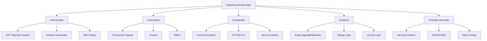

# Boas Práticas de Segurança

Guia completo de segurança do MindLedger baseado em OWASP Top 10 e melhores práticas da indústria.

## Sumário

- [Visão Geral](#visão-geral)
- [OWASP Top 10](#owasp-top-10)
- [Headers de Segurança](#headers-de-segurança)
- [CORS e CSRF](#cors-e-csrf)
- [Proteção XSS](#proteção-xss)
- [Proteção SQL Injection](#proteção-sql-injection)
- [Auditoria e Logging](#auditoria-e-logging)
- [Rate Limiting](#rate-limiting)
- [Validação de Entrada](#validação-de-entrada)
- [Gestão de Secrets](#gestão-de-secrets)
- [Segurança em Produção](#segurança-em-produção)
- [Checklist de Segurança](#checklist-de-segurança)

## Visão Geral

O MindLedger implementa múltiplas camadas de segurança para proteger dados financeiros sensíveis. Este documento descreve todas as medidas de segurança implementadas e recomendações para manter o sistema seguro.

### Princípios de Segurança

1. **Defense in Depth**: Múltiplas camadas de proteção
2. **Least Privilege**: Usuários têm apenas permissões necessárias
3. **Secure by Default**: Configurações seguras por padrão
4. **Fail Securely**: Erros não expõem informações sensíveis
5. **Separation of Duties**: Diferentes níveis de acesso

### Pilares de Segurança



## OWASP Top 10

### A01:2021 - Broken Access Control

**Risco**: Usuários acessam recursos sem permissão

**Proteções Implementadas**:

1. **GlobalDefaultPermission**
   ```python
   # Todas as ViewSets verificam permissões automaticamente
   class AccountViewSet(viewsets.ModelViewSet):
       permission_classes = [GlobalDefaultPermission]
   ```

2. **Filtro de Queryset por Usuário**
   ```python
   def get_queryset(self):
       """Usuários só veem seus próprios dados"""
       user = self.request.user
       if user.is_staff:
           return Password.objects.all()
       return Password.objects.filter(owner__user=user)
   ```

3. **Verificação de Propriedade**
   ```python
   class IsOwnerOrAdmin(permissions.BasePermission):
       def has_object_permission(self, request, view, obj):
           if request.user.is_staff:
               return True
           return obj.owner.user == request.user
   ```

**Recomendações**:
- [ ] Sempre filtrar querysets por usuário
- [ ] Verificar propriedade em has_object_permission
- [ ] Nunca confiar em IDs do frontend
- [ ] Logar tentativas de acesso não autorizado

### A02:2021 - Cryptographic Failures

**Risco**: Dados sensíveis expostos por criptografia fraca ou ausente

**Proteções Implementadas**:

1. **Criptografia de Dados em Repouso**
   ```python
   # FieldEncryption usando Fernet (AES-128)
   _security_code = models.TextField()  # Criptografado
   _password = models.TextField()        # Criptografado
   _card_number = models.TextField()     # Criptografado
   ```

2. **HTTPS em Produção**
   ```python
   # settings.py
   SECURE_SSL_REDIRECT = not DEBUG  # Força HTTPS
   SESSION_COOKIE_SECURE = not DEBUG
   CSRF_COOKIE_SECURE = not DEBUG
   ```

3. **Senhas Hasheadas (Django)**
   ```python
   # Django usa PBKDF2-SHA256 por padrão
   user = User.objects.create_user(
       username='user',
       password='senha'  # Automaticamente hasheada
   )
   ```

**Recomendações**:
- [ ] Use HTTPS em produção (obrigatório)
- [ ] Nunca armazene senhas em plain text
- [ ] Criptografe dados sensíveis em repouso
- [ ] Backup seguro de ENCRYPTION_KEY
- [ ] Certificado SSL válido e atualizado

### A03:2021 - Injection

**Risco**: SQL Injection, Command Injection, etc.

**Proteções Implementadas**:

1. **Django ORM (Previne SQL Injection)**
   ```python
   # ✅ SEGURO (parametrizado)
   Account.objects.filter(name=user_input)

   # ❌ INSEGURO (nunca fazer)
   Account.objects.raw(f"SELECT * FROM accounts WHERE name='{user_input}'")
   ```

2. **Validação de Entrada**
   ```python
   # DRF Serializers validam automaticamente
   class AccountSerializer(serializers.ModelSerializer):
       name = serializers.CharField(max_length=200)
       balance = serializers.DecimalField(max_digits=10, decimal_places=2)
   ```

3. **Sanitização de HTML (se aplicável)**
   ```python
   from django.utils.html import escape

   safe_output = escape(user_input)
   ```

**Recomendações**:
- [ ] SEMPRE use Django ORM (nunca raw SQL com input do usuário)
- [ ] Valide TODOS os inputs com serializers
- [ ] Use django-filter para filtros seguros
- [ ] Escape HTML em templates

### A04:2021 - Insecure Design

**Risco**: Falhas fundamentais de arquitetura

**Proteções Implementadas**:

1. **Autenticação Robusta**
   - JWT em cookies HttpOnly (proteção XSS)
   - Refresh automático de tokens
   - Logout limpa todos os cookies

2. **Separação de Responsabilidades**
   - Backend: autenticação, autorização, criptografia
   - Frontend: UI, nunca manipula tokens
   - Database: dados criptografados

3. **Princípio de Mínimo Privilégio**
   - Grupos com permissões limitadas
   - Superusuários bloqueados de certas interfaces

**Recomendações**:
- [ ] Design review antes de implementar features sensíveis
- [ ] Threat modeling para novos módulos
- [ ] Peer review de código de segurança

### A05:2021 - Security Misconfiguration

**Risco**: Configurações inseguras ou padrões fracos

**Proteções Implementadas**:

1. **DEBUG=False em Produção**
   ```python
   DEBUG = os.getenv('DEBUG', 'False') == 'True'
   ```

2. **ALLOWED_HOSTS Configurado**
   ```python
   ALLOWED_HOSTS = ['seu-dominio.com', 'www.seu-dominio.com']
   ```

3. **Senhas Fortes Requeridas**
   ```python
   AUTH_PASSWORD_VALIDATORS = [
       {'NAME': 'django.contrib.auth.password_validation.UserAttributeSimilarityValidator'},
       {'NAME': 'django.contrib.auth.password_validation.MinimumLengthValidator'},
       {'NAME': 'django.contrib.auth.password_validation.CommonPasswordValidator'},
       {'NAME': 'django.contrib.auth.password_validation.NumericPasswordValidator'},
   ]
   ```

**Recomendações**:
- [ ] Revise settings.py antes de deploy
- [ ] Use `python manage.py check --deploy`
- [ ] Mantenha dependências atualizadas
- [ ] Remova código/comentários de debug

### A06:2021 - Vulnerable and Outdated Components

**Risco**: Dependências com vulnerabilidades conhecidas

**Proteções Implementadas**:

1. **Requirements.txt Versionado**
   ```
   Django==4.2.7
   djangorestframework==3.14.0
   djangorestframework-simplejwt==5.3.0
   cryptography==41.0.7
   ```

2. **Verificação de Vulnerabilidades**
   ```bash
   # Safety (verifica vulnerabilidades)
   pip install safety
   safety check

   # Dependabot (GitHub)
   # Configurado para alertar sobre vulnerabilidades
   ```

**Recomendações**:
- [ ] Atualize dependências regularmente
- [ ] Use `pip list --outdated`
- [ ] Configure Dependabot no GitHub
- [ ] Teste atualizações em staging primeiro

### A07:2021 - Identification and Authentication Failures

**Risco**: Autenticação fraca ou sessões mal gerenciadas

**Proteções Implementadas**:

1. **JWT com Expiração**
   ```python
   SIMPLE_JWT = {
       "ACCESS_TOKEN_LIFETIME": timedelta(minutes=15),
       "REFRESH_TOKEN_LIFETIME": timedelta(hours=1),
   }
   ```

2. **HttpOnly Cookies (proteção XSS)**
   ```python
   response.set_cookie(
       key='access_token',
       httponly=True,  # JavaScript não acessa
       secure=True,    # Apenas HTTPS
       samesite='Lax'  # Proteção CSRF
   )
   ```

3. **Rate Limiting em Login**
   ```python
   REST_FRAMEWORK = {
       'DEFAULT_THROTTLE_CLASSES': [
           'rest_framework.throttling.AnonRateThrottle',
       ],
       'DEFAULT_THROTTLE_RATES': {
           'anon': '10/minute',  # Previne brute force
       }
   }
   ```

**Recomendações**:
- [ ] Implemente MFA (Multi-Factor Authentication)
- [ ] Bloqueie contas após X tentativas falhas
- [ ] Force troca de senha periódica para admins
- [ ] Detecte e bloqueie logins suspeitos

### A08:2021 - Software and Data Integrity Failures

**Risco**: Código ou dados modificados sem verificação

**Proteções Implementadas**:

1. **Backups Regulares**
   ```bash
   # Backup diário automatizado
   docker-compose exec db pg_dump -U $DB_USER mindledger_db > backup.sql
   ```

2. **Validação de Integridade**
   ```python
   # Serializers validam integridade dos dados
   class AccountSerializer(serializers.ModelSerializer):
       def validate_balance(self, value):
           if value < 0:
               raise serializers.ValidationError("Saldo não pode ser negativo")
           return value
   ```

**Recomendações**:
- [ ] Backups automáticos diários
- [ ] Teste restauração de backups
- [ ] Use checksums para verificar integridade
- [ ] Code signing para deploys

### A09:2021 - Security Logging and Monitoring Failures

**Risco**: Ataques não detectados por falta de logs

**Proteções Implementadas**: Ver [Auditoria e Logging](#auditoria-e-logging)

### A10:2021 - Server-Side Request Forgery (SSRF)

**Risco**: Servidor faz requests maliciosos

**Proteções Implementadas**:

1. **Validação de URLs**
   ```python
   from urllib.parse import urlparse

   def validate_url(url):
       parsed = urlparse(url)
       # Bloquear IPs privados
       if parsed.hostname in ['localhost', '127.0.0.1', '0.0.0.0']:
           raise ValidationError("URL não permitida")
       return url
   ```

**Recomendações**:
- [ ] Valide todas as URLs de input do usuário
- [ ] Bloqueie acesso a IPs privados (localhost, 192.168.x.x)
- [ ] Use whitelist de domínios permitidos

## Headers de Segurança

### SecurityHeadersMiddleware

**Arquivo**: `/home/tarcisio/Development/MindLedger/api/app/middleware.py`

```python
class SecurityHeadersMiddleware(MiddlewareMixin):
    """
    Middleware to add security headers to responses.
    """

    def process_response(self, request: HttpRequest,
                         response: HttpResponse) -> HttpResponse:
        """Add security headers"""

        content_type = response.get('Content-Type', '')
        if content_type.startswith(('text/html', 'application/json')):
            # Prevent MIME type sniffing
            response['X-Content-Type-Options'] = 'nosniff'

            # Enable XSS protection
            response['X-XSS-Protection'] = '1; mode=block'

            # Referrer policy
            response['Referrer-Policy'] = 'strict-origin-when-cross-origin'

            # Strict Transport Security (HSTS) - apenas HTTPS
            # Em produção, habilitar:
            # response['Strict-Transport-Security'] = 'max-age=31536000; includeSubDomains; preload'

            # Content Security Policy (CSP)
            response['Content-Security-Policy'] = (
                "default-src 'self'; "
                "script-src 'self' 'unsafe-inline' 'unsafe-eval'; "
                "style-src 'self' 'unsafe-inline' https://fonts.googleapis.com; "
                "font-src 'self' https://fonts.gstatic.com; "
                "img-src 'self' data: https:; "
                "connect-src 'self' http://localhost:* https:;"
            )

            # Permissions Policy
            response['Permissions-Policy'] = (
                "geolocation=(), "
                "microphone=(), "
                "camera=(), "
                "payment=(), "
                "usb=(), "
                "magnetometer=(), "
                "gyroscope=(), "
                "accelerometer=()"
            )

        # X-Frame-Options (previne clickjacking)
        response['X-Frame-Options'] = 'DENY'

        return response
```

### Headers Explicados

#### X-Content-Type-Options: nosniff

**Propósito**: Previne MIME type sniffing

**Risco Mitigado**: Navegador executar código malicioso interpretando arquivo incorretamente

```
X-Content-Type-Options: nosniff
```

#### X-XSS-Protection: 1; mode=block

**Propósito**: Ativa filtro XSS do navegador

**Risco Mitigado**: Cross-Site Scripting (XSS)

```
X-XSS-Protection: 1; mode=block
```

#### X-Frame-Options: DENY

**Propósito**: Previne clickjacking

**Risco Mitigado**: Site sendo carregado em iframe malicioso

```
X-Frame-Options: DENY
```

**Opções**:
- `DENY`: Nunca permitir iframe
- `SAMEORIGIN`: Apenas mesmo domínio
- `ALLOW-FROM https://trusted.com`: Domínios específicos (obsoleto)

#### Strict-Transport-Security (HSTS)

**Propósito**: Força HTTPS por período determinado

**Risco Mitigado**: Man-in-the-Middle via HTTP

```python
# APENAS EM PRODUÇÃO (com HTTPS)
response['Strict-Transport-Security'] = 'max-age=31536000; includeSubDomains; preload'
```

**Parâmetros**:
- `max-age=31536000`: 1 ano em segundos
- `includeSubDomains`: Aplica a todos os subdomínios
- `preload`: Incluir na lista HSTS preload dos navegadores

**⚠️ ATENÇÃO**: Só habilite com certificado SSL válido!

#### Content-Security-Policy (CSP)

**Propósito**: Define fontes confiáveis de conteúdo

**Risco Mitigado**: XSS, injeção de scripts maliciosos

```
Content-Security-Policy: default-src 'self'; script-src 'self' 'unsafe-inline'; ...
```

**Diretivas**:
- `default-src 'self'`: Padrão apenas mesmo domínio
- `script-src`: Fontes de JavaScript
- `style-src`: Fontes de CSS
- `img-src`: Fontes de imagens
- `connect-src`: Fontes de requisições (fetch, WebSocket)
- `font-src`: Fontes de fonts

**Valores**:
- `'self'`: Mesmo domínio
- `'unsafe-inline'`: Permite inline (evite se possível)
- `'unsafe-eval'`: Permite eval() (evite se possível)
- `https:`: Qualquer URL HTTPS
- `data:`: Data URIs
- `https://fonts.googleapis.com`: Domínio específico

#### Referrer-Policy

**Propósito**: Controla informações no header Referer

**Risco Mitigado**: Vazamento de URLs sensíveis

```
Referrer-Policy: strict-origin-when-cross-origin
```

**Opções**:
- `no-referrer`: Nunca envia referer
- `strict-origin-when-cross-origin`: Envia origem apenas (recomendado)
- `same-origin`: Apenas para mesmo domínio

#### Permissions-Policy

**Propósito**: Controla acesso a APIs do navegador

**Risco Mitigado**: Uso não autorizado de APIs sensíveis

```
Permissions-Policy: geolocation=(), microphone=(), camera=()
```

**APIs Bloqueadas**:
- `geolocation`: Localização
- `microphone`: Microfone
- `camera`: Câmera
- `payment`: Payment API
- `usb`: USB API
- `magnetometer`, `gyroscope`, `accelerometer`: Sensores

## CORS e CSRF

### CORS (Cross-Origin Resource Sharing)

**Arquivo**: `/home/tarcisio/Development/MindLedger/api/app/settings.py`

```python
# CORS Configuration
CORS_ALLOWED_ORIGINS = os.getenv(
    'CORS_ALLOWED_ORIGINS',
    'http://localhost:3000'
).split(',')

CORS_ALLOW_CREDENTIALS = True  # CRÍTICO para cookies

CORS_ALLOW_METHODS = [
    'DELETE',
    'GET',
    'OPTIONS',
    'PATCH',
    'POST',
    'PUT',
]

CORS_ALLOW_HEADERS = [
    'accept',
    'accept-encoding',
    'authorization',
    'content-type',
    'dnt',
    'origin',
    'user-agent',
    'x-csrftoken',
    'x-requested-with',
]
```

**Configuração em Produção**:
```bash
# .env
CORS_ALLOWED_ORIGINS=https://seu-dominio.com,https://www.seu-dominio.com
```

**⚠️ NUNCA USE WILDCARD EM PRODUÇÃO**:
```python
# ❌ INSEGURO
CORS_ALLOW_ALL_ORIGINS = True  # NUNCA FAÇA ISSO

# ✅ SEGURO
CORS_ALLOWED_ORIGINS = ['https://seu-dominio.com']
```

### CSRF (Cross-Site Request Forgery)

**Proteções**:

1. **SameSite Cookies**
   ```python
   response.set_cookie(
       key='access_token',
       samesite='Lax'  # Previne CSRF
   )
   ```

2. **Django CSRF Middleware**
   ```python
   MIDDLEWARE = [
       'django.middleware.csrf.CsrfViewMiddleware',
   ]
   ```

3. **CSRF Token em Formulários**
   ```html
   <form method="post">
       
       <!-- campos -->
   </form>
   ```

**SameSite Opções**:
- `Strict`: Cookie NUNCA enviado em requisições cross-site (mais seguro, pode quebrar funcionalidades)
- `Lax`: Cookie enviado apenas em navegações top-level (recomendado)
- `None`: Cookie sempre enviado (requer `Secure=True`)

## Proteção XSS

### O que é XSS?

Cross-Site Scripting: injeção de código JavaScript malicioso

**Tipos**:
1. **Stored XSS**: Script armazenado no banco
2. **Reflected XSS**: Script refletido na resposta
3. **DOM-based XSS**: Script manipula DOM

### Proteções Implementadas

1. **Django Template Auto-escaping**
   ```django
   {# Automaticamente escapado #}
   <p>{{ user_input }}</p>

   {# Para HTML confiável (cuidado!) #}
   <div>{{ trusted_html|safe }}</div>
   ```

2. **React Auto-escaping**
   ```tsx
   // Automaticamente escapado
   <p>{userInput}</p>

   // Para HTML (cuidado!)
   <div dangerouslySetInnerHTML={{__html: trustedHtml}} />
   ```

3. **Content-Security-Policy**
   ```
   script-src 'self'  # Apenas scripts do próprio domínio
   ```

4. **HttpOnly Cookies**
   ```python
   # Tokens inacessíveis ao JavaScript
   httponly=True
   ```

### Validação de Entrada

```python
from django.utils.html import escape
from bleach import clean

# Escape HTML
safe_output = escape(user_input)

# Sanitize HTML (permite tags específicas)
safe_html = clean(
    user_input,
    tags=['p', 'strong', 'em', 'a'],
    attributes={'a': ['href', 'title']},
    strip=True
)
```

## Proteção SQL Injection

### Django ORM (Proteção Automática)

```python
# ✅ SEGURO (parametrizado automaticamente)
Account.objects.filter(name=user_input)
Account.objects.filter(balance__gte=user_value)

# ✅ SEGURO (parametrização explícita)
Account.objects.raw(
    'SELECT * FROM accounts WHERE name = %s',
    [user_input]
)

# ❌ INSEGURO (string formatting)
Account.objects.raw(f"SELECT * FROM accounts WHERE name = '{user_input}'")
Account.objects.extra(where=[f"name = '{user_input}'"])
```

### Proteção em Queries Complexas

```python
from django.db.models import Q

# ✅ SEGURO
accounts = Account.objects.filter(
    Q(name__icontains=search_term) | Q(description__icontains=search_term)
)

# ✅ SEGURO (raw com parâmetros)
from django.db import connection
cursor = connection.cursor()
cursor.execute('SELECT * FROM accounts WHERE balance > %s', [min_balance])
```

## Auditoria e Logging

### AuditLoggingMiddleware

**Arquivo**: `/home/tarcisio/Development/MindLedger/api/app/middleware.py`

```python
class AuditLoggingMiddleware(MiddlewareMixin):
    """
    Middleware for logging user actions and API requests.
    Logs all POST, PUT, PATCH, DELETE requests with user information.
    """

    # Sensitive fields that should not be logged
    SENSITIVE_FIELDS = [
        'password', 'token', 'key', 'secret', 'cvv',
        'security_code', '_security_code', 'csrf_token'
    ]

    # Paths to exclude from logging
    EXCLUDED_PATHS = [
        '/admin/jsi18n/',
        '/health/',
        '/ready/',
        '/live/',
        '/static/',
        '/media/',
    ]

    def process_response(self, request: HttpRequest,
                         response: HttpResponse) -> HttpResponse:
        """Log the request after processing"""

        # Skip logging for excluded paths
        if any(request.path.startswith(path) for path in self.EXCLUDED_PATHS):
            return response

        # Only log modification requests and errors
        if (request.method in ['POST', 'PUT', 'PATCH', 'DELETE'] or
                response.status_code >= 400):
            self._log_request(request, response)

        return response

    def _log_request(self, request: HttpRequest,
                     response: HttpResponse) -> None:
        """Create audit log entry"""

        log_data = {
            'timestamp': now().isoformat(),
            'method': request.method,
            'path': request.path,
            'status_code': response.status_code,
            'user': self._get_user_info(request),
            'ip_address': self._get_client_ip(request),
            'user_agent': request.META.get('HTTP_USER_AGENT', ''),
            'duration_seconds': self._calculate_duration(request),
        }

        # Add request body for modification operations
        if request.method in ['POST', 'PUT', 'PATCH']:
            log_data['request_data'] = self._get_safe_request_data(request)

        # Log
        if response.status_code >= 400:
            logger.error('API request failed', extra=log_data)
        else:
            logger.info('User action logged', extra=log_data)
```

### O que é Logado?

**Requests de Modificação** (POST, PUT, PATCH, DELETE):
- Timestamp
- Método HTTP
- Path
- Código de status
- Usuário (id, username, email)
- IP do cliente
- User-Agent
- Duração da request
- Body da request (com campos sensíveis redatados)

**Erros** (status >= 400):
- Todas as informações acima +
- Detalhes do erro
- Stack trace (se aplicável)

### Campos Sensíveis Redatados

Automaticamente substituídos por `[REDACTED]`:
- `password`
- `token`
- `key`
- `secret`
- `cvv`
- `security_code`
- `_security_code`
- `csrf_token`

### Exemplo de Log

```json
{
  "timestamp": "2026-01-12T14:30:45.123Z",
  "method": "POST",
  "path": "/api/v1/expenses/",
  "status_code": 201,
  "user": {
    "id": 5,
    "username": "joao.silva",
    "email": "joao@example.com",
    "is_staff": false
  },
  "ip_address": "192.168.1.100",
  "user_agent": "Mozilla/5.0 ...",
  "duration_seconds": 0.234,
  "request_data": {
    "description": "Almoço",
    "amount": "25.00",
    "category": "food"
  }
}
```

### Configuração de Logging

```python
# settings.py
LOGGING = {
    'version': 1,
    'disable_existing_loggers': False,
    'formatters': {
        'json': {
            'format': '%(asctime)s %(name)s %(levelname)s %(message)s'
        },
    },
    'handlers': {
        'file': {
            'class': 'logging.handlers.RotatingFileHandler',
            'filename': 'logs/audit.log',
            'maxBytes': 10485760,  # 10MB
            'backupCount': 10,
            'formatter': 'json',
        },
        'console': {
            'class': 'logging.StreamHandler',
            'formatter': 'json',
        },
    },
    'loggers': {
        'expenselit.audit': {
            'handlers': ['file', 'console'],
            'level': 'INFO',
        },
    },
}
```

## Rate Limiting

### Django REST Framework Throttling

```python
# settings.py
REST_FRAMEWORK = {
    'DEFAULT_THROTTLE_CLASSES': [
        'rest_framework.throttling.AnonRateThrottle',
        'rest_framework.throttling.UserRateThrottle'
    ],
    'DEFAULT_THROTTLE_RATES': {
        'anon': '100/minute',   # Anônimos: 100 req/min
        'user': '1000/minute'   # Autenticados: 1000 req/min
    }
}
```

### Throttling Customizado

```python
# api/throttling.py
from rest_framework.throttling import UserRateThrottle


class LoginRateThrottle(UserRateThrottle):
    """Rate limit mais restritivo para login (previne brute force)"""
    rate = '5/minute'


# authentication/views.py
class CookieTokenObtainPairView(TokenObtainPairView):
    throttle_classes = [LoginRateThrottle]
```

### Throttling por Escopo

```python
# settings.py
REST_FRAMEWORK = {
    'DEFAULT_THROTTLE_RATES': {
        'anon': '100/minute',
        'user': '1000/minute',
        'login': '5/minute',  # Escopo customizado
    }
}

# views.py
class LoginView(APIView):
    throttle_scope = 'login'
```

## Validação de Entrada

### DRF Serializers

```python
from rest_framework import serializers


class AccountSerializer(serializers.ModelSerializer):
    name = serializers.CharField(
        max_length=200,
        required=True,
        allow_blank=False
    )

    balance = serializers.DecimalField(
        max_digits=10,
        decimal_places=2,
        min_value=0
    )

    def validate_name(self, value):
        """Validação customizada"""
        if len(value) < 3:
            raise serializers.ValidationError("Nome muito curto")
        return value

    def validate(self, data):
        """Validação multi-campo"""
        if data.get('balance') < 0 and data.get('active'):
            raise serializers.ValidationError(
                "Conta ativa não pode ter saldo negativo"
            )
        return data

    class Meta:
        model = Account
        fields = ['id', 'name', 'balance', 'active']
```

### Validação de Tipos

```python
class ExpenseSerializer(serializers.ModelSerializer):
    amount = serializers.DecimalField(
        max_digits=10,
        decimal_places=2,
        min_value=0.01,  # Pelo menos 1 centavo
        max_value=999999.99
    )

    date = serializers.DateField(
        format='%Y-%m-%d',
        input_formats=['%Y-%m-%d', '%d/%m/%Y']
    )

    category = serializers.ChoiceField(
        choices=EXPENSES_CATEGORIES
    )
```

### Sanitização de HTML

```python
import bleach


class PasswordSerializer(serializers.ModelSerializer):
    notes = serializers.CharField(required=False, allow_blank=True)

    def validate_notes(self, value):
        """Remove HTML malicioso"""
        if value:
            return bleach.clean(
                value,
                tags=[],  # Remove todas as tags
                strip=True
            )
        return value
```

## Gestão de Secrets

### Variáveis de Ambiente

```bash
# .env (NUNCA commite no Git)
SECRET_KEY=django_secret_key_50_chars
ENCRYPTION_KEY=fernet_key_44_chars_base64
DB_PASSWORD=postgres_password
GROQ_API_KEY=groq_api_key_here
```

### Vault Seguro (Produção)

#### AWS Secrets Manager

```python
# settings.py
import boto3
import json

def get_secret(secret_name):
    client = boto3.client('secretsmanager', region_name='us-east-1')
    response = client.get_secret_value(SecretId=secret_name)
    return json.loads(response['SecretString'])

if not DEBUG:
    secrets = get_secret('prod/mindledger')
    SECRET_KEY = secrets['SECRET_KEY']
    ENCRYPTION_KEY = secrets['ENCRYPTION_KEY']
    DB_PASSWORD = secrets['DB_PASSWORD']
```

#### HashiCorp Vault

```python
import hvac

client = hvac.Client(url='http://vault:8200', token=os.getenv('VAULT_TOKEN'))
secrets = client.secrets.kv.v2.read_secret_version(path='mindledger')

SECRET_KEY = secrets['data']['data']['SECRET_KEY']
ENCRYPTION_KEY = secrets['data']['data']['ENCRYPTION_KEY']
```

### .gitignore

```
# .gitignore
.env
.env.local
.env.production
*.key
*.pem
secrets/
```

## Segurança em Produção

### Checklist Completo

#### Configuração

- [ ] `DEBUG=False`
- [ ] `SECRET_KEY` único e forte (50+ chars)
- [ ] `ENCRYPTION_KEY` backupeada em vault seguro
- [ ] `ALLOWED_HOSTS` configurado corretamente
- [ ] `CORS_ALLOWED_ORIGINS` apenas domínios confiáveis

#### HTTPS/TLS

- [ ] Certificado SSL válido e atualizado
- [ ] HTTPS habilitado (Nginx/Apache)
- [ ] `SECURE_SSL_REDIRECT=True`
- [ ] `SESSION_COOKIE_SECURE=True`
- [ ] `CSRF_COOKIE_SECURE=True`
- [ ] HSTS habilitado (`Strict-Transport-Security`)
- [ ] TLS 1.2+ (desabilitar TLS 1.0, 1.1)

#### Banco de Dados

- [ ] PostgreSQL com senha forte
- [ ] Conexão via SSL/TLS
- [ ] Firewall permite apenas servidor app
- [ ] Backups automáticos diários
- [ ] Teste de restauração de backup
- [ ] Retenção de backups (30 dias mínimo)

#### Infraestrutura

- [ ] Firewall configurado (apenas portas necessárias)
- [ ] SSH com chave pública (sem senha)
- [ ] Atualizações de segurança automáticas (OS)
- [ ] Monitoramento de recursos (CPU, RAM, Disk)
- [ ] Logs centralizados (ELK Stack, CloudWatch)

#### Aplicação

- [ ] Dependências atualizadas (`pip list --outdated`)
- [ ] Security headers ativos (verificar em securityheaders.com)
- [ ] Rate limiting configurado
- [ ] CSRF protection habilitado
- [ ] Passwords hasheadas (Django padrão)
- [ ] Dados sensíveis criptografados
- [ ] Auditoria e logging ativos

#### Auditoria

- [ ] Logs de acesso habilitados
- [ ] Logs de auditoria ativos
- [ ] Alertas configurados (falhas de login, erros 500)
- [ ] Revisão mensal de logs
- [ ] Teste de penetração anual

#### Controle de Acesso

- [ ] Princípio de mínimo privilégio
- [ ] MFA habilitado para admins
- [ ] Revisão trimestral de permissões
- [ ] Offboarding automático de usuários

### Ferramentas de Auditoria

#### Bandit (Análise Estática)

```bash
pip install bandit
bandit -r api/ -ll  # Level Low and above

# Ignorar false positives
bandit -r api/ -ll -x api/tests/
```

#### Safety (Vulnerabilidades em Dependências)

```bash
pip install safety
safety check --json

# CI/CD
safety check --exit-code 1  # Falha se vulnerabilidade encontrada
```

#### Django Check (Deploy)

```bash
python manage.py check --deploy

# Output esperado:
# System check identified some issues:
# WARNINGS:
# ?: (security.W004) You have not set a value for the SECURE_HSTS_SECONDS setting...
```

#### OWASP ZAP (Scan de Segurança)

```bash
# Docker
docker run -t owasp/zap2docker-stable zap-baseline.py \
    -t https://seu-dominio.com

# Gera relatório HTML com vulnerabilidades encontradas
```

### Monitoramento Contínuo

#### Sentry (Error Tracking)

```python
# settings.py
import sentry_sdk
from sentry_sdk.integrations.django import DjangoIntegration

sentry_sdk.init(
    dsn=os.getenv('SENTRY_DSN'),
    integrations=[DjangoIntegration()],
    traces_sample_rate=1.0,
    send_default_pii=False  # Não envia PII por padrão
)
```

#### Prometheus + Grafana (Métricas)

```python
# requirements.txt
django-prometheus

# settings.py
INSTALLED_APPS = ['django_prometheus'] + INSTALLED_APPS

MIDDLEWARE = ['django_prometheus.middleware.PrometheusBeforeMiddleware'] + \
             MIDDLEWARE + \
             ['django_prometheus.middleware.PrometheusAfterMiddleware']
```

## Checklist de Segurança

### Deploy em Produção

```markdown
## Pré-Deploy

- [ ] Code review completo
- [ ] Testes de segurança passaram
- [ ] Dependências atualizadas
- [ ] Secrets configurados em vault
- [ ] Backup recente disponível

## Deploy

- [ ] DEBUG=False verificado
- [ ] HTTPS configurado e testado
- [ ] Certificado SSL válido
- [ ] Security headers ativos
- [ ] Rate limiting configurado
- [ ] Logs funcionando

## Pós-Deploy

- [ ] Smoke tests passaram
- [ ] Verificar securityheaders.com
- [ ] Testar autenticação
- [ ] Verificar logs
- [ ] Monitoramento ativo
- [ ] Alertas configurados

## Auditoria Mensal

- [ ] Revisar logs de segurança
- [ ] Atualizar dependências
- [ ] Revisar permissões de usuários
- [ ] Verificar backups
- [ ] Testar restauração
- [ ] Scan de vulnerabilidades
```

---

**Última atualização**: 2026-01-12
**Versão**: 1.0
**Próxima revisão**: 2026-04-12
