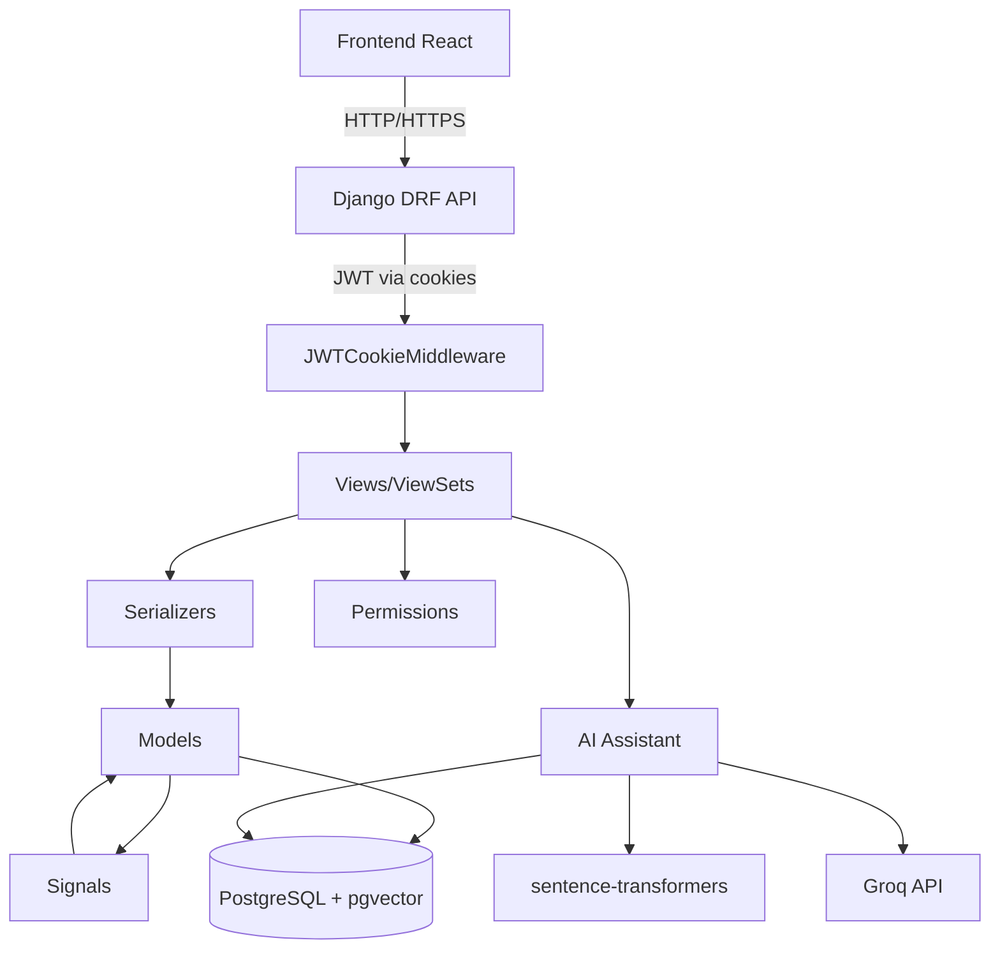

# Documentação do Backend Django

## Visão Geral

Esta seção contém a documentação técnica completa do backend Django do MindLedger, um sistema de gerenciamento financeiro pessoal com módulos adicionais de segurança, biblioteca e assistente de IA.

## Stack Tecnológico

- **Framework**: Django 4.2+ com Django REST Framework
- **Banco de Dados**: PostgreSQL 15+ com pgvector
- **Autenticação**: JWT via HttpOnly cookies
- **Criptografia**: Fernet (AES-128-CBC + HMAC-SHA256)
- **IA/RAG**: sentence-transformers (local) + Groq API
- **Containerização**: Docker + Docker Compose

## Índice da Documentação

### 1. [Estrutura das Apps Django](./estrutura-apps.md)

Visão geral da arquitetura modular do backend:
- Organização de apps (financeiro, segurança, biblioteca, IA)
- Estrutura de diretórios padrão
- Convenções de nomenclatura
- Dependências entre apps
- Padrões de organização

**Quando consultar**: Para entender a estrutura geral do projeto ou ao criar novas apps.

### 2. [Modelos de Dados](./modelos-dados.md)

Documentação completa dos modelos Django:
- BaseModel abstrato (campos de auditoria)
- Modelos do módulo financeiro (Account, CreditCard, Expense, Revenue, etc.)
- Modelos do módulo de segurança (Password, StoredCreditCard, etc.)
- Modelos do módulo de biblioteca (Book, Author, Publisher, etc.)
- Modelos do módulo de IA (ContentEmbedding)
- Relacionamentos entre modelos
- Properties para criptografia
- Validações customizadas

**Quando consultar**: Ao trabalhar com banco de dados, criar queries ou entender relacionamentos.

### 3. [Serializers DRF](./serializers.md)

Padrões de serialização do Django REST Framework:
- Serializers básicos e avançados
- Separação leitura vs escrita
- Campos calculados (SerializerMethodField)
- Validações customizadas
- Mascaramento de dados sensíveis
- Nested serializers
- Campos de auditoria

**Quando consultar**: Ao criar ou modificar APIs, trabalhar com validações ou formatar responses.

### 4. [ViewSets e Views](./viewsets-views.md)

Lógica de API e endpoints:
- Generic Views (ListCreateAPIView, RetrieveUpdateDestroyAPIView)
- ViewSets (ModelViewSet, ReadOnlyModelViewSet)
- Custom Actions (@action decorator)
- APIView para lógica customizada
- Permissões (GlobalDefaultPermission)
- Filtragem e ordenação
- Paginação
- Otimizações de performance (select_related, prefetch_related)
- Tratamento de erros
- Transações atômicas
- Streaming (SSE)

**Quando consultar**: Ao criar ou modificar endpoints, implementar lógica de negócio ou otimizar queries.

### 5. [Middleware e Signals](./middleware-signals.md)

Interceptadores de requisições e eventos de modelos:
- **Middleware**:
  - JWTCookieMiddleware (autenticação via cookies)
  - AuditLoggingMiddleware (logs de auditoria)
  - SecurityHeadersMiddleware (headers de segurança)
- **Signals**:
  - Atualização automática de saldos (accounts)
  - Criação de transações em transferências (transfers)
  - Atualização de empréstimos (loans)
- Boas práticas e prevenção de problemas

**Quando consultar**: Ao implementar lógica que deve executar automaticamente, interceptar requisições ou reagir a eventos.

### 6. [Sistema de Criptografia](./criptografia.md)

Criptografia de dados sensíveis com Fernet:
- O que é Fernet e como funciona
- Implementação no MindLedger (FieldEncryption)
- Padrão de campos criptografados (properties)
- Uso em modelos e serializers
- Gerenciamento de chaves (ENCRYPTION_KEY)
- Rotação de chaves
- Mascaramento de dados
- Segurança e limitações
- Troubleshooting

**Quando consultar**: Ao trabalhar com dados sensíveis, adicionar campos criptografados ou resolver problemas de criptografia.

### 7. [Comandos de Management](./comandos-management.md)

Comandos customizados do Django:
- **Comandos existentes**:
  - `update_balances`: Recalcula saldos de contas
  - `setup_permissions`: Configura permissões do grupo members
  - `process_existing_transfers`: Processa transferências legadas
  - `populate_embeddings`: Popula embeddings para IA
- Criação de novos comandos
- Argumentos e opções
- Estilização de output
- Agendamento (cron, celery)
- Testes

**Quando consultar**: Ao criar tarefas administrativas, scripts de manutenção ou operações em massa.

## Quick Start

### Setup Inicial

```bash
# 1. Clonar repositório
git clone <repo-url>
cd MindLedger

# 2. Configurar variáveis de ambiente
cp .env.example .env
# Editar .env com suas configurações

# 3. Subir com Docker
docker-compose up -d

# 4. Aplicar migrations
docker-compose exec api python manage.py migrate

# 5. Criar superuser
docker-compose exec api python manage.py createsuperuser

# 6. Configurar permissões
docker-compose exec api python manage.py setup_permissions
```

### Comandos Úteis

```bash
# Ver logs
docker-compose logs -f api

# Acessar shell Django
docker-compose exec api python manage.py shell

# Executar testes
docker-compose exec api python manage.py test

# Criar migration
docker-compose exec api python manage.py makemigrations

# Aplicar migrations
docker-compose exec api python manage.py migrate

# Recalcular saldos
docker-compose exec api python manage.py update_balances
```

## Arquitetura de Alto Nível



## Módulos Principais

### Módulo Financeiro
- **Accounts**: Contas bancárias
- **Credit Cards**: Cartões de crédito e faturas
- **Expenses**: Despesas
- **Revenues**: Receitas
- **Transfers**: Transferências entre contas
- **Loans**: Empréstimos
- **Dashboard**: Estatísticas e visualizações

### Módulo de Segurança
- **Password**: Gerenciador de senhas
- **StoredCreditCard**: Credenciais de cartões
- **StoredBankAccount**: Credenciais bancárias
- **Archive**: Arquivos confidenciais
- **ActivityLog**: Logs de atividades

### Módulo de Biblioteca
- **Author**: Autores
- **Publisher**: Editoras
- **Book**: Livros
- **Summary**: Resumos
- **Reading**: Registros de leitura

### Módulo de IA
- **ContentEmbedding**: Embeddings para RAG
- **Chat Service**: Serviço de chat com IA
- **Intent Classifier**: Classificação de intenções
- **Response Formatter**: Formatação de respostas

### Módulo de Planejamento
- **RoutineTask**: Tarefas de rotina
- **Goal**: Metas pessoais
- **DailyReflection**: Reflexões diárias

## Conceitos-Chave

### BaseModel
Todos os modelos herdam de BaseModel, que fornece:
- `uuid`: Identificador único universal
- `created_at`, `updated_at`: Timestamps
- `created_by`, `updated_by`: Auditoria de usuário
- `is_deleted`, `deleted_at`: Soft delete

### Criptografia
Campos sensíveis (senhas, CVVs, números de conta) são criptografados:
- Prefixo `_` no campo do modelo
- Property getter descriptografa
- Property setter criptografa
- Nunca expor dados descriptografados em APIs (usar mascaramento)

### Autenticação JWT via Cookies
- JWT armazenado em HttpOnly cookie (seguro contra XSS)
- Middleware extrai token e adiciona ao header
- Frontend não precisa gerenciar tokens
- Refresh automático em 401

### Soft Delete
Registros nunca são deletados fisicamente:
- `is_deleted=True` marca como deletado
- `deleted_at` registra quando
- Queries sempre filtram `is_deleted=False`

### Signals
Automação de lógica:
- Atualização de saldos quando receitas/despesas mudam
- Criação de transações em transferências
- Atualização de status de empréstimos
- Sempre use `select_for_update()` para evitar race conditions

## Convenções de Código

### Nomenclatura
- **Modelos**: Singular, PascalCase (`Account`, `CreditCard`)
- **Serializers**: `<Model>Serializer`, `<Model>CreateUpdateSerializer`
- **Views**: `<Model>CreateListView`, `<Model>RetrieveUpdateDestroyView`
- **URLs**: Plural, kebab-case (`/api/v1/accounts/`, `/api/v1/credit-cards/`)

### Imports
```python
# Django imports
from django.db import models

# DRF imports
from rest_framework import serializers, viewsets

# Third-party imports
from cryptography.fernet import Fernet

# Local imports
from app.models import BaseModel
from app.encryption import FieldEncryption
```

### Docstrings
```python
def update_account_balance(account):
    """
    Atualiza o saldo de uma conta baseado em receitas e despesas.

    Parameters
    ----------
    account : Account
        Conta a ter o saldo atualizado

    Returns
    -------
    None

    Notes
    -----
    O saldo é calculado como: receitas recebidas - despesas pagas
    """
```

## Recursos Adicionais

- [Django Documentation](https://docs.djangoproject.com/)
- [Django REST Framework](https://www.django-rest-framework.org/)
- [PostgreSQL Documentation](https://www.postgresql.org/docs/)
- [Fernet Specification](https://github.com/fernet/spec/blob/master/Spec.md)
- [sentence-transformers](https://www.sbert.net/)

## Contribuindo

Ao adicionar novas funcionalidades:
1. Siga os padrões estabelecidos
2. Documente novos modelos, serializers e views
3. Adicione testes
4. Atualize esta documentação se necessário
5. Use type hints quando possível
6. Documente todos os comandos de management

## Suporte

Para questões ou problemas:
1. Consulte esta documentação primeiro
2. Verifique os logs: `docker-compose logs -f api`
3. Execute testes: `python manage.py test`
4. Verifique o arquivo CLAUDE.md para instruções específicas

---

**Última atualização**: 2026-01-12
**Versão**: 1.0
