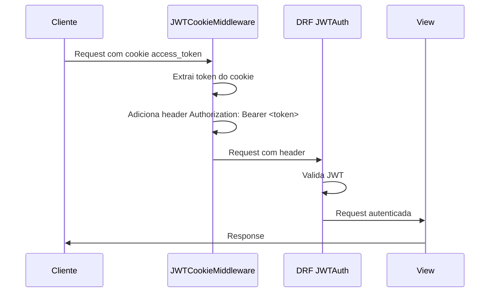
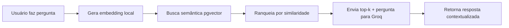
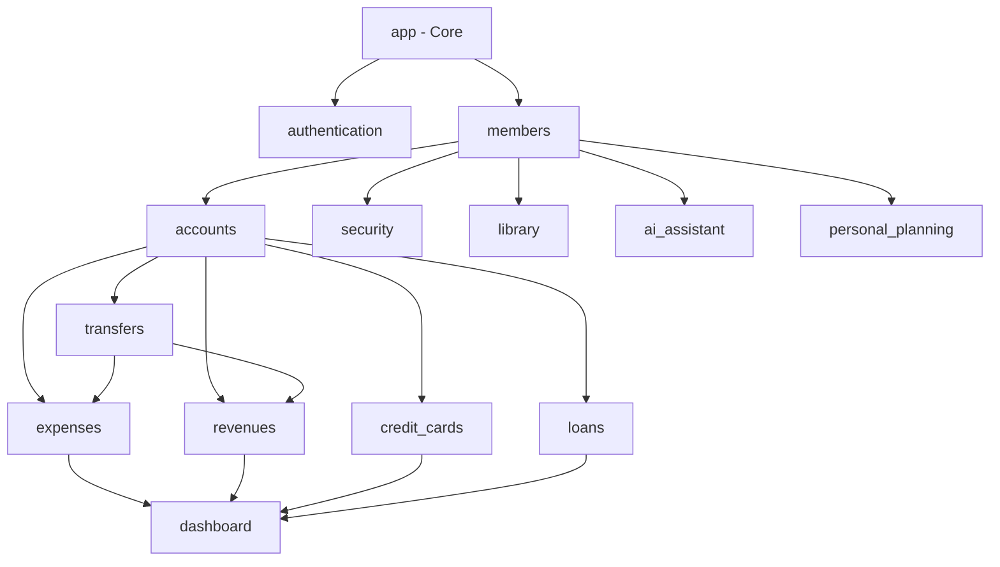

# Estrutura das Apps Django

## Visão Geral

O backend do MindLedger é organizado em apps Django modulares, cada uma responsável por um domínio específico da aplicação. A arquitetura segue os padrões Django e REST Framework com camadas bem definidas.

## Estrutura de Diretórios

```
api/
├── app/                    # Configuração principal e utilitários
├── authentication/         # Autenticação JWT via cookies
├── members/               # Gestão de membros
├── accounts/              # Contas bancárias
├── credit_cards/          # Cartões de crédito e faturas
├── expenses/              # Despesas e despesas fixas
├── revenues/              # Receitas
├── loans/                 # Empréstimos
├── transfers/             # Transferências entre contas
├── dashboard/             # Dashboard e estatísticas
├── security/              # Módulo de segurança (senhas, credenciais)
├── library/               # Módulo de biblioteca (livros)
├── ai_assistant/          # Assistente AI com RAG
└── personal_planning/     # Planejamento pessoal
```

## Apps Principais

### 1. App (Core)

**Responsabilidade**: Configuração central, modelos base, utilitários compartilhados.

**Componentes principais**:
- `settings.py`: Configurações Django e DRF
- `urls.py`: Roteamento principal
- `middleware.py`: Middlewares customizados (audit, security headers)
- `encryption.py`: Sistema de criptografia Fernet
- `permissions.py`: Permissões globais
- `models.py`: BaseModel abstrato
- `health.py`: Health checks

**Arquivos importantes**:
```python
# app/models.py
class BaseModel(models.Model):
    """Modelo abstrato com campos de auditoria"""
    uuid = models.UUIDField(default=uuid.uuid4, editable=False, unique=True)
    created_at = models.DateTimeField(auto_now_add=True)
    updated_at = models.DateTimeField(auto_now=True)
    created_by = models.ForeignKey(User, ...)
    updated_by = models.ForeignKey(User, ...)
    is_deleted = models.BooleanField(default=False)
    deleted_at = models.DateTimeField(null=True, blank=True)

    class Meta:
        abstract = True
```

### 2. Authentication

**Responsabilidade**: Autenticação JWT via cookies HttpOnly.

**Estrutura**:
```
authentication/
├── middleware.py      # JWTCookieMiddleware
├── views.py          # Login, logout, user info
└── urls.py           # Rotas de autenticação
```

**Endpoints principais**:
- `POST /api/v1/login/` - Login e geração de tokens
- `POST /api/v1/logout/` - Logout
- `GET /api/v1/me/` - Dados do usuário autenticado
- `GET /api/v1/permissions/` - Permissões do usuário
- `POST /api/v1/register/` - Registro de novos usuários

**Fluxo de autenticação**:


### 3. Members

**Responsabilidade**: Gestão de membros da família/organização.

**Modelo principal**:
```python
class Member(BaseModel):
    name = models.CharField(max_length=200)
    document = models.CharField(max_length=14, unique=True)  # CPF
    phone = models.CharField(max_length=20)
    email = models.EmailField(unique=True)
    sex = models.CharField(max_length=1, choices=[('M', 'Masculino'), ('F', 'Feminino')])
    user = models.OneToOneField(User, null=True, blank=True, related_name='member')
    is_creditor = models.BooleanField(default=False)
    is_benefited = models.BooleanField(default=False)
    active = models.BooleanField(default=True)
```

**Relacionamentos**:
- Vinculado opcionalmente a um User do Django
- Relacionado a contas, despesas, receitas, empréstimos, etc.

## Módulo Financeiro

### 4. Accounts

**Responsabilidade**: Contas bancárias e saldos.

**Características**:
- Saldo calculado automaticamente via signals
- Número da conta criptografado
- Suporte a múltiplos tipos de conta (corrente, poupança, etc.)

**Estrutura**:
```
accounts/
├── models.py              # Account
├── serializers.py         # AccountSerializer
├── views.py               # AccountCreateListView, AccountRetrieveUpdateDestroyView
├── signals.py             # Atualização automática de saldos
├── urls.py
└── management/
    └── commands/
        └── update_balances.py
```

### 5. Credit Cards

**Responsabilidade**: Cartões de crédito, faturas e despesas.

**Modelos**:
- `CreditCard`: Dados do cartão (número e CVV criptografados)
- `CreditCardBill`: Faturas mensais
- `CreditCardExpense`: Despesas parceladas no cartão

**Campos criptografados**:
```python
class CreditCard(BaseModel):
    _card_number = models.TextField()  # Criptografado
    _security_code = models.TextField()  # Criptografado

    @property
    def card_number(self):
        return FieldEncryption.decrypt_data(self._card_number)

    @card_number.setter
    def card_number(self, value):
        self._card_number = FieldEncryption.encrypt_data(str(value))
```

### 6. Expenses

**Responsabilidade**: Despesas e despesas fixas.

**Modelos**:
- `Expense`: Despesas pontuais
- `FixedExpense`: Despesas recorrentes (água, luz, aluguel)
- `FixedExpenseGenerationLog`: Log de geração automática

**Categorias**:
```python
EXPENSES_CATEGORIES = (
    ('food', 'Alimentação'),
    ('transport', 'Transporte'),
    ('health', 'Saúde'),
    ('education', 'Educação'),
    ('entertainment', 'Entretenimento'),
    ('housing', 'Moradia'),
    ('utilities', 'Contas'),
    ('shopping', 'Compras'),
    ('others', 'Outros')
)
```

### 7. Revenues

**Responsabilidade**: Receitas e entradas.

**Modelo principal**:
```python
class Revenue(BaseModel):
    description = models.CharField(max_length=200)
    value = models.DecimalField(max_digits=10, decimal_places=2)
    date = models.DateField()
    horary = models.TimeField()
    category = models.CharField(max_length=200, choices=REVENUE_CATEGORIES)
    account = models.ForeignKey(Account, on_delete=models.PROTECT)
    received = models.BooleanField(default=False)
    member = models.ForeignKey(Member, on_delete=models.PROTECT)
    related_transfer = models.ForeignKey('transfers.Transfer', null=True, blank=True)
    related_loan = models.ForeignKey('loans.Loan', null=True, blank=True)
```

### 8. Loans

**Responsabilidade**: Gestão de empréstimos.

**Modelo principal**:
```python
class Loan(BaseModel):
    description = models.CharField(max_length=200)
    total_amount = models.DecimalField(max_digits=10, decimal_places=2)
    installments = models.IntegerField()
    installment_value = models.DecimalField(max_digits=10, decimal_places=2)
    interest_rate = models.DecimalField(max_digits=5, decimal_places=2)
    start_date = models.DateField()
    payment_day = models.IntegerField()
    status = models.CharField(max_length=20, choices=LOAN_STATUS_CHOICES)
    creditor = models.ForeignKey(Member, related_name='loans_given')
    debtor = models.ForeignKey(Member, related_name='loans_received')
    account = models.ForeignKey(Account, on_delete=models.PROTECT)
```

**Signals**: Cria receitas automáticas para cada parcela paga.

### 9. Transfers

**Responsabilidade**: Transferências entre contas.

**Modelo principal**:
```python
class Transfer(BaseModel):
    description = models.CharField(max_length=200)
    value = models.DecimalField(max_digits=10, decimal_places=2)
    fee = models.DecimalField(max_digits=10, decimal_places=2, default=0.00)
    date = models.DateField()
    horary = models.TimeField()
    origin_account = models.ForeignKey(Account, related_name='transfers_out')
    destiny_account = models.ForeignKey(Account, related_name='transfers_in')
    transfered = models.BooleanField(default=False)
    category = models.CharField(max_length=100, choices=TRANSFER_CATEGORIES)
    transaction_id = models.CharField(max_length=100, unique=True, null=True)
    member = models.ForeignKey(Member, on_delete=models.PROTECT)
```

**Signals**: Cria automaticamente uma despesa na conta origem e uma receita na conta destino.

### 10. Dashboard

**Responsabilidade**: Estatísticas e visualizações.

**Endpoints**:
- `GET /api/v1/dashboard/summary/` - Resumo financeiro
- `GET /api/v1/dashboard/expenses-by-category/` - Despesas por categoria
- `GET /api/v1/dashboard/monthly-comparison/` - Comparação mensal
- `GET /api/v1/dashboard/account-balances/` - Saldos das contas

## Módulo de Segurança

### 11. Security

**Responsabilidade**: Armazenamento seguro de senhas, credenciais e arquivos confidenciais.

**Modelos**:
- `Password`: Senhas de sites/serviços (criptografadas)
- `StoredCreditCard`: Credenciais de cartões (criptografadas)
- `StoredBankAccount`: Credenciais bancárias (criptografadas)
- `Archive`: Arquivos confidenciais
- `ActivityLog`: Log de atividades do usuário

**Exemplo**:
```python
class Password(BaseModel):
    title = models.CharField(max_length=200)
    site = models.URLField(max_length=500, blank=True, null=True)
    username = models.CharField(max_length=200)
    _password = models.TextField()  # Criptografado
    category = models.CharField(max_length=100, choices=PASSWORD_CATEGORIES)
    notes = models.TextField(blank=True, null=True)
    last_password_change = models.DateTimeField(auto_now_add=True)
    owner = models.ForeignKey(Member, on_delete=models.PROTECT)

    @property
    def password(self):
        return FieldEncryption.decrypt_data(self._password)

    @password.setter
    def password(self, value):
        self._password = FieldEncryption.encrypt_data(str(value))
```

**Estrutura**:
```
security/
├── models.py              # Modelos de segurança
├── serializers.py         # Serializers com campos mascarados
├── views.py               # ViewSets com validação extra
├── urls.py
├── activity_logs/         # Subapp de logs
│   ├── models.py
│   ├── serializers.py
│   └── views.py
└── passwords/             # Subapp de senhas
    ├── models.py
    ├── serializers.py
    └── views.py
```

## Módulo de Biblioteca

### 12. Library

**Responsabilidade**: Gestão de livros, leituras e resumos.

**Modelos**:
- `Author`: Autores
- `Publisher`: Editoras
- `Book`: Livros
- `Summary`: Resumos de livros
- `Reading`: Registros de leitura

**Estrutura**:
```
library/
├── models.py
├── serializers.py
├── views.py
├── urls.py
├── authors/               # Subapp de autores
├── publishers/            # Subapp de editoras
├── books/                 # Subapp de livros
├── summaries/             # Subapp de resumos
└── readings/              # Subapp de leituras
```

**Exemplo de modelo**:
```python
class Book(BaseModel):
    title = models.CharField(max_length=500)
    authors = models.ManyToManyField(Author, related_name='books')
    pages = models.IntegerField()
    publisher = models.ForeignKey(Publisher, on_delete=models.PROTECT)
    language = models.CharField(max_length=50, choices=LANGUAGE_CHOICES)
    genre = models.CharField(max_length=100, choices=GENRE_CHOICES)
    literarytype = models.CharField(max_length=100, choices=LITERARY_TYPE_CHOICES)
    publish_date = models.DateField()
    synopsis = models.TextField(blank=True, null=True)
    edition = models.CharField(max_length=50, blank=True, null=True)
    media_type = models.CharField(max_length=50, choices=MEDIA_TYPE_CHOICES)
    rating = models.IntegerField(null=True, blank=True)
    read_status = models.CharField(max_length=50, choices=READ_STATUS_CHOICES)
    owner = models.ForeignKey(Member, on_delete=models.PROTECT)
```

## Módulo de IA

### 13. AI Assistant

**Responsabilidade**: Assistente de IA com RAG (Retrieval Augmented Generation).

**Arquitetura**:
```
ai_assistant/
├── models.py              # ContentEmbedding (pgvector)
├── serializers.py         # Query/Response serializers
├── views.py               # AIQueryView, AIStreamingQueryView
├── urls.py
├── chat/                  # Serviço de chat
│   ├── service.py
│   ├── embeddings.py
│   └── llm_client.py
├── indexer/               # Indexação de conteúdo
│   ├── finance_indexer.py
│   ├── security_indexer.py
│   └── library_indexer.py
├── intent_classifier.py   # Classificação de intenção
├── response_formatter.py  # Formatação de respostas
├── session_manager.py     # Gestão de sessões
└── management/
    └── commands/
        └── populate_embeddings.py
```

**Modelo de embedding**:
```python
class ContentEmbedding(BaseModel):
    content_type = models.CharField(max_length=100)  # 'expense', 'book', etc.
    content_id = models.PositiveIntegerField()
    tipo = models.CharField(max_length=20, choices=TipoConteudo.choices)
    sensibilidade = models.CharField(max_length=10, choices=Sensibilidade.choices)
    tags = ArrayField(models.CharField(max_length=50), default=list)
    data_referencia = models.DateField(null=True, blank=True)
    texto_original = models.TextField()
    texto_busca = models.TextField()
    embedding = VectorField(dimensions=384)  # pgvector
    metadata = models.JSONField(default=dict)
    owner = models.ForeignKey(Member, on_delete=models.CASCADE)
    is_indexed = models.BooleanField(default=False)
    indexed_at = models.DateTimeField(null=True, blank=True)
    embedding_model = models.CharField(max_length=100, default='all-MiniLM-L6-v2')
```

**Fluxo do RAG**:


**Características**:
- Embeddings gerados localmente com sentence-transformers (all-MiniLM-L6-v2)
- Busca semântica via pgvector (PostgreSQL)
- LLM via Groq API (llama-3.3-70b-versatile)
- Suporte a streaming (SSE)
- Classificação de intenção
- Visualizações dinâmicas
- Gestão de sessões com histórico

### 14. Personal Planning

**Responsabilidade**: Planejamento pessoal, metas e rotinas.

**Modelos**:
- `RoutineTask`: Tarefas da rotina
- `DailyTaskRecord`: Registros diários de tarefas
- `Goal`: Metas pessoais
- `DailyReflection`: Reflexões diárias

**Estrutura**:
```
personal_planning/
├── models.py
├── serializers.py
├── views.py
├── signals.py             # Atualização de progresso de metas
└── urls.py
```

## Padrões de Organização

### Estrutura Padrão de uma App

```
<app_name>/
├── __init__.py
├── apps.py                # Configuração da app
├── models.py              # Modelos de dados
├── serializers.py         # Serializers DRF
├── views.py               # ViewSets e APIViews
├── urls.py                # Roteamento
├── admin.py               # Admin Django
├── tests.py               # Testes
├── signals.py             # Signals Django (opcional)
├── permissions.py         # Permissões customizadas (opcional)
├── filters.py             # Filtros customizados (opcional)
└── management/            # Comandos de gerenciamento (opcional)
    └── commands/
        └── <command>.py
```

### Convenções de Nomenclatura

**Modelos**:
- Singular, PascalCase: `Account`, `CreditCard`, `Expense`
- Herdam de `BaseModel` para auditoria

**Serializers**:
- Sufixo `Serializer`: `AccountSerializer`
- Separar para leitura/escrita quando necessário: `BookSerializer`, `BookCreateUpdateSerializer`

**Views**:
- Generic views: `AccountCreateListView`, `AccountRetrieveUpdateDestroyView`
- ViewSets: `AccountViewSet`
- APIViews para lógica customizada: `DashboardSummaryView`

**URLs**:
- Padrão REST: `/api/v1/<resource>/`
- Ações customizadas: `/api/v1/<resource>/<action>/`
- Versionamento obrigatório: `/api/v1/`

## Instalação de Apps

Todas as apps devem ser registradas em `app/settings.py`:

```python
INSTALLED_APPS = [
    # Django apps
    'django.contrib.admin',
    'django.contrib.auth',
    ...

    # Third-party apps
    'rest_framework',
    'rest_framework_simplejwt',
    'corsheaders',
    'django_filters',

    # Core app
    'app',

    # Authentication
    'authentication',

    # Financial apps
    'accounts',
    'credit_cards',
    'expenses',
    'loans',
    'members',
    'revenues',
    'transfers',
    'dashboard',

    # Security Module
    'security',

    # Library Module
    'library',

    # AI Assistant
    'ai_assistant',

    # Personal Planning Module
    'personal_planning',
]
```

## Dependências entre Apps



**Regras de dependência**:
1. Todas as apps dependem de `app` (core)
2. Apps financeiras dependem de `members` e `accounts`
3. Apps de módulos (security, library, ai_assistant) dependem apenas de `members`
4. Dashboard agrega dados de várias apps
5. Evitar dependências circulares

## Considerações de Performance

### Otimizações Implementadas

1. **Índices de Banco de Dados**:
   - Campos frequentemente consultados têm `db_index=True`
   - Índices compostos para queries comuns (ex: `owner + tipo` em ContentEmbedding)

2. **Select Related / Prefetch Related**:
   - ViewSets usam `select_related` para ForeignKeys
   - `prefetch_related` para ManyToManyFields

3. **Paginação**:
   - Paginação padrão de 50 itens por página
   - Configurável via query param `page_size`

4. **Caching**:
   - Redis disponível via `CACHES['redis']`
   - Cache de embeddings para consultas semelhantes
   - Cache de sessões do AI Assistant

5. **Throttling**:
   - 100 requests/min para usuários anônimos
   - 1000 requests/min para usuários autenticados

## Próximos Passos

- [Modelos de Dados](./modelos-dados.md) - Documentação detalhada dos modelos
- [Serializers](./serializers.md) - Padrões de serialização
- [ViewSets e Views](./viewsets-views.md) - Lógica de API
- [Middleware e Signals](./middleware-signals.md) - Interceptadores e eventos
- [Criptografia](./criptografia.md) - Sistema de criptografia
- [Comandos Management](./comandos-management.md) - Comandos customizados
