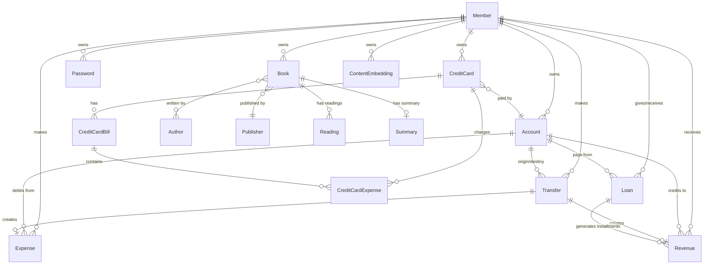

# Modelos de Dados

## Visão Geral

Este documento detalha os modelos de dados do MindLedger, incluindo campos, relacionamentos, validações e métodos especiais.

## BaseModel (Modelo Abstrato)

Todos os modelos herdam de `BaseModel`, que fornece campos comuns de auditoria e controle.

### Campos

```python
# app/models.py
class BaseModel(models.Model):
    """
    Modelo base abstrato com campos comuns para auditoria e controle.
    """
    uuid = models.UUIDField(
        default=uuid.uuid4,
        editable=False,
        unique=True,
        verbose_name="UUID"
    )
    created_at = models.DateTimeField(
        auto_now_add=True,
        verbose_name="Criado em"
    )
    updated_at = models.DateTimeField(
        auto_now=True,
        verbose_name="Atualizado em"
    )
    created_by = models.ForeignKey(
        User,
        on_delete=models.SET_NULL,
        null=True,
        blank=True,
        related_name="%(class)s_created",
        verbose_name="Criado por"
    )
    updated_by = models.ForeignKey(
        User,
        on_delete=models.SET_NULL,
        null=True,
        blank=True,
        related_name="%(class)s_updated",
        verbose_name="Atualizado por"
    )
    is_deleted = models.BooleanField(
        default=False,
        verbose_name="Excluído"
    )
    deleted_at = models.DateTimeField(
        null=True,
        blank=True,
        verbose_name="Excluído em"
    )

    class Meta:
        abstract = True
```

### Benefícios

1. **Rastreabilidade**: Sabe-se quem criou e modificou cada registro
2. **Auditoria**: Timestamps automáticos de criação e atualização
3. **Soft Delete**: Registros nunca são removidos fisicamente
4. **UUID**: Identificador único universal para integrações externas
5. **Consistência**: Todos os modelos seguem o mesmo padrão

### Uso do UUID vs ID

- **ID**: Chave primária interna, sequencial
- **UUID**: Identificador externo, único universalmente
- Use UUID em URLs e APIs públicas para evitar enumeração

## Modelos do Módulo Financeiro

### Account (Conta Bancária)

```python
# accounts/models.py
class Account(BaseModel):
    """Conta bancária com saldo calculado automaticamente."""

    account_name = models.CharField(max_length=200)
    institution_name = models.CharField(
        max_length=200,
        choices=ACCOUNT_NAMES  # NUB, SIC, MPG, IFB, CEF
    )
    account_type = models.CharField(
        max_length=100,
        choices=ACCOUNT_TYPES  # CC, CS, FG, VA
    )
    account_image = models.ImageField(
        upload_to='accounts/',
        blank=True,
        null=True
    )
    is_active = models.BooleanField(default=True)

    # Campo criptografado
    _account_number = models.TextField(null=True, blank=True)

    agency = models.CharField(max_length=20, null=True, blank=True)
    bank_code = models.CharField(max_length=10, null=True, blank=True)

    # Saldo atualizado via signals
    current_balance = models.DecimalField(
        max_digits=15,
        decimal_places=2,
        default=0.00
    )
    minimum_balance = models.DecimalField(
        max_digits=15,
        decimal_places=2,
        default=0.00
    )

    opening_date = models.DateField(null=True, blank=True)
    description = models.TextField(null=True, blank=True)
    owner = models.ForeignKey('members.Member', on_delete=models.PROTECT)

    class Meta:
        ordering = ['-account_name']
        verbose_name = "Conta"
        verbose_name_plural = "Contas"

    # Properties para criptografia
    @property
    def account_number(self):
        """Descriptografa o número da conta."""
        if self._account_number:
            try:
                return FieldEncryption.decrypt_data(self._account_number)
            except Exception:
                return None
        return None

    @property
    def account_number_masked(self):
        """Retorna número mascarado (****1234)."""
        if self._account_number:
            try:
                full_number = FieldEncryption.decrypt_data(self._account_number)
                if full_number and len(full_number) >= 4:
                    return '*' * (len(full_number) - 4) + full_number[-4:]
                return full_number
            except Exception:
                return None
        return None

    @account_number.setter
    def account_number(self, value):
        """Criptografa o número da conta."""
        if value:
            self._account_number = FieldEncryption.encrypt_data(str(value))
        else:
            self._account_number = None

    def __str__(self):
        return self.account_name
```

**Relacionamentos**:
- `owner`: Member (muitas contas para um membro)
- Relacionada reversa com: Expense, Revenue, Transfer, Loan

**Signals**:
- `update_balance_on_revenue_save`: Atualiza saldo ao criar/editar receita
- `update_balance_on_expense_save`: Atualiza saldo ao criar/editar despesa
- `create_initial_revenue_on_account_creation`: Cria receita de saldo inicial

### CreditCard (Cartão de Crédito)

```python
# credit_cards/models.py
class CreditCard(BaseModel):
    """Cartão de crédito com dados sensíveis criptografados."""

    name = models.CharField(max_length=200)
    on_card_name = models.CharField(max_length=200)
    flag = models.CharField(
        max_length=200,
        choices=FLAGS  # MSC, VSA, ELO, EXP, HCD
    )
    validation_date = models.DateField()

    # Campos criptografados
    _security_code = models.TextField()  # CVV
    _card_number = models.TextField(null=True, blank=True)

    credit_limit = models.DecimalField(max_digits=10, decimal_places=2)
    max_limit = models.DecimalField(max_digits=10, decimal_places=2)
    associated_account = models.ForeignKey(Account, on_delete=models.PROTECT)
    is_active = models.BooleanField(default=True)

    closing_day = models.IntegerField(null=True, blank=True)
    due_day = models.IntegerField(null=True, blank=True)
    interest_rate = models.DecimalField(max_digits=5, decimal_places=2, null=True)
    annual_fee = models.DecimalField(max_digits=10, decimal_places=2, null=True)

    owner = models.ForeignKey('members.Member', on_delete=models.PROTECT)
    notes = models.TextField(null=True, blank=True)

    class Meta:
        verbose_name = "Cartão de Crédito"
        verbose_name_plural = "Cartões de Crédito"

    # Properties para CVV
    @property
    def security_code(self):
        try:
            return FieldEncryption.decrypt_data(self._security_code)
        except ValidationError:
            return None

    @security_code.setter
    def security_code(self, value):
        if value is not None:
            # Validação: 3 ou 4 dígitos
            if not str(value).isdigit() or len(str(value)) not in [3, 4]:
                raise ValidationError("CVV deve conter 3 ou 4 dígitos numéricos")
            self._security_code = FieldEncryption.encrypt_data(str(value))
        else:
            self._security_code = None

    # Properties para número do cartão
    @property
    def card_number(self):
        if self._card_number:
            try:
                return FieldEncryption.decrypt_data(self._card_number)
            except Exception:
                return None
        return None

    @property
    def card_number_masked(self):
        if self._card_number:
            try:
                full_number = FieldEncryption.decrypt_data(self._card_number)
                if full_number and len(full_number) >= 4:
                    return '*' * (len(full_number) - 4) + full_number[-4:]
                return full_number if full_number else "****"
            except Exception:
                return "****"
        return "****"

    @card_number.setter
    def card_number(self, value):
        if value:
            self._card_number = FieldEncryption.encrypt_data(str(value))
        else:
            self._card_number = None

    def clean(self):
        """Validação customizada."""
        super().clean()
        from datetime import date
        if self.validation_date and self.validation_date <= date.today():
            raise ValidationError(
                "Data de validade não pode ser anterior ou igual à data atual"
            )

    def save(self, *args, **kwargs):
        self.full_clean()  # Executa validações
        super().save(*args, **kwargs)

    def __str__(self):
        return self.name
```

**Relacionamentos**:
- `associated_account`: Account (qual conta paga a fatura)
- `owner`: Member
- Relacionada reversa com: CreditCardBill, CreditCardExpense

### CreditCardBill (Fatura)

```python
class CreditCardBill(BaseModel):
    """Fatura mensal do cartão de crédito."""

    credit_card = models.ForeignKey(CreditCard, on_delete=models.PROTECT)
    year = models.CharField(choices=YEARS)
    month = models.CharField(choices=MONTHS)

    invoice_beginning_date = models.DateField()
    invoice_ending_date = models.DateField()
    closed = models.BooleanField()

    total_amount = models.DecimalField(max_digits=10, decimal_places=2, default=0.00)
    minimum_payment = models.DecimalField(max_digits=10, decimal_places=2, default=0.00)
    due_date = models.DateField(null=True, blank=True)

    paid_amount = models.DecimalField(max_digits=10, decimal_places=2, default=0.00)
    payment_date = models.DateField(null=True, blank=True)

    interest_charged = models.DecimalField(max_digits=10, decimal_places=2, default=0.00)
    late_fee = models.DecimalField(max_digits=10, decimal_places=2, default=0.00)

    status = models.CharField(
        max_length=20,
        choices=BILL_STATUS_CHOICES,  # open, closed, paid, overdue
        default='open'
    )

    class Meta:
        verbose_name = "Fatura"
        verbose_name_plural = "Faturas"

    def __str__(self):
        return f"{self.credit_card} - {self.year}/{self.month}"
```

### CreditCardExpense (Despesa no Cartão)

```python
class CreditCardExpense(BaseModel):
    """Despesa parcelada no cartão de crédito."""

    description = models.CharField(max_length=200)
    value = models.DecimalField(max_digits=10, decimal_places=2)
    date = models.DateField()
    horary = models.TimeField()
    category = models.CharField(max_length=200, choices=EXPENSES_CATEGORIES)

    card = models.ForeignKey(CreditCard, on_delete=models.PROTECT)
    installment = models.PositiveIntegerField()  # Parcela atual
    total_installments = models.IntegerField(default=1)  # Total de parcelas
    payed = models.BooleanField()

    merchant = models.CharField(max_length=200, null=True, blank=True)
    transaction_id = models.CharField(max_length=100, null=True, blank=True)
    location = models.CharField(max_length=200, null=True, blank=True)

    bill = models.ForeignKey(CreditCardBill, on_delete=models.PROTECT, null=True)
    member = models.ForeignKey('members.Member', on_delete=models.PROTECT, null=True)
    notes = models.TextField(null=True, blank=True)
    receipt = models.FileField(upload_to='credit_cards/receipts/', null=True, blank=True)

    class Meta:
        ordering = ['-id']
        verbose_name = "Despesa de Cartão"
        verbose_name_plural = "Despesas de Cartão"

    def __str__(self):
        return f"{self.description},{self.card} - {self.date},{self.horary}"
```

### Expense (Despesa)

```python
# expenses/models.py
class Expense(BaseModel):
    """Despesa pontual."""

    description = models.CharField(max_length=200)
    value = models.DecimalField(max_digits=10, decimal_places=2)
    date = models.DateField()
    horary = models.TimeField()
    category = models.CharField(max_length=200, choices=EXPENSES_CATEGORIES)

    account = models.ForeignKey(Account, on_delete=models.PROTECT)
    payed = models.BooleanField(default=False)

    merchant = models.CharField(max_length=200, null=True, blank=True)
    payment_method = models.CharField(
        max_length=50,
        choices=PAYMENT_METHOD_CHOICES,
        default='cash'
    )

    member = models.ForeignKey('members.Member', on_delete=models.PROTECT, null=True)
    notes = models.TextField(null=True, blank=True)
    receipt = models.FileField(upload_to='expenses/receipts/', null=True, blank=True)

    related_transfer = models.ForeignKey(
        'transfers.Transfer',
        on_delete=models.SET_NULL,
        null=True,
        blank=True
    )

    class Meta:
        ordering = ['-date', '-horary']
        verbose_name = "Despesa"
        verbose_name_plural = "Despesas"

    def __str__(self):
        return f"{self.description} - R$ {self.value}"
```

**Categorias de Despesa**:
```python
EXPENSES_CATEGORIES = (
    ('food', 'Alimentação'),
    ('transport', 'Transporte'),
    ('health', 'Saúde'),
    ('education', 'Educação'),
    ('entertainment', 'Entretenimento'),
    ('housing', 'Moradia'),
    ('utilities', 'Contas'),
    ('shopping', 'Compras'),
    ('others', 'Outros')
)
```

### FixedExpense (Despesa Fixa)

```python
class FixedExpense(BaseModel):
    """Despesa recorrente (água, luz, aluguel, etc.)."""

    description = models.CharField(max_length=200)
    value = models.DecimalField(max_digits=10, decimal_places=2)
    category = models.CharField(max_length=200, choices=EXPENSES_CATEGORIES)
    account = models.ForeignKey(Account, on_delete=models.PROTECT)

    frequency = models.CharField(
        max_length=20,
        choices=PAYMENT_FREQUENCY_CHOICES,  # daily, weekly, monthly, etc.
        default='monthly'
    )
    day_of_month = models.IntegerField(null=True, blank=True)  # Para mensais
    day_of_week = models.IntegerField(null=True, blank=True)  # Para semanais

    start_date = models.DateField()
    end_date = models.DateField(null=True, blank=True)
    is_active = models.BooleanField(default=True)
    auto_generate = models.BooleanField(default=True)

    member = models.ForeignKey('members.Member', on_delete=models.PROTECT, null=True)
    notes = models.TextField(null=True, blank=True)

    class Meta:
        verbose_name = "Despesa Fixa"
        verbose_name_plural = "Despesas Fixas"

    def __str__(self):
        return f"{self.description} - {self.get_frequency_display()}"
```

### Revenue (Receita)

```python
# revenues/models.py
class Revenue(BaseModel):
    """Receita ou entrada financeira."""

    description = models.CharField(max_length=200)
    value = models.DecimalField(max_digits=10, decimal_places=2)
    date = models.DateField()
    horary = models.TimeField()
    category = models.CharField(max_length=200, choices=REVENUE_CATEGORIES)

    account = models.ForeignKey(Account, on_delete=models.PROTECT)
    received = models.BooleanField(default=False)

    source = models.CharField(max_length=200, null=True, blank=True)
    member = models.ForeignKey('members.Member', on_delete=models.PROTECT, null=True)
    notes = models.TextField(null=True, blank=True)

    # Relacionamentos com outras entidades
    related_transfer = models.ForeignKey(
        'transfers.Transfer',
        on_delete=models.SET_NULL,
        null=True,
        blank=True
    )
    related_loan = models.ForeignKey(
        'loans.Loan',
        on_delete=models.SET_NULL,
        null=True,
        blank=True
    )

    class Meta:
        ordering = ['-date', '-horary']
        verbose_name = "Receita"
        verbose_name_plural = "Receitas"

    def __str__(self):
        return f"{self.description} - R$ {self.value}"
```

**Categorias de Receita**:
```python
REVENUE_CATEGORIES = (
    ('salary', 'Salário'),
    ('freelance', 'Freelance'),
    ('investment', 'Investimento'),
    ('gift', 'Presente'),
    ('refund', 'Reembolso'),
    ('transfer', 'Transferência'),
    ('loan', 'Empréstimo'),
    ('deposit', 'Depósito'),
    ('others', 'Outros')
)
```

### Transfer (Transferência)

```python
# transfers/models.py
class Transfer(BaseModel):
    """Transferência entre contas."""

    description = models.CharField(max_length=200)
    value = models.DecimalField(max_digits=10, decimal_places=2)
    fee = models.DecimalField(max_digits=10, decimal_places=2, default=0.00)
    date = models.DateField()
    horary = models.TimeField()

    origin_account = models.ForeignKey(
        Account,
        on_delete=models.PROTECT,
        related_name='transfers_out'
    )
    destiny_account = models.ForeignKey(
        Account,
        on_delete=models.PROTECT,
        related_name='transfers_in'
    )

    transfered = models.BooleanField(default=False)
    category = models.CharField(max_length=100, choices=TRANSFER_CATEGORIES)
    transaction_id = models.CharField(max_length=100, unique=True, null=True)

    member = models.ForeignKey('members.Member', on_delete=models.PROTECT, null=True)
    notes = models.TextField(null=True, blank=True)

    class Meta:
        ordering = ['-date', '-horary']
        verbose_name = "Transferência"
        verbose_name_plural = "Transferências"

    def __str__(self):
        return f"{self.origin_account} → {self.destiny_account}: R$ {self.value}"
```

**Signals**: Cria automaticamente uma despesa na origem e receita no destino.

### Loan (Empréstimo)

```python
# loans/models.py
class Loan(BaseModel):
    """Empréstimo entre membros."""

    description = models.CharField(max_length=200)
    total_amount = models.DecimalField(max_digits=10, decimal_places=2)
    installments = models.IntegerField()
    installment_value = models.DecimalField(max_digits=10, decimal_places=2)
    interest_rate = models.DecimalField(max_digits=5, decimal_places=2, default=0.00)

    start_date = models.DateField()
    payment_day = models.IntegerField()  # Dia do mês

    status = models.CharField(
        max_length=20,
        choices=LOAN_STATUS_CHOICES,  # active, paid, overdue, cancelled
        default='active'
    )

    creditor = models.ForeignKey(
        'members.Member',
        on_delete=models.PROTECT,
        related_name='loans_given'
    )
    debtor = models.ForeignKey(
        'members.Member',
        on_delete=models.PROTECT,
        related_name='loans_received'
    )
    account = models.ForeignKey(Account, on_delete=models.PROTECT)
    notes = models.TextField(null=True, blank=True)

    class Meta:
        verbose_name = "Empréstimo"
        verbose_name_plural = "Empréstimos"

    def __str__(self):
        return f"{self.description} - {self.creditor} → {self.debtor}"
```

### Member (Membro)

```python
# members/models.py
class Member(BaseModel):
    """Membro da família ou organização."""

    name = models.CharField(max_length=200)
    document = models.CharField(max_length=14, unique=True)  # CPF
    phone = models.CharField(max_length=20)
    email = models.EmailField(unique=True)
    sex = models.CharField(
        max_length=1,
        choices=[('M', 'Masculino'), ('F', 'Feminino')]
    )

    user = models.OneToOneField(
        User,
        on_delete=models.SET_NULL,
        null=True,
        blank=True,
        related_name='member'
    )

    is_creditor = models.BooleanField(default=False)
    is_benefited = models.BooleanField(default=False)
    active = models.BooleanField(default=True)

    class Meta:
        verbose_name = "Membro"
        verbose_name_plural = "Membros"

    def __str__(self):
        return self.name
```

## Modelos do Módulo de Segurança

### Password (Senha)

```python
# security/models.py
class Password(BaseModel):
    """Armazenamento seguro de senhas."""

    title = models.CharField(max_length=200)
    site = models.URLField(max_length=500, blank=True, null=True)
    username = models.CharField(max_length=200)
    _password = models.TextField()  # Criptografado
    category = models.CharField(max_length=100, choices=PASSWORD_CATEGORIES)
    notes = models.TextField(blank=True, null=True)
    last_password_change = models.DateTimeField(auto_now_add=True)
    owner = models.ForeignKey('members.Member', on_delete=models.PROTECT)

    @property
    def password(self):
        if self._password:
            try:
                return FieldEncryption.decrypt_data(self._password)
            except Exception:
                return None
        return None

    @password.setter
    def password(self, value):
        if value:
            self._password = FieldEncryption.encrypt_data(str(value))
        else:
            self._password = None

    class Meta:
        verbose_name = "Senha"
        verbose_name_plural = "Senhas"
        ordering = ['-created_at']

    def __str__(self):
        return f"{self.title} - {self.username}"
```

**Categorias**:
```python
PASSWORD_CATEGORIES = (
    ('social', 'Redes Sociais'),
    ('email', 'E-mail'),
    ('banking', 'Bancário'),
    ('work', 'Trabalho'),
    ('entertainment', 'Entretenimento'),
    ('shopping', 'Compras'),
    ('streaming', 'Streaming'),
    ('gaming', 'Games'),
    ('other', 'Outro')
)
```

### StoredCreditCard (Cartão Armazenado)

```python
class StoredCreditCard(BaseModel):
    """Armazenamento seguro de credenciais de cartões."""

    name = models.CharField(max_length=200)
    _card_number = models.TextField()  # Criptografado
    _security_code = models.TextField()  # Criptografado
    expiration_month = models.IntegerField()
    expiration_year = models.IntegerField()
    cardholder_name = models.CharField(max_length=200)
    flag = models.CharField(max_length=50, choices=FLAGS)
    notes = models.TextField(blank=True, null=True)
    owner = models.ForeignKey('members.Member', on_delete=models.PROTECT)

    # Link opcional com cartão financeiro
    finance_card = models.ForeignKey(
        'credit_cards.CreditCard',
        on_delete=models.SET_NULL,
        null=True,
        blank=True
    )

    @property
    def card_number(self):
        if self._card_number:
            try:
                return FieldEncryption.decrypt_data(self._card_number)
            except Exception:
                return None
        return None

    @card_number.setter
    def card_number(self, value):
        if value:
            clean_value = str(value).replace(' ', '').replace('-', '')
            if not clean_value.isdigit() or len(clean_value) < 13 or len(clean_value) > 19:
                raise ValidationError("Número do cartão inválido.")
            self._card_number = FieldEncryption.encrypt_data(clean_value)
        else:
            self._card_number = None

    @property
    def card_number_masked(self):
        if self._card_number:
            try:
                full_number = FieldEncryption.decrypt_data(self._card_number)
                if full_number and len(full_number) >= 4:
                    return '*' * (len(full_number) - 4) + full_number[-4:]
                return full_number
            except Exception:
                return None
        return None

    @property
    def security_code(self):
        if self._security_code:
            try:
                return FieldEncryption.decrypt_data(self._security_code)
            except Exception:
                return None
        return None

    @security_code.setter
    def security_code(self, value):
        if value:
            clean_value = str(value).strip()
            if not clean_value.isdigit() or len(clean_value) not in [3, 4]:
                raise ValidationError("CVV inválido.")
            self._security_code = FieldEncryption.encrypt_data(clean_value)
        else:
            self._security_code = None

    class Meta:
        verbose_name = "Cartão Armazenado"
        verbose_name_plural = "Cartões Armazenados"
        ordering = ['-created_at']

    def __str__(self):
        return f"{self.name} - {self.flag} ({self.card_number_masked})"
```

### StoredBankAccount (Conta Bancária Armazenada)

```python
class StoredBankAccount(BaseModel):
    """Armazenamento seguro de credenciais bancárias."""

    name = models.CharField(max_length=200)
    institution_name = models.CharField(max_length=200)
    account_type = models.CharField(max_length=50, choices=ACCOUNT_TYPES)
    _account_number = models.TextField()  # Criptografado
    agency = models.CharField(max_length=10, blank=True, null=True)
    _password = models.TextField(blank=True, null=True)  # Criptografado
    _digital_password = models.TextField(blank=True, null=True)  # Criptografado
    notes = models.TextField(blank=True, null=True)
    owner = models.ForeignKey('members.Member', on_delete=models.PROTECT)

    # Link opcional com conta financeira
    finance_account = models.ForeignKey(
        'accounts.Account',
        on_delete=models.SET_NULL,
        null=True,
        blank=True
    )

    # Properties similares a StoredCreditCard para campos criptografados
    # ...

    class Meta:
        verbose_name = "Conta Bancária Armazenada"
        verbose_name_plural = "Contas Bancárias Armazenadas"
        ordering = ['-created_at']

    def __str__(self):
        return f"{self.name} - {self.institution_name}"
```

### Archive (Arquivo Confidencial)

```python
class Archive(BaseModel):
    """Armazenamento seguro de arquivos confidenciais."""

    title = models.CharField(max_length=200)
    category = models.CharField(max_length=100, choices=ARCHIVE_CATEGORIES)
    archive_type = models.CharField(max_length=50, choices=ARCHIVE_TYPES)
    _encrypted_text = models.TextField(blank=True, null=True)  # Criptografado
    encrypted_file = models.FileField(
        upload_to='security/archives/%Y/%m/',
        blank=True,
        null=True
    )
    file_name = models.CharField(max_length=255, blank=True, null=True)
    file_size = models.BigIntegerField(blank=True, null=True)
    notes = models.TextField(blank=True, null=True)
    tags = models.CharField(max_length=500, blank=True, null=True)
    owner = models.ForeignKey('members.Member', on_delete=models.PROTECT)

    @property
    def text_content(self):
        if self._encrypted_text:
            try:
                return FieldEncryption.decrypt_data(self._encrypted_text)
            except Exception:
                return None
        return None

    @text_content.setter
    def text_content(self, value):
        if value:
            self._encrypted_text = FieldEncryption.encrypt_data(str(value))
            self.file_size = len(str(value).encode('utf-8'))
        else:
            self._encrypted_text = None
            self.file_size = None

    def has_text_content(self):
        return bool(self._encrypted_text)

    def has_file_content(self):
        return bool(self.encrypted_file)

    class Meta:
        verbose_name = "Arquivo Confidencial"
        verbose_name_plural = "Arquivos Confidenciais"
        ordering = ['-created_at']

    def __str__(self):
        return f"{self.title} - {self.category}"
```

## Modelos do Módulo de Biblioteca

### Author (Autor)

```python
# library/models.py
class Author(BaseModel):
    """Autor de livros."""

    name = models.CharField(max_length=200)
    birthday = models.DateField(null=True, blank=True)
    death_date = models.DateField(null=True, blank=True)
    nationality = models.CharField(max_length=100, choices=NATIONALITY_CHOICES)
    biography = models.TextField(blank=True, null=True)
    owner = models.ForeignKey('members.Member', on_delete=models.PROTECT)

    class Meta:
        verbose_name = "Autor"
        verbose_name_plural = "Autores"
        ordering = ['name']

    def __str__(self):
        return self.name
```

### Publisher (Editora)

```python
class Publisher(BaseModel):
    """Editora de livros."""

    name = models.CharField(max_length=200)
    description = models.TextField(blank=True, null=True)
    website = models.URLField(max_length=500, blank=True, null=True)
    country = models.CharField(max_length=100, choices=COUNTRY_CHOICES)
    founded_year = models.IntegerField(null=True, blank=True)
    owner = models.ForeignKey('members.Member', on_delete=models.PROTECT)

    class Meta:
        verbose_name = "Editora"
        verbose_name_plural = "Editoras"
        ordering = ['name']

    def __str__(self):
        return self.name
```

### Book (Livro)

```python
class Book(BaseModel):
    """Livro na biblioteca pessoal."""

    title = models.CharField(max_length=500)
    authors = models.ManyToManyField(Author, related_name='books')
    pages = models.IntegerField()
    publisher = models.ForeignKey(Publisher, on_delete=models.PROTECT)
    language = models.CharField(max_length=50, choices=LANGUAGE_CHOICES)
    genre = models.CharField(max_length=100, choices=GENRE_CHOICES)
    literarytype = models.CharField(max_length=100, choices=LITERARY_TYPE_CHOICES)
    publish_date = models.DateField()
    synopsis = models.TextField(blank=True, null=True)
    edition = models.CharField(max_length=50, blank=True, null=True)
    media_type = models.CharField(max_length=50, choices=MEDIA_TYPE_CHOICES)
    rating = models.IntegerField(null=True, blank=True)
    read_status = models.CharField(max_length=50, choices=READ_STATUS_CHOICES)
    owner = models.ForeignKey('members.Member', on_delete=models.PROTECT)

    class Meta:
        verbose_name = "Livro"
        verbose_name_plural = "Livros"
        ordering = ['-created_at']

    def __str__(self):
        return self.title
```

### Summary (Resumo)

```python
class Summary(BaseModel):
    """Resumo de livro."""

    title = models.CharField(max_length=500)
    book = models.OneToOneField(Book, on_delete=models.CASCADE, related_name='summary')
    text = models.TextField()
    is_vectorized = models.BooleanField(default=False)
    vectorization_date = models.DateTimeField(null=True, blank=True)
    owner = models.ForeignKey('members.Member', on_delete=models.PROTECT)

    class Meta:
        verbose_name = "Resumo"
        verbose_name_plural = "Resumos"
        ordering = ['-created_at']

    def __str__(self):
        return f"Resumo: {self.book.title}"
```

### Reading (Leitura)

```python
class Reading(BaseModel):
    """Registro de leitura."""

    book = models.ForeignKey(Book, on_delete=models.PROTECT, related_name='readings')
    reading_date = models.DateField()
    reading_time = models.TimeField()
    pages_read = models.IntegerField()
    notes = models.TextField(blank=True, null=True)
    owner = models.ForeignKey('members.Member', on_delete=models.PROTECT)

    class Meta:
        verbose_name = "Leitura"
        verbose_name_plural = "Leituras"
        ordering = ['-reading_date', '-reading_time']

    def clean(self):
        """Valida que páginas lidas não excedem o total."""
        if self.book and self.pages_read:
            total_read = self.book.readings.filter(
                deleted_at__isnull=True
            ).exclude(pk=self.pk).aggregate(
                total=models.Sum('pages_read')
            )['total'] or 0

            if total_read + self.pages_read > self.book.pages:
                raise ValidationError(
                    f"Total de páginas lidas ({total_read + self.pages_read}) "
                    f"excede o total do livro ({self.book.pages})"
                )

    def __str__(self):
        return f"{self.book.title} - {self.reading_date}"
```

## Modelos do Módulo de IA

### ContentEmbedding (Embedding de Conteúdo)

```python
# ai_assistant/models.py
from pgvector.django import VectorField
from django.contrib.postgres.fields import ArrayField

class ContentEmbedding(BaseModel):
    """Armazena embeddings para busca semântica com pgvector."""

    # Identificação do conteúdo
    content_type = models.CharField(max_length=100, db_index=True)
    content_id = models.PositiveIntegerField()

    # Classificação
    tipo = models.CharField(
        max_length=20,
        choices=TipoConteudo.choices,  # planejamento, seguranca, financeiro, leitura
        db_index=True
    )
    sensibilidade = models.CharField(
        max_length=10,
        choices=Sensibilidade.choices,  # baixa, media, alta
        default='baixa',
        db_index=True
    )
    tags = ArrayField(
        models.CharField(max_length=50),
        default=list,
        blank=True
    )

    # Temporal
    data_referencia = models.DateField(null=True, blank=True, db_index=True)

    # Conteúdo
    texto_original = models.TextField()
    texto_busca = models.TextField()

    # Embedding (384 dimensões para all-MiniLM-L6-v2)
    embedding = VectorField(dimensions=384, null=True, blank=True)

    # Metadados adicionais
    metadata = models.JSONField(default=dict, blank=True)

    # Proprietário
    owner = models.ForeignKey(
        'members.Member',
        on_delete=models.CASCADE,
        related_name='content_embeddings'
    )

    # Status de indexação
    is_indexed = models.BooleanField(default=False, db_index=True)
    indexed_at = models.DateTimeField(null=True, blank=True)
    embedding_model = models.CharField(max_length=100, default='all-MiniLM-L6-v2')

    class Meta:
        verbose_name = 'Embedding de Conteudo'
        verbose_name_plural = 'Embeddings de Conteudo'
        ordering = ['-created_at']
        unique_together = [['content_type', 'content_id', 'owner']]
        indexes = [
            models.Index(fields=['owner', 'tipo'], name='idx_owner_tipo'),
            models.Index(fields=['owner', 'sensibilidade'], name='idx_owner_sens'),
            models.Index(fields=['owner', 'is_indexed'], name='idx_owner_indexed'),
            models.Index(fields=['content_type', 'content_id'], name='idx_content_ref'),
            models.Index(fields=['owner', '-data_referencia'], name='idx_owner_data'),
        ]

    def __str__(self):
        return f"{self.content_type}:{self.content_id} ({self.tipo}/{self.sensibilidade})"

    def mark_indexed(self):
        """Marca como indexado com timestamp atual."""
        from django.utils import timezone
        self.is_indexed = True
        self.indexed_at = timezone.now()
        self.save(update_fields=['is_indexed', 'indexed_at', 'updated_at'])

    def clear_embedding(self):
        """Limpa embedding para re-indexação."""
        self.embedding = None
        self.is_indexed = False
        self.indexed_at = None
        self.save(update_fields=['embedding', 'is_indexed', 'indexed_at', 'updated_at'])
```

**Mapeamento de sensibilidade**:
```python
CONTENT_SENSITIVITY_MAP = {
    # Segurança - SEMPRE ALTA
    'password': Sensibilidade.ALTA,
    'storedcreditcard': Sensibilidade.ALTA,
    'storedbankaccount': Sensibilidade.ALTA,
    'archive': Sensibilidade.MEDIA,

    # Financeiro
    'account': Sensibilidade.MEDIA,
    'creditcard': Sensibilidade.MEDIA,
    'expense': Sensibilidade.BAIXA,
    'revenue': Sensibilidade.BAIXA,
    'transfer': Sensibilidade.BAIXA,
    'loan': Sensibilidade.MEDIA,

    # Biblioteca
    'book': Sensibilidade.BAIXA,
    'summary': Sensibilidade.BAIXA,
    'reading': Sensibilidade.BAIXA,

    # Planejamento
    'routinetask': Sensibilidade.BAIXA,
    'goal': Sensibilidade.BAIXA,
    'dailyreflection': Sensibilidade.MEDIA,
}
```

## Relacionamentos entre Modelos



## Considerações de Performance

### Índices de Banco de Dados

Todos os modelos possuem índices estratégicos:

```python
class Meta:
    indexes = [
        models.Index(fields=['owner', 'tipo']),
        models.Index(fields=['created_at']),
        models.Index(fields=['is_deleted']),
    ]
```

### Queries Otimizadas

Use `select_related` e `prefetch_related`:

```python
# Exemplo de query otimizada
expenses = Expense.objects.select_related(
    'account',
    'member'
).prefetch_related(
    'account__owner'
).filter(is_deleted=False)
```

### Soft Delete

Sempre filtrar por `is_deleted=False`:

```python
queryset = Account.objects.filter(is_deleted=False)
```

## Próximos Passos

- [Serializers](./serializers.md) - Padrões de serialização DRF
- [ViewSets e Views](./viewsets-views.md) - Lógica de API
- [Criptografia](./criptografia.md) - Sistema de criptografia Fernet
