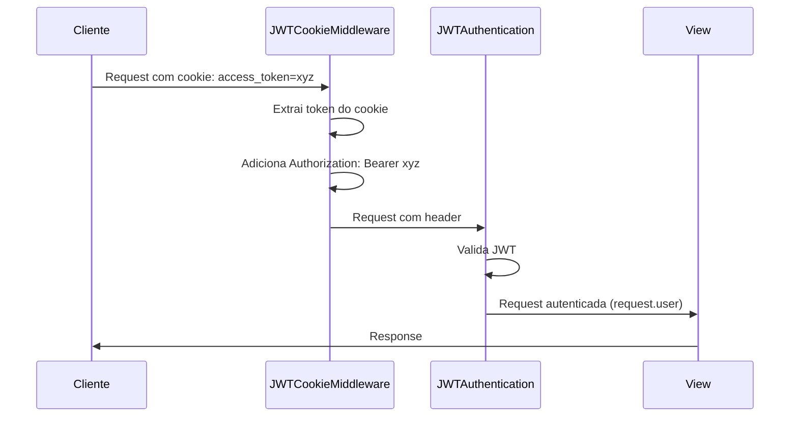
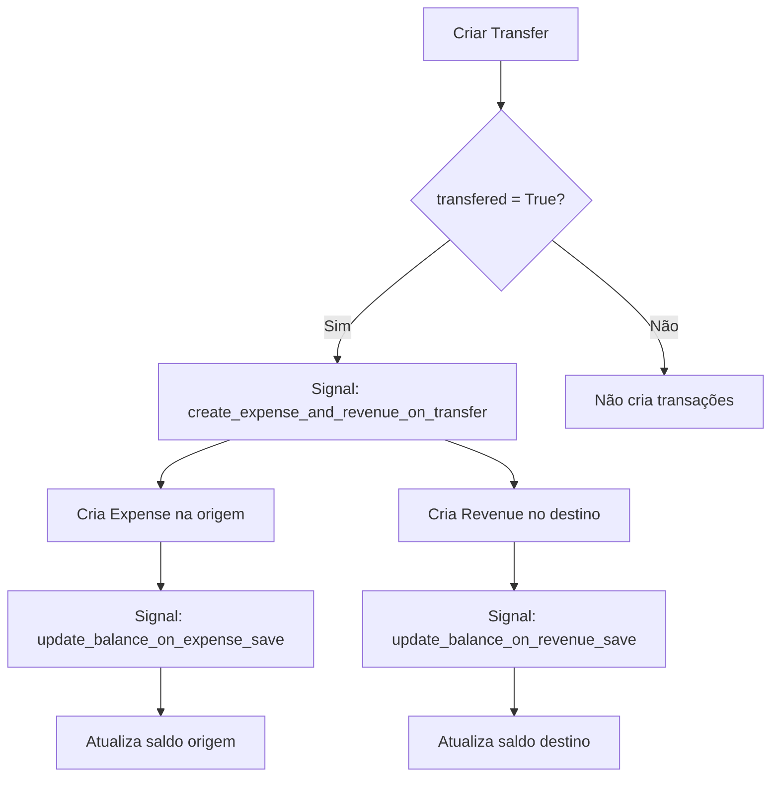

# Middleware e Django Signals

## Visão Geral

Este documento detalha os middlewares customizados e Django signals do MindLedger, explicando como interceptam requisições e respondem a eventos de modelos.

## Middleware

Middlewares são componentes que processam requisições antes de chegarem à view e respostas antes de serem enviadas ao cliente.

### Ordem de Execução

```python
# app/settings.py
MIDDLEWARE = [
    'django.middleware.security.SecurityMiddleware',
    'corsheaders.middleware.CorsMiddleware',  # CORS antes de tudo
    'django.contrib.sessions.middleware.SessionMiddleware',
    'django.middleware.common.CommonMiddleware',
    'django.middleware.csrf.CsrfViewMiddleware',
    'django.contrib.auth.middleware.AuthenticationMiddleware',
    'authentication.middleware.JWTCookieMiddleware',  # JWT via cookies
    'app.middleware.AuditLoggingMiddleware',  # Log de auditoria
    'django.contrib.messages.middleware.MessageMiddleware',
    'django.middleware.clickjacking.XFrameOptionsMiddleware',
    'app.middleware.SecurityHeadersMiddleware',  # Headers de segurança
]
```

**Ordem importa**: Middlewares são executados de cima para baixo no processamento de requisições e de baixo para cima no processamento de respostas.

```mermaid
graph LR
    A[Request] --> B[SecurityMiddleware]
    B --> C[CorsMiddleware]
    C --> D[SessionMiddleware]
    D --> E[AuthenticationMiddleware]
    E --> F[JWTCookieMiddleware]
    F --> G[AuditLoggingMiddleware]
    G --> H[View]
    H --> I[SecurityHeadersMiddleware]
    I --> J[AuditLoggingMiddleware]
    J --> K[Response]
```



### 1. JWTCookieMiddleware

**Responsabilidade**: Extrai JWT token de cookies HttpOnly e adiciona ao header Authorization.

**Localização**: `/home/tarcisio/Development/MindLedger/api/authentication/middleware.py`

```python
class JWTCookieMiddleware:
    """
    Middleware que extrai JWT token de cookies httpOnly.

    Fluxo:
    1. Lê access_token do cookie
    2. Se existe e não há header Authorization, adiciona o token
    3. DRF JWTAuthentication processa o token normalmente
    """

    def __init__(self, get_response):
        self.get_response = get_response

    def __call__(self, request):
        # Ler access token do cookie
        access_token = request.COOKIES.get('access_token')

        # Se existe token no cookie e não há Authorization header
        if access_token and not request.META.get('HTTP_AUTHORIZATION'):
            # Adicionar token ao header Authorization
            request.META['HTTP_AUTHORIZATION'] = f'Bearer {access_token}'

        response = self.get_response(request)
        return response
```

**Por que usar?**:
- **Segurança**: HttpOnly cookies não são acessíveis via JavaScript (proteção contra XSS)
- **Simplicidade**: Frontend não precisa gerenciar tokens manualmente
- **Auto-envio**: Navegador envia cookies automaticamente em cada requisição

**Como funciona**:


**Uso no frontend**:
```typescript
// Frontend NÃO precisa enviar token manualmente
// O navegador envia o cookie automaticamente

const response = await apiClient.get('/api/v1/accounts/');
// Cookie access_token é enviado automaticamente
// Middleware adiciona ao header Authorization
// DRF autentica normalmente
```

### 2. AuditLoggingMiddleware

**Responsabilidade**: Registra ações dos usuários para auditoria e segurança.

**Localização**: `/home/tarcisio/Development/MindLedger/api/app/middleware.py`

```python
class AuditLoggingMiddleware(MiddlewareMixin):
    """
    Middleware para logging de ações de usuários e requisições API.
    Registra todas as requisições POST, PUT, PATCH, DELETE com informações do usuário.
    """

    # Campos sensíveis que não devem ser logados
    SENSITIVE_FIELDS = [
        'password', 'token', 'key', 'secret', 'cvv',
        'security_code', '_security_code', 'csrf_token'
    ]

    # Paths excluídos de logging
    EXCLUDED_PATHS = [
        '/admin/jsi18n/',
        '/health/',
        '/ready/',
        '/live/',
        '/static/',
        '/media/',
    ]

    def process_request(self, request):
        """Armazena timestamp e body da requisição."""
        request._audit_start_time = now()

        # Armazenar body para logging posterior (pode ser lido apenas uma vez)
        if request.method in ['POST', 'PUT', 'PATCH']:
            try:
                request._cached_body = request.body
            except Exception:
                request._cached_body = None

        return None

    def process_response(self, request, response):
        """Registra a requisição após processamento."""

        # Pular paths excluídos
        if any(request.path.startswith(path) for path in self.EXCLUDED_PATHS):
            return response

        # Só logar modificações e erros
        if (request.method in ['POST', 'PUT', 'PATCH', 'DELETE'] or
                response.status_code >= 400):
            self._log_request(request, response)

        return response

    def _log_request(self, request, response):
        """Cria entrada de log de auditoria."""
        try:
            # Calcular duração da requisição
            duration = None
            if hasattr(request, '_audit_start_time'):
                duration = (now() - request._audit_start_time).total_seconds()

            # Preparar dados do log
            log_data = {
                'timestamp': now().isoformat(),
                'method': request.method,
                'path': request.path,
                'status_code': response.status_code,
                'user': self._get_user_info(request),
                'ip_address': self._get_client_ip(request),
                'user_agent': request.META.get('HTTP_USER_AGENT', ''),
                'duration_seconds': duration,
            }

            # Adicionar body da requisição (sanitizado)
            if request.method in ['POST', 'PUT', 'PATCH']:
                log_data['request_data'] = self._get_safe_request_data(request)

            # Adicionar query parameters
            if request.GET:
                log_data['query_params'] = dict(request.GET)

            # Adicionar info de erro
            if response.status_code >= 400:
                log_data['error'] = True
                try:
                    if hasattr(response, 'data'):
                        log_data['error_details'] = response.data
                    elif response.content:
                        content = response.content.decode('utf-8')
                        if len(content) < 1000:
                            log_data['error_details'] = content
                except Exception:
                    pass

            # Logar
            if response.status_code >= 400:
                logger.error('API request failed', extra=log_data)
            else:
                logger.info('User action logged', extra=log_data)

        except Exception as e:
            logger.error(f'Failed to create audit log: {str(e)}')

    def _get_user_info(self, request):
        """Extrai informações seguras do usuário."""
        if hasattr(request, 'user') and request.user.is_authenticated:
            return {
                'id': request.user.id,
                'username': request.user.username,
                'email': request.user.email,
                'is_staff': request.user.is_staff,
                'is_superuser': request.user.is_superuser,
            }
        return {'authenticated': False}

    def _get_client_ip(self, request):
        """Obtém IP do cliente, considerando proxies."""
        x_forwarded_for = request.META.get('HTTP_X_FORWARDED_FOR')
        if x_forwarded_for:
            ip = x_forwarded_for.split(',')[0].strip()
        else:
            ip = request.META.get('REMOTE_ADDR', '')
        return ip

    def _get_safe_request_data(self, request):
        """Obtém dados da requisição com campos sensíveis removidos."""
        try:
            if hasattr(request, '_cached_body') and request._cached_body:
                if request.content_type == 'application/json':
                    data = json.loads(request._cached_body)
                else:
                    data = dict(request.POST)
            else:
                data = dict(request.POST)

            # Remover campos sensíveis
            safe_data = self._sanitize_data(data)

            # Limitar tamanho do log
            data_str = json.dumps(safe_data)
            if len(data_str) > 2000:
                return {'message': 'Request data too large to log'}

            return safe_data

        except Exception as e:
            return {'error': f'Could not parse request data: {str(e)}'}

    def _sanitize_data(self, data):
        """Remove recursivamente campos sensíveis."""
        if isinstance(data, dict):
            sanitized = {}
            for key, value in data.items():
                if any(sensitive in key.lower() for sensitive in self.SENSITIVE_FIELDS):
                    sanitized[key] = '[REDACTED]'
                else:
                    sanitized[key] = self._sanitize_data(value)
            return sanitized
        elif isinstance(data, list):
            return [self._sanitize_data(item) for item in data]
        else:
            return data
```

**Exemplo de log**:
```json
{
  "timestamp": "2024-01-15T10:30:45.123Z",
  "method": "POST",
  "path": "/api/v1/expenses/",
  "status_code": 201,
  "user": {
    "id": 1,
    "username": "joao",
    "email": "joao@example.com",
    "is_staff": false,
    "is_superuser": false
  },
  "ip_address": "192.168.1.100",
  "user_agent": "Mozilla/5.0...",
  "duration_seconds": 0.142,
  "request_data": {
    "description": "Mercado",
    "value": "150.00",
    "category": "food",
    "password": "[REDACTED]"
  }
}
```

**Benefícios**:
- Auditoria completa de ações
- Detecção de atividades suspeitas
- Debugging de problemas
- Conformidade com regulamentações (LGPD, GDPR)

### 3. SecurityHeadersMiddleware

**Responsabilidade**: Adiciona headers de segurança às respostas HTTP.

```python
class SecurityHeadersMiddleware(MiddlewareMixin):
    """
    Middleware para adicionar headers de segurança às respostas.
    """

    def process_response(self, request, response):
        """Adiciona headers de segurança."""

        content_type = response.get('Content-Type', '')
        if content_type.startswith(('text/html', 'application/json')):
            # Previne MIME type sniffing
            response['X-Content-Type-Options'] = 'nosniff'

            # Ativa proteção XSS
            response['X-XSS-Protection'] = '1; mode=block'

            # Política de referrer
            response['Referrer-Policy'] = 'strict-origin-when-cross-origin'

            # Content Security Policy
            response['Content-Security-Policy'] = (
                "default-src 'self'; "
                "script-src 'self' 'unsafe-inline' 'unsafe-eval'; "
                "style-src 'self' 'unsafe-inline' https://fonts.googleapis.com; "
                "font-src 'self' https://fonts.gstatic.com; "
                "img-src 'self' data: https:; "
                "connect-src 'self' http://localhost:* https:;"
            )

            # Permissions Policy
            response['Permissions-Policy'] = (
                "geolocation=(), "
                "microphone=(), "
                "camera=(), "
                "payment=(), "
                "usb=()"
            )

        # X-Frame-Options para prevenir clickjacking
        response['X-Frame-Options'] = 'DENY'

        return response
```

**Headers adicionados**:
- `X-Content-Type-Options`: Previne MIME type sniffing
- `X-XSS-Protection`: Ativa proteção contra XSS no navegador
- `Referrer-Policy`: Controla informações de referrer
- `Content-Security-Policy`: Define fontes permitidas de conteúdo
- `Permissions-Policy`: Controla acesso a APIs do navegador
- `X-Frame-Options`: Previne clickjacking

## Django Signals

Signals permitem que aplicações desacopladas sejam notificadas quando ações ocorrem em outras partes do sistema.

### Quando Usar Signals

**Use signals quando**:
- Múltiplas apps precisam reagir a um evento
- Ação deve ocorrer sempre que um modelo é salvo/deletado
- Lógica é de infraestrutura (logging, caching, indexação)

**NÃO use signals quando**:
- Lógica é específica de uma view (faça na view)
- Pode causar efeitos colaterais inesperados
- Pode criar dependências circulares

### Tipos de Signals

**Model Signals**:
- `pre_save`: Antes de salvar
- `post_save`: Depois de salvar
- `pre_delete`: Antes de deletar
- `post_delete`: Depois de deletar
- `m2m_changed`: Quando ManyToMany muda

**Request/Response Signals**:
- `request_started`: Quando requisição inicia
- `request_finished`: Quando requisição termina

### 1. Signals de Atualização de Saldo

**Arquivo**: `/home/tarcisio/Development/MindLedger/api/accounts/signals.py`

**Objetivo**: Atualizar automaticamente o saldo das contas quando receitas/despesas são criadas, editadas ou deletadas.

```python
from django.db import models, transaction
from django.db.models.signals import post_save, post_delete
from django.dispatch import receiver
from decimal import Decimal

def update_account_balance(account):
    """
    Atualiza o saldo de uma conta baseado em receitas e despesas.

    Fórmula: saldo = soma(receitas recebidas) - soma(despesas pagas)
    """
    from revenues.models import Revenue
    from expenses.models import Expense

    with transaction.atomic():
        # Total de receitas recebidas
        total_revenues = Revenue.objects.filter(
            account=account,
            received=True
        ).aggregate(total=models.Sum('value'))['total'] or Decimal('0.00')

        # Total de despesas pagas
        total_expenses = Expense.objects.filter(
            account=account,
            payed=True
        ).aggregate(total=models.Sum('value'))['total'] or Decimal('0.00')

        # Atualizar saldo
        new_balance = total_revenues - total_expenses
        account.current_balance = new_balance
        account.save(update_fields=['current_balance'])


@receiver(post_save, sender='revenues.Revenue')
def update_balance_on_revenue_save(sender, instance, created, **kwargs):
    """Atualiza saldo da conta quando receita é criada ou editada."""
    if instance.account:
        update_account_balance(instance.account)


@receiver(post_delete, sender='revenues.Revenue')
def update_balance_on_revenue_delete(sender, instance, **kwargs):
    """Atualiza saldo da conta quando receita é deletada."""
    if instance.account:
        update_account_balance(instance.account)


@receiver(post_save, sender='expenses.Expense')
def update_balance_on_expense_save(sender, instance, created, **kwargs):
    """Atualiza saldo da conta quando despesa é criada ou editada."""
    if instance.account:
        update_account_balance(instance.account)


@receiver(post_delete, sender='expenses.Expense')
def update_balance_on_expense_delete(sender, instance, **kwargs):
    """Atualiza saldo da conta quando despesa é deletada."""
    if instance.account:
        update_account_balance(instance.account)


@receiver(post_save, sender='accounts.Account')
def create_initial_revenue_on_account_creation(sender, instance, created, **kwargs):
    """
    Cria receita de saldo inicial quando conta é criada com saldo > 0.
    """
    from revenues.models import Revenue

    if created and instance.current_balance > Decimal('0.00'):
        revenue_date = instance.opening_date or timezone.now().date()
        revenue_time = timezone.now().time()

        Revenue.objects.create(
            description='Saldo inicial',
            value=instance.current_balance,
            date=revenue_date,
            horary=revenue_time,
            category='deposit',
            account=instance,
            received=True,
            member=instance.owner,
            created_by=instance.created_by,
            updated_by=instance.updated_by,
            notes='Receita criada automaticamente a partir do saldo inicial da conta.'
        )
```

**Benefícios**:
- Saldo sempre correto e consistente
- Não precisa recalcular manualmente
- Transações atômicas evitam inconsistências

### 2. Signals de Transferência

**Arquivo**: `/home/tarcisio/Development/MindLedger/api/transfers/signals.py`

**Objetivo**: Criar automaticamente despesa na origem e receita no destino quando transferência é efetivada.

```python
from django.db.models.signals import post_save, pre_delete
from django.dispatch import receiver

@receiver(post_save, sender=Transfer)
def create_expense_and_revenue_on_transfer(sender, instance, created, **kwargs):
    """
    Cria despesa e receita automaticamente quando transferência é criada.
    """
    from expenses.models import Expense
    from revenues.models import Revenue

    # Só cria transações se transferência foi efetivada
    if not instance.transfered:
        return

    # Verificar se já existem (evitar duplicação)
    existing_expense = Expense.objects.filter(
        description=f"Transferência: {instance.description}",
        account=instance.origin_account,
        date=instance.date,
        horary=instance.horary,
        value=instance.value + instance.fee
    ).first()

    existing_revenue = Revenue.objects.filter(
        description=f"Transferência: {instance.description}",
        account=instance.destiny_account,
        date=instance.date,
        horary=instance.horary,
        value=instance.value
    ).first()

    # Criar despesa na origem
    if not existing_expense:
        Expense.objects.create(
            description=f"Transferência: {instance.description}",
            value=instance.value + instance.fee,  # Valor + taxa
            date=instance.date,
            horary=instance.horary,
            category='others',
            account=instance.origin_account,
            payed=instance.transfered,
            merchant=f"Transferência para {instance.destiny_account.account_name}",
            payment_method='transfer',
            member=instance.member,
            related_transfer=instance,  # Vincula à transferência
            notes=f"Transferência ID: {instance.transaction_id or instance.uuid}\n"
                  f"Tipo: {instance.get_category_display()}\n"
                  f"Taxa: R$ {instance.fee}\n"
                  f"{instance.notes or ''}",
            created_by=instance.created_by,
            updated_by=instance.updated_by
        )

    # Criar receita no destino
    if not existing_revenue:
        Revenue.objects.create(
            description=f"Transferência: {instance.description}",
            value=instance.value,
            date=instance.date,
            horary=instance.horary,
            category='transfer',
            account=instance.destiny_account,
            received=instance.transfered,
            source=f"Transferência de {instance.origin_account.account_name}",
            member=instance.member,
            related_transfer=instance,
            notes=f"Transferência ID: {instance.transaction_id or instance.uuid}\n"
                  f"Tipo: {instance.get_category_display()}\n"
                  f"{instance.notes or ''}",
            created_by=instance.created_by,
            updated_by=instance.updated_by
        )


@receiver(pre_delete, sender=Transfer)
def delete_related_transactions_on_transfer_delete(sender, instance, **kwargs):
    """
    Remove transações relacionadas quando transferência é deletada.
    """
    from expenses.models import Expense
    from revenues.models import Revenue

    Expense.objects.filter(related_transfer=instance).delete()
    Revenue.objects.filter(related_transfer=instance).delete()
```

**Fluxo**:


### 3. Signals de Empréstimo

**Arquivo**: `/home/tarcisio/Development/MindLedger/api/loans/signals.py`

**Objetivo**: Atualizar automaticamente `payed_value` e `status` de empréstimos quando despesas/receitas relacionadas são criadas, editadas ou deletadas.

```python
from django.db.models import Sum
from decimal import Decimal

def update_loan_payed_value(loan):
    """
    Recalcula payed_value do empréstimo baseado em despesas e receitas vinculadas.
    """
    from expenses.models import Expense
    from revenues.models import Revenue

    # Somar despesas pagas vinculadas
    expense_payments = Expense.objects.filter(
        related_loan=loan,
        is_deleted=False
    ).aggregate(total=Sum('value'))['total'] or Decimal('0')

    # Somar receitas recebidas vinculadas
    revenue_payments = Revenue.objects.filter(
        related_loan=loan,
        is_deleted=False
    ).aggregate(total=Sum('value'))['total'] or Decimal('0')

    # Total pago
    total_paid = expense_payments + revenue_payments

    loan.payed_value = total_paid
    loan.save(update_fields=['payed_value', 'updated_at'])


def update_loan_status(loan):
    """
    Atualiza status do empréstimo.

    Regras:
    - 'paid': payed_value >= value (totalmente pago)
    - 'overdue': payed_value < value AND today > due_date (atrasado)
    - 'active': caso contrário
    """
    from datetime import date

    remaining = loan.value - loan.payed_value

    if loan.payed_value >= loan.value:
        new_status = 'paid'
    elif loan.due_date and date.today() > loan.due_date and remaining > 0:
        new_status = 'overdue'
    else:
        new_status = 'active'

    if loan.status != new_status:
        loan.status = new_status
        loan.save(update_fields=['status', 'updated_at'])


@receiver(post_save, sender='expenses.Expense')
def update_loan_on_expense_save(sender, instance, created, **kwargs):
    """Atualiza empréstimo quando despesa vinculada é criada ou editada."""
    if not instance.related_loan:
        return

    from loans.models import Loan

    try:
        # select_for_update evita race conditions
        loan = Loan.objects.select_for_update().get(pk=instance.related_loan.pk)
        update_loan_payed_value(loan)
        update_loan_status(loan)
    except Loan.DoesNotExist:
        pass


@receiver(post_delete, sender='expenses.Expense')
def recalculate_loan_after_expense_delete(sender, instance, **kwargs):
    """Recalcula empréstimo após despesa ser deletada."""
    if not instance.related_loan:
        return

    from loans.models import Loan

    try:
        loan = Loan.objects.select_for_update().get(pk=instance.related_loan.pk)
        update_loan_payed_value(loan)
        update_loan_status(loan)
    except Loan.DoesNotExist:
        pass


# Signals similares para Revenue...
```

**select_for_update()**: Previne race conditions ao atualizar concorrentemente o mesmo empréstimo.

### Registro de Signals

**Forma 1: Usando @receiver decorator**:
```python
from django.dispatch import receiver
from django.db.models.signals import post_save

@receiver(post_save, sender=MyModel)
def my_handler(sender, instance, created, **kwargs):
    # lógica aqui
    pass
```

**Forma 2: Conectando manualmente**:
```python
from django.db.models.signals import post_save

def my_handler(sender, instance, created, **kwargs):
    # lógica aqui
    pass

post_save.connect(my_handler, sender=MyModel)
```

**Registro em AppConfig**:
```python
# accounts/apps.py
from django.apps import AppConfig

class AccountsConfig(AppConfig):
    default_auto_field = 'django.db.models.BigAutoField'
    name = 'accounts'

    def ready(self):
        import accounts.signals  # Importa para registrar signals
```

## Boas Práticas

### Middleware

1. **Ordem importa**: Coloque middlewares de autenticação antes de middlewares que precisam do usuário
2. **Performance**: Evite operações pesadas em middlewares (executam em toda requisição)
3. **Segurança**: Sempre sanitize dados sensíveis antes de logar
4. **Exceções**: Capture exceções para não quebrar o request/response cycle
5. **Cache**: Se precisar de dados da requisição posteriormente, armazene em atributos privados (`request._meu_dado`)

### Signals

1. **Evite signals aninhados**: Signal que dispara outro signal dificulta debugging
2. **Use select_for_update()**: Para evitar race conditions em atualizações concorrentes
3. **Cuidado com recursão**: Signals salvando o mesmo modelo podem causar loops infinitos
4. **Transaction atomic**: Use `@transaction.atomic` quando signal faz múltiplas operações
5. **Verificações de existência**: Sempre verifique se relacionamentos existem antes de acessar
6. **Documente**: Explique claramente o que cada signal faz e por quê
7. **Teste isoladamente**: Teste signals separadamente das views

### Prevenindo Loops Infinitos

```python
@receiver(post_save, sender=MyModel)
def my_handler(sender, instance, created, **kwargs):
    # ❌ RUIM: Pode causar loop infinito
    instance.field = 'new value'
    instance.save()  # Dispara post_save novamente!

    # ✅ BOM: Usa update_fields para evitar disparar signal
    MyModel.objects.filter(pk=instance.pk).update(field='new value')

    # ✅ BOM: Usa flag para evitar reprocessamento
    if not hasattr(instance, '_processing'):
        instance._processing = True
        instance.field = 'new value'
        instance.save()
```

### Race Conditions

```python
@receiver(post_save, sender='expenses.Expense')
def update_account_balance(sender, instance, created, **kwargs):
    if instance.account:
        # ❌ RUIM: Pode ter race condition com requests concorrentes
        account = Account.objects.get(pk=instance.account.pk)
        account.balance += instance.value
        account.save()

        # ✅ BOM: Usa select_for_update para lock pessimista
        account = Account.objects.select_for_update().get(pk=instance.account.pk)
        account.balance = calculate_balance(account)  # Recalcula do zero
        account.save()
```

## Debugging

### Logging de Signals

```python
import logging
logger = logging.getLogger(__name__)

@receiver(post_save, sender=MyModel)
def my_handler(sender, instance, created, **kwargs):
    logger.debug(f"Signal triggered: {sender.__name__}, created={created}, instance={instance}")
    # lógica aqui
```

### Desabilitando Signals Temporariamente

Útil para testes ou operações em massa:

```python
from django.db.models.signals import post_save

# Desconecta signal
post_save.disconnect(my_handler, sender=MyModel)

# Operação sem trigger de signal
MyModel.objects.bulk_create([...])

# Reconecta signal
post_save.connect(my_handler, sender=MyModel)
```

**Context manager para testes**:
```python
from contextlib import contextmanager

@contextmanager
def disable_signals():
    """Desabilita signals temporariamente."""
    post_save.disconnect(my_handler, sender=MyModel)
    try:
        yield
    finally:
        post_save.connect(my_handler, sender=MyModel)

# Uso
with disable_signals():
    MyModel.objects.create(...)  # Sem disparar signal
```

## Próximos Passos

- [Criptografia](./criptografia.md) - Sistema de criptografia Fernet
- [Comandos Management](./comandos-management.md) - Comandos customizados
