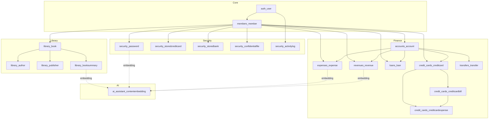

# Documentação de Banco de Dados

Esta seção contém a documentação completa sobre o banco de dados PostgreSQL do MindLedger, incluindo schema, otimizações e recursos avançados.

## Arquivos Disponíveis

### [schema.md](schema.md)
Documentação completa do schema do banco de dados:
- Todas as tabelas e seus campos
- Tipos de dados e constraints
- Relacionamentos entre tabelas
- Diagramas ER (Entity-Relationship)
- Campos de auditoria e soft delete

### [indices-otimizacao.md](indices-otimizacao.md)
Estratégias de otimização e performance:
- Índices criados e suas justificativas
- Índices compostos para queries frequentes
- Análise de queries N+1
- Uso de select_related e prefetch_related
- Estratégias de cache (futuro)

### [pgvector.md](pgvector.md)
Implementação de busca vetorial com pgvector:
- Configuração da extensão pgvector
- Armazenamento de embeddings
- Busca por similaridade (cosine similarity)
- Integração com sentence-transformers
- Performance de queries vetoriais

### [migrations.md](migrations.md)
Guia de migrations Django:
- Como criar migrations
- Boas práticas
- Resolução de conflitos
- Migrations de dados vs. schema
- Rollback de migrations

## Tecnologias

- **PostgreSQL 16** - Banco de dados relacional
- **pgvector** - Extensão para busca vetorial
- **Django ORM** - Object-Relational Mapping
- **psycopg2** - Adaptador PostgreSQL para Python

## Visão Geral Rápida

### Principais Tabelas

#### Módulo Finance
- `accounts_account` - Contas bancárias
- `expenses_expense` - Despesas
- `revenues_revenue` - Receitas
- `loans_loan` - Empréstimos
- `credit_cards_creditcard` - Cartões de crédito
- `credit_cards_creditcardbill` - Faturas
- `credit_cards_creditcardexpense` - Despesas de cartão
- `transfers_transfer` - Transferências

#### Módulo Security
- `security_password` - Senhas armazenadas
- `security_storedcreditcard` - Cartões armazenados
- `security_storedbank` - Contas bancárias armazenadas
- `security_confidentialfile` - Arquivos confidenciais
- `security_activitylog` - Logs de auditoria

#### Módulo Library
- `library_book` - Livros
- `library_author` - Autores
- `library_publisher` - Editoras
- `library_booksummary` - Resumos de leitura

#### AI Assistant
- `ai_assistant_contentembedding` - Embeddings vetoriais

#### Sistema
- `members_member` - Membros/Usuários unificados
- `auth_user` - Usuários Django

### Padrão Base

Todas as tabelas principais herdam de `BaseModel`:

```python
class BaseModel(models.Model):
    uuid = models.UUIDField(default=uuid.uuid4, unique=True)
    created_at = models.DateTimeField(auto_now_add=True)
    updated_at = models.DateTimeField(auto_now=True)
    created_by = models.ForeignKey(User, on_delete=models.SET_NULL, null=True, related_name='+')
    updated_by = models.ForeignKey(User, on_delete=models.SET_NULL, null=True, related_name='+')
    is_deleted = models.BooleanField(default=False)
    deleted_at = models.DateTimeField(null=True, blank=True)
```

### Recursos Especiais

#### Soft Delete
- Exclusão lógica através de flag `is_deleted`
- Preservação de histórico
- Queries filtram automaticamente registros deletados

#### Criptografia
- Campos sensíveis prefixados com `_`
- Criptografia Fernet (AES-128)
- Mascaramento em listagens

#### Busca Vetorial
- Embeddings de 384 dimensões
- Busca por similaridade com pgvector
- Suporte a RAG (Retrieval Augmented Generation)

## Diagrama de Alto Nível



## Comandos Úteis

### Acesso ao PostgreSQL
```bash
# Via Docker
docker-compose exec db psql -U mindledger_user -d mindledger_db

# Local
psql -h localhost -p 5435 -U mindledger_user -d mindledger_db
```

### Inspeção do Schema
```sql
-- Listar todas as tabelas
\dt

-- Descrever uma tabela
\d accounts_account

-- Ver índices
\di

-- Ver constraints
\d+ accounts_account
```

### Backup e Restore
```bash
# Backup
docker-compose exec db pg_dump -U mindledger_user mindledger_db > backup.sql

# Restore
docker-compose exec -T db psql -U mindledger_user mindledger_db < backup.sql
```

## Links Relacionados

- [Modelos Django](../backend/data_models.md)
- [Serializers DRF](../backend/serializers.md)
- [Criptografia de Dados](../backend/criptography.md)
- [Sistema de Autenticação](../authentication-security/authentication_flow.md)
