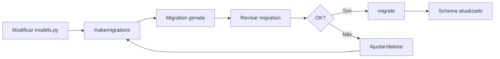

# Guia Completo de Migrations - Django MindLedger

> Guia prático para criação, aplicação e resolução de conflitos de migrations no Django

## Índice

- [Visão Geral](#visão-geral)
- [Criando Migrations](#criando-migrations)
- [Aplicando Migrations](#aplicando-migrations)
- [Tipos de Alterações](#tipos-de-alterações)
- [Migrations Customizadas](#migrations-customizadas)
- [Resolução de Conflitos](#resolução-de-conflitos)
- [Rollback e Reversão](#rollback-e-reversão)
- [Boas Práticas](#boas-práticas)
- [Troubleshooting](#troubleshooting)

---

## Visão Geral

### O que são Migrations?

Migrations são arquivos Python que descrevem mudanças no schema do banco de dados. Django as usa para:

1. **Versionamento**: Controlar evolução do schema ao longo do tempo
2. **Portabilidade**: Aplicar mudanças em diferentes ambientes (dev, staging, prod)
3. **Rastreabilidade**: Saber exatamente quais mudanças foram aplicadas
4. **Reversibilidade**: Desfazer mudanças quando necessário

### Estrutura de uma Migration

```python
# expenses/migrations/0001_initial.py
from django.db import migrations, models

class Migration(migrations.Migration):
    # Dependências (outras migrations que devem ser aplicadas antes)
    dependencies = [
        ('accounts', '0001_initial'),
    ]

    # Operações a serem executadas
    operations = [
        migrations.CreateModel(
            name='Expense',
            fields=[
                ('id', models.BigAutoField(primary_key=True)),
                ('description', models.CharField(max_length=100)),
                ('value', models.DecimalField(max_digits=10, decimal_places=2)),
                # ...
            ],
        ),
    ]
```

### Fluxo de Trabalho



---

## Criando Migrations

### Comando Básico

```bash
# Criar migrations para TODOS os apps com mudanças
docker-compose exec api python manage.py makemigrations

# Criar migration para app específico
docker-compose exec api python manage.py makemigrations expenses

# Dry-run (mostrar o que seria criado sem criar)
docker-compose exec api python manage.py makemigrations --dry-run

# Criar migration vazia (para customizações)
docker-compose exec api python manage.py makemigrations expenses --empty --name custom_operation
```

---

### Detecção Automática de Mudanças

Django detecta automaticamente:

```python
# 1. Novos modelos
class NewModel(BaseModel):
    name = models.CharField(max_length=200)

# 2. Novos campos
class Expense(BaseModel):
    # ... campos existentes ...
    new_field = models.CharField(max_length=100, default='')  # SEMPRE adicionar default

# 3. Campos renomeados (com prompt de confirmação)
class Expense(BaseModel):
    # merchant → store_name
    store_name = models.CharField(max_length=200)  # Django perguntará se foi renomeado

# 4. Campos deletados
class Expense(BaseModel):
    # Remove campo 'old_field'
    pass

# 5. Alteração de tipo
class Expense(BaseModel):
    value = models.DecimalField(max_digits=15, decimal_places=2)  # Era 10 antes

# 6. Alteração de constraints
class Expense(BaseModel):
    description = models.CharField(max_length=200)  # Era 100 antes

# 7. Alteração de Meta
class Meta:
    ordering = ['-date', 'description']  # Era só ['-date']
    indexes = [
        models.Index(fields=['account', 'date'])  # Novo índice
    ]
```

---

### Nomeando Migrations

Django gera nomes automaticamente, mas você pode customizar:

```bash
# Migration com nome descritivo
docker-compose exec api python manage.py makemigrations expenses --name add_merchant_field

# Resultado: 0005_add_merchant_field.py
```

**Convenções de Nome**:
- `add_<field>_field`: Adicionar campo
- `remove_<field>_field`: Remover campo
- `alter_<field>_<property>`: Alterar propriedade
- `rename_<old>_to_<new>`: Renomear campo
- `create_<index_name>_index`: Criar índice
- `<description>`: Operações complexas

---

## Aplicando Migrations

### Comando Básico

```bash
# Aplicar TODAS as migrations pendentes
docker-compose exec api python manage.py migrate

# Aplicar migrations de app específico
docker-compose exec api python manage.py migrate expenses

# Aplicar até migration específica
docker-compose exec api python manage.py migrate expenses 0003

# Dry-run (mostrar SQL sem executar)
docker-compose exec api python manage.py migrate --plan
docker-compose exec api python manage.py sqlmigrate expenses 0003

# Forçar re-aplicação (fake)
docker-compose exec api python manage.py migrate expenses 0003 --fake
```

---

### Verificar Status

```bash
# Listar todas as migrations e seu status
docker-compose exec api python manage.py showmigrations

# Listar migrations de app específico
docker-compose exec api python manage.py showmigrations expenses

# Mostrar apenas pendentes
docker-compose exec api python manage.py showmigrations --plan
```

**Output Exemplo**:
```
accounts
 [X] 0001_initial
 [X] 0002_remove_institution_unique
credit_cards
 [X] 0001_initial
 [X] 0002_alter_creditcard__security_code
expenses
 [X] 0001_initial
 [ ] 0002_alter_expense_payed  <-- Pendente
```

---

### Aplicar em Produção

**Fluxo Seguro**:

```bash
# 1. Backup do banco
docker-compose exec db pg_dump -U $DB_USER mindledger_db > backup_pre_migration.sql

# 2. Ver o que será executado
docker-compose exec api python manage.py migrate --plan

# 3. Ver SQL gerado
docker-compose exec api python manage.py sqlmigrate expenses 0003

# 4. Aplicar
docker-compose exec api python manage.py migrate

# 5. Verificar
docker-compose exec api python manage.py showmigrations
```

**IMPORTANTE**: Em produção, sempre fazer backup antes de aplicar migrations!

---

## Tipos de Alterações

### 1. Adicionar Campo

#### Sem Valor Padrão (vai falhar se tabela tiver dados)

```python
# models.py
class Expense(BaseModel):
    new_field = models.CharField(max_length=100)  # ❌ Erro se tabela tem rows
```

**Erro**:
```
You are trying to add a non-nullable field 'new_field' to expense
without a default; we can't do that (the database needs something to populate existing rows).
```

#### Com Valor Padrão (recomendado)

```python
# models.py
class Expense(BaseModel):
    new_field = models.CharField(max_length=100, default='')  # ✅ OK
```

**Migration Gerada**:
```python
operations = [
    migrations.AddField(
        model_name='expense',
        name='new_field',
        field=models.CharField(default='', max_length=100),
    ),
]
```

#### Com Valor NULL

```python
# models.py
class Expense(BaseModel):
    new_field = models.CharField(max_length=100, null=True, blank=True)  # ✅ OK
```

---

### 2. Remover Campo

```python
# models.py
class Expense(BaseModel):
    # description = models.CharField(...)  # DELETAR esta linha
    pass
```

**Migration Gerada**:
```python
operations = [
    migrations.RemoveField(
        model_name='expense',
        name='description',
    ),
]
```

**IMPORTANTE**: Django NÃO cria backup automático. Dados serão perdidos permanentemente!

---

### 3. Renomear Campo

Django detecta renames se campos forem removidos e adicionados na mesma migration:

```python
# models.py
class Expense(BaseModel):
    # merchant → store_name
    store_name = models.CharField(max_length=200)  # Antes era 'merchant'
```

**Prompt**:
```
Did you rename expense.merchant to expense.store_name (a CharField)? [y/N]
```

Digite `y` para Django gerar `RenameField` ao invés de `RemoveField + AddField`.

**Migration Gerada (se respondeu 'y')**:
```python
operations = [
    migrations.RenameField(
        model_name='expense',
        old_name='merchant',
        new_name='store_name',
    ),
]
```

**Rename Manual (se respondeu 'n')**:
```python
# Editar migration gerada e trocar:
operations = [
    # migrations.RemoveField(...),
    # migrations.AddField(...),
    # POR:
    migrations.RenameField(
        model_name='expense',
        old_name='merchant',
        new_name='store_name',
    ),
]
```

---

### 4. Alterar Tipo de Campo

#### Conversões Compatíveis (automáticas)

```python
# De CharField para TextField
class Expense(BaseModel):
    notes = models.TextField()  # Antes era CharField(max_length=500)
```

**Migration**:
```python
operations = [
    migrations.AlterField(
        model_name='expense',
        name='notes',
        field=models.TextField(),
    ),
]
```

#### Conversões Incompatíveis (requer dados)

```python
# De CharField para IntegerField
class Expense(BaseModel):
    quantity = models.IntegerField()  # Antes era CharField
```

**Solução**: Criar migration em múltiplos passos:

```python
# Migration 1: Adicionar novo campo
operations = [
    migrations.AddField(
        model_name='expense',
        name='quantity_int',
        field=models.IntegerField(null=True),
    ),
]

# Migration 2: Migrar dados (RunPython)
def migrate_quantity(apps, schema_editor):
    Expense = apps.get_model('expenses', 'Expense')
    for expense in Expense.objects.all():
        try:
            expense.quantity_int = int(expense.quantity)
            expense.save()
        except ValueError:
            expense.quantity_int = 0
            expense.save()

operations = [
    migrations.RunPython(migrate_quantity),
]

# Migration 3: Remover campo antigo e renomear novo
operations = [
    migrations.RemoveField(model_name='expense', name='quantity'),
    migrations.RenameField(
        model_name='expense',
        old_name='quantity_int',
        new_name='quantity',
    ),
]
```

---

### 5. Adicionar Índice

```python
# models.py
class Expense(BaseModel):
    class Meta:
        indexes = [
            models.Index(fields=['account', 'date']),  # Novo índice
        ]
```

**Migration Gerada**:
```python
operations = [
    migrations.AddIndex(
        model_name='expense',
        index=models.Index(fields=['account', 'date'], name='expenses_account_date_idx'),
    ),
]
```

---

### 6. Adicionar Constraint

```python
# models.py
class Transfer(BaseModel):
    class Meta:
        constraints = [
            models.CheckConstraint(
                check=~models.Q(origin_account=models.F('destiny_account')),
                name='origin_different_from_destiny'
            )
        ]
```

**Migration Gerada**:
```python
operations = [
    migrations.AddConstraint(
        model_name='transfer',
        constraint=models.CheckConstraint(
            check=~models.Q(origin_account=models.F('destiny_account')),
            name='origin_different_from_destiny'
        ),
    ),
]
```

---

### 7. Adicionar Unique Together

```python
# models.py
class DailyReflection(BaseModel):
    class Meta:
        unique_together = [['date', 'owner']]
```

**Migration Gerada**:
```python
operations = [
    migrations.AlterUniqueTogether(
        name='dailyreflection',
        unique_together={('date', 'owner')},
    ),
]
```

---

## Migrations Customizadas

### 1. RunPython - Migração de Dados

```python
# expenses/migrations/0005_migrate_category_format.py
from django.db import migrations

def migrate_categories(apps, schema_editor):
    """
    Converte categorias de minúsculas para uppercase.
    """
    Expense = apps.get_model('expenses', 'Expense')

    # Mapeamento de conversão
    category_map = {
        'food': 'FOOD',
        'transport': 'TRANSPORT',
        'housing': 'HOUSING',
    }

    for expense in Expense.objects.all():
        old_category = expense.category
        new_category = category_map.get(old_category, old_category.upper())
        if old_category != new_category:
            expense.category = new_category
            expense.save()

def reverse_migrate_categories(apps, schema_editor):
    """Reversão da migração."""
    Expense = apps.get_model('expenses', 'Expense')

    category_map = {
        'FOOD': 'food',
        'TRANSPORT': 'transport',
        'HOUSING': 'housing',
    }

    for expense in Expense.objects.all():
        expense.category = category_map.get(expense.category, expense.category.lower())
        expense.save()

class Migration(migrations.Migration):
    dependencies = [
        ('expenses', '0004_previous_migration'),
    ]

    operations = [
        migrations.RunPython(
            migrate_categories,
            reverse_code=reverse_migrate_categories
        ),
    ]
```

**Características**:
- `apps.get_model()`: Usa versão histórica do modelo (estado na época da migration)
- `reverse_code`: Função para desfazer a operação (opcional mas recomendado)
- Não use `from expenses.models import Expense` diretamente!

---

### 2. RunSQL - SQL Customizado

```python
# ai_assistant/migrations/0002_create_ivfflat_index.py
from django.db import migrations

class Migration(migrations.Migration):
    dependencies = [
        ('ai_assistant', '0001_initial'),
    ]

    operations = [
        migrations.RunSQL(
            sql="""
                CREATE INDEX idx_embedding_cosine
                ON ai_assistant_contentembedding
                USING ivfflat (embedding vector_cosine_ops)
                WITH (lists = 100);
            """,
            reverse_sql="DROP INDEX IF EXISTS idx_embedding_cosine;"
        ),
    ]
```

**Casos de Uso**:
- Criar extensões PostgreSQL
- Criar índices especiais (GIN, GiST, pgvector)
- Triggers e stored procedures
- Operações que Django não suporta nativamente

---

### 3. SeparateDatabaseAndState - Operações Pesadas

Para operações que levam muito tempo (ex: criar índice em tabela grande):

```python
from django.db import migrations

class Migration(migrations.Migration):
    operations = [
        # Criar índice de forma não-bloqueante (PostgreSQL)
        migrations.RunSQL(
            sql="CREATE INDEX CONCURRENTLY idx_expense_date ON expenses_expense (date);",
            reverse_sql="DROP INDEX CONCURRENTLY idx_expense_date;",
        ),
        # Atualizar estado do Django sem executar SQL
        migrations.SeparateDatabaseAndState(
            state_operations=[
                migrations.AddIndex(
                    model_name='expense',
                    index=models.Index(fields=['date'], name='idx_expense_date'),
                ),
            ],
            database_operations=[],  # Já executamos o SQL acima
        ),
    ]
```

**IMPORTANTE**: `CREATE INDEX CONCURRENTLY` não pode rodar dentro de transaction. Execute manualmente em produção se necessário.

---

### 4. Operações Atômicas vs Não-Atômicas

Por padrão, migrations rodam em transaction (all-or-nothing):

```python
class Migration(migrations.Migration):
    atomic = True  # Default
```

Para operações que não suportam transactions:

```python
class Migration(migrations.Migration):
    atomic = False  # Desabilita transaction

    operations = [
        migrations.RunSQL(
            "CREATE INDEX CONCURRENTLY idx_name ON table_name (column);"
        ),
    ]
```

---

## Resolução de Conflitos

### Conflito 1: Múltiplas Branches

**Cenário**: Você e um colega criaram migrations na mesma branch:

```
expenses/migrations/
  0001_initial.py
  0002_add_merchant.py (sua branch)
  0002_add_notes.py (branch do colega)  <-- Conflito!
```

**Solução 1: Django Merge Migrations (Automático)**

```bash
# Django detecta conflito e cria migration de merge
docker-compose exec api python manage.py makemigrations --merge
```

**Migration Gerada**:
```python
# 0003_merge.py
class Migration(migrations.Migration):
    dependencies = [
        ('expenses', '0002_add_merchant'),
        ('expenses', '0002_add_notes'),
    ]

    operations = []  # Vazia, só resolve dependências
```

**Solução 2: Renumerar Manualmente**

```bash
# Renomear uma das migrations
mv expenses/migrations/0002_add_notes.py expenses/migrations/0003_add_notes.py

# Editar 0003_add_notes.py:
dependencies = [
    ('expenses', '0002_add_merchant'),  # Depende da outra
]
```

---

### Conflito 2: Migration Aplicada em Dev Mas Não Commitada

**Cenário**: Você aplicou migration localmente, mas não commitou, e agora há uma nova do remote.

**Sintomas**:
```bash
git pull
# Conflito: django_migrations table diz que 0002 está aplicada, mas arquivo mudou
```

**Solução**:

```bash
# 1. Ver status atual
docker-compose exec api python manage.py showmigrations expenses

# 2. Fake unapply da migration local
docker-compose exec api python manage.py migrate expenses 0001 --fake

# 3. Deletar arquivo local
rm expenses/migrations/0002_old.py

# 4. Aplicar migration do remote
docker-compose exec api python manage.py migrate
```

---

### Conflito 3: Tabela django_migrations Corrompida

**Sintomas**:
```
ProgrammingError: relation "django_migrations" does not exist
```

**Solução**:
```bash
# Recriar tabela (se banco vazio)
docker-compose exec api python manage.py migrate --run-syncdb

# Ou fake-apply todas as migrations (se tabelas já existem)
docker-compose exec api python manage.py migrate --fake-initial
```

---

### Conflito 4: Dependências Circulares

**Erro**:
```
django.db.migrations.exceptions.CircularDependencyError:
  expenses.0002 -> accounts.0003 -> expenses.0002
```

**Causa**: App A depende de migration do app B, que depende de migration do app A.

**Solução**: Reordenar dependências ou quebrar em mais migrations:

```python
# expenses/migrations/0002.py
dependencies = [
    ('accounts', '0002'),  # Não 0003
]

# accounts/migrations/0003.py
dependencies = [
    ('expenses', '0002'),
]
```

---

## Rollback e Reversão

### Desfazer Última Migration

```bash
# Ver qual foi a última
docker-compose exec api python manage.py showmigrations expenses

# Desfazer última (reverter para anterior)
docker-compose exec api python manage.py migrate expenses 0002

# Verificar
docker-compose exec api python manage.py showmigrations expenses
```

**Exemplo**:
```
expenses
 [X] 0001_initial
 [X] 0002_add_merchant
 [X] 0003_add_notes  <-- Queremos desfazer

# Executar:
docker-compose exec api python manage.py migrate expenses 0002

# Resultado:
 [X] 0001_initial
 [X] 0002_add_merchant
 [ ] 0003_add_notes  <-- Desfeita
```

---

### Desfazer Todas as Migrations de um App

```bash
# Reverter para estado inicial (antes de qualquer migration)
docker-compose exec api python manage.py migrate expenses zero

# CUIDADO: Isso deleta TODAS as tabelas do app!
```

---

### Reversibilidade

Nem todas as migrations são reversíveis:

```python
# ✅ Reversível
operations = [
    migrations.AddField(...)  # Reverse: RemoveField
    migrations.RemoveField(...)  # Reverse: AddField
    migrations.RenameField(...)  # Reverse: RenameField (volta)
]

# ❌ Não reversível (perde dados)
operations = [
    migrations.RunSQL("DELETE FROM expenses WHERE value < 0;")
    # Sem reverse_sql!
]

# ✅ Reversível com reverse_code
operations = [
    migrations.RunPython(forward_func, reverse_code=backward_func)
]
```

**Testar Reversibilidade**:
```bash
# Aplicar
docker-compose exec api python manage.py migrate expenses 0003

# Reverter
docker-compose exec api python manage.py migrate expenses 0002

# Se der erro, migration não é reversível!
```

---

## Boas Práticas

### 1. Sempre Revisar Migrations Geradas

```bash
# Gerar
docker-compose exec api python manage.py makemigrations

# REVISAR ARQUIVO GERADO
cat api/expenses/migrations/0003_auto_20260112_1234.py

# Editar se necessário
vim api/expenses/migrations/0003_auto_20260112_1234.py

# Aplicar
docker-compose exec api python manage.py migrate
```

**Checklist de Revisão**:
- [ ] Nome descritivo (não `auto_...`)
- [ ] Operações fazem sentido
- [ ] Campos obrigatórios têm `default` ou `null=True`
- [ ] RenameField ao invés de RemoveField + AddField
- [ ] Reverse operations estão corretas
- [ ] Sem SQL perigoso (DROP DATABASE, DELETE sem WHERE, etc.)

---

### 2. Uma Migration Por Funcionalidade

```bash
# ❌ Ruim: Misturar funcionalidades
# 0003_add_merchant_and_refactor_categories_and_fix_indexes.py

# ✅ Bom: Separar
# 0003_add_merchant_field.py
# 0004_refactor_expense_categories.py
# 0005_add_expense_date_index.py
```

**Benefícios**:
- Facilita rollback parcial
- Histórico mais claro
- Menor chance de conflitos

---

### 3. Testar Migrations em Ambiente Isolado

```bash
# Criar banco de teste
docker-compose exec db psql -U postgres -c "CREATE DATABASE test_mindledger;"

# Aplicar migrations
DJANGO_SETTINGS_MODULE=app.settings_test python manage.py migrate

# Testar aplicação
# ...

# Deletar banco
docker-compose exec db psql -U postgres -c "DROP DATABASE test_mindledger;"
```

---

### 4. Migrations em CI/CD

```yaml
# .github/workflows/ci.yml
jobs:
  test:
    steps:
      - name: Check for missing migrations
        run: |
          python manage.py makemigrations --check --dry-run --no-input

      - name: Run migrations
        run: |
          python manage.py migrate

      - name: Run tests
        run: |
          pytest
```

---

### 5. Squashing Migrations (Avançado)

Combinar múltiplas migrations antigas em uma:

```bash
# Squash migrations 0001-0010 em uma só
docker-compose exec api python manage.py squashmigrations expenses 0001 0010

# Resultado: 0001_squashed_0010_auto.py
```

**Quando Usar**:
- Após muitas migrations (> 50)
- Antes de release público
- Para acelerar testes

**IMPORTANTE**: Só faça squash se migrations antigas JÁ estiverem aplicadas em produção!

---

### 6. Documentar Migrations Complexas

```python
"""
Migration: Migrar sistema de categorias

Esta migration faz as seguintes alterações:
1. Adiciona campo 'category_v2' (novo formato)
2. Migra dados de 'category' para 'category_v2'
3. Remove campo 'category' antigo
4. Renomeia 'category_v2' para 'category'

Rollback: Reverte categoria para formato antigo (perde precisão)

Autor: João Silva
Data: 2026-01-12
Ticket: PROJ-123
"""
from django.db import migrations

class Migration(migrations.Migration):
    # ...
```

---

### 7. Backup Antes de Migrations Destrutivas

```bash
# Migrations que removem campos/tabelas
# SEMPRE fazer backup antes:

# 1. Backup
docker-compose exec db pg_dump -U $DB_USER mindledger_db > backup_$(date +%Y%m%d_%H%M%S).sql

# 2. Aplicar migration
docker-compose exec api python manage.py migrate

# 3. Verificar
# ... testar aplicação ...

# 4. Se algo der errado, restaurar:
docker-compose exec -T db psql -U $DB_USER mindledger_db < backup_20260112_153045.sql
```

---

## Troubleshooting

### Problema 1: "No changes detected"

```bash
docker-compose exec api python manage.py makemigrations
# No changes detected
```

**Causas**:
- Mudanças só em código Python (não afetam schema)
- App não está em INSTALLED_APPS
- Erro de sintaxe no models.py

**Solução**:
```bash
# Forçar criar migration vazia
docker-compose exec api python manage.py makemigrations expenses --empty

# Verificar INSTALLED_APPS
grep "expenses" api/app/settings.py

# Verificar erros de sintaxe
docker-compose exec api python manage.py check
```

---

### Problema 2: "Conflicting migrations detected"

```bash
CommandError: Conflicting migrations detected; multiple leaf nodes in the migration graph
```

**Causa**: Múltiplas migrations com mesmo número.

**Solução**:
```bash
# Criar migration de merge
docker-compose exec api python manage.py makemigrations --merge

# Ou renumerar manualmente (ver seção Resolução de Conflitos)
```

---

### Problema 3: "Relation already exists"

```bash
django.db.utils.ProgrammingError: relation "expenses_expense" already exists
```

**Causa**: Tabela já existe, mas Django não sabe (django_migrations desatualizada).

**Solução**:
```bash
# Fake-apply migrations existentes
docker-compose exec api python manage.py migrate --fake-initial

# Ou fake-apply migration específica
docker-compose exec api python manage.py migrate expenses 0001 --fake
```

---

### Problema 4: "Cannot alter field ... (foreign key)"

```bash
ValueError: Cannot alter field ... into ... - they are not compatible types
```

**Causa**: Tentar mudar tipo de ForeignKey diretamente.

**Solução**: Criar nova coluna, migrar dados, deletar antiga:

```python
# Migration 1: Adicionar novo campo
operations = [
    migrations.AddField(
        model_name='expense',
        name='account_new',
        field=models.ForeignKey('accounts.Account', null=True, on_delete=models.PROTECT),
    ),
]

# Migration 2: Copiar dados
def copy_accounts(apps, schema_editor):
    Expense = apps.get_model('expenses', 'Expense')
    for expense in Expense.objects.all():
        expense.account_new = expense.account
        expense.save()

operations = [
    migrations.RunPython(copy_accounts),
]

# Migration 3: Remover campo antigo e renomear novo
operations = [
    migrations.RemoveField(model_name='expense', name='account'),
    migrations.RenameField(
        model_name='expense',
        old_name='account_new',
        new_name='account',
    ),
]
```

---

### Problema 5: "Migration is not reversible"

```bash
Migration expenses.0003 is not reversible
```

**Causa**: Migration usa `RunSQL` ou `RunPython` sem reverse.

**Solução**: Adicionar reverse operations:

```python
# Antes (não reversível)
operations = [
    migrations.RunSQL("ALTER TABLE expenses_expense ADD COLUMN temp VARCHAR(100);")
]

# Depois (reversível)
operations = [
    migrations.RunSQL(
        sql="ALTER TABLE expenses_expense ADD COLUMN temp VARCHAR(100);",
        reverse_sql="ALTER TABLE expenses_expense DROP COLUMN temp;"
    )
]
```

---

### Problema 6: Migration Lenta em Produção

**Sintomas**: Migration trava por minutos/horas.

**Causas**:
- Tabela grande com alteração pesada
- Lock de tabela bloqueado por outras queries
- Índices sendo reconstruídos

**Soluções**:

```python
# 1. Adicionar campo com default=None (rápido)
operations = [
    migrations.AddField(
        model_name='expense',
        name='new_field',
        field=models.CharField(max_length=100, null=True),  # Não default!
    ),
]

# 2. Popular campo em lote (rápido, sem lock)
def populate_new_field(apps, schema_editor):
    Expense = apps.get_model('expenses', 'Expense')
    batch_size = 1000

    expenses = Expense.objects.all()
    total = expenses.count()

    for i in range(0, total, batch_size):
        batch = expenses[i:i+batch_size]
        for expense in batch:
            expense.new_field = 'default_value'
        Expense.objects.bulk_update(batch, ['new_field'])

operations = [
    migrations.RunPython(populate_new_field),
]

# 3. Adicionar NOT NULL constraint (rápido)
operations = [
    migrations.AlterField(
        model_name='expense',
        name='new_field',
        field=models.CharField(max_length=100),  # Remove null=True
    ),
]
```

**Alternativa**: Executar SQL manualmente fora de horário de pico:

```sql
-- Adicionar coluna sem NOT NULL (rápido, sem lock)
ALTER TABLE expenses_expense ADD COLUMN new_field VARCHAR(100);

-- Popular em transações pequenas (sem lock longo)
UPDATE expenses_expense SET new_field = 'default' WHERE id BETWEEN 1 AND 1000;
UPDATE expenses_expense SET new_field = 'default' WHERE id BETWEEN 1001 AND 2000;
-- ...

-- Adicionar NOT NULL constraint
ALTER TABLE expenses_expense ALTER COLUMN new_field SET NOT NULL;
```

Depois fake-apply a migration:
```bash
docker-compose exec api python manage.py migrate expenses 0005 --fake
```

---

## Comandos Úteis - Resumo

```bash
# Criar migrations
docker-compose exec api python manage.py makemigrations
docker-compose exec api python manage.py makemigrations <app>
docker-compose exec api python manage.py makemigrations --empty <app> --name <name>
docker-compose exec api python manage.py makemigrations --merge

# Aplicar migrations
docker-compose exec api python manage.py migrate
docker-compose exec api python manage.py migrate <app>
docker-compose exec api python manage.py migrate <app> <migration_name>
docker-compose exec api python manage.py migrate <app> zero
docker-compose exec api python manage.py migrate --fake
docker-compose exec api python manage.py migrate --fake-initial

# Ver status
docker-compose exec api python manage.py showmigrations
docker-compose exec api python manage.py showmigrations <app>
docker-compose exec api python manage.py showmigrations --plan

# Ver SQL
docker-compose exec api python manage.py sqlmigrate <app> <migration_name>

# Verificar
docker-compose exec api python manage.py check
docker-compose exec api python manage.py makemigrations --check --dry-run

# Squash (avançado)
docker-compose exec api python manage.py squashmigrations <app> <start> <end>
```

---

## Checklist de Deployment

Antes de fazer deploy com migrations:

- [ ] Revisei todas as migrations geradas
- [ ] Testei migrations em ambiente local
- [ ] Testei rollback (migrate para migration anterior)
- [ ] Fiz backup do banco de produção
- [ ] Verifiquei que não há operações pesadas (> 1min)
- [ ] Revisei SQL gerado (sqlmigrate)
- [ ] Documentei migrations complexas
- [ ] Notifiquei equipe sobre downtime (se necessário)
- [ ] Tenho plano de rollback pronto

---

## Próximos Passos

- [Schema Completo](./schema.md)
- [Índices e Otimização](./indices-otimizacao.md)
- [Extensão pgvector](./pgvector.md)

---

## Referências

- [Django Migrations Docs](https://docs.djangoproject.com/en/4.2/topics/migrations/)
- [Django Migration Operations](https://docs.djangoproject.com/en/4.2/ref/migration-operations/)
- [PostgreSQL ALTER TABLE](https://www.postgresql.org/docs/current/sql-altertable.html)

---

**Última Atualização**: 2026-01-12
**Django Version**: 4.2+
