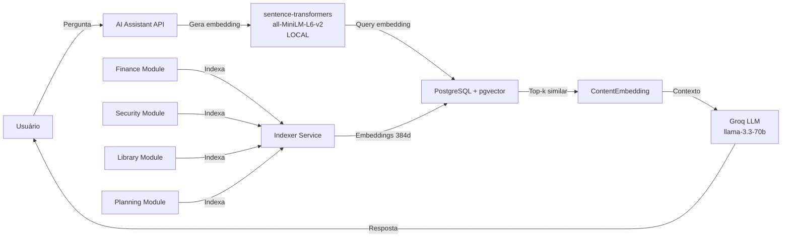
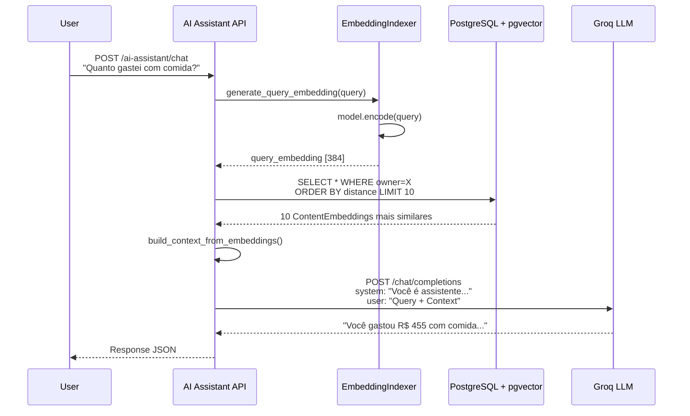

# pgvector - Busca Vetorial Semântica

> Documentação completa da extensão pgvector para busca semântica com embeddings locais

## Índice

- [Visão Geral](#visão-geral)
- [Instalação e Configuração](#instalação-e-configuração)
- [Modelo ContentEmbedding](#modelo-contentembedding)
- [Geração de Embeddings](#geração-de-embeddings)
- [Busca Vetorial](#busca-vetorial)
- [Índices Vetoriais](#índices-vetoriais)
- [Integração com AI Assistant](#integração-com-ai-assistant)
- [Performance e Otimização](#performance-e-otimização)
- [Troubleshooting](#troubleshooting)

---

## Visão Geral

### O que é pgvector?

pgvector é uma extensão open-source do PostgreSQL que adiciona suporte nativo para:
- Armazenamento de vetores (arrays de floats)
- Operações de similaridade (cosine, L2, inner product)
- Índices otimizados para busca aproximada (IVFFlat, HNSW)

### Por que pgvector no MindLedger?

O MindLedger usa pgvector para implementar RAG (Retrieval Augmented Generation) que permite:

1. **Busca semântica**: Encontrar despesas/livros/tarefas por significado, não apenas palavras-chave
2. **Contexto para LLM**: Enviar informações relevantes para Groq gerar respostas precisas
3. **Multi-módulo**: Buscar simultaneamente em Finance, Security, Library, Planning
4. **Privacidade**: Embeddings gerados localmente (sentence-transformers), não em APIs externas

### Arquitetura do Sistema



### Características Técnicas

- **Dimensões**: 384 (modelo all-MiniLM-L6-v2)
- **Métrica**: Cosine similarity (padrão para text embeddings)
- **Volume esperado**: ~10k embeddings por usuário
- **Latência**: ~5-20ms por query (com índice IVFFlat)
- **Custo**: ZERO (embeddings locais, Groq free tier)

---

## Instalação e Configuração

### 1. Instalar Extensão pgvector

#### Docker (Recomendado)

```yaml
# docker-compose.yml
services:
  db:
    image: pgvector/pgvector:pg14
    # OU use imagem oficial com extensão manualmente:
    # image: postgres:14
    # volumes:
    #   - ./init.sql:/docker-entrypoint-initdb.d/init.sql
```

#### Ubuntu/Debian

```bash
# Adicionar repositório PostgreSQL
sudo apt install postgresql-14 postgresql-14-pgvector

# Ou compilar do source
git clone --branch v0.5.1 https://github.com/pgvector/pgvector.git
cd pgvector
make
sudo make install
```

#### macOS

```bash
brew install pgvector
```

---

### 2. Habilitar Extensão no Banco

```sql
-- Conectar ao banco MindLedger
\c mindledger_db

-- Habilitar extensão
CREATE EXTENSION IF NOT EXISTS vector;

-- Verificar instalação
SELECT * FROM pg_extension WHERE extname = 'vector';
```

**Output Esperado**:
```
 extname | extversion | extrelocatable | extnamespace
---------+------------+----------------+--------------
 vector  | 0.5.1      | f              |         2200
```

---

### 3. Configurar Django

#### Instalar Pacote Python

```bash
pip install pgvector
```

**Versões**:
- `pgvector>=0.2.4` (Python package)
- PostgreSQL 12+ com extensão pgvector 0.5+

#### settings.py

```python
INSTALLED_APPS = [
    # ...
    'pgvector',
    'ai_assistant',
]

# PostgreSQL com pgvector
DATABASES = {
    'default': {
        'ENGINE': 'django.db.backends.postgresql',
        'NAME': 'mindledger_db',
        'USER': os.getenv('DB_USER'),
        'PASSWORD': os.getenv('DB_PASSWORD'),
        'HOST': os.getenv('DB_HOST', 'db'),
        'PORT': os.getenv('DB_PORT', '5432'),
    }
}
```

---

### 4. Criar Migration Inicial

```python
# ai_assistant/migrations/0001_initial.py
from django.db import migrations
import pgvector.django

class Migration(migrations.Migration):
    operations = [
        migrations.RunSQL('CREATE EXTENSION IF NOT EXISTS vector'),
        migrations.CreateModel(
            name='ContentEmbedding',
            fields=[
                # ... outros campos ...
                ('embedding', pgvector.django.VectorField(
                    dimensions=384,
                    null=True,
                    blank=True
                )),
            ],
        ),
    ]
```

**Executar**:
```bash
docker-compose exec api python manage.py migrate ai_assistant
```

---

## Modelo ContentEmbedding

### Definição Completa

```python
from django.db import models
from django.contrib.postgres.fields import ArrayField
from pgvector.django import VectorField
from app.models import BaseModel

class ContentEmbedding(BaseModel):
    """
    Armazena embeddings de conteúdo para busca semântica RAG.
    """

    # Identificação do conteúdo original
    content_type = models.CharField(
        max_length=100,
        verbose_name='Tipo de Entidade',
        help_text='expense, book, password, goal, etc.',
        db_index=True
    )
    content_id = models.PositiveIntegerField(
        verbose_name='ID da Entidade'
    )

    # Classificação para filtros
    tipo = models.CharField(
        max_length=20,
        choices=TipoConteudo.choices,  # planejamento, seguranca, financeiro, leitura
        db_index=True
    )
    sensibilidade = models.CharField(
        max_length=10,
        choices=Sensibilidade.choices,  # baixa, media, alta
        default=Sensibilidade.BAIXA,
        db_index=True
    )
    tags = ArrayField(
        models.CharField(max_length=50),
        default=list,
        blank=True
    )

    # Data de referência (para filtros temporais)
    data_referencia = models.DateField(
        null=True,
        blank=True,
        db_index=True
    )

    # Conteúdo textual
    texto_original = models.TextField(
        verbose_name='Texto para Display',
        help_text='Texto legível para mostrar ao usuário'
    )
    texto_busca = models.TextField(
        verbose_name='Texto para Embedding',
        help_text='Texto otimizado para geração de embedding'
    )

    # VETOR 384 DIMENSÕES (pgvector)
    embedding = VectorField(
        dimensions=384,
        null=True,
        blank=True
    )

    # Metadados adicionais (JSON flexível)
    metadata = models.JSONField(
        default=dict,
        blank=True,
        help_text='Dados específicos por tipo de conteúdo'
    )

    # Proprietário
    owner = models.ForeignKey(
        'members.Member',
        on_delete=models.CASCADE,
        related_name='content_embeddings'
    )

    # Status de indexação
    is_indexed = models.BooleanField(
        default=False,
        db_index=True
    )
    indexed_at = models.DateTimeField(null=True, blank=True)
    embedding_model = models.CharField(
        max_length=100,
        default='all-MiniLM-L6-v2'
    )

    class Meta:
        unique_together = [['content_type', 'content_id', 'owner']]
        indexes = [
            models.Index(fields=['owner', 'tipo']),
            models.Index(fields=['owner', 'sensibilidade']),
            models.Index(fields=['owner', 'is_indexed']),
            models.Index(fields=['content_type', 'content_id']),
            models.Index(fields=['owner', '-data_referencia']),
        ]
```

---

### Choices Enums

```python
class TipoConteudo(models.TextChoices):
    """Módulo de origem do conteúdo."""
    PLANEJAMENTO = 'planejamento', 'Planejamento Pessoal'
    SEGURANCA = 'seguranca', 'Seguranca'
    FINANCEIRO = 'financeiro', 'Financeiro'
    LEITURA = 'leitura', 'Leitura/Biblioteca'

class Sensibilidade(models.TextChoices):
    """
    Nível de sensibilidade para roteamento de LLM.

    ALTA: Dados NUNCA podem sair da infraestrutura local (apenas Ollama)
    MEDIA: Preferir local, mas pode usar cloud para queries complexas
    BAIXA: Pode ser processado por qualquer LLM provider
    """
    BAIXA = 'baixa', 'Baixa'
    MEDIA = 'media', 'Media'
    ALTA = 'alta', 'Alta'
```

---

### Mapeamento de Sensibilidade

```python
# ai_assistant/models.py
CONTENT_SENSITIVITY_MAP = {
    # Security - ALTA (nunca enviar para cloud)
    'password': Sensibilidade.ALTA,
    'storedcreditcard': Sensibilidade.ALTA,
    'storedbankaccount': Sensibilidade.ALTA,
    'archive': Sensibilidade.MEDIA,  # Depende do conteúdo

    # Finance - MEDIA/BAIXA
    'account': Sensibilidade.MEDIA,       # Informações de saldo
    'creditcard': Sensibilidade.MEDIA,    # Limites de crédito
    'expense': Sensibilidade.BAIXA,       # Histórico de transações
    'revenue': Sensibilidade.BAIXA,       # Histórico de receitas
    'transfer': Sensibilidade.BAIXA,
    'loan': Sensibilidade.MEDIA,
    'creditcardexpense': Sensibilidade.BAIXA,

    # Library - BAIXA (dados não sensíveis)
    'book': Sensibilidade.BAIXA,
    'summary': Sensibilidade.BAIXA,
    'reading': Sensibilidade.BAIXA,

    # Planning - BAIXA/MEDIA
    'routinetask': Sensibilidade.BAIXA,
    'goal': Sensibilidade.BAIXA,
    'dailyreflection': Sensibilidade.MEDIA,  # Pensamentos pessoais
}
```

---

## Geração de Embeddings

### 1. Modelo all-MiniLM-L6-v2

O MindLedger usa o modelo **all-MiniLM-L6-v2** da biblioteca sentence-transformers:

**Características**:
- **384 dimensões** (menor que BERT-768, mais rápido)
- **~80MB** de tamanho (download automático na primeira execução)
- **~5x mais rápido** que modelos maiores
- **Multilíngue**: Suporta português, inglês, espanhol, etc.
- **Normalizado**: Embeddings já vêm normalizados (norma L2 = 1)
- **GRATUITO e LOCAL**: Nenhuma API key necessária

**Performance**:
- Embed 1 texto: ~10-20ms (CPU)
- Embed 100 textos (batch): ~100-200ms (CPU)
- Embed 1 texto: ~2-5ms (GPU - se disponível)

---

### 2. Instalação de Dependências

```bash
# requirements.txt
sentence-transformers>=2.2.0
torch>=2.0.0  # PyTorch (backend)
```

**Primeiro uso**:
```python
from sentence_transformers import SentenceTransformer

# Download automático (~80MB)
model = SentenceTransformer('sentence-transformers/all-MiniLM-L6-v2')
```

Modelo é salvo em `~/.cache/torch/sentence_transformers/`.

---

### 3. Serviço de Indexação

```python
# ai_assistant/services/indexer.py
from sentence_transformers import SentenceTransformer
from ai_assistant.models import ContentEmbedding, CONTENT_SENSITIVITY_MAP, CONTENT_TYPE_MAP
from django.utils import timezone

class EmbeddingIndexer:
    """
    Serviço para gerar embeddings localmente com sentence-transformers.
    """

    def __init__(self):
        # Carregar modelo (cache automático após primeira vez)
        self.model = SentenceTransformer('sentence-transformers/all-MiniLM-L6-v2')

    def index_content(self, content_type: str, content_id: int, owner,
                     texto_busca: str, texto_original: str,
                     data_referencia=None, metadata=None):
        """
        Cria ou atualiza embedding para um conteúdo.

        Parameters
        ----------
        content_type : str
            Tipo da entidade (expense, book, password, etc.)
        content_id : int
            ID da entidade
        owner : Member
            Proprietário do conteúdo
        texto_busca : str
            Texto otimizado para geração de embedding
        texto_original : str
            Texto legível para display
        data_referencia : date, optional
            Data de referência (expense.date, reading.reading_date, etc.)
        metadata : dict, optional
            Metadados adicionais específicos do tipo
        """
        # Gerar embedding localmente (384 dims)
        embedding = self.model.encode(texto_busca, normalize_embeddings=True)

        # Determinar tipo e sensibilidade automaticamente
        tipo = CONTENT_TYPE_MAP.get(content_type.lower(), 'financeiro')
        sensibilidade = CONTENT_SENSITIVITY_MAP.get(content_type.lower(), 'baixa')

        # Criar ou atualizar
        content_embedding, created = ContentEmbedding.objects.update_or_create(
            content_type=content_type.lower(),
            content_id=content_id,
            owner=owner,
            defaults={
                'tipo': tipo,
                'sensibilidade': sensibilidade,
                'texto_busca': texto_busca,
                'texto_original': texto_original,
                'data_referencia': data_referencia,
                'metadata': metadata or {},
                'embedding': embedding.tolist(),  # Converter numpy array para list
                'is_indexed': True,
                'indexed_at': timezone.now(),
                'embedding_model': 'all-MiniLM-L6-v2'
            }
        )

        return content_embedding

    def index_expense(self, expense):
        """Indexa uma despesa."""
        texto_busca = f"""
        Despesa: {expense.description}
        Categoria: {expense.get_category_display()}
        Valor: R$ {expense.value}
        Data: {expense.date.strftime('%d/%m/%Y')}
        Conta: {expense.account.account_name}
        {'Pago' if expense.payed else 'Pendente'}
        """

        texto_original = (
            f"{expense.description} - R$ {expense.value} "
            f"({expense.get_category_display()}) em {expense.date.strftime('%d/%m/%Y')}"
        )

        metadata = {
            'value': float(expense.value),
            'category': expense.category,
            'payed': expense.payed,
            'account_name': expense.account.account_name
        }

        return self.index_content(
            content_type='expense',
            content_id=expense.id,
            owner=expense.account.owner,
            texto_busca=texto_busca.strip(),
            texto_original=texto_original,
            data_referencia=expense.date,
            metadata=metadata
        )

    def index_book(self, book):
        """Indexa um livro."""
        authors = ", ".join(author.name for author in book.authors.all())

        texto_busca = f"""
        Livro: {book.title}
        Autor(es): {authors}
        Gênero: {book.get_genre_display()}
        Sinopse: {book.synopsis[:500]}
        """

        texto_original = f"{book.title} por {authors}"

        metadata = {
            'genre': book.genre,
            'rating': book.rating,
            'read_status': book.read_status,
            'authors': authors
        }

        return self.index_content(
            content_type='book',
            content_id=book.id,
            owner=book.owner,
            texto_busca=texto_busca.strip(),
            texto_original=texto_original,
            data_referencia=book.publish_date,
            metadata=metadata
        )

    def index_goal(self, goal):
        """Indexa um objetivo."""
        texto_busca = f"""
        Objetivo: {goal.title}
        Descrição: {goal.description}
        Tipo: {goal.get_goal_type_display()}
        Progresso: {goal.current_value}/{goal.target_value}
        Status: {goal.get_status_display()}
        """

        texto_original = (
            f"{goal.title} - {goal.current_value}/{goal.target_value} "
            f"({goal.get_status_display()})"
        )

        metadata = {
            'goal_type': goal.goal_type,
            'status': goal.status,
            'progress_percentage': goal.progress_percentage
        }

        return self.index_content(
            content_type='goal',
            content_id=goal.id,
            owner=goal.owner,
            texto_busca=texto_busca.strip(),
            texto_original=texto_original,
            data_referencia=goal.start_date,
            metadata=metadata
        )

    def batch_index(self, items, index_func):
        """
        Indexa múltiplos itens em batch para melhor performance.

        Parameters
        ----------
        items : QuerySet or list
            Lista de objetos para indexar
        index_func : callable
            Função de indexação (index_expense, index_book, etc.)
        """
        results = []
        for item in items:
            try:
                result = index_func(item)
                results.append(result)
            except Exception as e:
                print(f"Erro ao indexar {item}: {e}")
        return results
```

---

### 4. Uso em Signals (Auto-indexação)

```python
# expenses/signals.py
from django.db.models.signals import post_save, post_delete
from django.dispatch import receiver
from expenses.models import Expense
from ai_assistant.services.indexer import EmbeddingIndexer

indexer = EmbeddingIndexer()

@receiver(post_save, sender=Expense)
def index_expense_on_save(sender, instance, created, **kwargs):
    """Indexa despesa automaticamente ao criar/atualizar."""
    if not instance.is_deleted:
        indexer.index_expense(instance)

@receiver(post_delete, sender=Expense)
def delete_embedding_on_delete(sender, instance, **kwargs):
    """Remove embedding ao deletar despesa."""
    ContentEmbedding.objects.filter(
        content_type='expense',
        content_id=instance.id,
        owner=instance.account.owner
    ).delete()
```

**Ativar signals**:
```python
# expenses/apps.py
class ExpensesConfig(AppConfig):
    name = 'expenses'

    def ready(self):
        import expenses.signals  # noqa
```

---

### 5. Management Command para Reindexação

```python
# ai_assistant/management/commands/reindex_embeddings.py
from django.core.management.base import BaseCommand
from ai_assistant.services.indexer import EmbeddingIndexer
from expenses.models import Expense
from library.models import Book
from personal_planning.models import Goal

class Command(BaseCommand):
    help = 'Reindexa todos os embeddings'

    def add_arguments(self, parser):
        parser.add_argument('--module', type=str, help='Módulo específico (finance, library, planning)')
        parser.add_argument('--owner', type=int, help='ID do membro')

    def handle(self, *args, **options):
        indexer = EmbeddingIndexer()

        # Filtros
        filters = {}
        if options['owner']:
            filters['owner_id'] = options['owner']

        # Indexar por módulo
        if not options['module'] or options['module'] == 'finance':
            self.stdout.write('Indexando despesas...')
            expenses = Expense.objects.filter(is_deleted=False, **filters)
            indexer.batch_index(expenses, indexer.index_expense)
            self.stdout.write(self.style.SUCCESS(f'✓ {expenses.count()} despesas'))

        if not options['module'] or options['module'] == 'library':
            self.stdout.write('Indexando livros...')
            books = Book.objects.filter(is_deleted=False, **filters).prefetch_related('authors')
            indexer.batch_index(books, indexer.index_book)
            self.stdout.write(self.style.SUCCESS(f'✓ {books.count()} livros'))

        if not options['module'] or options['module'] == 'planning':
            self.stdout.write('Indexando objetivos...')
            goals = Goal.objects.filter(is_deleted=False, **filters)
            indexer.batch_index(goals, indexer.index_goal)
            self.stdout.write(self.style.SUCCESS(f'✓ {goals.count()} objetivos'))

        self.stdout.write(self.style.SUCCESS('✓ Reindexação concluída!'))
```

**Uso**:
```bash
# Reindexar tudo
docker-compose exec api python manage.py reindex_embeddings

# Apenas finanças
docker-compose exec api python manage.py reindex_embeddings --module finance

# Apenas um usuário
docker-compose exec api python manage.py reindex_embeddings --owner 1
```

---

## Busca Vetorial

### 1. Query com pgvector

```python
from pgvector.django import CosineDistance
from ai_assistant.models import ContentEmbedding
from sentence_transformers import SentenceTransformer

# Carregar modelo
model = SentenceTransformer('sentence-transformers/all-MiniLM-L6-v2')

# Pergunta do usuário
query = "Quanto gastei com comida este mês?"

# Gerar embedding da query (local, ~10ms)
query_embedding = model.encode(query, normalize_embeddings=True)

# Buscar os 10 mais similares
results = ContentEmbedding.objects.filter(
    owner=member,
    tipo='financeiro',
    is_indexed=True
).annotate(
    distance=CosineDistance('embedding', query_embedding)
).order_by('distance')[:10]

# Acessar resultados
for result in results:
    print(f"{result.texto_original} - Distance: {result.distance:.4f}")
```

**Output Exemplo**:
```
Supermercado Dia - R$ 250.00 (Supermercado) - Distance: 0.1234
Restaurante Outback - R$ 120.00 (Comida e bebida) - Distance: 0.1567
Ifood - Pizza - R$ 85.00 (Comida e bebida) - Distance: 0.1789
...
```

---

### 2. Operadores de Distância

pgvector fornece 3 operadores:

```python
from pgvector.django import CosineDistance, L2Distance, MaxInnerProduct

# 1. Cosine Distance (0 = idêntico, 2 = oposto)
# Recomendado para embeddings NORMALIZADOS
.annotate(distance=CosineDistance('embedding', query_embedding))

# 2. L2 Distance (Euclidean)
# Útil para embeddings NÃO normalizados
.annotate(distance=L2Distance('embedding', query_embedding))

# 3. Negative Inner Product (dot product invertido)
# Para MaxInnerProduct, menor distance = mais similar
.annotate(distance=MaxInnerProduct('embedding', query_embedding))
```

**Recomendação**: Use `CosineDistance` para all-MiniLM-L6-v2 (já normalizado).

---

### 3. Filtros Combinados

```python
# Exemplo: Busca em despesas de alimentação nos últimos 30 dias
from datetime import date, timedelta

thirty_days_ago = date.today() - timedelta(days=30)

results = ContentEmbedding.objects.filter(
    owner=member,
    tipo='financeiro',
    content_type='expense',
    is_indexed=True,
    data_referencia__gte=thirty_days_ago
).annotate(
    distance=CosineDistance('embedding', query_embedding)
).order_by('distance')[:10]
```

**Performance**:
- Filtro por índices B-tree primeiro (owner, tipo, data)
- Depois busca vetorial no subset filtrado
- ~5-20ms para 10k embeddings com filtros

---

### 4. Threshold de Similaridade

```python
# Filtrar apenas resultados suficientemente similares
SIMILARITY_THRESHOLD = 0.3  # Ajustar conforme necessário

results = ContentEmbedding.objects.filter(
    owner=member,
    is_indexed=True
).annotate(
    distance=CosineDistance('embedding', query_embedding)
).filter(
    distance__lte=SIMILARITY_THRESHOLD  # Apenas se distance <= 0.3
).order_by('distance')[:10]
```

**Dica**: Cosine distance varia de 0 (idêntico) a 2 (oposto). Para embeddings normalizados, valores típicos:
- 0.0 - 0.2: Muito similar
- 0.2 - 0.5: Similar
- 0.5 - 1.0: Relacionado
- 1.0+: Não relacionado

---

## Índices Vetoriais

### 1. Quando Criar Índices

**Sem Índice** (busca exata):
- Rápido para < 1k vetores (~10ms)
- Lento para > 10k vetores (~500ms)

**Com Índice** (busca aproximada):
- Rápido para qualquer volume (~5-20ms)
- Recall ~90-99% (não 100% exato)

**Recomendação**: Criar índice quando tiver > 5k embeddings.

---

### 2. IVFFlat (Recomendado para MindLedger)

Índice baseado em clustering (k-means):

```sql
-- Conectar ao banco
docker-compose exec db psql -U $DB_USER mindledger_db

-- Criar índice IVFFlat para cosine similarity
CREATE INDEX idx_contentembedding_cosine ON ai_assistant_contentembedding
USING ivfflat (embedding vector_cosine_ops)
WITH (lists = 100);
```

**Parâmetros**:
- `lists`: Número de clusters (tipicamente `sqrt(num_rows)`)
  - 10k rows → lists=100
  - 100k rows → lists=316
  - 1M rows → lists=1000

**Configuração em Runtime**:
```sql
-- Quantos clusters buscar (padrão: 1, recomendado: 10)
SET ivfflat.probes = 10;
```

Mais probes = melhor recall, mas mais lento:
- probes=1: ~90% recall, ~5ms
- probes=10: ~95% recall, ~15ms
- probes=50: ~99% recall, ~50ms

**Criar Índice em Migration**:

```python
# ai_assistant/migrations/0003_create_ivfflat_index.py
from django.db import migrations

class Migration(migrations.Migration):
    dependencies = [
        ('ai_assistant', '0002_change_embedding_dimensions_to_384'),
    ]

    operations = [
        migrations.RunSQL(
            sql="""
            CREATE INDEX IF NOT EXISTS idx_contentembedding_cosine
            ON ai_assistant_contentembedding
            USING ivfflat (embedding vector_cosine_ops)
            WITH (lists = 100);
            """,
            reverse_sql="DROP INDEX IF EXISTS idx_contentembedding_cosine;"
        ),
        migrations.RunSQL(
            sql="SET ivfflat.probes = 10;",
            reverse_sql="SET ivfflat.probes = 1;"
        )
    ]
```

---

### 3. HNSW (Para Datasets Grandes)

Índice baseado em grafos (alternativa mais rápida para > 1M vetores):

```sql
-- Criar índice HNSW
CREATE INDEX idx_contentembedding_hnsw ON ai_assistant_contentembedding
USING hnsw (embedding vector_cosine_ops)
WITH (m = 16, ef_construction = 64);
```

**Parâmetros**:
- `m`: Conexões por nó (16-64, default=16)
- `ef_construction`: Expansão na construção (64-200, default=64)

**Configuração em Runtime**:
```sql
-- Qualidade de busca (padrão: 40, recomendado: 40-100)
SET hnsw.ef_search = 100;
```

**Trade-offs**:
- ✅ Mais rápido que IVFFlat para > 1M vetores
- ✅ Melhor recall (~99%)
- ❌ Consome mais memória (~10x IVFFlat)
- ❌ Construção mais lenta

**Recomendação MindLedger**: Usar IVFFlat (datasets pequenos por usuário).

---

### 4. Comparação de Performance

Dataset: 10k embeddings, query: top-10

| Método        | Tempo | Recall | Memória |
|---------------|-------|--------|---------|
| Sem índice    | 200ms | 100%   | 0 MB    |
| IVFFlat (probes=1) | 8ms | 90%    | 2 MB    |
| IVFFlat (probes=10) | 15ms | 95%   | 2 MB    |
| HNSW (ef=40)  | 5ms   | 97%    | 20 MB   |
| HNSW (ef=100) | 10ms  | 99%    | 20 MB   |

---

## Integração com AI Assistant

### 1. Fluxo Completo



---

### 2. Construção de Contexto

```python
# ai_assistant/services/rag.py
from sentence_transformers import SentenceTransformer
from pgvector.django import CosineDistance
from ai_assistant.models import ContentEmbedding

class RAGService:
    def __init__(self):
        self.model = SentenceTransformer('sentence-transformers/all-MiniLM-L6-v2')

    def search(self, query: str, owner, tipo=None, top_k=10, threshold=0.5):
        """
        Busca semântica com filtros.

        Parameters
        ----------
        query : str
            Pergunta do usuário
        owner : Member
            Proprietário dos dados
        tipo : str, optional
            Filtrar por tipo ('financeiro', 'leitura', etc.)
        top_k : int
            Número de resultados
        threshold : float
            Distance máximo (0-2)

        Returns
        -------
        list[ContentEmbedding]
            Resultados ordenados por similaridade
        """
        # Gerar embedding da query
        query_embedding = self.model.encode(query, normalize_embeddings=True)

        # Query base
        qs = ContentEmbedding.objects.filter(
            owner=owner,
            is_indexed=True
        )

        # Filtro opcional por tipo
        if tipo:
            qs = qs.filter(tipo=tipo)

        # Busca vetorial
        results = qs.annotate(
            distance=CosineDistance('embedding', query_embedding)
        ).filter(
            distance__lte=threshold
        ).order_by('distance')[:top_k]

        return list(results)

    def build_context(self, results):
        """
        Constrói contexto textual a partir dos resultados.

        Parameters
        ----------
        results : list[ContentEmbedding]
            Resultados da busca semântica

        Returns
        -------
        str
            Contexto formatado para o LLM
        """
        if not results:
            return "Nenhum dado relevante encontrado."

        context_parts = []
        for i, result in enumerate(results, 1):
            context_parts.append(
                f"{i}. [{result.get_tipo_display()}] {result.texto_original}\n"
                f"   Relevância: {(1 - result.distance) * 100:.1f}%\n"
            )

        return "\n".join(context_parts)
```

---

### 3. Endpoint de Chat

```python
# ai_assistant/views.py
from rest_framework.decorators import api_view, permission_classes
from rest_framework.permissions import IsAuthenticated
from rest_framework.response import Response
from ai_assistant.services.rag import RAGService
import requests
import os

rag_service = RAGService()

@api_view(['POST'])
@permission_classes([IsAuthenticated])
def chat(request):
    """
    Endpoint de chat com RAG.

    POST /api/v1/ai-assistant/chat/
    Body: {
        "query": "Quanto gastei com comida este mês?",
        "tipo": "financeiro",  // opcional
        "top_k": 10  // opcional
    }
    """
    query = request.data.get('query')
    tipo = request.data.get('tipo')
    top_k = request.data.get('top_k', 10)

    if not query:
        return Response({'error': 'Query obrigatória'}, status=400)

    # Busca semântica
    member = request.user.member
    results = rag_service.search(query, member, tipo=tipo, top_k=top_k)

    # Construir contexto
    context = rag_service.build_context(results)

    # Chamar Groq LLM
    groq_response = requests.post(
        'https://api.groq.com/openai/v1/chat/completions',
        headers={
            'Authorization': f"Bearer {os.getenv('GROQ_API_KEY')}",
            'Content-Type': 'application/json'
        },
        json={
            'model': 'llama-3.3-70b-versatile',
            'messages': [
                {
                    'role': 'system',
                    'content': 'Você é um assistente financeiro pessoal. Use apenas as informações fornecidas no contexto.'
                },
                {
                    'role': 'user',
                    'content': f"Contexto:\n{context}\n\nPergunta: {query}"
                }
            ],
            'temperature': 0.7,
            'max_tokens': 500
        },
        timeout=30
    )

    if groq_response.status_code != 200:
        return Response({'error': 'Erro ao chamar Groq'}, status=500)

    llm_answer = groq_response.json()['choices'][0]['message']['content']

    return Response({
        'query': query,
        'answer': llm_answer,
        'context_used': len(results),
        'sources': [
            {
                'type': r.content_type,
                'text': r.texto_original,
                'relevance': round((1 - r.distance) * 100, 1)
            }
            for r in results
        ]
    })
```

---

## Performance e Otimização

### 1. Benchmarks Típicos

**Hardware**: CPU Intel i7, 16GB RAM, SSD

| Operação                          | Tempo    |
|-----------------------------------|----------|
| Encode 1 texto (CPU)              | 10-20ms  |
| Encode 100 textos batch (CPU)     | 100-200ms |
| Query top-10 (10k rows, sem índice)| 200ms    |
| Query top-10 (10k rows, IVFFlat)  | 5-15ms   |
| Query top-10 (100k rows, HNSW)    | 10-20ms  |

---

### 2. Otimizações

#### Filtrar ANTES da Busca Vetorial

```python
# ✅ Bom: Filtrar por índices B-tree primeiro
ContentEmbedding.objects.filter(
    owner=member,              # Índice: (owner, tipo)
    tipo='financeiro',         # Reduz dataset drasticamente
    data_referencia__gte=start # Índice: (owner, -data_referencia)
).annotate(
    distance=CosineDistance('embedding', query_embedding)
).order_by('distance')[:10]

# ❌ Ruim: Busca vetorial em dataset inteiro
ContentEmbedding.objects.annotate(
    distance=CosineDistance('embedding', query_embedding)
).filter(owner=member).order_by('distance')[:10]
```

---

#### Batch Encoding

```python
# ✅ Bom: Encode múltiplos textos em batch
texts = [expense.description for expense in expenses]
embeddings = model.encode(texts, batch_size=32, show_progress_bar=False)

for expense, embedding in zip(expenses, embeddings):
    ContentEmbedding.objects.create(
        content_type='expense',
        content_id=expense.id,
        embedding=embedding.tolist(),
        ...
    )

# ❌ Ruim: Encode um por um
for expense in expenses:
    embedding = model.encode(expense.description)  # Muito lento!
```

---

#### Cache do Modelo

```python
# ✅ Singleton pattern
class EmbeddingIndexer:
    _model = None

    @property
    def model(self):
        if self._model is None:
            self._model = SentenceTransformer('sentence-transformers/all-MiniLM-L6-v2')
        return self._model
```

---

#### Normalização de Embeddings

```python
# Sempre normalizar embeddings (all-MiniLM-L6-v2 já faz isso automaticamente)
embedding = model.encode(text, normalize_embeddings=True)
```

---

### 3. Monitoramento

```python
# Middleware para logar tempo de queries
import time
from django.db import connection

class QueryTimeMiddleware:
    def __call__(self, request):
        queries_before = len(connection.queries)
        start_time = time.time()

        response = self.get_response(request)

        total_time = time.time() - start_time
        num_queries = len(connection.queries) - queries_before

        if '/ai-assistant/' in request.path:
            print(f"⏱️  RAG query: {total_time:.3f}s - {num_queries} queries")

        return response
```

---

## Troubleshooting

### Problema 1: Extensão pgvector Não Encontrada

```
ERROR: type "vector" does not exist
```

**Solução**:
```sql
-- Verificar se extensão está instalada
SELECT * FROM pg_available_extensions WHERE name = 'vector';

-- Instalar extensão
CREATE EXTENSION IF NOT EXISTS vector;

-- Verificar versão
SELECT extversion FROM pg_extension WHERE extname = 'vector';
```

---

### Problema 2: Erro ao Criar Índice IVFFlat

```
ERROR: index method "ivfflat" does not exist
```

**Causa**: Extensão pgvector não está instalada no servidor PostgreSQL.

**Solução**: Use imagem Docker `pgvector/pgvector:pg14` ou instale manualmente.

---

### Problema 3: Query Lenta (> 500ms)

**Diagnóstico**:
```sql
EXPLAIN ANALYZE
SELECT *, embedding <=> '[0.1, 0.2, ...]' AS distance
FROM ai_assistant_contentembedding
WHERE owner_id = 1
ORDER BY distance
LIMIT 10;
```

**Soluções**:
- Criar índice IVFFlat/HNSW
- Filtrar por owner/tipo antes da busca vetorial
- Aumentar `ivfflat.probes` se recall for baixo

---

### Problema 4: Modelo sentence-transformers Não Baixa

```
OSError: Can't load model 'sentence-transformers/all-MiniLM-L6-v2'
```

**Causa**: Sem acesso à internet ou Hugging Face Hub bloqueado.

**Solução**:
```python
# Download manual
from sentence_transformers import SentenceTransformer

model = SentenceTransformer('sentence-transformers/all-MiniLM-L6-v2')
model.save('/path/to/local/model')

# Carregar de local
model = SentenceTransformer('/path/to/local/model')
```

---

### Problema 5: Embeddings com Dimensões Incorretas

```
ERROR: expected 384 dimensions, got 768
```

**Causa**: Modelo trocado após criar tabela.

**Solução**:
```sql
-- Recriar coluna com dimensões corretas
ALTER TABLE ai_assistant_contentembedding
DROP COLUMN embedding;

ALTER TABLE ai_assistant_contentembedding
ADD COLUMN embedding vector(384);

-- Reindexar tudo
docker-compose exec api python manage.py reindex_embeddings
```

---

### Problema 6: Recall Baixo (< 80%)

**Causa**: `ivfflat.probes` muito baixo.

**Solução**:
```sql
-- Aumentar probes (trade-off: velocidade vs recall)
SET ivfflat.probes = 20;  -- Default é 1
```

---

## Próximos Passos

- [Schema Completo](./schema.md)
- [Índices e Otimização](./indices-otimizacao.md)
- [Guia de Migrations](./migrations.md)

---

## Referências

- [pgvector GitHub](https://github.com/pgvector/pgvector)
- [sentence-transformers Docs](https://www.sbert.net/)
- [all-MiniLM-L6-v2 Model Card](https://huggingface.co/sentence-transformers/all-MiniLM-L6-v2)
- [Groq API Docs](https://console.groq.com/docs)

---

**Última Atualização**: 2026-01-12
**Versões**: pgvector 0.5+, sentence-transformers 2.2+, PostgreSQL 14+
