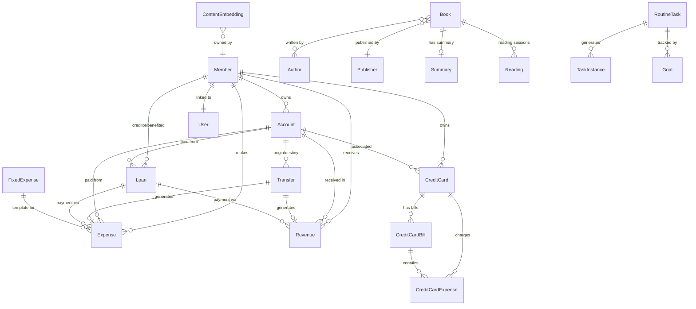
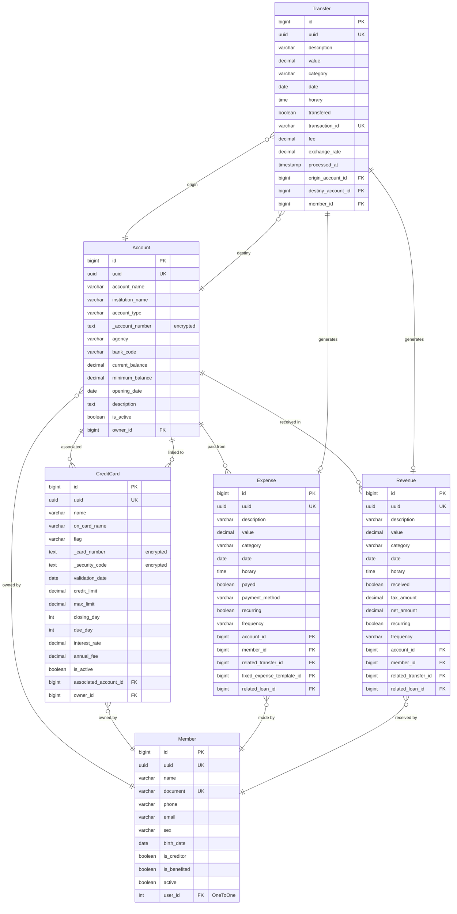
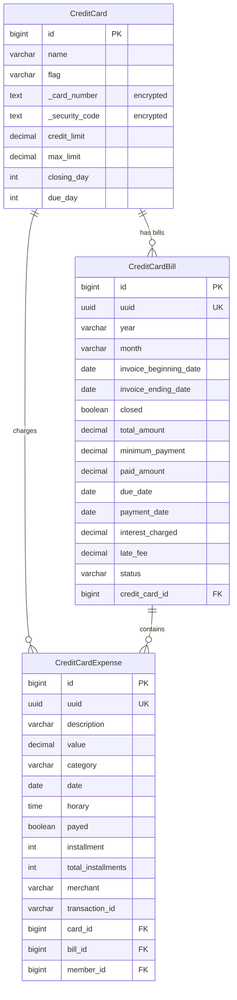
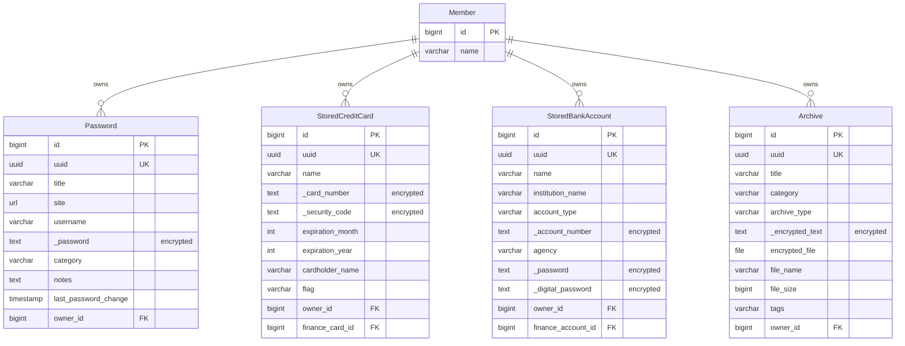
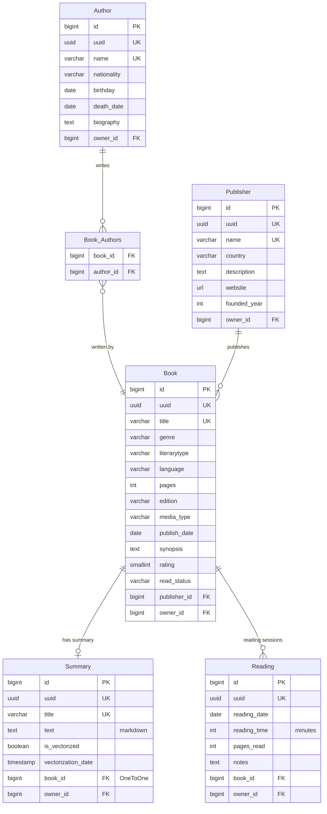
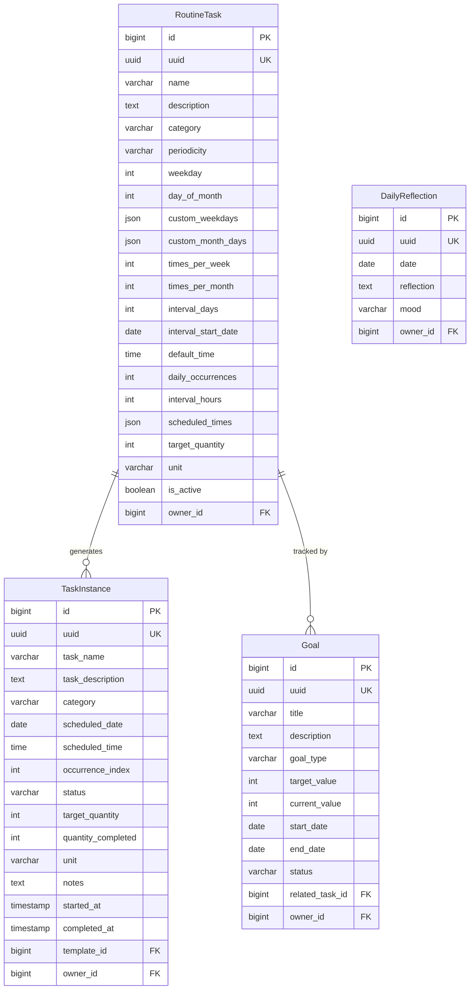
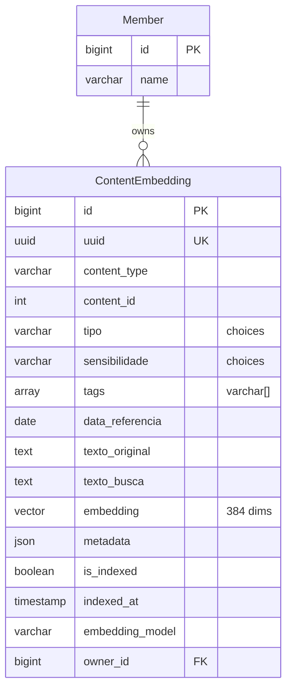

# Schema do Banco de Dados - MindLedger

> Documentação completa do schema do banco de dados PostgreSQL com pgvector

## Índice

- [Visão Geral](#visão-geral)
- [Modelo Base](#modelo-base)
- [Módulos Financeiros](#módulos-financeiros)
- [Módulo de Segurança](#módulo-de-segurança)
- [Módulo de Biblioteca](#módulo-de-biblioteca)
- [Módulo de Planejamento Pessoal](#módulo-de-planejamento-pessoal)
- [Módulo AI Assistant](#módulo-ai-assistant)
- [Relacionamentos](#relacionamentos)
- [Diagramas ER](#diagramas-er)

---

## Visão Geral

O MindLedger utiliza PostgreSQL com a extensão pgvector para armazenamento de dados financeiros, pessoais e vetoriais. Todos os modelos herdam de `BaseModel` que fornece campos comuns de auditoria e soft delete.

### Características Principais

- **Soft Delete**: Registros não são deletados fisicamente, apenas marcados com `is_deleted=True`
- **Auditoria**: Todos os registros rastreiam quem criou/modificou e quando
- **Criptografia**: Campos sensíveis são criptografados com Fernet (ENCRYPTION_KEY)
- **pgvector**: Suporte nativo para busca vetorial semântica (384 dimensões)
- **UUID**: Cada registro possui um UUID único além do ID

### Convenções

- Prefixo `_` para campos criptografados (ex: `_password`, `_card_number`)
- Campos `related_name` em português para ForeignKeys
- Choices em português com valores em inglês
- Timestamps UTC com Django timezone awareness

---

## Modelo Base

### BaseModel (Abstract)

Base abstrata para todos os modelos do sistema.

```python
class BaseModel(models.Model):
    # Identificação
    id: AutoField (PK)
    uuid: UUIDField (unique, auto-generated)

    # Auditoria temporal
    created_at: DateTimeField (auto_now_add)
    updated_at: DateTimeField (auto_now)

    # Auditoria de usuário
    created_by: ForeignKey(User, null=True)
    updated_by: ForeignKey(User, null=True)

    # Soft delete
    is_deleted: BooleanField (default=False)
    deleted_at: DateTimeField (null=True)
```

**Características**:
- Abstract=True (não cria tabela própria)
- Todos os modelos herdam estes campos automaticamente
- `related_name` usa padrão `%(class)s_created` e `%(class)s_updated`

---

## Módulos Financeiros

### 1. Accounts (Contas Bancárias)

**Tabela**: `accounts_account`

```python
class Account(BaseModel):
    # Identificação
    account_name: CharField(200) - Nome da conta
    institution_name: CharField(200) - choices ACCOUNT_NAMES
    account_type: CharField(100) - choices ACCOUNT_TYPES
    account_image: ImageField - Logo da instituição

    # Dados bancários (criptografados)
    _account_number: TextField (encrypted)
    agency: CharField(20)
    bank_code: CharField(10)

    # Saldos
    current_balance: Decimal(15,2) - Saldo atual
    minimum_balance: Decimal(15,2) - Saldo mínimo

    # Metadados
    opening_date: DateField
    description: TextField
    is_active: BooleanField
    owner: ForeignKey(Member)
```

**Choices**:
```python
ACCOUNT_TYPES = [
    ('CC', 'Conta Corrente'),
    ('CS', 'Conta Salário'),
    ('FG', 'Fundo de Garantia'),
    ('VA', 'Vale Alimentação')
]

ACCOUNT_NAMES = [
    ('NUB', 'Nubank'),
    ('SIC', 'Sicoob'),
    ('MPG', 'Mercado Pago'),
    ('IFB', 'Ifood Benefícios'),
    ('CEF', 'Caixa Econômica Federal')
]
```

**Properties**:
- `account_number`: Descriptografa `_account_number`
- `account_number_masked`: Retorna `****1234`

**Ordenação**: `-account_name`

---

### 2. Credit Cards (Cartões de Crédito)

**Tabela**: `credit_cards_creditcard`

```python
class CreditCard(BaseModel):
    # Identificação
    name: CharField(200)
    on_card_name: CharField(200)
    flag: CharField(200) - choices FLAGS

    # Dados sensíveis (criptografados)
    _card_number: TextField (encrypted)
    _security_code: TextField (encrypted, required)
    validation_date: DateField

    # Limites
    credit_limit: Decimal(10,2)
    max_limit: Decimal(10,2)

    # Financeiro
    closing_day: IntegerField - Dia de fechamento (1-31)
    due_day: IntegerField - Dia de vencimento (1-31)
    interest_rate: Decimal(5,2) - Taxa de juros %
    annual_fee: Decimal(10,2) - Anuidade

    # Relacionamentos
    associated_account: ForeignKey(Account)
    owner: ForeignKey(Member)

    # Status
    is_active: BooleanField
    notes: TextField
```

**Choices**:
```python
FLAGS = [
    ('MSC', 'Master Card'),
    ('VSA', 'Visa'),
    ('ELO', 'Elo'),
    ('EXP', 'American Express'),
    ('HCD', 'Hipercard')
]
```

**Properties**:
- `security_code`: Descriptografa CVV
- `card_number`: Descriptografa número completo
- `card_number_masked`: Retorna `****1234`

**Validações**:
- CVV deve ter 3 ou 4 dígitos
- Data de validade não pode ser no passado

---

### 3. Credit Card Bills (Faturas)

**Tabela**: `credit_cards_creditcardbill`

```python
class CreditCardBill(BaseModel):
    # Relacionamentos
    credit_card: ForeignKey(CreditCard)

    # Período
    year: CharField - choices YEARS
    month: CharField - choices MONTHS
    invoice_beginning_date: DateField
    invoice_ending_date: DateField

    # Valores
    total_amount: Decimal(10,2)
    minimum_payment: Decimal(10,2)
    paid_amount: Decimal(10,2)
    interest_charged: Decimal(10,2)
    late_fee: Decimal(10,2)

    # Datas
    due_date: DateField
    payment_date: DateField

    # Status
    closed: BooleanField
    status: CharField - choices BILL_STATUS_CHOICES
```

**Choices**:
```python
BILL_STATUS_CHOICES = [
    ('open', 'Aberta'),
    ('closed', 'Fechada'),
    ('paid', 'Paga'),
    ('overdue', 'Em atraso')
]
```

---

### 4. Credit Card Expenses (Despesas de Cartão)

**Tabela**: `credit_cards_creditcardexpense`

```python
class CreditCardExpense(BaseModel):
    # Descrição
    description: CharField(200)
    value: Decimal(10,2)
    category: CharField(200) - choices EXPENSES_CATEGORIES

    # Temporal
    date: DateField
    horary: TimeField

    # Relacionamentos
    card: ForeignKey(CreditCard)
    bill: ForeignKey(CreditCardBill, null=True)
    member: ForeignKey(Member, null=True)

    # Parcelamento
    installment: PositiveIntegerField - Parcela atual
    total_installments: IntegerField - Total de parcelas

    # Metadados
    merchant: CharField(200)
    transaction_id: CharField(100)
    location: CharField(200)
    notes: TextField
    receipt: FileField

    # Status
    payed: BooleanField
```

**Ordenação**: `-id`

---

### 5. Expenses (Despesas)

**Tabela**: `expenses_expense`

```python
class Expense(BaseModel):
    # Descrição
    description: CharField(100)
    value: Decimal(10,2)
    category: CharField(200) - choices EXPENSES_CATEGORIES

    # Temporal
    date: DateField
    horary: TimeField

    # Relacionamentos
    account: ForeignKey(Account)
    member: ForeignKey(Member, null=True)
    related_transfer: ForeignKey(Transfer, null=True, CASCADE)
    fixed_expense_template: ForeignKey(FixedExpense, null=True, SET_NULL)
    related_loan: ForeignKey(Loan, null=True, SET_NULL)

    # Metadados
    merchant: CharField(200)
    location: CharField(200)
    payment_method: CharField(20) - choices PAYMENT_METHOD_CHOICES
    notes: TextField
    receipt: FileField

    # Status
    payed: BooleanField

    # Recorrência
    recurring: BooleanField
    frequency: CharField(20) - choices PAYMENT_FREQUENCY_CHOICES
```

**Choices**:
```python
EXPENSES_CATEGORIES = [
    ('food and drink', 'Comida e bebida'),
    ('bills and services', 'Contas e serviços'),
    ('electronics', 'Eletrônicos'),
    ('family and friends', 'Amizades e Família'),
    ('pets', 'Animais de estimação'),
    ('digital signs', 'Assinaturas digitais'),
    ('house', 'Casa'),
    ('purchases', 'Compras'),
    ('donate', 'Doações'),
    ('education', 'Educação'),
    ('loans', 'Empréstimos'),
    ('entertainment', 'Entretenimento'),
    ('taxes', 'Impostos'),
    ('investments', 'Investimentos'),
    ('others', 'Outros'),
    ('vestuary', 'Roupas'),
    ('health and care', 'Saúde e cuidados pessoais'),
    ('professional services', 'Serviços profissionais'),
    ('supermarket', 'Supermercado'),
    ('rates', 'Taxas'),
    ('transport', 'Transporte'),
    ('travels', 'Viagens')
]
```

**Índices Compostos**:
```python
indexes = [
    Index(fields=['-date']),
    Index(fields=['category', 'date']),
    Index(fields=['account', 'date']),
    Index(fields=['payed', 'date']),
    Index(fields=['account', 'category']),
    Index(fields=['related_transfer']),
    Index(fields=['related_loan'])
]
```

**Ordenação**: `-date`

---

### 6. Fixed Expenses (Despesas Fixas)

**Tabela**: `expenses_fixedexpense`

```python
class FixedExpense(BaseModel):
    # Descrição
    description: CharField(200)
    default_value: Decimal(10,2)
    category: CharField(200) - choices EXPENSES_CATEGORIES

    # Relacionamentos
    account: ForeignKey(Account)
    member: ForeignKey(Member, null=True)

    # Agendamento
    due_day: PositiveIntegerField (1-31)
    payment_method: CharField(20)

    # Configuração
    is_active: BooleanField
    allow_value_edit: BooleanField
    last_generated_month: CharField(7) - Formato YYYY-MM

    # Metadados
    merchant: CharField(200)
    notes: TextField
```

**Índices Compostos**:
```python
indexes = [
    Index(fields=['account', 'is_active']),
    Index(fields=['due_day', 'is_active'])
]
```

**Ordenação**: `due_day`, `description`

---

### 7. Fixed Expense Generation Log

**Tabela**: `expenses_fixedexpensegenerationlog`

```python
class FixedExpenseGenerationLog(BaseModel):
    # Identificação
    month: CharField(7, unique=True) - Formato YYYY-MM

    # Auditoria
    generated_by: ForeignKey(User, null=True)
    total_generated: PositiveIntegerField
    fixed_expense_ids: JSONField - Lista de IDs
```

**Propósito**: Previne duplicação de despesas fixas por mês.

**Ordenação**: `-month`

---

### 8. Revenues (Receitas)

**Tabela**: `revenues_revenue`

```python
class Revenue(BaseModel):
    # Descrição
    description: CharField(200)
    value: Decimal(10,2)
    category: CharField(200) - choices REVENUES_CATEGORIES

    # Temporal
    date: DateField
    horary: TimeField

    # Relacionamentos
    account: ForeignKey(Account)
    member: ForeignKey(Member, null=True)
    related_transfer: ForeignKey(Transfer, null=True, CASCADE)
    related_loan: ForeignKey(Loan, null=True, SET_NULL)

    # Valores
    tax_amount: Decimal(10,2)
    net_amount: Decimal(10,2)

    # Metadados
    source: CharField(200)
    notes: TextField
    receipt: FileField

    # Status
    received: BooleanField

    # Recorrência
    recurring: BooleanField
    frequency: CharField(20) - choices PAYMENT_FREQUENCY_CHOICES
```

**Choices**:
```python
REVENUES_CATEGORIES = [
    ('deposit', 'Depósito'),
    ('award', 'Prêmio'),
    ('salary', 'Salário'),
    ('ticket', 'Vale'),
    ('income', 'Rendimentos'),
    ('refund', 'Reembolso'),
    ('cashback', 'Cashback'),
    ('transfer', 'Transferência Recebida'),
    ('received_loan', 'Empréstimo Recebido'),
    ('loan_devolution', 'Devolução de empréstimo')
]
```

**Auto-cálculo**: `net_amount = value - tax_amount` no save()

**Índices Compostos**:
```python
indexes = [
    Index(fields=['-date']),
    Index(fields=['category', 'date']),
    Index(fields=['account', 'date']),
    Index(fields=['received', 'date']),
    Index(fields=['account', 'category']),
    Index(fields=['related_transfer']),
    Index(fields=['related_loan'])
]
```

**Ordenação**: `-date`

---

### 9. Loans (Empréstimos)

**Tabela**: `loans_loan`

```python
class Loan(BaseModel):
    # Descrição
    description: CharField(200)
    value: Decimal(10,2)
    payed_value: Decimal(10,2)
    category: CharField(200) - choices EXPENSES_CATEGORIES

    # Temporal
    date: DateField
    horary: TimeField
    due_date: DateField

    # Relacionamentos (triplo: beneficiado, credor, avalista)
    account: ForeignKey(Account)
    benefited: ForeignKey(Member) - Quem recebe
    creditor: ForeignKey(Member) - Quem empresta
    guarantor: ForeignKey(Member, null=True) - Avalista

    # Financeiro
    interest_rate: Decimal(5,2)
    installments: IntegerField
    payment_frequency: CharField(20)
    late_fee: Decimal(10,2)

    # Metadados
    contract_document: FileField
    notes: TextField

    # Status
    payed: BooleanField
    status: CharField(20) - choices LOAN_STATUS_CHOICES
```

**Choices**:
```python
LOAN_STATUS_CHOICES = [
    ('active', 'Ativo'),
    ('paid', 'Quitado'),
    ('overdue', 'Em atraso'),
    ('cancelled', 'Cancelado')
]
```

**Validações**:
- `payed_value` não pode ser maior que `value`

**Ordenação**: `-date`

---

### 10. Transfers (Transferências)

**Tabela**: `transfers_transfer`

```python
class Transfer(BaseModel):
    # Descrição
    description: CharField(200)
    value: Decimal(10,2)
    category: CharField(200) - choices TRANSFER_CATEGORIES

    # Temporal
    date: DateField
    horary: TimeField
    processed_at: DateTimeField

    # Relacionamentos (origem -> destino)
    origin_account: ForeignKey(Account)
    destiny_account: ForeignKey(Account)
    member: ForeignKey(Member, null=True)

    # Financeiro
    fee: Decimal(10,2)
    exchange_rate: Decimal(10,6)

    # Metadados
    transaction_id: CharField(100, unique=True)
    confirmation_code: CharField(50)
    notes: TextField
    receipt: FileField

    # Status
    transfered: BooleanField
```

**Choices**:
```python
TRANSFER_CATEGORIES = [
    ('doc', 'DOC'),
    ('ted', 'TED'),
    ('pix', 'PIX')
]
```

**Validações**:
- `origin_account` deve ser diferente de `destiny_account`

**Efeitos Cascata**:
- Ao criar/processar transferência, gera automaticamente:
  - `Expense` na conta origem (`related_transfer`)
  - `Revenue` na conta destino (`related_transfer`)

**Ordenação**: `-id`

---

### 11. Members (Membros)

**Tabela**: `members_member`

```python
class Member(BaseModel):
    # Identificação
    name: CharField(200)
    document: CharField(200, unique=True)
    phone: CharField(200)
    email: CharField(200)
    sex: CharField - choices SEX_OPTION

    # Foto
    profile_photo: ImageField

    # Dados pessoais
    birth_date: DateField
    address: TextField
    emergency_contact: CharField(200)
    occupation: CharField(200)
    monthly_income: Decimal(10,2)

    # Relacionamentos
    user: OneToOneField(User, null=True) - Login do sistema

    # Flags para empréstimos
    is_creditor: BooleanField - Pode emprestar
    is_benefited: BooleanField - Pode receber empréstimo

    # Status
    active: BooleanField
    notes: TextField
```

**Choices**:
```python
SEX_OPTION = [
    ('M', 'Masculino'),
    ('F', 'Feminino')
]
```

**Properties**:
- `is_user`: Retorna True se vinculado a User
- `age`: Calcula idade a partir de `birth_date`

**Ordenação**: `name`

---

## Módulo de Segurança

### 1. Passwords (Senhas)

**Tabela**: `security_password`

```python
class Password(BaseModel):
    # Identificação
    title: CharField(200)
    site: URLField(500)
    category: CharField(100) - choices PASSWORD_CATEGORIES

    # Credenciais (criptografadas)
    username: CharField(200)
    _password: TextField (encrypted, required)

    # Metadados
    notes: TextField
    last_password_change: DateTimeField
    owner: ForeignKey(Member)
```

**Choices**:
```python
PASSWORD_CATEGORIES = [
    ('social', 'Redes Sociais'),
    ('email', 'E-mail'),
    ('banking', 'Bancário'),
    ('work', 'Trabalho'),
    ('entertainment', 'Entretenimento'),
    ('shopping', 'Compras'),
    ('streaming', 'Streaming'),
    ('gaming', 'Games'),
    ('other', 'Outro')
]
```

**Properties**:
- `password`: Descriptografa senha

**Ordenação**: `-created_at`

---

### 2. Stored Credit Cards (Cartões Armazenados)

**Tabela**: `security_storedcreditcard`

```python
class StoredCreditCard(BaseModel):
    # Identificação
    name: CharField(200)
    cardholder_name: CharField(200)
    flag: CharField(50) - choices FLAGS

    # Dados sensíveis (criptografados)
    _card_number: TextField (encrypted, required)
    _security_code: TextField (encrypted, required)
    expiration_month: IntegerField
    expiration_year: IntegerField

    # Relacionamentos
    owner: ForeignKey(Member)
    finance_card: ForeignKey(CreditCard, null=True, SET_NULL)

    # Metadados
    notes: TextField
```

**Properties**:
- `card_number`: Descriptografa número completo
- `card_number_masked`: Retorna `****1234`
- `security_code`: Descriptografa CVV

**Validações**:
- Número do cartão: 13-19 dígitos
- CVV: 3 ou 4 dígitos

**Ordenação**: `-created_at`

---

### 3. Stored Bank Accounts (Contas Bancárias Armazenadas)

**Tabela**: `security_storedbankaccount`

```python
class StoredBankAccount(BaseModel):
    # Identificação
    name: CharField(200)
    institution_name: CharField(200)
    account_type: CharField(50) - choices ACCOUNT_TYPES

    # Dados sensíveis (criptografados)
    _account_number: TextField (encrypted, required)
    agency: CharField(10)
    _password: TextField (encrypted, optional)
    _digital_password: TextField (encrypted, optional)

    # Relacionamentos
    owner: ForeignKey(Member)
    finance_account: ForeignKey(Account, null=True, SET_NULL)

    # Metadados
    notes: TextField
```

**Choices**:
```python
ACCOUNT_TYPES = [
    ('CC', 'Conta Corrente'),
    ('CS', 'Conta Salário'),
    ('CP', 'Conta Poupança'),
    ('CI', 'Conta Investimento'),
    ('OTHER', 'Outro')
]
```

**Properties**:
- `account_number`: Descriptografa número completo
- `account_number_masked`: Retorna `****1234`
- `password`: Descriptografa senha bancária
- `digital_password`: Descriptografa senha digital

**Ordenação**: `-created_at`

---

### 4. Archives (Arquivos Confidenciais)

**Tabela**: `security_archive`

```python
class Archive(BaseModel):
    # Identificação
    title: CharField(200)
    category: CharField(100) - choices ARCHIVE_CATEGORIES
    archive_type: CharField(50) - choices ARCHIVE_TYPES

    # Conteúdo (dual mode: texto OU arquivo)
    _encrypted_text: TextField (encrypted, optional)
    encrypted_file: FileField (optional)

    # Metadados
    file_name: CharField(255)
    file_size: BigIntegerField
    tags: CharField(500)
    notes: TextField
    owner: ForeignKey(Member)
```

**Choices**:
```python
ARCHIVE_TYPES = [
    ('text', 'Texto'),
    ('pdf', 'PDF'),
    ('image', 'Imagem'),
    ('document', 'Documento'),
    ('other', 'Outro')
]

ARCHIVE_CATEGORIES = [
    ('personal', 'Pessoal'),
    ('financial', 'Financeiro'),
    ('legal', 'Jurídico'),
    ('medical', 'Médico'),
    ('tax', 'Impostos'),
    ('work', 'Trabalho'),
    ('other', 'Outro')
]
```

**Properties**:
- `text_content`: Descriptografa texto
- `has_text_content()`: Verifica se há texto
- `has_file_content()`: Verifica se há arquivo

**Ordenação**: `-created_at`

---

## Módulo de Biblioteca

### 1. Authors (Autores)

**Tabela**: `library_author`

```python
class Author(BaseModel):
    # Identificação
    name: CharField(200, unique=True)
    nationality: CharField(100) - choices NATIONALITY_CHOICES

    # Datas
    birthday: DateField
    death_date: DateField

    # Metadados
    biography: TextField
    owner: ForeignKey(Member)
```

**Choices**:
```python
NATIONALITY_CHOICES = [
    ('USA', 'Americana'),
    ('BRA', 'Brasileira'),
    ('SUI', 'Suíça'),
    ('ALE', 'Alemã'),
    ('CZE', 'Checa'),
    ('ISR', 'Israelense'),
    ('AUS', 'Austríaca'),
    ('ROM', 'Romana'),
    ('GRE', 'Grega'),
    ('FRA', 'Francesa'),
    ('ING', 'Inglesa'),
    ('CUB', 'Cubana'),
    ('MEX', 'Mexicana')
]
```

**Ordenação**: `name`

---

### 2. Publishers (Editoras)

**Tabela**: `library_publisher`

```python
class Publisher(BaseModel):
    # Identificação
    name: CharField(200, unique=True)
    country: CharField(100) - choices COUNTRIES

    # Metadados
    description: TextField(1000)
    website: URLField
    founded_year: PositiveIntegerField
    owner: ForeignKey(Member)
```

**Choices**:
```python
COUNTRIES = [
    ('BRA', 'Brasil'),
    ('USA', 'Estados Unidos da América'),
    ('UK', 'Reino Unido'),
    ('POR', 'Portugal')
]
```

**Ordenação**: `name`

---

### 3. Books (Livros)

**Tabela**: `library_book`

```python
class Book(BaseModel):
    # Identificação
    title: CharField(200, unique=True)
    synopsis: TextField

    # Classificação
    genre: CharField(200) - choices GENRES
    literarytype: CharField(200) - choices LITERARY_TYPES
    language: CharField(200) - choices LANGUAGES

    # Relacionamentos (Many-to-Many para autores)
    authors: ManyToManyField(Author)
    publisher: ForeignKey(Publisher)
    owner: ForeignKey(Member)

    # Físico
    pages: PositiveIntegerField
    edition: CharField(50)
    media_type: CharField - choices MEDIA_TYPE

    # Metadados
    publish_date: DateField
    rating: PositiveSmallIntegerField (1-5)
    read_status: CharField(20) - choices READ_STATUS_CHOICES
```

**Choices**:
```python
GENRES = [
    ('Philosophy', 'Filosofia'),
    ('History', 'História'),
    ('Psychology', 'Psicologia'),
    ('Fiction', 'Ficção'),
    ('Policy', 'Política'),
    ('Technology', 'Tecnologia'),
    ('Theology', 'Teologia')
]

LITERARY_TYPES = [
    ('book', 'Livro'),
    ('collection', 'Coletânea'),
    ('magazine', 'Revista'),
    ('article', 'Artigo'),
    ('essay', 'Ensaio')
]

LANGUAGES = [
    ('Por', 'Português'),
    ('Ing', 'Inglês'),
    ('Esp', 'Espanhol')
]

MEDIA_TYPE = [
    ('Dig', 'Digital'),
    ('Phi', 'Física')
]

READ_STATUS_CHOICES = [
    ('to_read', 'Para ler'),
    ('reading', 'Lendo'),
    ('read', 'Lido')
]
```

**Ordenação**: `-created_at`

---

### 4. Summaries (Resumos)

**Tabela**: `library_summary`

```python
class Summary(BaseModel):
    # Identificação
    title: CharField(200, unique=True)
    book: OneToOneField(Book, unique=True)

    # Conteúdo
    text: TextField - Markdown format

    # Vetorização (para AI Assistant)
    is_vectorized: BooleanField
    vectorization_date: DateTimeField

    # Relacionamentos
    owner: ForeignKey(Member)
```

**Propósito**: Armazena resumos em Markdown que são indexados pelo AI Assistant.

**Ordenação**: `-created_at`

---

### 5. Readings (Sessões de Leitura)

**Tabela**: `library_reading`

```python
class Reading(BaseModel):
    # Relacionamentos
    book: ForeignKey(Book)
    owner: ForeignKey(Member)

    # Temporal
    reading_date: DateField
    reading_time: PositiveIntegerField - Minutos

    # Progresso
    pages_read: PositiveIntegerField
    notes: TextField
```

**Validações**:
- Total de `pages_read` de todas as leituras não pode exceder `book.pages`

**Ordenação**: `-reading_date`

---

## Módulo de Planejamento Pessoal

### 1. Routine Tasks (Tarefas Rotineiras)

**Tabela**: `personal_planning_routinetask`

```python
class RoutineTask(BaseModel):
    # Identificação
    name: CharField(200)
    description: TextField
    category: CharField(50) - choices TASK_CATEGORY_CHOICES

    # Periodicidade
    periodicity: CharField(20) - choices PERIODICITY_CHOICES
    weekday: IntegerField (0-6) - Para periodicidade semanal
    day_of_month: PositiveIntegerField (1-31) - Para mensal

    # Periodicidade personalizada (custom)
    custom_weekdays: JSONField - Array [0-6]
    custom_month_days: JSONField - Array [1-31]
    times_per_week: PositiveIntegerField
    times_per_month: PositiveIntegerField
    interval_days: PositiveIntegerField - A cada X dias
    interval_start_date: DateField - Referência para intervalo

    # Agendamento de horário
    default_time: TimeField
    daily_occurrences: PositiveIntegerField - Vezes por dia
    interval_hours: PositiveIntegerField - Intervalo entre repetições
    scheduled_times: JSONField - Array ["08:00", "14:00", "20:00"]

    # Progresso
    target_quantity: PositiveIntegerField - Meta diária
    unit: CharField(50) - Unidade (copos, minutos, páginas)

    # Status
    is_active: BooleanField
    owner: ForeignKey(Member)
```

**Choices**:
```python
TASK_CATEGORY_CHOICES = [
    ('health', 'Saúde'),
    ('studies', 'Estudos'),
    ('spiritual', 'Espiritual'),
    ('exercise', 'Exercício Físico'),
    ('nutrition', 'Nutrição'),
    ('meditation', 'Meditação'),
    ('reading', 'Leitura'),
    ('writing', 'Escrita'),
    ('work', 'Trabalho'),
    ('leisure', 'Lazer'),
    ('family', 'Família'),
    ('social', 'Social'),
    ('finance', 'Finanças'),
    ('household', 'Casa'),
    ('personal_care', 'Cuidado Pessoal'),
    ('other', 'Outros')
]

PERIODICITY_CHOICES = [
    ('daily', 'Diária'),
    ('weekdays', 'Dias Úteis'),
    ('weekly', 'Semanal'),
    ('monthly', 'Mensal'),
    ('custom', 'Personalizado')
]
```

**Métodos**:
- `should_appear_on_date(date)`: Verifica se tarefa deve aparecer em determinada data

**Índices Compostos**:
```python
indexes = [
    Index(fields=['owner', 'is_active']),
    Index(fields=['periodicity', 'is_active'])
]
```

**Ordenação**: `category`, `name`

---

### 2. Task Instances (Instâncias de Tarefas)

**Tabela**: `personal_planning_taskinstance`

```python
class TaskInstance(BaseModel):
    # Template (nullable para tarefas avulsas)
    template: ForeignKey(RoutineTask, null=True, SET_NULL)

    # Snapshot do template
    task_name: CharField(200)
    task_description: TextField
    category: CharField(50) - choices TASK_CATEGORY_CHOICES

    # Agendamento
    scheduled_date: DateField
    scheduled_time: TimeField
    occurrence_index: PositiveIntegerField - Índice da ocorrência (0-based)

    # Status (Kanban)
    status: CharField(20) - choices INSTANCE_STATUS_CHOICES

    # Progresso
    target_quantity: PositiveIntegerField
    quantity_completed: PositiveIntegerField
    unit: CharField(50)

    # Metadados
    notes: TextField
    started_at: DateTimeField
    completed_at: DateTimeField
    owner: ForeignKey(Member)
```

**Choices**:
```python
INSTANCE_STATUS_CHOICES = [
    ('pending', 'Pendente'),
    ('in_progress', 'Em Andamento'),
    ('completed', 'Concluída'),
    ('skipped', 'Pulada'),
    ('cancelled', 'Cancelada')
]
```

**Properties**:
- `is_overdue`: Verifica se está atrasada
- `time_display`: Retorna horário formatado

**Lógica de Save**:
- `status='in_progress'` → seta `started_at`
- `status='completed'` → seta `completed_at` e `quantity_completed=target_quantity`

**Constraint**:
```python
unique_together = [['template', 'scheduled_date', 'occurrence_index', 'owner']]
```

**Índices Compostos**:
```python
indexes = [
    Index(fields=['owner', 'scheduled_date']),
    Index(fields=['template', 'scheduled_date']),
    Index(fields=['status', 'scheduled_date']),
    Index(fields=['scheduled_date', 'scheduled_time'])
]
```

**Ordenação**: `scheduled_date`, `scheduled_time`, `occurrence_index`

---

### 3. Goals (Objetivos)

**Tabela**: `personal_planning_goal`

```python
class Goal(BaseModel):
    # Identificação
    title: CharField(200)
    description: TextField
    goal_type: CharField(30) - choices GOAL_TYPE_CHOICES

    # Relacionamentos
    related_task: ForeignKey(RoutineTask, null=True, SET_NULL)
    owner: ForeignKey(Member)

    # Progresso
    target_value: PositiveIntegerField
    current_value: PositiveIntegerField

    # Temporal
    start_date: DateField
    end_date: DateField

    # Status
    status: CharField(20) - choices GOAL_STATUS_CHOICES
```

**Choices**:
```python
GOAL_TYPE_CHOICES = [
    ('consecutive_days', 'Dias Consecutivos'),
    ('total_days', 'Total de Dias'),
    ('avoid_habit', 'Evitar Hábito'),
    ('custom', 'Personalizado')
]

GOAL_STATUS_CHOICES = [
    ('active', 'Ativo'),
    ('completed', 'Concluído'),
    ('failed', 'Falhou'),
    ('cancelled', 'Cancelado')
]
```

**Properties**:
- `progress_percentage`: Retorna percentual (0-100)
- `days_active`: Calcula dias desde `start_date`

**Índices Compostos**:
```python
indexes = [
    Index(fields=['owner', 'status']),
    Index(fields=['status', '-created_at'])
]
```

**Ordenação**: `-created_at`

---

### 4. Daily Reflections (Reflexões Diárias)

**Tabela**: `personal_planning_dailyreflection`

```python
class DailyReflection(BaseModel):
    # Temporal
    date: DateField

    # Conteúdo
    reflection: TextField
    mood: CharField(20) - choices MOOD_CHOICES

    # Relacionamentos
    owner: ForeignKey(Member)
```

**Choices**:
```python
MOOD_CHOICES = [
    ('excellent', 'Excelente'),
    ('good', 'Bom'),
    ('neutral', 'Neutro'),
    ('bad', 'Ruim'),
    ('terrible', 'Péssimo')
]
```

**Constraint**:
```python
unique_together = [['date', 'owner']]
```

**Índices Compostos**:
```python
indexes = [
    Index(fields=['owner', '-date'])
]
```

**Ordenação**: `-date`

---

## Módulo AI Assistant

### 1. Content Embeddings

**Tabela**: `ai_assistant_contentembedding`

```python
class ContentEmbedding(BaseModel):
    # Identificação do conteúdo
    content_type: CharField(100, db_index=True)
    content_id: PositiveIntegerField

    # Classificação
    tipo: CharField(20) - choices TipoConteudo (db_index=True)
    sensibilidade: CharField(10) - choices Sensibilidade (db_index=True)
    tags: ArrayField(CharField(50))

    # Temporal
    data_referencia: DateField (db_index=True)

    # Conteúdo
    texto_original: TextField
    texto_busca: TextField

    # Embedding vetorial (pgvector)
    embedding: VectorField(dimensions=384)

    # Metadados
    metadata: JSONField
    owner: ForeignKey(Member)

    # Status de indexação
    is_indexed: BooleanField (db_index=True)
    indexed_at: DateTimeField
    embedding_model: CharField(100) - Default: 'all-MiniLM-L6-v2'
```

**Choices**:
```python
class TipoConteudo(TextChoices):
    PLANEJAMENTO = 'planejamento', 'Planejamento Pessoal'
    SEGURANCA = 'seguranca', 'Seguranca'
    FINANCEIRO = 'financeiro', 'Financeiro'
    LEITURA = 'leitura', 'Leitura/Biblioteca'

class Sensibilidade(TextChoices):
    BAIXA = 'baixa', 'Baixa'
    MEDIA = 'media', 'Media'
    ALTA = 'alta', 'Alta'
```

**Constraint**:
```python
unique_together = [['content_type', 'content_id', 'owner']]
```

**Índices Compostos**:
```python
indexes = [
    Index(fields=['owner', 'tipo'], name='idx_owner_tipo'),
    Index(fields=['owner', 'sensibilidade'], name='idx_owner_sens'),
    Index(fields=['owner', 'is_indexed'], name='idx_owner_indexed'),
    Index(fields=['content_type', 'content_id'], name='idx_content_ref'),
    Index(fields=['owner', '-data_referencia'], name='idx_owner_data')
]
```

**Métodos**:
- `mark_indexed()`: Marca como indexado com timestamp
- `clear_embedding()`: Limpa embedding para re-indexação

**Propósito**: Armazena embeddings de 384 dimensões gerados localmente com sentence-transformers (all-MiniLM-L6-v2) para busca semântica via pgvector.

**Ordenação**: `-created_at`

---

## Relacionamentos

### Diagrama de Relacionamentos Principais



### Relacionamentos Cascata

**CASCADE** (deleta filho ao deletar pai):
- `Transfer` → `Expense` (related_transfer)
- `Transfer` → `Revenue` (related_transfer)
- `Member` → `ContentEmbedding`

**PROTECT** (impede deleção do pai se houver filhos):
- Quase todos os ForeignKeys financeiros usam PROTECT
- Garante integridade referencial

**SET_NULL** (define NULL ao deletar pai):
- `FixedExpense` → `Expense` (fixed_expense_template)
- `Loan` → `Expense` (related_loan)
- `Loan` → `Revenue` (related_loan)
- `RoutineTask` → `TaskInstance` (template)
- `RoutineTask` → `Goal` (related_task)

---

## Diagramas ER

### Módulo Financeiro - Core



### Módulo Financeiro - Cartões de Crédito



### Módulo de Segurança



### Módulo de Biblioteca



### Módulo de Planejamento Pessoal



### Módulo AI Assistant (pgvector)



**Notas sobre pgvector**:
- Campo `embedding` é do tipo `vector(384)` fornecido pela extensão pgvector
- Suporta operações de similaridade: `<->` (L2), `<#>` (inner product), `<=>` (cosine)
- Índices IVFFlat ou HNSW podem ser criados para performance
- Embeddings gerados localmente com sentence-transformers (all-MiniLM-L6-v2)

---

## Notas de Implementação

### Criptografia de Campos

Campos prefixados com `_` são criptografados usando Fernet:

```python
from app.encryption import FieldEncryption

# No save()
self._card_number = FieldEncryption.encrypt_data(plain_value)

# No @property
return FieldEncryption.decrypt_data(self._card_number)
```

**CRÍTICO**: NUNCA mudar `ENCRYPTION_KEY` após criptografar dados (dados ficarão irrecuperáveis).

### Soft Delete

Todos os modelos suportam soft delete via `BaseModel`:

```python
# Ao deletar (no view/service):
instance.is_deleted = True
instance.deleted_at = timezone.now()
instance.save()

# Queries devem filtrar:
Model.objects.filter(is_deleted=False)
```

### Auditoria Automática

Timestamps são gerenciados automaticamente:
- `created_at`: auto_now_add=True
- `updated_at`: auto_now=True

Auditoria de usuário deve ser setada manualmente nos views/serializers.

### Validações Customizadas

Modelos importantes implementam `clean()` e `save()`:

```python
def clean(self):
    # Validações de negócio
    if self.value < 0:
        raise ValidationError("Valor não pode ser negativo")

def save(self, *args, **kwargs):
    self.full_clean()  # Executa validações
    super().save(*args, **kwargs)
```

### Choices Compartilhadas

Choices comuns estão em `app/models.py`:

```python
PAYMENT_METHOD_CHOICES
PAYMENT_FREQUENCY_CHOICES
LOAN_STATUS_CHOICES
BILL_STATUS_CHOICES
```

### Performance

Para consultas pesadas, use:
- `select_related()` para ForeignKeys
- `prefetch_related()` para ManyToMany e reverse ForeignKeys
- Índices compostos já estão definidos nos Meta

Veja `indices-otimizacao.md` para detalhes.

---

## Próximos Passos

- [Índices e Otimização](./indices-otimizacao.md)
- [Extensão pgvector](./pgvector.md)
- [Guia de Migrations](./migrations.md)

---

**Última Atualização**: 2026-01-12
**Versão do Schema**: PostgreSQL 14+ com pgvector 0.5+
