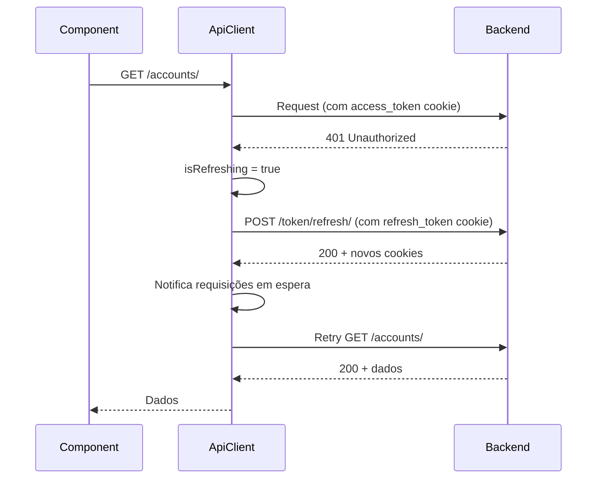

# API Client

## Visão Geral

O PersonalHub utiliza **Axios** como cliente HTTP base, com interceptors customizados para autenticação automática, refresh de tokens e tratamento de erros centralizado.

## Arquitetura

```
api-client.ts (Singleton)
├── Axios Instance
├── Request Interceptor       # Adiciona auth cookies
├── Response Interceptor      # Token refresh + erro handling
└── HTTP Methods (get, post, put, patch, delete)

services/ (Camada de API)
├── auth-service.ts
├── accounts-service.ts
├── expenses-service.ts
└── ...
```

## api-client.ts - Cliente Base

### Localização

```
src/services/api-client.ts
```

### Classe ApiClient

```typescript
import axios, { type AxiosInstance, AxiosError } from 'axios';
import { API_CONFIG } from '@/config/constants';

class ApiClient {
  private client: AxiosInstance;
  private isRefreshing = false;
  private refreshSubscribers: Array<() => void> = [];

  constructor() {
    this.client = axios.create({
      baseURL: API_CONFIG.BASE_URL,
      headers: {
        'Content-Type': 'application/json',
      },
      withCredentials: true, // ⚠️ CRÍTICO: envia cookies httpOnly
    });

    this.setupInterceptors();
  }

  // ... métodos
}

// Exporta instância singleton
export const apiClient = new ApiClient();
```

## Request Interceptor

Processa requisições antes de enviá-las ao servidor.

```typescript
private setupInterceptors() {
  // Request interceptor
  this.client.interceptors.request.use(
    (config) => {
      console.log('[ApiClient] Request to', config.url);

      // Remove Content-Type se for FormData
      if (config.data instanceof FormData) {
        delete config.headers['Content-Type'];
      }

      return config;
    },
    (error) => Promise.reject(error)
  );

  // Response interceptor (próxima seção)
}
```

### Características

- **Cookies automáticos:** `withCredentials: true` envia cookies httpOnly em todas as requisições
- **FormData handling:** Remove Content-Type para permitir boundary automático
- **Logging:** Console logs em desenvolvimento

## Response Interceptor

Trata respostas e erros de forma centralizada.

### Fluxo de Token Refresh



### Implementação

```typescript
this.client.interceptors.response.use(
  (response) => response,
  async (error: AxiosError) => {
    const originalRequest = error.config;

    // NÃO tenta refresh para endpoints de autenticação
    const authEndpoints = [
      API_CONFIG.ENDPOINTS.LOGIN,
      API_CONFIG.ENDPOINTS.REFRESH_TOKEN,
      API_CONFIG.ENDPOINTS.VERIFY_TOKEN,
    ];

    const isAuthEndpoint = authEndpoints.some(endpoint =>
      originalRequest.url?.includes(endpoint)
    );

    // Se 401 e não é endpoint de auth e não tentou retry ainda
    if (error.response?.status === 401 && !originalRequest._retry && !isAuthEndpoint) {
      if (this.isRefreshing) {
        // Aguarda refresh em andamento
        return new Promise((resolve) => {
          this.refreshSubscribers.push(() => {
            resolve(this.client(originalRequest));
          });
        });
      }

      originalRequest._retry = true;
      this.isRefreshing = true;

      try {
        console.log('[ApiClient] Attempting token refresh');

        await axios.post(
          `${API_CONFIG.BASE_URL}${API_CONFIG.ENDPOINTS.REFRESH_TOKEN}`,
          {},
          { withCredentials: true }
        );

        console.log('[ApiClient] Token refreshed successfully');

        // Notifica requisições em espera
        this.refreshSubscribers.forEach((callback) => callback());
        this.refreshSubscribers = [];

        return this.client(originalRequest);
      } catch (refreshError) {
        console.error('[ApiClient] Token refresh failed:', refreshError);
        this.clearTokens();
        return Promise.reject(new AuthenticationError('Session expired'));
      } finally {
        this.isRefreshing = false;
      }
    }

    return Promise.reject(this.handleError(error));
  }
);
```

### Características

- **Refresh automático:** Detecta 401 e tenta refresh do token
- **Fila de requisições:** Enquanto refresh ocorre, outras requisições aguardam
- **Retry automático:** Após refresh bem-sucedido, retry da requisição original
- **Tratamento de erros:** Converte erros HTTP em classes customizadas

## Classes de Erro Customizadas

```typescript
export class AuthenticationError extends Error {
  constructor(message: string) {
    super(message);
    this.name = 'AuthenticationError';
  }
}

export class ValidationError extends Error {
  errors: Record<string, string[]>;

  constructor(message: string, errors: Record<string, string[]> = {}) {
    super(message);
    this.name = 'ValidationError';
    this.errors = errors;
  }
}

export class NotFoundError extends Error {
  constructor(message: string) {
    super(message);
    this.name = 'NotFoundError';
  }
}

export class PermissionError extends Error {
  constructor(message: string) {
    super(message);
    this.name = 'PermissionError';
  }
}
```

## Tratamento de Erros

### handleError Method

```typescript
private handleError(error: AxiosError): Error {
  const response = error.response;

  if (!response) {
    return new Error('Erro de rede. Verifique sua conexão.');
  }

  const data = response.data as any;

  const formatErrorMessage = (data: any): string => {
    if (typeof data === 'string') return data;
    if (data.detail) return data.detail;

    // Django REST Framework validation errors
    if (data && typeof data === 'object') {
      const errorMessages: string[] = [];

      for (const [field, errors] of Object.entries(data)) {
        if (Array.isArray(errors)) {
          errorMessages.push(`${field}: ${errors.join(', ')}`);
        }
      }

      if (errorMessages.length > 0) {
        return errorMessages.join('\n');
      }
    }

    return 'Ocorreu um erro desconhecido';
  };

  switch (response.status) {
    case 400:
      return new ValidationError(
        formatErrorMessage(data) || 'Erro de validação',
        data.errors || data
      );
    case 401:
      return new AuthenticationError(
        formatErrorMessage(data) || 'Falha na autenticação'
      );
    case 403:
      return new PermissionError(
        formatErrorMessage(data) || 'Sem permissão'
      );
    case 404:
      return new NotFoundError(
        formatErrorMessage(data) || 'Recurso não encontrado'
      );
    case 500:
      return new Error('Erro interno do servidor');
    default:
      return new Error(formatErrorMessage(data));
  }
}
```

## Métodos HTTP

### GET

```typescript
async get<T = any>(url: string, params?: Record<string, any>): Promise<T> {
  const response = await this.client.get<T>(url, { params });
  return response.data;
}
```

**Uso:**
```typescript
// Sem query params
const accounts = await apiClient.get<Account[]>('/api/v1/accounts/');

// Com query params
const filtered = await apiClient.get('/api/v1/expenses/', {
  category: 'food',
  date_from: '2024-01-01',
});
```

### POST

```typescript
async post<T = any>(url: string, data?: any): Promise<T> {
  if (import.meta.env.DEV) {
    console.log('POST Request:', { url, data });
  }
  const response = await this.client.post<T>(url, data);
  return response.data;
}
```

**Uso:**
```typescript
// JSON data
const newAccount = await apiClient.post('/api/v1/accounts/', {
  name: 'Nubank',
  account_type: 'CC',
  current_balance: '1000.00',
});

// FormData (para arquivos)
const formData = new FormData();
formData.append('name', 'Expense');
formData.append('receipt', file);

const expense = await apiClient.post('/api/v1/expenses/', formData);
```

### PUT

```typescript
async put<T = any>(url: string, data?: any): Promise<T> {
  const response = await this.client.put<T>(url, data);
  return response.data;
}
```

**Uso:**
```typescript
const updated = await apiClient.put('/api/v1/accounts/1/', {
  name: 'Nubank Updated',
  current_balance: '1500.00',
});
```

### PATCH

```typescript
async patch<T = any>(url: string, data?: any): Promise<T> {
  const response = await this.client.patch<T>(url, data);
  return response.data;
}
```

**Uso:**
```typescript
// Atualiza apenas campos específicos
const updated = await apiClient.patch('/api/v1/accounts/1/', {
  current_balance: '2000.00', // Apenas saldo
});
```

### DELETE

```typescript
async delete<T = any>(url: string): Promise<T> {
  const response = await this.client.delete<T>(url);
  return response.data;
}
```

**Uso:**
```typescript
await apiClient.delete('/api/v1/accounts/1/');
```

## Gerenciamento de Tokens

### hasValidToken

```typescript
private tokenValidationCache: { isValid: boolean; timestamp: number } | null = null;
private readonly CACHE_DURATION = 5000; // 5 segundos

public async hasValidToken(): Promise<boolean> {
  // Usa cache se disponível e recente
  if (this.tokenValidationCache) {
    const age = Date.now() - this.tokenValidationCache.timestamp;
    if (age < this.CACHE_DURATION) {
      return this.tokenValidationCache.isValid;
    }
  }

  // Verifica com backend
  try {
    await this.client.post(API_CONFIG.ENDPOINTS.VERIFY_TOKEN);
    this.tokenValidationCache = { isValid: true, timestamp: Date.now() };
    return true;
  } catch {
    this.tokenValidationCache = { isValid: false, timestamp: Date.now() };
    return false;
  }
}
```

### clearTokens

```typescript
public clearTokens() {
  // Limpa apenas cookies não-httpOnly (user_data, user_permissions)
  // HttpOnly cookies (access_token, refresh_token) são removidos pelo backend
  Cookies.remove('user_data');
  Cookies.remove('user_permissions');
  this.tokenValidationCache = null;
}
```

## Services - Camada de API

Cada módulo tem seu service que usa o `apiClient`.

### Padrão de Service

```typescript
// services/accounts-service.ts
import { apiClient } from './api-client';
import { API_CONFIG } from '@/config/constants';
import type { Account, AccountFormData, PaginatedResponse } from '@/types';

class AccountsService {
  async getAll(): Promise<Account[]> {
    const response = await apiClient.get<PaginatedResponse<Account>>(
      API_CONFIG.ENDPOINTS.ACCOUNTS
    );
    return response.results;
  }

  async getById(id: number): Promise<Account> {
    return apiClient.get<Account>(`${API_CONFIG.ENDPOINTS.ACCOUNTS}${id}/`);
  }

  async create(data: AccountFormData): Promise<Account> {
    return apiClient.post<Account>(API_CONFIG.ENDPOINTS.ACCOUNTS, data);
  }

  async update(id: number, data: Partial<AccountFormData>): Promise<Account> {
    return apiClient.put<Account>(
      `${API_CONFIG.ENDPOINTS.ACCOUNTS}${id}/`,
      data
    );
  }

  async delete(id: number): Promise<void> {
    return apiClient.delete(`${API_CONFIG.ENDPOINTS.ACCOUNTS}${id}/`);
  }
}

// Exporta instância singleton
export const accountsService = new AccountsService();
```

### Uso em Componentes

```typescript
import { accountsService } from '@/services/accounts-service';
import { useState, useEffect } from 'react';

function AccountsList() {
  const [accounts, setAccounts] = useState<Account[]>([]);
  const [loading, setLoading] = useState(true);
  const [error, setError] = useState<string | null>(null);

  useEffect(() => {
    loadAccounts();
  }, []);

  const loadAccounts = async () => {
    try {
      setLoading(true);
      const data = await accountsService.getAll();
      setAccounts(data);
    } catch (err: any) {
      setError(err.message);
    } finally {
      setLoading(false);
    }
  };

  const handleDelete = async (id: number) => {
    try {
      await accountsService.delete(id);
      setAccounts(accounts.filter(a => a.id !== id));
      toast({ title: 'Conta excluída com sucesso' });
    } catch (err: any) {
      toast({
        title: 'Erro ao excluir',
        description: err.message,
        variant: 'destructive',
      });
    }
  };

  if (loading) return <LoadingSpinner />;
  if (error) return <ErrorMessage message={error} />;

  return (
    <div>
      {accounts.map(account => (
        <AccountCard
          key={account.id}
          account={account}
          onDelete={() => handleDelete(account.id)}
        />
      ))}
    </div>
  );
}
```

## Configuração de Endpoints

Centralize endpoints em `config/constants.ts`:

```typescript
export const API_CONFIG = {
  BASE_URL: import.meta.env.VITE_API_BASE_URL || 'http://localhost:8002',
  ENDPOINTS: {
    // Auth
    LOGIN: '/api/v1/authentication/login/',
    LOGOUT: '/api/v1/authentication/logout/',
    REFRESH_TOKEN: '/api/v1/authentication/token/refresh/',
    VERIFY_TOKEN: '/api/v1/authentication/token/verify/',
    USER_PERMISSIONS: '/api/v1/authentication/user-permissions/',

    // Financial
    ACCOUNTS: '/api/v1/accounts/',
    EXPENSES: '/api/v1/expenses/',
    REVENUES: '/api/v1/revenues/',
    CREDIT_CARDS: '/api/v1/credit-cards/',
    TRANSFERS: '/api/v1/transfers/',
    LOANS: '/api/v1/loans/',

    // Security
    PASSWORDS: '/api/v1/security/passwords/',
    STORED_CARDS: '/api/v1/security/stored-cards/',

    // Library
    BOOKS: '/api/v1/library/books/',
    AUTHORS: '/api/v1/library/authors/',

    // AI
    AI_QUERY: '/api/v1/ai-assistant/query/',
    AI_STREAM: '/api/v1/ai-assistant/stream/',
  },
};
```

## Tratamento de Erros em Componentes

```typescript
import { AuthenticationError, ValidationError } from '@/services/api-client';

const handleSave = async () => {
  try {
    await accountsService.create(formData);
    toast({ title: 'Salvo com sucesso' });
  } catch (err: any) {
    if (err instanceof AuthenticationError) {
      // Usuário não autenticado - já tratado pelo interceptor
      navigate('/login');
    } else if (err instanceof ValidationError) {
      // Mostra erros de validação
      Object.entries(err.errors).forEach(([field, messages]) => {
        form.setError(field, { message: messages.join(', ') });
      });
    } else {
      // Erro genérico
      toast({
        title: 'Erro',
        description: err.message,
        variant: 'destructive',
      });
    }
  }
};
```

## Timeout e Retry (Futura melhoria)

```typescript
// config com timeout
this.client = axios.create({
  baseURL: API_CONFIG.BASE_URL,
  timeout: 10000, // 10 segundos
  withCredentials: true,
});

// Retry com axios-retry
import axiosRetry from 'axios-retry';

axiosRetry(this.client, {
  retries: 3,
  retryDelay: axiosRetry.exponentialDelay,
  retryCondition: (error) => {
    return error.response?.status === 503;
  },
});
```

## Boas Práticas

### 1. Sempre use o service, nunca apiClient diretamente

```typescript
// ✅ Bom
const accounts = await accountsService.getAll();

// ❌ Ruim
const accounts = await apiClient.get('/api/v1/accounts/');
```

### 2. Trate erros específicos

```typescript
// ✅ Bom
try {
  await accountsService.delete(id);
} catch (err) {
  if (err instanceof NotFoundError) {
    toast({ title: 'Conta não encontrada' });
  } else if (err instanceof PermissionError) {
    toast({ title: 'Sem permissão para excluir' });
  } else {
    toast({ title: 'Erro ao excluir' });
  }
}
```

### 3. Use TypeScript para type safety

```typescript
// ✅ Bom - tipos explícitos
const account = await apiClient.get<Account>('/api/v1/accounts/1/');

// ❌ Ruim - tipo any implícito
const account = await apiClient.get('/api/v1/accounts/1/');
```

## Próximos Passos

- **Estado Global:** Veja [gerenciamento-estado.md](./gerenciamento-estado.md)
- **API Endpoints:** Veja [../05-api/endpoints.md](../05-api/endpoints.md)
