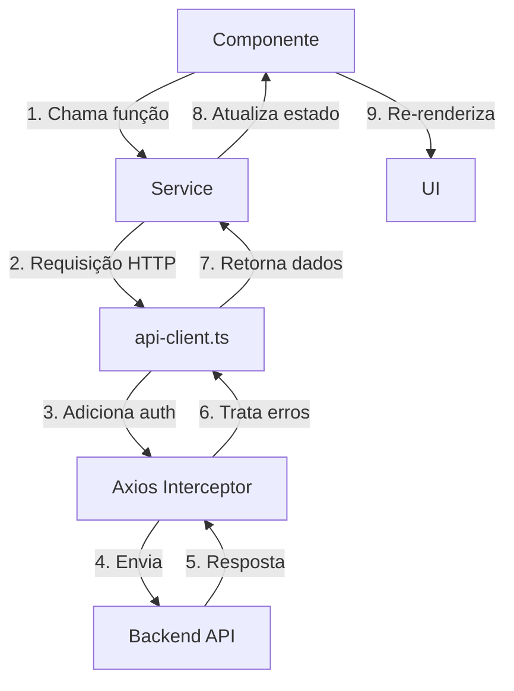

# Estrutura do Projeto Frontend

## Visão Geral

O frontend do PersonalHub é uma aplicação React + TypeScript moderna, utilizando Vite como bundler e seguindo uma arquitetura modular e escalável.

## Estrutura de Diretórios

```
frontend/
├── src/
│   ├── assets/              # Recursos estáticos (imagens, ícones)
│   ├── components/          # Componentes React
│   │   ├── ui/              # Componentes UI reutilizáveis (shadcn/ui + Radix)
│   │   ├── layout/          # Componentes de layout (Header, Sidebar, Footer)
│   │   ├── common/          # Componentes comuns (ProtectedRoute, DataTable)
│   │   ├── providers/       # Context providers
│   │   ├── accounts/        # Componentes específicos de Contas
│   │   ├── expenses/        # Componentes específicos de Despesas
│   │   ├── revenues/        # Componentes específicos de Receitas
│   │   ├── credit-cards/    # Componentes de Cartões de Crédito
│   │   ├── transfers/       # Componentes de Transferências
│   │   ├── members/         # Componentes de Membros
│   │   ├── security/        # Componentes do módulo Security
│   │   ├── library/         # Componentes do módulo Library
│   │   ├── ai/              # Componentes do AI Assistant
│   │   ├── personal-planning/ # Componentes de Planejamento Pessoal
│   │   └── charts/          # Componentes de gráficos
│   ├── config/              # Configurações da aplicação
│   │   └── constants.ts     # Constantes (API URLs, endpoints)
│   ├── hooks/               # Custom React Hooks
│   ├── lib/                 # Utilitários e helpers
│   │   ├── utils.ts         # Funções utilitárias gerais
│   │   └── animations/      # Configurações de animação
│   ├── pages/               # Páginas da aplicação (rotas)
│   │   ├── Login.tsx
│   │   ├── Register.tsx
│   │   ├── Home.tsx
│   │   ├── Dashboard.tsx
│   │   ├── Accounts.tsx
│   │   ├── Expenses.tsx
│   │   ├── Revenues.tsx
│   │   ├── CreditCards.tsx
│   │   ├── SecurityDashboard.tsx
│   │   ├── LibraryDashboard.tsx
│   │   └── AIAssistant.tsx
│   ├── services/            # Camada de serviços (API clients)
│   │   ├── api-client.ts    # Cliente HTTP base (axios + interceptors)
│   │   ├── auth-service.ts
│   │   ├── accounts-service.ts
│   │   ├── expenses-service.ts
│   │   └── ...
│   ├── stores/              # Gerenciamento de estado global (Zustand)
│   │   └── auth-store.ts    # Store de autenticação
│   ├── styles/              # Estilos globais
│   │   └── globals.css      # CSS global com variáveis do tema
│   ├── types/               # Definições de tipos TypeScript
│   │   └── index.ts         # Interfaces e tipos da aplicação
│   ├── App.tsx              # Componente raiz com rotas
│   └── main.tsx             # Entry point da aplicação
├── public/                  # Arquivos públicos servidos diretamente
├── index.html               # HTML base
├── tailwind.config.js       # Configuração do TailwindCSS
├── tsconfig.json            # Configuração do TypeScript
├── vite.config.ts           # Configuração do Vite
└── package.json             # Dependências e scripts
```

## Organização de Componentes

### Hierarquia de Componentes

```
App.tsx (Raiz)
├── BrowserRouter
│   ├── AnimatedRoutes
│   │   ├── Routes Públicas
│   │   │   ├── /login → Login
│   │   │   ├── /register → Register
│   │   │   └── /unauthorized → Unauthorized
│   │   └── Routes Protegidas (ProtectedRoute + Layout)
│   │       ├── / → Home
│   │       ├── /dashboard → Dashboard
│   │       ├── /accounts → Accounts
│   │       ├── /expenses → Expenses
│   │       ├── /revenues → Revenues
│   │       ├── /credit-cards → CreditCards
│   │       ├── /security/* → Security Module
│   │       ├── /library/* → Library Module
│   │       └── /ai-assistant → AIAssistant
│   ├── Toaster (Notificações)
│   └── AlertDialogProvider (Dialogs globais)
```

### Componentes por Categoria

#### 1. **components/ui/** - Componentes Básicos UI

Componentes de baixo nível baseados em Radix UI e estilizados com TailwindCSS:

- `button.tsx` - Botões com variantes
- `input.tsx` - Campos de entrada
- `select.tsx` - Dropdowns
- `dialog.tsx` - Modais
- `card.tsx` - Cards
- `table.tsx` - Tabelas
- `badge.tsx` - Badges
- `checkbox.tsx` - Checkboxes
- `toast.tsx` - Notificações
- `date-picker.tsx` - Seletor de datas
- `skeleton.tsx` - Loading skeletons

#### 2. **components/layout/** - Componentes de Layout

Estrutura geral da aplicação:

- `Layout.tsx` - Container principal com Sidebar + Outlet
- `Header.tsx` - Cabeçalho com navegação
- `Sidebar.tsx` - Menu lateral com navegação
- `Footer.tsx` - Rodapé

#### 3. **components/common/** - Componentes Comuns

Componentes reutilizáveis compartilhados:

- `ProtectedRoute.tsx` - HOC para proteção de rotas
- `DataTable/` - Tabela de dados com paginação, ordenação e filtros
- `LoadingSpinner.tsx` - Indicador de carregamento
- `ErrorBoundary.tsx` - Tratamento de erros

#### 4. **components/[feature]/** - Componentes por Módulo

Cada módulo tem sua pasta com componentes específicos:

**Estrutura típica de um módulo:**
```
components/accounts/
├── AccountsList.tsx         # Lista de contas
├── AccountCard.tsx          # Card individual de conta
├── AccountForm.tsx          # Formulário de criação/edição
├── AccountDetails.tsx       # Detalhes da conta
└── AccountFilters.tsx       # Filtros de pesquisa
```

## Pages (Rotas)

Cada página é um componente lazy-loaded que representa uma rota da aplicação:

```typescript
// Lazy loading para performance
const Dashboard = lazy(() => import('./pages/Dashboard'));
const Accounts = lazy(() => import('./pages/Accounts'));
```

### Páginas Públicas (não autenticadas)
- `/login` - Login.tsx
- `/register` - Register.tsx
- `/unauthorized` - Unauthorized.tsx

### Páginas Protegidas (requerem autenticação)

**Módulo Financeiro:**
- `/` - Home.tsx (Dashboard inicial)
- `/dashboard` - Dashboard.tsx (Dashboard financeiro)
- `/accounts` - Accounts.tsx
- `/expenses` - Expenses.tsx
- `/fixed-expenses` - FixedExpenses.tsx
- `/revenues` - Revenues.tsx
- `/credit-cards` - CreditCards.tsx
- `/credit-card-bills` - CreditCardBills.tsx
- `/credit-card-expenses` - CreditCardExpenses.tsx
- `/transfers` - Transfers.tsx
- `/loans` - Loans.tsx
- `/members` - Members.tsx

**Módulo Security:**
- `/security/dashboard` - SecurityDashboard.tsx
- `/security/passwords` - Passwords.tsx
- `/security/stored-cards` - StoredCards.tsx
- `/security/stored-accounts` - StoredAccounts.tsx
- `/security/archives` - Archives.tsx
- `/security/activity-logs` - ActivityLogs.tsx

**Módulo Library:**
- `/library/dashboard` - LibraryDashboard.tsx
- `/library/books` - Books.tsx
- `/library/authors` - Authors.tsx
- `/library/publishers` - Publishers.tsx
- `/library/summaries` - Summaries.tsx
- `/library/readings` - Readings.tsx

**Módulo AI Assistant:**
- `/ai-assistant` - AIAssistant.tsx

**Módulo Personal Planning:**
- `/planning/dashboard` - PersonalPlanningDashboard.tsx
- `/planning/routine-tasks` - RoutineTasks.tsx
- `/planning/goals` - Goals.tsx
- `/planning/daily` - DailyChecklist.tsx

## Services (Camada de API)

Cada service encapsula as chamadas HTTP para um recurso específico:

```typescript
// Padrão de um service
export class AccountsService {
  async getAll(): Promise<Account[]>
  async getById(id: number): Promise<Account>
  async create(data: AccountFormData): Promise<Account>
  async update(id: number, data: Partial<AccountFormData>): Promise<Account>
  async delete(id: number): Promise<void>
}

export const accountsService = new AccountsService();
```

**Services disponíveis:**
- `api-client.ts` - Cliente HTTP base (singleton)
- `auth-service.ts` - Autenticação e tokens
- `accounts-service.ts` - Contas bancárias
- `expenses-service.ts` - Despesas
- `revenues-service.ts` - Receitas
- `credit-cards-service.ts` - Cartões de crédito
- `credit-card-bills-service.ts` - Faturas
- `credit-card-expenses-service.ts` - Despesas do cartão
- `transfers-service.ts` - Transferências
- `loans-service.ts` - Empréstimos
- `members-service.ts` - Membros
- `passwords-service.ts` - Senhas (Security)
- `books-service.ts` - Livros (Library)
- `ai-service.ts` - AI Assistant

## Types (TypeScript)

Definições de tipos centralizadas em `/src/types/index.ts`:

```typescript
// Exemplo de tipos
export interface Account {
  id: number;
  name: string;
  account_type: string;
  current_balance: string;
  is_active: boolean;
  // ...
}

export interface AccountFormData {
  name: string;
  account_type: string;
  is_active?: boolean;
  // ...
}

export interface PaginatedResponse<T> {
  count: number;
  next: string | null;
  previous: string | null;
  results: T[];
}
```

## Config

Configurações centralizadas da aplicação:

### constants.ts
```typescript
export const API_CONFIG = {
  BASE_URL: import.meta.env.VITE_API_BASE_URL || 'http://localhost:8002',
  ENDPOINTS: {
    LOGIN: '/api/v1/authentication/login/',
    LOGOUT: '/api/v1/authentication/logout/',
    REFRESH_TOKEN: '/api/v1/authentication/token/refresh/',
    ACCOUNTS: '/api/v1/accounts/',
    EXPENSES: '/api/v1/expenses/',
    // ...
  }
};
```

## Convenções de Nomenclatura

### Arquivos
- **Componentes:** PascalCase (ex: `AccountCard.tsx`)
- **Services:** kebab-case (ex: `accounts-service.ts`)
- **Types:** kebab-case (ex: `index.ts`)
- **Hooks:** camelCase com prefixo `use` (ex: `useAuth.ts`)

### Pastas
- **kebab-case** para todas as pastas (ex: `credit-cards/`)

### Variáveis e Funções
- **camelCase** para variáveis e funções (ex: `getUserData`)
- **PascalCase** para componentes React (ex: `AccountCard`)
- **UPPER_SNAKE_CASE** para constantes (ex: `API_BASE_URL`)

## Fluxo de Dados



## Padrões de Importação

### Path Alias
O projeto usa `@/` como alias para `src/`:

```typescript
// ✅ Correto
import { Button } from '@/components/ui/button';
import { accountsService } from '@/services/accounts-service';
import type { Account } from '@/types';

// ❌ Evite
import { Button } from '../../../components/ui/button';
```

### Ordem de Imports
1. React e bibliotecas externas
2. Componentes internos
3. Services e stores
4. Types
5. Estilos

```typescript
// 1. React e bibliotecas
import { useState, useEffect } from 'react';
import { useNavigate } from 'react-router-dom';

// 2. Componentes
import { Button } from '@/components/ui/button';
import { AccountCard } from '@/components/accounts/AccountCard';

// 3. Services e stores
import { accountsService } from '@/services/accounts-service';
import { useAuthStore } from '@/stores/auth-store';

// 4. Types
import type { Account, AccountFormData } from '@/types';

// 5. Estilos (se houver)
import './styles.css';
```

## Performance

### Code Splitting
- **Lazy loading** de todas as páginas protegidas
- **Suspense** com fallback de loading

```typescript
const Dashboard = lazy(() => import('./pages/Dashboard'));

<Suspense fallback={<LoadingFallback />}>
  <Dashboard />
</Suspense>
```

### Memoization
- Use `React.memo` para componentes pesados
- Use `useMemo` para cálculos custosos
- Use `useCallback` para funções passadas como props

## Próximos Passos

Para mais detalhes sobre aspectos específicos do frontend:

- **Componentes UI:** Veja [componentes-ui.md](./componentes-ui.md)
- **Roteamento:** Veja [roteamento.md](./roteamento.md)
- **Estado Global:** Veja [gerenciamento-estado.md](./gerenciamento-estado.md)
- **API Client:** Veja [api-client.md](./api-client.md)
- **Estilização:** Veja [estilizacao.md](./estilizacao.md)
