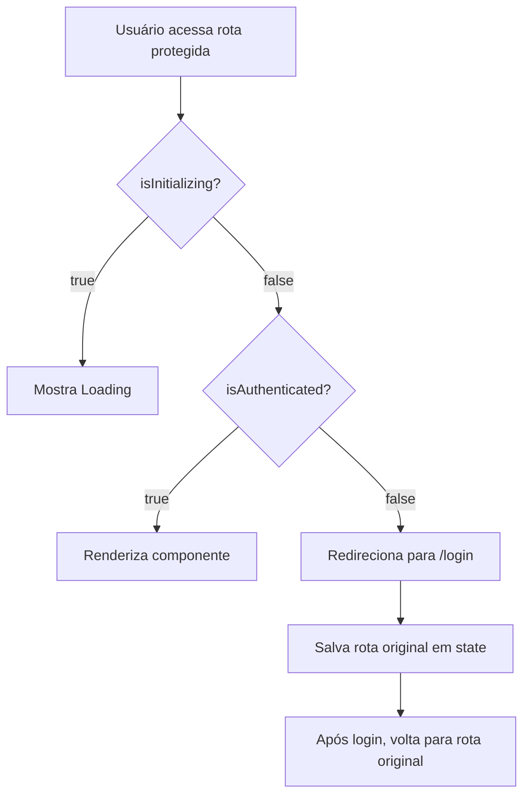

# Roteamento

## Visão Geral

O PersonalHub utiliza **React Router v6** para gerenciamento de rotas, com suporte a lazy loading, proteção de rotas autenticadas e animações de transição.

## Estrutura de Rotas

### App.tsx - Configuração Principal

```tsx
import { BrowserRouter, Routes, Route, Navigate } from 'react-router-dom';
import { AnimatePresence } from 'framer-motion';
import { lazy, Suspense } from 'react';

// Eager loading (páginas públicas)
import Login from './pages/Login';
import Register from './pages/Register';

// Lazy loading (páginas protegidas)
const Dashboard = lazy(() => import('./pages/Dashboard'));
const Accounts = lazy(() => import('./pages/Accounts'));

function App() {
  return (
    <BrowserRouter>
      <AnimatedRoutes />
      <Toaster />
    </BrowserRouter>
  );
}
```

## Tipos de Rotas

### 1. Rotas Públicas

Acessíveis sem autenticação. Se o usuário já está logado, redireciona para home.

```tsx
<Route
  path="/login"
  element={
    isAuthenticated ? <Navigate to="/" replace /> : <Login />
  }
/>
<Route path="/register" element={<Register />} />
<Route path="/unauthorized" element={<Unauthorized />} />
```

### 2. Rotas Protegidas

Requerem autenticação. Usuários não autenticados são redirecionados para `/login`.

```tsx
<Route
  element={
    <ProtectedRoute>
      <Layout />
    </ProtectedRoute>
  }
>
  <Route path="/" element={<Home />} />
  <Route path="/dashboard" element={<Dashboard />} />
  <Route path="/accounts" element={<Accounts />} />
  {/* ... */}
</Route>
```

## Componente ProtectedRoute

Componente HOC (Higher-Order Component) que protege rotas privadas.

### Implementação

```tsx
// components/common/ProtectedRoute.tsx
import { Navigate, useLocation } from 'react-router-dom';
import { useAuthStore } from '@/stores/auth-store';

interface ProtectedRouteProps {
  children: React.ReactNode;
}

export function ProtectedRoute({ children }: ProtectedRouteProps) {
  const { isAuthenticated, isInitializing } = useAuthStore();
  const location = useLocation();

  // Mostra loading enquanto verifica autenticação
  if (isInitializing) {
    return <LoadingFallback />;
  }

  // Redireciona para login se não autenticado
  if (!isAuthenticated) {
    return <Navigate to="/login" state={{ from: location }} replace />;
  }

  return <>{children}</>;
}
```

### Fluxo de Proteção



### Retorno à Rota Original

Após login bem-sucedido, o usuário retorna à página que tentou acessar:

```tsx
// Login.tsx
const location = useLocation();
const from = location.state?.from?.pathname || '/';

const handleLogin = async () => {
  await login(credentials);
  navigate(from, { replace: true }); // Volta para página original
};
```

## Layout Aninhado

As rotas protegidas usam um layout compartilhado (Sidebar + Header):

```tsx
<Route
  element={
    <ProtectedRoute>
      <Layout />  {/* Sidebar + Header + Outlet */}
    </ProtectedRoute>
  }
>
  {/* Todas as rotas filhas renderizam no <Outlet /> do Layout */}
  <Route path="/" element={<Home />} />
  <Route path="/dashboard" element={<Dashboard />} />
</Route>
```

### Layout.tsx

```tsx
// components/layout/Layout.tsx
import { Outlet } from 'react-router-dom';

export function Layout() {
  return (
    <div className="flex h-screen">
      <Sidebar />
      <div className="flex-1 flex flex-col overflow-hidden">
        <Header />
        <main className="flex-1 overflow-y-auto p-6">
          <Outlet /> {/* Rotas filhas renderizam aqui */}
        </main>
      </div>
    </div>
  );
}
```

## Lazy Loading e Code Splitting

### Por que usar?

- **Performance:** Carrega apenas o código necessário
- **Bundle menor:** Divide código em chunks
- **Melhor UX:** Páginas iniciais carregam mais rápido

### Implementação

```tsx
import { lazy, Suspense } from 'react';

// ✅ Lazy loading
const Dashboard = lazy(() => import('./pages/Dashboard'));
const Accounts = lazy(() => import('./pages/Accounts'));

// Wrapper com Suspense
<Route
  path="/dashboard"
  element={
    <Suspense fallback={<LoadingFallback />}>
      <Dashboard />
    </Suspense>
  }
/>
```

### LoadingFallback

```tsx
function LoadingFallback() {
  return (
    <div className="flex items-center justify-center h-screen">
      <Loader2 className="w-12 h-12 animate-spin text-primary" />
    </div>
  );
}
```

## Animações de Transição

Usa **Framer Motion** com **AnimatePresence** para transições suaves entre rotas.

### AnimatedRoutes Component

```tsx
import { AnimatePresence } from 'framer-motion';
import { useLocation } from 'react-router-dom';

function AnimatedRoutes() {
  const location = useLocation();

  return (
    <AnimatePresence mode="wait">
      <Routes location={location} key={location.pathname}>
        {/* Suas rotas */}
      </Routes>
    </AnimatePresence>
  );
}
```

### Animação em Páginas

```tsx
// pages/Dashboard.tsx
import { motion } from 'framer-motion';

function Dashboard() {
  return (
    <motion.div
      initial={{ opacity: 0, y: 20 }}
      animate={{ opacity: 1, y: 0 }}
      exit={{ opacity: 0, y: -20 }}
      transition={{ duration: 0.2 }}
    >
      {/* Conteúdo da página */}
    </motion.div>
  );
}
```

## Mapa Completo de Rotas

### Rotas Públicas

| Rota | Componente | Descrição |
|------|-----------|-----------|
| `/login` | Login | Página de login |
| `/register` | Register | Registro de novos usuários |
| `/unauthorized` | Unauthorized | Página de acesso negado |

### Rotas Protegidas - Financeiro

| Rota | Componente | Descrição |
|------|-----------|-----------|
| `/` | Home | Dashboard inicial |
| `/dashboard` | Dashboard | Dashboard financeiro |
| `/accounts` | Accounts | Gerenciar contas |
| `/expenses` | Expenses | Gerenciar despesas |
| `/fixed-expenses` | FixedExpenses | Despesas fixas |
| `/revenues` | Revenues | Gerenciar receitas |
| `/credit-cards` | CreditCards | Gerenciar cartões |
| `/credit-card-bills` | CreditCardBills | Faturas de cartões |
| `/credit-card-expenses` | CreditCardExpenses | Despesas do cartão |
| `/transfers` | Transfers | Transferências |
| `/loans` | Loans | Empréstimos |
| `/members` | Members | Gerenciar membros |

### Rotas Protegidas - Security

| Rota | Componente | Descrição |
|------|-----------|-----------|
| `/security/dashboard` | SecurityDashboard | Dashboard de segurança |
| `/security/passwords` | Passwords | Gerenciar senhas |
| `/security/stored-cards` | StoredCards | Cartões armazenados |
| `/security/stored-accounts` | StoredAccounts | Contas armazenadas |
| `/security/archives` | Archives | Arquivos seguros |
| `/security/activity-logs` | ActivityLogs | Logs de atividade |

### Rotas Protegidas - Library

| Rota | Componente | Descrição |
|------|-----------|-----------|
| `/library/dashboard` | LibraryDashboard | Dashboard da biblioteca |
| `/library/books` | Books | Gerenciar livros |
| `/library/authors` | Authors | Gerenciar autores |
| `/library/publishers` | Publishers | Gerenciar editoras |
| `/library/summaries` | Summaries | Resumos de livros |
| `/library/readings` | Readings | Leituras |

### Rotas Protegidas - AI e Planning

| Rota | Componente | Descrição |
|------|-----------|-----------|
| `/ai-assistant` | AIAssistant | Assistente de IA |
| `/planning/dashboard` | PersonalPlanningDashboard | Dashboard de planejamento |
| `/planning/routine-tasks` | RoutineTasks | Tarefas de rotina |
| `/planning/goals` | Goals | Metas |
| `/planning/daily` | DailyChecklist | Checklist diário |

## Navegação Programática

### useNavigate Hook

```tsx
import { useNavigate } from 'react-router-dom';

function MyComponent() {
  const navigate = useNavigate();

  const goToDashboard = () => {
    navigate('/dashboard');
  };

  const goBack = () => {
    navigate(-1); // Volta uma página
  };

  const replaceRoute = () => {
    navigate('/new-route', { replace: true }); // Substitui no histórico
  };

  return (
    <div>
      <Button onClick={goToDashboard}>Ir para Dashboard</Button>
      <Button onClick={goBack}>Voltar</Button>
    </div>
  );
}
```

### Link Component

```tsx
import { Link } from 'react-router-dom';

<Link to="/dashboard" className="text-primary hover:underline">
  Dashboard
</Link>

// Com state
<Link to="/details" state={{ from: 'homepage' }}>
  Ver Detalhes
</Link>
```

### NavLink (com active state)

```tsx
import { NavLink } from 'react-router-dom';

<NavLink
  to="/dashboard"
  className={({ isActive }) =>
    isActive ? 'text-primary font-bold' : 'text-foreground'
  }
>
  Dashboard
</NavLink>
```

## Parâmetros de Rota

### URL Params

```tsx
// Definição da rota
<Route path="/accounts/:id" element={<AccountDetails />} />

// Leitura dos params
import { useParams } from 'react-router-dom';

function AccountDetails() {
  const { id } = useParams<{ id: string }>();

  useEffect(() => {
    loadAccount(id);
  }, [id]);

  return <div>Conta #{id}</div>;
}
```

### Query Params

```tsx
import { useSearchParams } from 'react-router-dom';

function SearchPage() {
  const [searchParams, setSearchParams] = useSearchParams();

  const query = searchParams.get('q') || '';
  const page = searchParams.get('page') || '1';

  const updateSearch = (newQuery: string) => {
    setSearchParams({ q: newQuery, page: '1' });
  };

  return <div>Busca: {query}</div>;
}

// URL: /search?q=teste&page=1
```

## Fallback (Rota 404)

Redireciona rotas não encontradas para home:

```tsx
<Route path="*" element={<Navigate to="/" replace />} />
```

Ou crie uma página 404 customizada:

```tsx
<Route path="*" element={<NotFound />} />
```

## Proteção por Permissão

Para proteger rotas específicas por permissão:

```tsx
function PermissionRoute({ children, requiredPermission }) {
  const { hasPermission } = useAuthStore();

  if (!hasPermission(requiredPermission)) {
    return <Navigate to="/unauthorized" replace />;
  }

  return <>{children}</>;
}

// Uso
<Route
  path="/admin"
  element={
    <PermissionRoute requiredPermission="admin_access">
      <AdminPanel />
    </PermissionRoute>
  }
/>
```

## Melhores Práticas

### 1. Sempre use replace para redirecionamentos

```tsx
// ✅ Bom
<Navigate to="/login" replace />

// ❌ Ruim - adiciona ao histórico
<Navigate to="/login" />
```

### 2. Lazy load páginas pesadas

```tsx
// ✅ Bom
const Dashboard = lazy(() => import('./pages/Dashboard'));

// ❌ Ruim - importação síncrona
import Dashboard from './pages/Dashboard';
```

### 3. Use Suspense com fallback

```tsx
// ✅ Bom
<Suspense fallback={<LoadingFallback />}>
  <LazyComponent />
</Suspense>

// ❌ Ruim - sem fallback
<LazyComponent />
```

### 4. Centralize rotas em constantes

```tsx
// config/routes.ts
export const ROUTES = {
  HOME: '/',
  LOGIN: '/login',
  DASHBOARD: '/dashboard',
  ACCOUNTS: '/accounts',
  // ...
};

// Uso
navigate(ROUTES.DASHBOARD);
<Link to={ROUTES.ACCOUNTS}>Contas</Link>
```

## Debugging

### Ver rota atual

```tsx
import { useLocation } from 'react-router-dom';

function MyComponent() {
  const location = useLocation();

  console.log('Current path:', location.pathname);
  console.log('Search params:', location.search);
  console.log('State:', location.state);

  return <div>Rota: {location.pathname}</div>;
}
```

### React Router DevTools

Instale a extensão para Chrome/Firefox para visualizar rotas em desenvolvimento.

## Próximos Passos

- **Estado Global:** Veja [gerenciamento-estado.md](./gerenciamento-estado.md) para integração com Zustand
- **API Client:** Veja [api-client.md](./api-client.md) para chamadas HTTP nas páginas
