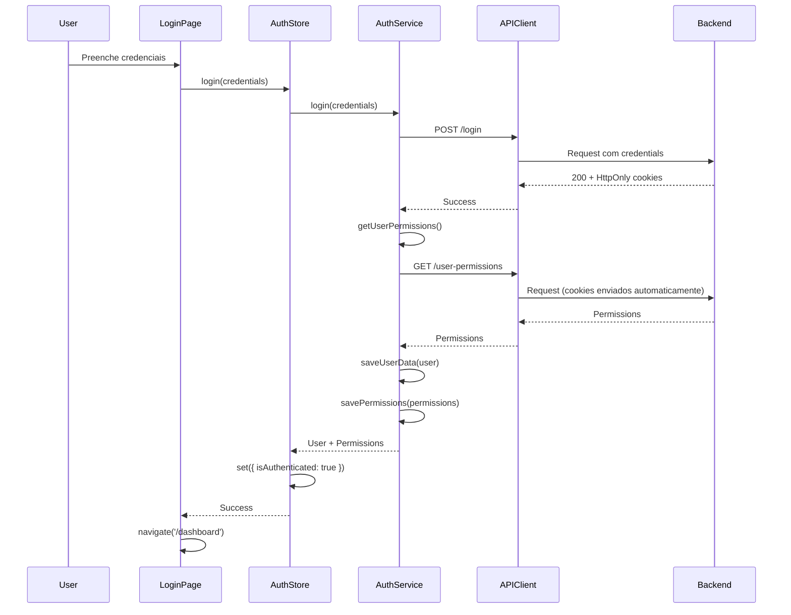

# Gerenciamento de Estado

## Visão Geral

O MindLedger utiliza **Zustand** para gerenciamento de estado global, com foco em simplicidade, performance e tipagem TypeScript.

## Por que Zustand?

- **Simples:** API minimalista, sem boilerplate
- **Performático:** Re-renderiza apenas componentes necessários
- **TypeScript:** Excelente suporte a tipos
- **Pequeno:** ~1KB gzipped
- **Flexível:** Não opinionated, funciona com qualquer padrão

## Arquitetura de Estado

```
Estado Global (Zustand)
├── auth-store.ts           # Autenticação, usuário, permissões
└── [futuras stores]        # Outras stores conforme necessário

Estado Local (React)
├── useState                # Estado de componentes
├── useReducer             # Estado complexo
└── React Hook Form        # Estado de formulários
```

## Auth Store

Store principal que gerencia autenticação, dados do usuário e permissões.

### Localização

```
src/stores/auth-store.ts
```

### Interface

```typescript
interface AuthState {
  // Estado
  user: User | null;
  permissions: Permission[];
  isAuthenticated: boolean;
  isLoading: boolean;
  isInitializing: boolean;
  error: string | null;

  // Ações
  login: (credentials: LoginCredentials) => Promise<void>;
  logout: () => void;
  loadUserData: () => Promise<void>;
  setError: (error: string | null) => void;
  hasPermission: (appName: string, action: string) => boolean;
  hasSystemAccess: () => boolean;
}
```

### Implementação Completa

```typescript
import { create } from 'zustand';
import type { User, Permission, LoginCredentials } from '@/types';
import { authService } from '@/services/auth-service';

let loadUserDataPromise: Promise<void> | null = null;

export const useAuthStore = create<AuthState>((set, get) => ({
  // Estado inicial
  user: null,
  permissions: [],
  isAuthenticated: false,
  isLoading: false,
  isInitializing: true,
  error: null,

  // Login
  login: async (credentials: LoginCredentials) => {
    set({ isLoading: true, error: null });

    try {
      const loginResponse = await authService.login(credentials);
      console.log('[AuthStore] Login successful:', loginResponse.message);

      // Busca permissões do usuário
      const permissionsResponse = await authService.getUserPermissions();
      authService.savePermissions(permissionsResponse);

      // Constrói objeto do usuário
      const user: User = {
        id: 1,
        username: credentials.username,
        email: '',
        first_name: '',
        last_name: '',
        groups: ['Membros'],
      };

      authService.saveUserData(user);

      set({
        user,
        permissions: permissionsResponse,
        isAuthenticated: true,
        isLoading: false,
      });
    } catch (error: any) {
      let errorMessage = error.message || 'Login failed';

      if (error.name === 'PermissionError') {
        errorMessage = 'Superusuários não podem acessar o frontend.';
      }

      set({
        error: errorMessage,
        isLoading: false,
      });
      throw error;
    }
  },

  // Logout
  logout: () => {
    authService.logout();
    set({
      user: null,
      permissions: [],
      isAuthenticated: false,
      error: null,
    });
  },

  // Carrega dados do usuário (de cookies)
  loadUserData: async () => {
    // Evita múltiplas chamadas simultâneas
    if (loadUserDataPromise) {
      return loadUserDataPromise;
    }

    loadUserDataPromise = (async () => {
      try {
        set({ isInitializing: true });

        const user = authService.getUserData();
        const permissions = authService.getPermissions();

        if (!user) {
          console.log('[AuthStore] No user data - not authenticated');
          set({
            user: null,
            permissions: [],
            isAuthenticated: false,
            isInitializing: false,
          });
          return;
        }

        // Verifica se token ainda é válido
        const isAuthenticated = await authService.isAuthenticated();

        set({
          user: isAuthenticated ? user : null,
          permissions: isAuthenticated ? permissions : [],
          isAuthenticated,
          isInitializing: false,
        });
      } catch (error) {
        console.error('[AuthStore] Error loading user data:', error);
        set({
          user: null,
          permissions: [],
          isAuthenticated: false,
          isInitializing: false,
        });
      } finally {
        loadUserDataPromise = null;
      }
    })();

    return loadUserDataPromise;
  },

  // Define mensagem de erro
  setError: (error: string | null) => {
    set({ error });
  },

  // Verifica se usuário tem permissão específica
  hasPermission: (appName: string, action: string) => {
    const { permissions } = get();
    if (!Array.isArray(permissions)) return false;
    const codename = `${action}_${appName}`;
    return permissions.some((perm) => perm.codename === codename);
  },

  // Verifica se usuário tem acesso ao sistema
  hasSystemAccess: () => {
    const { user } = get();
    if (!user || !Array.isArray(user.groups)) return false;
    return user.groups.includes('Membros');
  },
}));
```

## Usando a Store

### Acessando Estado

```typescript
import { useAuthStore } from '@/stores/auth-store';

function MyComponent() {
  // ✅ Selecionar apenas campos necessários (performance)
  const user = useAuthStore((state) => state.user);
  const isAuthenticated = useAuthStore((state) => state.isAuthenticated);

  // ❌ Evite - causa re-render desnecessários
  const { user, permissions, isLoading, error } = useAuthStore();

  return <div>Welcome, {user?.username}</div>;
}
```

### Chamando Ações

```typescript
import { useAuthStore } from '@/stores/auth-store';

function LoginForm() {
  const login = useAuthStore((state) => state.login);
  const isLoading = useAuthStore((state) => state.isLoading);
  const error = useAuthStore((state) => state.error);

  const handleSubmit = async (data: LoginCredentials) => {
    try {
      await login(data);
      navigate('/dashboard');
    } catch (err) {
      // Erro já está no store
      console.error('Login failed:', err);
    }
  };

  return (
    <form onSubmit={handleSubmit}>
      {error && <Alert variant="destructive">{error}</Alert>}
      {/* Campos do formulário */}
      <Button type="submit" disabled={isLoading}>
        {isLoading ? 'Entrando...' : 'Entrar'}
      </Button>
    </form>
  );
}
```

### Verificando Permissões

```typescript
import { useAuthStore } from '@/stores/auth-store';

function AccountsPage() {
  const hasPermission = useAuthStore((state) => state.hasPermission);

  const canCreate = hasPermission('account', 'add');
  const canEdit = hasPermission('account', 'change');
  const canDelete = hasPermission('account', 'delete');

  return (
    <div>
      {canCreate && <Button>Nova Conta</Button>}
      {canEdit && <Button>Editar</Button>}
      {canDelete && <Button variant="destructive">Excluir</Button>}
    </div>
  );
}
```

## Fluxo de Autenticação



## Inicialização da Store

No `App.tsx`, a store é inicializada no mount:

```typescript
function App() {
  const { loadUserData, isInitializing } = useAuthStore();

  useEffect(() => {
    // Carrega dados do usuário de cookies na inicialização
    loadUserData();
  }, [loadUserData]);

  // Mostra loading enquanto inicializa
  if (isInitializing) {
    return <LoadingFallback />;
  }

  return (
    <BrowserRouter>
      {/* Rotas */}
    </BrowserRouter>
  );
}
```

## Estado Local vs Global

### Quando usar Estado Global (Zustand)

✅ **Use para:**
- Autenticação e dados do usuário
- Dados que múltiplos componentes distantes precisam acessar
- Estado que persiste entre navegações
- Configurações globais da aplicação

### Quando usar Estado Local (useState/useReducer)

✅ **Use para:**
- Estado de UI (modals abertos, tabs ativas)
- Estado de formulários (use React Hook Form)
- Estado temporário de componentes
- Dados que não precisam ser compartilhados

```typescript
// ✅ Estado local - não precisa ser global
function ExpensesPage() {
  const [isModalOpen, setIsModalOpen] = useState(false);
  const [selectedExpense, setSelectedExpense] = useState<Expense | null>(null);

  return (
    <div>
      <Button onClick={() => setIsModalOpen(true)}>
        Nova Despesa
      </Button>
      <ExpenseModal
        open={isModalOpen}
        onClose={() => setIsModalOpen(false)}
      />
    </div>
  );
}
```

## React Hook Form para Formulários

Para estado de formulários, use **React Hook Form**:

```typescript
import { useForm } from 'react-hook-form';
import { zodResolver } from '@hookform/resolvers/zod';
import * as z from 'zod';

// Schema de validação
const accountSchema = z.object({
  name: z.string().min(1, 'Nome é obrigatório'),
  account_type: z.string(),
  current_balance: z.string(),
});

type AccountFormData = z.infer<typeof accountSchema>;

function AccountForm() {
  const {
    register,
    handleSubmit,
    formState: { errors, isSubmitting },
  } = useForm<AccountFormData>({
    resolver: zodResolver(accountSchema),
  });

  const onSubmit = async (data: AccountFormData) => {
    await accountsService.create(data);
  };

  return (
    <form onSubmit={handleSubmit(onSubmit)}>
      <Input {...register('name')} />
      {errors.name && <span>{errors.name.message}</span>}

      <Button type="submit" disabled={isSubmitting}>
        Salvar
      </Button>
    </form>
  );
}
```

## Otimização de Performance

### 1. Selecione apenas o necessário

```typescript
// ✅ Bom - re-renderiza apenas quando user muda
const username = useAuthStore((state) => state.user?.username);

// ❌ Ruim - re-renderiza quando qualquer parte do state muda
const { user } = useAuthStore();
```

### 2. Use shallow comparison para objetos

```typescript
import { shallow } from 'zustand/shallow';

// Re-renderiza apenas se user OU permissions mudarem
const { user, permissions } = useAuthStore(
  (state) => ({ user: state.user, permissions: state.permissions }),
  shallow
);
```

### 3. Memoize seletores complexos

```typescript
const selectUserName = (state: AuthState) => state.user?.username || 'Guest';
const username = useAuthStore(selectUserName);
```

## Debugging

### Zustand DevTools

Instale a extensão Redux DevTools para visualizar mudanças de estado:

```typescript
import { devtools } from 'zustand/middleware';

export const useAuthStore = create<AuthState>()(
  devtools(
    (set, get) => ({
      // ... sua store
    }),
    { name: 'AuthStore' }
  )
);
```

### Console logging

```typescript
// Em desenvolvimento, log de mudanças de estado
if (import.meta.env.DEV) {
  console.log('[AuthStore] State updated:', get());
}
```

## Persistência (Futura)

Para persistir estado no localStorage:

```typescript
import { persist } from 'zustand/middleware';

export const useAuthStore = create<AuthState>()(
  persist(
    (set, get) => ({
      // ... sua store
    }),
    {
      name: 'auth-storage', // localStorage key
      partialize: (state) => ({
        // Persiste apenas user e permissions
        user: state.user,
        permissions: state.permissions,
      }),
    }
  )
);
```

## Testando a Store

```typescript
import { renderHook, act } from '@testing-library/react';
import { useAuthStore } from '@/stores/auth-store';

describe('AuthStore', () => {
  it('should login successfully', async () => {
    const { result } = renderHook(() => useAuthStore());

    await act(async () => {
      await result.current.login({
        username: 'test',
        password: 'test123',
      });
    });

    expect(result.current.isAuthenticated).toBe(true);
    expect(result.current.user).toBeTruthy();
  });

  it('should check permissions correctly', () => {
    const { result } = renderHook(() => useAuthStore());

    const hasPermission = result.current.hasPermission('account', 'add');
    expect(typeof hasPermission).toBe('boolean');
  });
});
```

## Boas Práticas

### 1. Use tipos TypeScript

```typescript
// ✅ Bom
interface AuthState {
  user: User | null;
  login: (credentials: LoginCredentials) => Promise<void>;
}

// ❌ Ruim
const useAuthStore = create((set) => ({
  user: null,
  login: async (credentials) => { /* ... */ },
}));
```

### 2. Separe ações complexas

```typescript
// ✅ Bom - lógica no service
login: async (credentials) => {
  const response = await authService.login(credentials);
  set({ user: response.user, isAuthenticated: true });
}

// ❌ Ruim - lógica na store
login: async (credentials) => {
  const response = await axios.post('/login', credentials);
  const user = response.data.user;
  localStorage.setItem('user', JSON.stringify(user));
  set({ user, isAuthenticated: true });
}
```

### 3. Sempre trate erros

```typescript
// ✅ Bom
login: async (credentials) => {
  set({ isLoading: true, error: null });
  try {
    const response = await authService.login(credentials);
    set({ user: response.user, isAuthenticated: true });
  } catch (error) {
    set({ error: error.message });
    throw error;
  } finally {
    set({ isLoading: false });
  }
}
```

## Próximos Passos

- **API Client:** Veja [api-client.md](./api-client.md) para integração com serviços
- **Roteamento:** Veja [roteamento.md](./roteamento.md) para proteção de rotas
