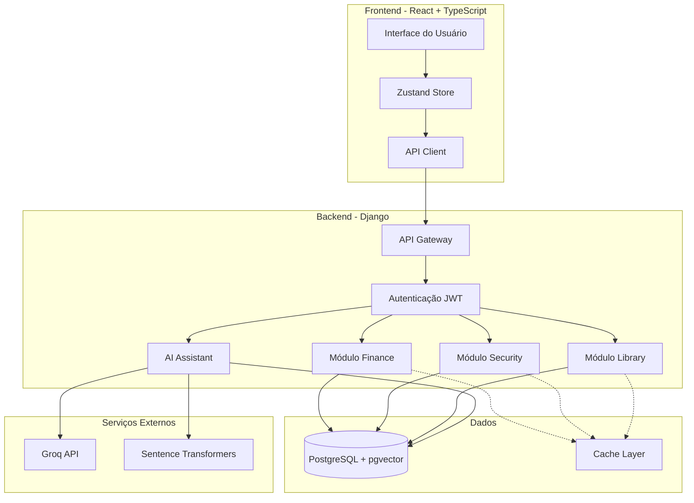

# Introdução ao MindLedger

## O que é o MindLedger?

MindLedger é um sistema completo de gerenciamento pessoal que integra três módulos principais: **Finanças**, **Segurança** e **Biblioteca**. O sistema foi projetado para oferecer controle total sobre diferentes aspectos da vida pessoal através de uma plataforma unificada, segura e intuitiva.

## Visão Geral

O MindLedger é construído como uma aplicação full-stack moderna, combinando:

- **Backend robusto** em Django REST Framework
- **Frontend responsivo** em React com TypeScript
- **Banco de dados PostgreSQL** com extensão pgvector para busca semântica
- **Assistente de IA** com tecnologia RAG (Retrieval Augmented Generation)

## Módulos Principais

### 1. Módulo Finance (ExpenseLit)

Sistema completo de gestão financeira pessoal que permite:

- Gerenciamento de contas bancárias e cartões de crédito
- Controle detalhado de despesas e receitas
- Sistema de empréstimos e transferências
- Dashboard com visualizações e métricas financeiras
- Categorização automática de transações
- Criptografia de dados sensíveis (CVV, números de conta)

### 2. Módulo Security (StreamFort)

Gerenciador seguro de credenciais e informações confidenciais:

- Armazenamento criptografado de senhas
- Gestão segura de cartões de crédito
- Credenciais bancárias protegidas
- Arquivos confidenciais com criptografia
- Sistema de auditoria e logs de atividade
- Organização por categorias e tags

### 3. Módulo Library (CodexDB)

Biblioteca pessoal digital com recursos avançados:

- Catálogo completo de livros
- Gestão de autores e editoras
- Resumos de leitura com busca semântica
- Controle de progresso de leitura
- Metadados completos (ISBN, ano, páginas)
- Sistema de avaliações e notas

### 4. AI Assistant

Assistente inteligente com busca semântica:

- Busca unificada em todos os módulos
- Respostas contextualizadas via LLM (Groq)
- Embeddings locais com sentence-transformers
- Citação de fontes com score de relevância
- Interface de chat interativa
- Suporte multilíngue (incluindo português)

## Tecnologias Core

### Backend
- **Django 5.2.5** - Framework web principal
- **Django REST Framework 3.16.1** - API RESTful
- **PostgreSQL 16** com **pgvector** - Banco de dados
- **Sentence Transformers** - Embeddings semânticos
- **Groq API** - Geração de respostas via LLM
- **Cryptography (Fernet)** - Criptografia de dados

### Frontend
- **React 18** - Biblioteca UI
- **TypeScript** - Tipagem estática
- **TailwindCSS** - Framework CSS
- **Zustand** - Gerenciamento de estado
- **React Router v7** - Roteamento
- **Recharts** - Visualização de dados

### Infraestrutura
- **Docker & Docker Compose** - Containerização
- **Nginx** (opcional) - Proxy reverso
- **JWT** - Autenticação baseada em tokens

## Arquitetura de Alto Nível

## Principais Características

### Segurança

- **Criptografia end-to-end** para dados sensíveis usando Fernet
- **Autenticação JWT** com tokens armazenados em HttpOnly cookies
- **Sistema de permissões** granular baseado no Django
- **Logs de auditoria** para ações críticas
- **Soft delete** preservando histórico de dados
- **Validações robustas** em todas as camadas

### Performance

- **Índices otimizados** no banco de dados
- **Lazy loading** de componentes no frontend
- **Embeddings locais** sem dependência de APIs externas
- **Cache estratégico** para dados frequentemente acessados
- **Queries otimizadas** com select_related e prefetch_related

### Usabilidade

- **Interface responsiva** que se adapta a qualquer dispositivo
- **Tema dark mode** (Dracula) por padrão
- **Traduções em português** para toda a interface
- **Feedback visual** em todas as ações
- **Navegação intuitiva** com sidebar e breadcrumbs

### Manutenibilidade

- **Código limpo** seguindo padrões PEP8 e clean code
- **Tipagem forte** em TypeScript
- **Arquitetura modular** com separação de responsabilidades
- **Documentação completa** em português
- **Testes automatizados** (em desenvolvimento)

## Público-Alvo

O MindLedger é ideal para:

- Indivíduos que buscam controle financeiro detalhado
- Profissionais que necessitam gerenciar múltiplas credenciais
- Leitores que desejam organizar sua biblioteca pessoal
- Usuários que valorizam privacidade e segurança de dados
- Pessoas que querem centralizar informações pessoais em um único lugar

## Próximos Passos

Para começar a usar o MindLedger, consulte:

- [Guia de Instalação](../08-development/instalacao.md)
- [Configuração Inicial](../08-development/configuracao.md)
- [Arquitetura do Sistema](../02-architecture/visao-geral.md)

## Suporte e Comunidade

- **Documentação**: Este repositório de documentação
- **Issues**: [GitHub Issues](https://github.com/tarcisioribeiro/mindledger/issues)
- **Email**: tarcisio.ribeiro.1840@hotmail.com

## Licença

Este projeto está sob a licença MIT. Consulte o arquivo LICENSE para mais detalhes.
